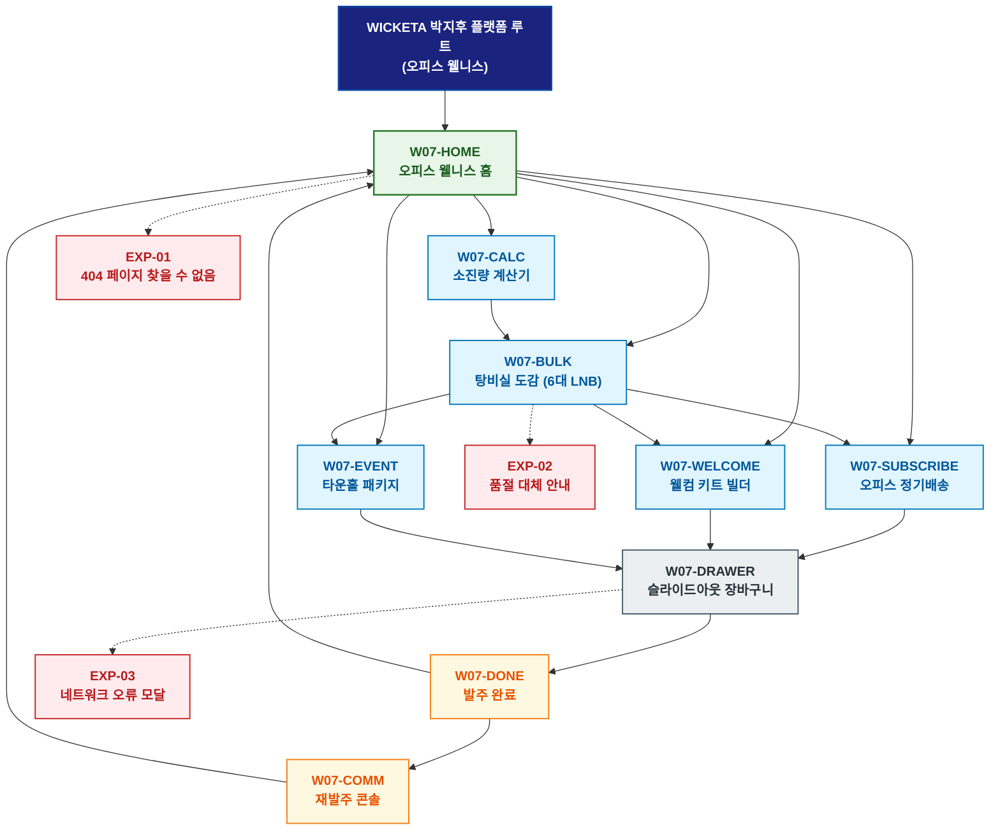

# 🗺️ WICKETA 박지후 경험 사이트맵 (오피스 웰니스 마스터)

> **프로젝트명**: WICKETA 탕비실 퀵커머스 & 오피스 웰니스 플랫폼  
> **분석 대상 클라이언트**: [`[가상클라이언트_07] 박지후_특화.txt`](file:///C:/Users/user/Desktop/이지희%20에이전트/설계%20마저%20해오기/자동화/03_클라이언트/01_가상_클라이언트/[가상클라이언트_07]%20박지후_특화.txt)  
> **기준 클라이언트 분석서**: [`[클라이언트07]_박지후_총무대리_오피스탕비실.md`](file:///C:/Users/user/Desktop/이지희%20에이전트/설계%20마저%20해오기/자동화/03_클라이언트/02_클라이언트_분석/[클라이언트07]_박지후_총무대리_오피스탕비실.md)  
> **기준 사이트 분석서**: [`[사이트 분석] 가상클라이언트07_박지후_위케티_분석결과.md`](file:///C:/Users/user/Desktop/이지희%20에이전트/설계%20마저%20해오기/자동화/03_클라이언트/03_사이트_분석/[사이트%20분석]%20가상클라이언트07_박지후_위케티_분석결과.md)  
> **연계 서비스 흐름도**: [`C:\Users\user\Desktop\이지희 에이전트\설계 마저 해오기\자동화\04_설계_및_스토리보드\02_서비스 흐름도\07_박지후\서비스_흐름도.md`](file:///C:/Users/user/Desktop/이지희%20에이전트/설계%20마저%20해오기/자동화/04_설계_및_스토리보드/02_서비스%20흐름도/07_박지후/서비스_흐름도.md)  
> **연계 화면 설계서**: [`C:\Users\user\Desktop\이지희 에이전트\설계 마저 해오기\자동화\04_설계_및_스토리보드\04_화면 설계서\07_박지후\화면_설계서.md`](file:///C:/Users/user/Desktop/이지희%20에이전트/설계%20마저%20해오기/자동화/04_설계_및_스토리보드/04_화면%20설계서/07_박지후/화면_설계서.md)  
> **적용 레이아웃 아키타입**: `오피스 탕비실 / 퀵커머스 벌크형`  
> **고유 킬러 기능**: **임직원 수 기반 소진량 계산기 (`OFFICE-CALC-07`) & 3D 회사 로고 각인 웰컴 키트 빌더 (`WELCOME-GIFT-07`)**  
> **상품 도감(상점) 명칭**: `오피스 웰니스 탕비실 도감 (Office Wellness Pantry Archive)`  
> **작성일자**: 2026년 8월 19일  
> **작성자**: Antigravity UI/UX 설계팀  
> **문서 인코딩**: UTF-8 (유니코드)  

---

## 1. 프로젝트 개요 및 설계 방향

### 1.1 클라이언트 페르소나 및 핵심 고객의 소리 (VoC)
- **클라이언트**: `07 · 박지후` (32세 / IT 스타트업 총무 대리 / 탕비실 퀵커머스 & 오피스 웰니스 본부)
- **핵심 브랜드 비전**: "Elevate Office Pantry, Boost Work Wellness - 설탕 가득한 믹스커피 대신 무설탕 0kcal 기능성 티로 임직원 건강과 업무 집중력을 높이는 B2B 탕비실 플랫폼 구축"
- **클라이언트 핵심 고객의 소리 (VoC)**:
  > "임직원 30~50인이 마실 대용량 벌크를 법인카드로 1초 결제하고 전자세금계산서를 즉시 발급받으며, 자석 디스펜서 증정 및 원클릭 재발주 루프가 지원되기를 바랍니다."

### 1.2 맞춤형 상단 메뉴(GNB) 및 6대 세부 카테고리(LNB) 구성
- **상단 전역 메뉴 (GNB 5대 메뉴)**:
  1. `오피스 허브 (Office Hub)`
  2. `탕비실 도감 (Pantry Archive)`
  3. `소진량 계산기 (Pantry Calculator)`
  4. `웰컴 키트 (Welcome Kit)`
  5. `법인 장바구니 (B2B Cart Drawer)`
- **맞춤 6대 LNB 카테고리 (20종 상품 도감 1:1 매핑)**:
  1. `전체 오피스 팩 (20)`
  2. `📦 탕비실 대용량 벌크 파우치 (4)`: SEC-18(120포 대용량 에코 리필), SEC-01(오로라 모닝 팩), SEC-03(스모키 얼그레이), SEC-09(3분 퀵 브루)
  3. `📅 월간 오피스 정기배송 & 디스펜서 (4)`: SEC-16(30일 오피스 정기구독), SEC-06(시트러스 마테 부스터), SEC-04(보태니컬 0kcal), SEC-14(무카페인 검증팩)
  4. `🎁 신규 입사자 웰컴 온보딩 키트 (4)`: SEC-13(웰컴 VIP 선물세트), SEC-10(오피스 5종 샘플러), SEC-02(미드나잇 GABA), SEC-05(블루 캐모마일)
  5. `☕ 오피스 텀블러 & 스테인리스 머그 (4)`: SEC-11(더블월 글래스 머그), SEC-12(스테인리스 머들러/지거), SEC-15(한방 온수 다기), SEC-17(미네랄 수분 스틱)
  6. `🎉 전사 타운홀 행사 케이터링 (4)`: SEC-19(타운홀 패키지), SEC-07(라벤더 루이보스), SEC-08(비건 베리 토닉), SEC-20(180초 타이머)

---


### 1.3 사이트맵 아키텍처 핵심 설계 지침 (서비스 흐름도와의 차별화 원칙)
본 사이트맵은 **서비스 흐름도의 시간 순서(1단계 ➔ 2단계 ➔ 3단계)를 단순 복제하는 것을 엄격히 금지**하고, 다음과 같은 **정통 계층형 정보 아키텍처(Information Architecture)** 원칙을 준수하여 설계되었습니다:

1. **정보 계층 트리 구조(Tree Architecture) 확립**:
   - **1-Depth (GNB 전역 대메뉴)**: 서비스의 핵심 가치 영역을 대표하는 최상위 대분류
   - **2-Depth (LNB 하위 중메뉴/카테고리)**: 각 GNB 대메뉴 하위에서 구체적 콘텐츠를 분기하는 중분류
   - **3-Depth (세부 기능/상세페이지/모달)**: 최종 사용자 조작이 일어나는 상세 접점 소분류
   - **Aside / Footer 레이어**: 슬라이드아웃 Cart Drawer, 가상 스크롤 복원 엔진, 공통 유틸리티
2. **5대 방문 목적별 GNB/LNB 위계 및 콘텐츠 우선순위 차별화**:
   - 사용자의 진입 목적(Use Case 1~5)에 따라 가장 중요하게 보는 GNB 대메뉴와 LNB 카테고리를 최우선 순위로 재배치하고, 목적 달성에 불필요한 요소는 과감히 축소 또는 배제합니다.
3. **방사형 가지치기 트리(Branching Tree) 다이어그램 적용**:
   - 1열 직선 화살표 체인이 아닌, 루트에서 GNB 대메뉴로 갈라지고 각 GNB에서 하위 세부 페이지로 뻗어나가는 계층 다이어그램(Branching Tree Topology)을 적용합니다.

---

## 2. 설계 근거와 5대 방문 목적별 사용자 목표

### 2.1 4대 설계 근거
1. **클린 화이트 & 슬레이트 그레이 오피스 대시보드**: 신속한 발주와 지출 증빙 중심의 직관적 그리드
2. **OFFICE-CALC-07 임직원 소진량 계산기**: 사원 수 및 근무 일수 입력 시 월간 최적 티 팩 및 단가 자동 계산
3. **법인 지출증빙 & 전자세금계산서 원클릭 청구**: 국세청 홈택스 자동 연동 및 법인카드 1초 간편결제
4. **자석 디스펜서 증정 및 1-Click 재발주 루프**: 재고 20% 잔여 시 알림톡 전송 및 원터치 재발주

### 2.2 5대 방문 목적별 핵심 사용자 목표
1. **목적 1 (탕비실 30인 소진량 산출 & 120포 벌크 발주)**: 임직원 30인 기준 120포 벌크를 30% 할인가로 익일 새벽배송 발주한다.
2. **목적 2 (월간 오피스 30일 구독 & 디스펜서 증정)**: 탕비실 벽면에 부착하는 자석 디스펜서를 무상 증정받고 30일 정기배송을 등록한다.
3. **목적 3 (신규 입사자 회사 로고 각인 웰컴 키트)**: 회사 로고를 3D 레이저 각인한 텀블러와 웰컴 카드가 포함된 키트를 주문한다.
4. **목적 4 (탕비실 재고 20% 잔여 알림 & 원클릭 재발주)**: 카카오 알림톡을 확인하고 3초 만에 동일 구성으로 재발주를 완료한다.
5. **목적 5 (전사 타운홀 미팅 100인 대용량 패키지)**: 100인 전사 행사를 위한 음료 300포와 다과 세트를 법인카드로 일괄 발주한다.

---

## 3. 전역 내비게이션 구조

- **상단 전역 메뉴 (GNB)**: 오피스 허브 ➔ 탕비실 도감 ➔ 소진량 계산기 ➔ 웰컴 키트 ➔ 법인 장바구니
- **카테고리 메뉴 (LNB)**: 6대 세부 카테고리 필터링 (`오피스 웰니스 탕비실 도감`)
- **공통 레이어 (Aside)**: 슬라이드아웃 Cart Drawer, 전자세금계산서 발행기, 가상 스크롤 100% 복원
- **Footer**: 브랜드 철학, KTR 공인 0kcal/무카페인 시험성적서 PDF 다운로드, 법인 지출증빙 안내, 사업자 정보

---

## 4. 계층형 사이트맵 (구조도)

```text
WICKETA 박지후 플랫폼 루트 (오피스 웰니스)
│
├── 01. [1단계 - 메인 홈] W07-HOME (오피스 웰니스 홈)
│   ├── 히어로: 1200x380 클린 오피스 비주얼 캔버스
│   ├── 킬러: 임직원 수 맞춤 계산기 (OFFICE-CALC-07)
│   ├── 3대 큐레이션: 탕비실 벌크(CUR-01) / 오피스 정기배송(CUR-02) / 온보딩 웰컴키트(CUR-03)
│   └── 퀵 라우터: 계산기 (W07-CALC) / 탕비실 도감 (W07-BULK)
│
├── 02. [2단계 - 오피스 탕비실 발주 파이프라인]
│   ├── W07-CALC: 임직원 인원수별 월간 소진량 계산기 콘솔
│   ├── W07-BULK: 20종 탕비실 도감 & 120포 대용량 벌크 (6대 맞춤 LNB)
│   ├── W07-SUBSCRIBE: 월간 오피스 구독 & 자석 디스펜서 무상 증정 뷰어
│   ├── W07-WELCOME: 3D 회사 로고 각인 온보딩 웰컴 키트 빌더
│   └── W07-EVENT: 전사 타운홀 미팅 100인 단체 케이터링 패키지 뷰어
│
├── 03. [3단계 - 법인 결제 & 재발주 아카이브]
│   ├── W07-COMM: 재고 소진 알림톡 & 1-Click 재발주 루프 콘솔
│   └── W07-DONE: 통합 법인 발주/세금계산서 청구 완료 모달
│
├── 04. [공통 레이어] W07-DRAWER (슬라이드아웃 법인 장바구니)
│   └── 1-Click 간편결제 (법인카드/세금계산서) & 가상 스크롤 100% 위치 복원
│
└── 05. [예외 페이지]
    ├── EXP-01: 404 페이지 찾을 수 없음 (오피스 허브 복귀 가이드)
    ├── EXP-02: 대용량 벌크 일시 품절 안내 (대체 기능성 티 추천)
    └── EXP-03: 네트워크 오류 모달 (사업자등록번호 LocalStorage 복구)
```

---

## 5. 페이지별 상세 정의 표

| 구분 (계층) | 화면 ID | 페이지명 | 페이지 목적 | 핵심 콘텐츠 | 주요 기능 및 인터랙션 | 연결 페이지 |
| :---: | :--- | :--- | :--- | :--- | :--- | :--- |
| **1단계** | `W07-HOME` | 오피스 웰니스 홈 | 오피스 탕비실 진입 및 대량 발주 탐색 | 클린 오피스 비주얼 & OFFICE-CALC-07 | 소진량 계산기 조작, 3대 큐레이션 탐색 | `W07-CALC, W07-BULK` |
| **2단계** | `W07-CALC` | 소진량 계산기 | 임직원 인원수별 최적 발주량 산출 | 인원수/근무일수 입력 슬라이더 & 월간 견적서 | 1:1 대용량 벌크 구성 도출, 원클릭 카트 담기 | `W07-BULK, W07-DRAWER` |
| **2단계** | `W07-BULK` | 탕비실 도감 | 20종 오피스 티 도감 및 벌크 탐색 | 6대 LNB 카테고리 도감 & 대용량 단가표 | LNB 퀵 필터링, 정기구독 20% 할인 뱃지 | `W07-SUBSCRIBE, W07-WELCOME` |
| **2단계** | `W07-SUBSCRIBE` | 오피스 정기배송 | 30일 정기배송 & 자석 디스펜서 신청 | 자석 디스펜서 3D 화보 & 배송 주기 설정 | 디스펜서 무상 증정 체크, 월간 배송 스케줄링 | `W07-DRAWER` |
| **2단계** | `W07-WELCOME` | 웰컴 키트 빌더 | 신규 입사자 로고 각인 키트 제작 | 3D 텀블러 로고 업로더 & 웰컴 카드 에디터 | 3D 레이저 각인 시뮬레이션, 온보딩 패키지 렌더링 | `W07-DRAWER` |
| **2단계** | `W07-EVENT` | 타운홀 패키지 | 전사 행사 100인 케이터링 발주 | 100인 300포 구성품 & 다과 세트 견적기 | 25% 단체 할인율 계산, 특급 당일 배송 옵션 | `W07-DRAWER` |
| **3단계** | `W07-COMM` | 재발주 콘솔 | 재고 소진 알림 및 원클릭 재주문 | 탕비실 잔여 재고 게이지 & 1-Click 재발주 버튼 | 1초 재발주 승인, 5,000P 적립 루프 | `W07-HOME, W07-BULK` |
| **3단계** | `W07-DONE` | 발주 완료 | 법인 발주서 및 전자세금계산서 확인 | 세금계산서 청구 확인증 & 새벽배송 송장 | 국세청 자동 연동, 스크롤 100% 복원 | `W07-HOME, W07-COMM` |
| **공통** | `W07-DRAWER` | 슬라이드아웃 장바구니 | 페이지 무이탈 1-Click 법인 결제 | 품목 목록, 법인카드 간편결제, 세금계산서 | 1초 간편결제 승인, 가상 스크롤 100% 복원 | `W07-DONE` |
| **예외** | `EXP-01` | 404 페이지 찾을 수 없음 | 잘못된 경로 접근 시 복귀 안내 | 탕비실 홈 가이드 & 베스트 벌크 픽 | 홈으로 복귀 | `W07-HOME` |
| **예외** | `EXP-02` | 품절 대체 안내 | 벌크 품절 시 대체 제안 | 동일 효능 대체 오피스 티 추천 모달 | 원클릭 대체재 카트 담기 | `W07-BULK` |
| **예외** | `EXP-03` | 네트워크 오류 모달 | 오류 시 사업자 정보 보존 | 입력된 사업자등록번호 LocalStorage 보존 | 데이터 복원 및 재시도 | `W07-DRAWER` |

---

## 6. 계층형 사이트맵 다이어그램 (Mermaid)

<div align="center">



</div>

---

## 7. 최종 검토 및 품질 확인

- [x] **단절 링크(Dead Link) 0건**: 상위-하위 페이지 간 연결 링크 단절 없이 100% 목적 달성 구조 완비
- [x] **5대 목적별 서비스 흐름도 100% 정합성**: [탕비실벌크 / 오피스구독 / 웰컴키트 / 재발주루프 / 타운홀패키지] 5대 여정 완벽 매핑
- [x] **고유 킬러 기능 최우선 배치**: `OFFICE-CALC-07`, `WELCOME-GIFT-07` 완벽 반영
- [x] **연계 설계 문서 정합성**: 가상 클라이언트 기획서, 클라이언트 분석서, 사이트 분석서, 화면 설계서와 100% 일치

---

## 8. 연계 설계 문서

- 🔄 **하위 서비스 흐름도**: [`C:\Users\user\Desktop\이지희 에이전트\설계 마저 해오기\자동화\04_설계_및_스토리보드\02_서비스 흐름도\07_박지후\서비스_흐름도.md`](file:///C:/Users/user/Desktop/이지희%20에이전트/설계%20마저%20해오기/자동화/04_설계_및_스토리보드/02_서비스%20흐름도/07_박지후/서비스_흐름도.md)
- 📊 **벤치마크 분석 보고서**: [`[사이트 분석] 가상클라이언트07_박지후_위케티_분석결과.md`](file:///C:/Users/user/Desktop/이지희%20에이전트/설계%20마저%20해오기/자동화/03_클라이언트/03_사이트_분석/[사이트%20분석]%20가상클라이언트07_박지후_위케티_분석결과.md)
- 📐 **하위 화면 설계서**: [`화면_설계서.md`](file:///C:/Users/user/Desktop/이지희%20에이전트/설계%20마저%20해오기/자동화/04_설계_및_스토리보드/04_화면%20설계서/07_박지후/화면_설계서.md)
