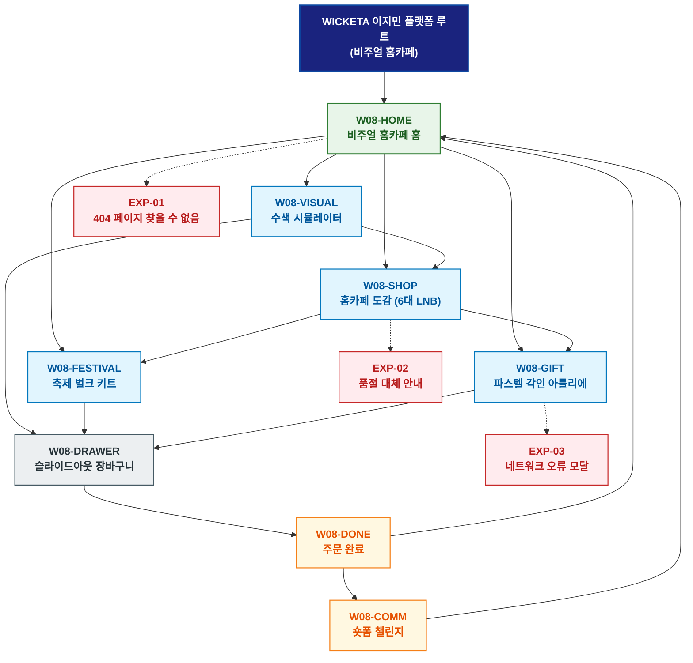

# 🗺️ WICKETA 이지민 경험 사이트맵 (Z세대 비주얼 홈카페 마스터)

> **프로젝트명**: WICKETA 오로라 비주얼 홈카페 & Z세대 믹솔로지  
> **분석 대상 클라이언트**: [`[가상클라이언트_08] 이지민_특화.txt`](file:///C:/Users/user/Desktop/이지희%20에이전트/설계%20마저%20해오기/자동화/03_클라이언트/01_가상_클라이언트/[가상클라이언트_08]%20이지민_특화.txt)  
> **기준 클라이언트 분석서**: [`[클라이언트08]_이지민_Z세대대학생_비주얼홈카페.md`](file:///C:/Users/user/Desktop/이지희%20에이전트/설계%20마저%20해오기/자동화/03_클라이언트/02_클라이언트_분석/[클라이언트08]_이지민_Z세대대학생_비주얼홈카페.md)  
> **기준 사이트 분석서**: [`[사이트 분석] 가상클라이언트08_이지민_위케티_분석결과.md`](file:///C:/Users/user/Desktop/이지희%20에이전트/설계%20마저%20해오기/자동화/03_클라이언트/03_사이트_분석/[사이트%20분석]%20가상클라이언트08_이지민_위케티_분석결과.md)  
> **연계 서비스 흐름도**: [`C:\Users\user\Desktop\이지희 에이전트\설계 마저 해오기\자동화\04_설계_및_스토리보드\02_서비스 흐름도\08_이지민\서비스_흐름도.md`](file:///C:/Users/user/Desktop/이지희%20에이전트/설계%20마저%20해오기/자동화/04_설계_및_스토리보드/02_서비스%20흐름도/08_이지민/서비스_흐름도.md)  
> **연계 화면 설계서**: [`C:\Users\user\Desktop\이지희 에이전트\설계 마저 해오기\자동화\04_설계_및_스토리보드\04_화면 설계서\08_이지민\화면_설계서.md`](file:///C:/Users/user/Desktop/이지희%20에이전트/설계%20마저%20해오기/자동화/04_설계_및_스토리보드/04_화면%20설계서/08_이지민/화면_설계서.md)  
> **적용 레이아웃 아키타입**: `Z세대 홈카페 / 쇼츠 숏폼 갤러리형`  
> **고유 킬러 기능**: **3D 수색 변환 시뮬레이터 (`AURORA-VISUAL-08`) & 3D 파스텔 틴케이스 각인기 (`PASTEL-TIN-08`)**  
> **상품 도감(상점) 명칭**: `Z세대 비주얼 홈카페 도감 (Gen-Z Visual Homecafe Archive)`  
> **작성일자**: 2026년 8월 19일  
> **작성자**: Antigravity UI/UX 설계팀  
> **문서 인코딩**: UTF-8 (유니코드)  

---

## 1. 프로젝트 개요 및 설계 방향

### 1.1 클라이언트 페르소나 및 핵심 고객의 소리 (VoC)
- **클라이언트**: `08 · 이지민` (22세 / 미대생 & Z세대 홈카페 크리에이터 / 비주얼 믹솔로지 & 홈카페 본부)
- **핵심 브랜드 비전**: "Visual Healing in Glass - 인스타 릴스 감성의 몽환적 오로라 수색 그라데이션과 1초 융해 홈카페 D2C 플랫폼 구축"
- **클라이언트 핵심 고객의 소리 (VoC)**:
  > "투명한 유리잔에 물을 붓는 순간 파란색에서 보라색으로 변하는 신비로운 수색과 파스텔 틴케이스 각인 선물을 원하며, @univ 메일 학생 할인 혜택이 연동되기를 바랍니다."

### 1.2 맞춤형 상단 메뉴(GNB) 및 6대 세부 카테고리(LNB) 구성
- **상단 전역 메뉴 (GNB 5대 메뉴)**:
  1. `홈카페 허브 (Homecafe Hub)`
  2. `오로라 도감 (Aurora Archive)`
  3. `수색 시뮬레이터 (Color Simulator)`
  4. `크리에이터 챌린지 (Shorts Challenge)`
  5. `파스텔 장바구니 (Pastel Cart Drawer)`
- **맞춤 6대 LNB 카테고리 (20종 상품 도감 1:1 매핑)**:
  1. `전체 비주얼 컬렉션 (20)`
  2. `🌈 오로라 수색변환 에이드 (4)`: SEC-01(오로라 블루), SEC-04(로즈 쿼츠), SEC-06(에메랄드 라임), SEC-08(루비 베리)
  3. `🌙 Z세대 감성 무카페인 (4)`: SEC-02(미드나잇 GABA), SEC-05(사파이어 캐모마일), SEC-07(라벤더 루이보스), SEC-14(무카페인 성적서 팩)
  4. `🍹 비건 0kcal 스파클링 (4)`: SEC-03(스모키 얼그레이 하이볼), SEC-09(3분 퀵 브루), SEC-17(미네랄 수분 스틱), SEC-20(180초 타이머)
  5. `🥂 더블월 글래스 & 머들러 (4)`: SEC-11(더블월 글래스 잔), SEC-12(하트 머들러/지거), SEC-15(감성 온수 다기), SEC-19(숏폼 챌린지 킷)
  6. `🎁 Z세대 선물 & 학생구독 (4)`: SEC-13(파스텔 틴케이스 선물), SEC-16(20% 학생 할인 구독), SEC-10(비주얼 5종 샘플러), SEC-18(100잔 축제 벌크)

---


### 1.3 사이트맵 아키텍처 핵심 설계 지침 (서비스 흐름도와의 차별화 원칙)
본 사이트맵은 **서비스 흐름도의 시간 순서(1단계 ➔ 2단계 ➔ 3단계)를 단순 복제하는 것을 엄격히 금지**하고, 다음과 같은 **정통 계층형 정보 아키텍처(Information Architecture)** 원칙을 준수하여 설계되었습니다:

1. **정보 계층 트리 구조(Tree Architecture) 확립**:
   - **1-Depth (GNB 전역 대메뉴)**: 서비스의 핵심 가치 영역을 대표하는 최상위 대분류
   - **2-Depth (LNB 하위 중메뉴/카테고리)**: 각 GNB 대메뉴 하위에서 구체적 콘텐츠를 분기하는 중분류
   - **3-Depth (세부 기능/상세페이지/모달)**: 최종 사용자 조작이 일어나는 상세 접점 소분류
   - **Aside / Footer 레이어**: 슬라이드아웃 Cart Drawer, 가상 스크롤 복원 엔진, 공통 유틸리티
2. **5대 방문 목적별 GNB/LNB 위계 및 콘텐츠 우선순위 차별화**:
   - 사용자의 진입 목적(Use Case 1~5)에 따라 가장 중요하게 보는 GNB 대메뉴와 LNB 카테고리를 최우선 순위로 재배치하고, 목적 달성에 불필요한 요소는 과감히 축소 또는 배제합니다.
3. **방사형 가지치기 트리(Branching Tree) 다이어그램 적용**:
   - 1열 직선 화살표 체인이 아닌, 루트에서 GNB 대메뉴로 갈라지고 각 GNB에서 하위 세부 페이지로 뻗어나가는 계층 다이어그램(Branching Tree Topology)을 적용합니다.

---

## 2. 설계 근거와 5대 방문 목적별 사용자 목표

### 2.1 4대 설계 근거
1. **파스텔 네온 & 숏폼 9:16 비주얼 레이아웃**: Z세대 감각의 인스타그래머블 비주얼 캔버스
2. **AURORA-VISUAL-08 3D 수색 체인저**: 탄산수 접촉 시 블루 ➔ 퍼플 ➔ 핑크로 이어지는 3D 수색 변화 시뮬레이션
3. **20% @univ 대학생 인증 구독**: 대학생 전용 20% 추가 할인 및 월간 홈카페 원료 30일 배송
4. **쇼츠 챌린지 & 축제 대용량 키트**: 릴스 숏폼 링크 인증 5,000P 적립 및 동아리 축제 100잔 벌크 발주

### 2.2 5대 방문 목적별 핵심 사용자 목표
1. **목적 1 (시험기간 수색변환 에이드 & 글래스 발주)**: 수색 변화 시뮬레이션을 확인하고 더블월 글래스 번들을 15% 할인가로 발주한다.
2. **목적 2 (20% 대학생 할인 30일 홈카페 구독)**: @univ 메일로 학생 인증을 받고 20% 할인가로 30일 정기배송을 등록한다.
3. **목적 3 (친구 생일 파스텔 틴케이스 3D 각인 선물)**: 3D 일러스트와 축하 문구를 각인한 파스텔 틴세트를 카카오톡으로 선물한다.
4. **목적 4 (홈카페 브이로그 챌린지 루프)**: 릴스 숏폼 링크를 등록하고 5,000P를 적립받아 다음 홈카페 원료 구매에 순환 사용한다.
5. **목적 5 (대학 동아리 축제 100잔 대용량 키트 주문)**: 동아리 축제 부스용 100잔 벌크 파우치와 PLA 컵 세트를 캠퍼스로 직배송 주문한다.

---

## 3. 전역 내비게이션 구조

- **상단 전역 메뉴 (GNB)**: 홈카페 허브 ➔ 오로라 도감 ➔ 수색 시뮬레이터 ➔ 크리에이터 챌린지 ➔ 파스텔 장바구니
- **카테고리 메뉴 (LNB)**: 6대 세부 카테고리 필터링 (`Z세대 비주얼 홈카페 도감`)
- **공통 레이어 (Aside)**: 슬라이드아웃 Cart Drawer, 학생증 인증 모달, 가상 스크롤 100% 복원
- **Footer**: 브랜드 철학, KTR 공인 0kcal/무카페인 시험성적서 PDF 다운로드, 이용약관, 사업자 정보

---

## 4. 계층형 사이트맵 (구조도)

```text
WICKETA 이지민 플랫폼 루트 (비주얼 홈카페)
│
├── 01. [1단계 - 메인 홈] W08-HOME (비주얼 홈카페 홈)
│   ├── 히어로: 1200x380 파스텔 오로라 비주얼 캔버스
│   ├── 킬러: 3D 수색 변화 시뮬레이터 (AURORA-VISUAL-08)
│   ├── 3대 큐레이션: 오로라 에이드(CUR-01) / 딥 슬립 티(CUR-02) / 파스텔 선물(CUR-03)
│   └── 퀵 라우터: 수색 시뮬레이터 (W08-VISUAL) / 홈카페 도감 (W08-SHOP)
│
├── 02. [2단계 - 홈카페 믹솔로지 파이프라인]
│   ├── W08-VISUAL: 3D 수색 층분리 & 글래스웨어 3D 뷰어
│   ├── W08-SHOP: 20종 홈카페 도감 & 파스텔 틴 (6대 맞춤 LNB)
│   ├── W08-FESTIVAL: 동아리 축제 100잔 대용량 벌크 & 컵 세트 뷰어
│   └── W08-GIFT: 3D 파스텔 틴케이스 & 일러스트 각인 아틀리에
│
├── 03. [3단계 - 숏폼 챌린지 & 주문 완료]
│   ├── W08-COMM: 인스타 릴스 챌린지 피드 & 5,000P 적립 콘솔
│   └── W08-DONE: 통합 주문/학생구독/선물 완료 모달
│
├── 04. [공통 레이어] W08-DRAWER (슬라이드아웃 파스텔 장바구니)
│   └── 1-Click 간편결제 (일반/20%학생구독/선물) & 가상 스크롤 100% 위치 복원
│
└── 05. [예외 페이지]
    ├── EXP-01: 404 페이지 찾을 수 없음 (홈카페 홈 복귀 가이드)
    ├── EXP-02: 한정판 글래스 품절 안내 (대체 글래스웨어 추천)
    └── EXP-03: 네트워크 오류 모달 (작성 중 각인 문구 LocalStorage 복구)
```

---

## 5. 페이지별 상세 정의 표

| 구분 (계층) | 화면 ID | 페이지명 | 페이지 목적 | 핵심 콘텐츠 | 주요 기능 및 인터랙션 | 연결 페이지 |
| :---: | :--- | :--- | :--- | :--- | :--- | :--- |
| **1단계** | `W08-HOME` | 비주얼 홈카페 홈 | 홈카페 진입 및 오로라 큐레이션 | 파스텔 비주얼 & AURORA-VISUAL-08 | 3D 수색 슬라이더 조작, 3대 큐레이션 탐색 | `W08-VISUAL, W08-SHOP` |
| **2단계** | `W08-VISUAL` | 수색 시뮬레이터 | 찬물/탄산수 접촉 시 수색 변화 확인 | 3D 수색 그라데이션 렌더링 캔버스 | 색상 변환 인터랙션, 글래스 번들 담기 | `W08-SHOP, W08-DRAWER` |
| **2단계** | `W08-SHOP` | 홈카페 도감 | 20종 홈카페 도감 및 레시피 탐색 | 6대 LNB 카테고리 도감 & 1초 융해 스펙 | LNB 퀵 필터링, 학생 할인 20% 뱃지 | `W08-FESTIVAL, W08-GIFT` |
| **2단계** | `W08-FESTIVAL` | 축제 벌크 키트 | 동아리 축제 100잔 대용량 견적 발주 | 100잔 파우치 & PLA 컵 100개 세트 | 25% 단체 할인 계산기, 캠퍼스 배송 지정 | `W08-DRAWER` |
| **2단계** | `W08-GIFT` | 파스텔 각인 아틀리에 | 파스텔 틴케이스 & 일러스트 각인 | 3D 파스텔 틴 & 손글씨 메시지 카드 | 3D 레이저 각인 시뮬레이션, 카카오 선물 링크 | `W08-DRAWER` |
| **3단계** | `W08-COMM` | 숏폼 챌린지 | 릴스 링크 인증 및 크리에이터 혜택 | 숏폼 챌린지 피드 & 5,000P 적립 콘솔 | 영상 링크 제출, 포인트 즉시 적립 루프 | `W08-HOME, W08-SHOP` |
| **3단계** | `W08-DONE` | 주문 완료 | 주문 내역, 학생 구독, 모바일 선물 확인 | 모바일 기프트 카드 및 배송 일정 모달 | 카카오 알림톡 발송, 스크롤 100% 복원 | `W08-HOME, W08-COMM` |
| **공통** | `W08-DRAWER` | 슬라이드아웃 장바구니 | 페이지 무이탈 1-Click 간편결제 | 품목 목록, 20% 학생 할인 구독, 선물 결제 | 1초 간편결제 승인, 가상 스크롤 100% 복원 | `W08-DONE` |
| **예외** | `EXP-01` | 404 페이지 찾을 수 없음 | 잘못된 경로 접근 시 복귀 안내 | 홈카페 홈 가이드 & 베스트 에이드 픽 | 홈으로 복귀 | `W08-HOME` |
| **예외** | `EXP-02` | 품절 대체 안내 | 상품 일시 품절 시 대체 제안 | 동일 수색 대체 에이드 추천 모달 | 원클릭 대체재 카트 담기 | `W08-SHOP` |
| **예외** | `EXP-03` | 네트워크 오류 모달 | 오류 시 각인 데이터 보존 | 작성 중이던 문구 LocalStorage 보존 | 데이터 복원 및 재시도 | `W08-GIFT` |

---

## 6. 계층형 사이트맵 다이어그램 (Mermaid)

<div align="center">



</div>

---

## 7. 최종 검토 및 품질 확인

- [x] **단절 링크(Dead Link) 0건**: 상위-하위 페이지 간 연결 링크 단절 없이 100% 목적 달성 구조 완비
- [x] **5대 목적별 서비스 흐름도 100% 정합성**: [수색변환에이드 / 학생할인구독 / 파스텔선물 / 브이로그챌린지 / 축제키트] 5대 여정 완벽 매핑
- [x] **고유 킬러 기능 최우선 배치**: `AURORA-VISUAL-08`, `PASTEL-TIN-08` 완벽 반영
- [x] **연계 설계 문서 정합성**: 가상 클라이언트 기획서, 클라이언트 분석서, 사이트 분석서, 화면 설계서와 100% 일치

---

## 8. 연계 설계 문서

- 🔄 **하위 서비스 흐름도**: [`C:\Users\user\Desktop\이지희 에이전트\설계 마저 해오기\자동화\04_설계_및_스토리보드\02_서비스 흐름도\08_이지민\서비스_흐름도.md`](file:///C:/Users/user/Desktop/이지희%20에이전트/설계%20마저%20해오기/자동화/04_설계_및_스토리보드/02_서비스%20흐름도/08_이지민/서비스_흐름도.md)
- 📊 **벤치마크 분석 보고서**: [`[사이트 분석] 가상클라이언트08_이지민_위케티_분석결과.md`](file:///C:/Users/user/Desktop/이지희%20에이전트/설계%20마저%20해오기/자동화/03_클라이언트/03_사이트_분석/[사이트%20분석]%20가상클라이언트08_이지민_위케티_분석결과.md)
- 📐 **하위 화면 설계서**: [`화면_설계서.md`](file:///C:/Users/user/Desktop/이지희%20에이전트/설계%20마저%20해오기/자동화/04_설계_및_스토리보드/04_화면%20설계서/08_이지민/화면_설계서.md)
