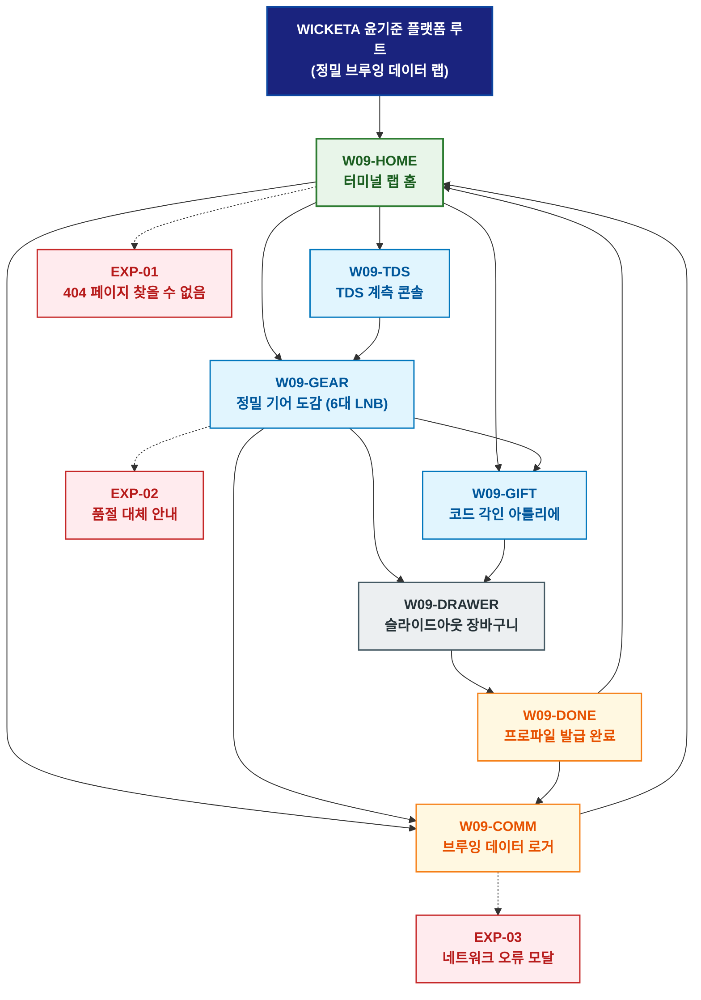

# 🗺️ WICKETA 윤기준 경험 사이트맵 (정밀 브루잉 데이터 랩 마스터)

> **프로젝트명**: WICKETA 고정밀 브루잉 데이터 랩 & 엔지니어링 콘솔  
> **분석 대상 클라이언트**: [`[가상클라이언트_09] 윤기준_특화.txt`](file:///C:/Users/user/Desktop/이지희%20에이전트/설계%20마저%20해오기/자동화/03_클라이언트/01_가상_클라이언트/[가상클라이언트_09]%20윤기준_특화.txt)  
> **기준 클라이언트 분석서**: [`[클라이언트09]_윤기준_개발팀장_정밀브루잉타이머.md`](file:///C:/Users/user/Desktop/이지희%20에이전트/설계%20마저%20해오기/자동화/03_클라이언트/02_클라이언트_분석/[클라이언트09]_윤기준_개발팀장_정밀브루잉타이머.md)  
> **기준 사이트 분석서**: [`[사이트 분석] 가상클라이언트09_윤기준_위케티_분석결과.md`](file:///C:/Users/user/Desktop/이지희%20에이전트/설계%20마저%20해오기/자동화/03_클라이언트/03_사이트_분석/[사이트%20분석]%20가상클라이언트09_윤기준_위케티_분석결과.md)  
> **연계 서비스 흐름도**: [`C:\Users\user\Desktop\이지희 에이전트\설계 마저 해오기\자동화\04_설계_및_스토리보드\02_서비스 흐름도\09_윤기준\서비스_흐름도.md`](file:///C:/Users/user/Desktop/이지희%20에이전트/설계%20마저%20해오기/자동화/04_설계_및_스토리보드/02_서비스%20흐름도/09_윤기준/서비스_흐름도.md)  
> **연계 화면 설계서**: [`C:\Users\user\Desktop\이지희 에이전트\설계 마저 해오기\자동화\04_설계_및_스토리보드\04_화면 설계서\09_윤기준\화면_설계서.md`](file:///C:/Users/user/Desktop/이지희%20에이전트/설계%20마저%20해오기/자동화/04_설계_및_스토리보드/04_화면%20설계서/09_윤기준/화면_설계서.md)  
> **적용 레이아웃 아키타입**: `고정밀 브루잉 콘솔 / 데이터 엔지니어링형`  
> **고유 킬러 기능**: **3D 브루잉 파라미터 계측기 (`PRECISION-DASH-09`) & 소스코드 각인기 (`DEV-GIFT-09`)**  
> **상품 도감(상점) 명칭**: `정밀 브루잉 데이터 랩 도감 (Precision Brewing Data Lab Archive)`  
> **작성일자**: 2026년 8월 19일  
> **작성자**: Antigravity UI/UX 설계팀  
> **문서 인코딩**: UTF-8 (유니코드)  

---

## 1. 프로젝트 개요 및 설계 방향

### 1.1 클라이언트 페르소나 및 핵심 고객의 소리 (VoC)
- **클라이언트**: `09 · 윤기준` (38세 / 백엔드 개발팀장 / 정밀 브루잉 & 데이터 랩 본부)
- **핵심 브랜드 비전**: "Code with Clarity, Brew with Precision - 0.1g 정밀 계량과 TDS 데이터 기반의 카페인 크래시 없는 인지 몰입 D2C 플랫폼 구축"
- **클라이언트 핵심 고객의 소리 (VoC)**:
  > "주관적인 맛 설명 대신 HPLC 463종 잔류농약 불검출 시험성적서와 TDS/온도별 용출 곡선 데이터를 확인하고, 추출 파라미터 JSON 다운로드 및 깃허브 연동을 원합니다."

### 1.2 맞춤형 상단 메뉴(GNB) 및 6대 세부 카테고리(LNB) 구성
- **상단 전역 메뉴 (GNB 5대 메뉴)**:
  1. `터미널 랩 (Terminal Lab)`
  2. `정밀 도감 (Precision Archive)`
  3. `TDS 계측기 (TDS Analyzer)`
  4. `깃허브 아카이브 (Commit Archive)`
  5. `엔지니어링 장바구니 (Dev Cart Drawer)`
- **맞춤 6대 LNB 카테고리 (20종 상품 도감 1:1 매핑)**:
  1. `전체 정밀 포뮬러 (20)`
  2. `💻 0.1g 정밀 계측 몰입 티 (4)`: SEC-01(오로라 몰입 팩), SEC-03(스모키 얼그레이), SEC-06(시트러스 포커스), SEC-09(3분 퀵 브루)
  3. `💧 TDS 밸런스 & 미네랄 (4)`: SEC-17(TDS 밸런스 앰플), SEC-04(보태니컬 0kcal), SEC-08(비건 베리 토닉), SEC-14(HPLC 463종 성적서 팩)
  4. `🌙 캄테크 무카페인 뇌식 티 (4)`: SEC-02(미드나잇 GABA 뇌식), SEC-05(사파이어 캐모마일), SEC-07(라벤더 루이보스), SEC-20(스마트 타이머)
  5. `⏱️ 스마트 타이머 & 디지털 스케일 (4)`: SEC-11(더블월 글래스웨어), SEC-12(정밀 머들러/지거), SEC-15(온수 다기 세트), SEC-19(해커톤 부스팅 팩)
  6. `🎁 엔지니어링 기프트 & 구독 (4)`: SEC-13(터미널 코드 각인 틴), SEC-16(30일 TDS 정기구독), SEC-10(데이터 5종 샘플러), SEC-18(100포 해커톤 벌크)

---


### 1.3 사이트맵 아키텍처 핵심 설계 지침 (서비스 흐름도와의 차별화 원칙)
본 사이트맵은 **서비스 흐름도의 시간 순서(1단계 ➔ 2단계 ➔ 3단계)를 단순 복제하는 것을 엄격히 금지**하고, 다음과 같은 **정통 계층형 정보 아키텍처(Information Architecture)** 원칙을 준수하여 설계되었습니다:

1. **정보 계층 트리 구조(Tree Architecture) 확립**:
   - **1-Depth (GNB 전역 대메뉴)**: 서비스의 핵심 가치 영역을 대표하는 최상위 대분류
   - **2-Depth (LNB 하위 중메뉴/카테고리)**: 각 GNB 대메뉴 하위에서 구체적 콘텐츠를 분기하는 중분류
   - **3-Depth (세부 기능/상세페이지/모달)**: 최종 사용자 조작이 일어나는 상세 접점 소분류
   - **Aside / Footer 레이어**: 슬라이드아웃 Cart Drawer, 가상 스크롤 복원 엔진, 공통 유틸리티
2. **5대 방문 목적별 GNB/LNB 위계 및 콘텐츠 우선순위 차별화**:
   - 사용자의 진입 목적(Use Case 1~5)에 따라 가장 중요하게 보는 GNB 대메뉴와 LNB 카테고리를 최우선 순위로 재배치하고, 목적 달성에 불필요한 요소는 과감히 축소 또는 배제합니다.
3. **방사형 가지치기 트리(Branching Tree) 다이어그램 적용**:
   - 1열 직선 화살표 체인이 아닌, 루트에서 GNB 대메뉴로 갈라지고 각 GNB에서 하위 세부 페이지로 뻗어나가는 계층 다이어그램(Branching Tree Topology)을 적용합니다.

---

## 2. 설계 근거와 5대 방문 목적별 사용자 목표

### 2.1 4대 설계 근거
1. **다크 터미널 테마 & 모노스페이스 폰트 레이아웃**: 개발자를 위한 고대비 다크 모드 인터페이스
2. **PRECISION-DASH-09 3D 계측 콘솔**: TDS 85ppm, 80℃, 180초 파라미터 조작 및 성분 데이터시트 실시간 노출
3. **HPLC 463종 공인 검증 & 브루잉 JSON 내보내기**: 추출 파라미터 JSON 다운로드 및 깃허브 웹훅 잔디 커밋 연동
4. **해커톤 팀 팩 대량 발주**: 10인 개발팀을 위한 0.1g 에너지 부스팅 티 100포 당일 특급 배송

### 2.2 5대 방문 목적별 핵심 사용자 목표
1. **목적 1 (정밀 티 & 스마트 타이머 번들 발주)**: TDS 계측 데이터를 확인하고 타이머 번들을 결제하여 최적 브루잉 JSON을 수령한다.
2. **목적 2 (월간 TDS 최적화 & HPLC 30일 구독)**: HPLC 463종 성적서를 검토하고 미네랄 앰플 증정 30일 정기구독을 등록한다.
3. **목적 3 (동료 개발자 소스코드 각인 기어 선물)**: 깃허브 ID와 한 줄 코드를 레이저 각인한 터미널 틴세트를 동료에게 선물한다.
4. **목적 4 (브루잉 로그 JSON 내보내기 & 커밋 루프)**: 추출 데이터를 깃허브 리포지토리에 커밋하고 30일 잔디 뱃지를 획득한다.
5. **목적 5 (해커톤 10인 개발팀 부스팅 팩 발주)**: 24시간 해커톤 대회를 위한 에너지 티 100포와 스케일 풀패키지를 법인카드로 발주한다.

---

## 3. 전역 내비게이션 구조

- **상단 전역 메뉴 (GNB)**: 터미널 랩 ➔ 정밀 도감 ➔ TDS 계측기 ➔ 깃허브 아카이브 ➔ 엔지니어링 장바구니
- **카테고리 메뉴 (LNB)**: 6대 세부 카테고리 필터링 (`정밀 브루잉 데이터 랩 도감`)
- **공통 레이어 (Aside)**: 슬라이드아웃 Cart Drawer, JSON 내보내기 모달, 가상 스크롤 100% 복원
- **Footer**: 브랜드 철학, HPLC 463종 시험성적서 PDF 다운로드, 깃허브 웹훅 안내, 사업자 정보

---

## 4. 계층형 사이트맵 (구조도)

```text
WICKETA 윤기준 플랫폼 루트 (데이터 랩)
│
├── 01. [1단계 - 메인 홈] W09-HOME (터미널 랩 홈)
│   ├── 히어로: 1200x380 다크 터미널 대시보드
│   ├── 킬러: 3D 계측 콘솔 (PRECISION-DASH-09)
│   ├── 3대 큐레이션: 0.1g 정밀 티(CUR-01) / TDS 미네랄(CUR-02) / 스마트 기어(CUR-03)
│   └── 퀵 라우터: TDS 계측기 (W09-TDS) / 정밀 도감 (W09-GEAR)
│
├── 02. [2단계 - 데이터 엔지니어링 파이프라인]
│   ├── W09-TDS: 수질 TDS & 추출 온도별 용출 곡선 모니터
│   ├── W09-GEAR: 20종 정밀 티 도감 & 블루투스 타이머 (6대 맞춤 LNB)
│   ├── W09-GIFT: 3D 터미널 소스코드/깃허브 ID 레이저 각인기
│   └── W09-COMM: 실시간 브루잉 데이터 로거 & 깃허브 웹훅 연동기
│
├── 03. [3단계 - 깃허브 커밋 & 주문 완료]
│   ├── W09-DONE: 통합 주문/구독/JSON 프로파일 발급 완료 모달
│   └── W09-DRAWER: 슬라이드아웃 엔지니어링 장바구니 (1초 결제)
│
└── 05. [예외 페이지]
    ├── EXP-01: 404 페이지 찾을 수 없음 (터미널 복귀 가이드)
    ├── EXP-02: 스마트 타이머 재고 부족 안내 (예약 발송 추천)
    └── EXP-03: 네트워크 오류 모달 (브루잉 로그 IndexedDB 복구)
```

---

## 5. 페이지별 상세 정의 표

| 구분 (계층) | 화면 ID | 페이지명 | 페이지 목적 | 핵심 콘텐츠 | 주요 기능 및 인터랙션 | 연결 페이지 |
| :---: | :--- | :--- | :--- | :--- | :--- | :--- |
| **1단계** | `W09-HOME` | 터미널 랩 홈 | 데이터 랩 진입 및 계측 큐레이션 | 다크 터미널 비주얼 & PRECISION-DASH-09 | 3D 계측기 조작, 3대 큐레이션 탐색 | `W09-TDS, W09-GEAR` |
| **2단계** | `W09-TDS` | TDS 계측 콘솔 | 수질 및 추출 온도별 데이터 검증 | TDS/수온 슬라이더 & HPLC 성분 데이터시트 | L-테아닌 수치 실시간 렌더링, JSON 다운로드 | `W09-GEAR, W09-DRAWER` |
| **2단계** | `W09-GEAR` | 정밀 기어 도감 | 20종 정밀 티 도감 및 기어 탐색 | 6대 LNB 카테고리 도감 & 스마트 타이머 스펙 | LNB 퀵 필터링, 정기구독 20% 할인 뱃지 | `W09-GIFT, W09-COMM` |
| **2단계** | `W09-GIFT` | 코드 각인 아틀리에 | 깃허브 ID & 소스코드 레이저 각인 | 3D 매트 블랙 틴 & Monaco 폰트 코드 에디터 | 3D 레이저 각인 시뮬레이션, 터미널 카드 발송 | `W09-DRAWER` |
| **2단계** | `W09-COMM` | 브루잉 데이터 로거 | 추출 파라미터 로깅 및 깃허브 푸시 | 실시간 데이터 로거 & 깃허브 잔디 뱃지 | JSON 내보내기, GitHub Webhook 자동 커밋 | `W09-HOME, W09-TDS` |
| **3단계** | `W09-DONE` | 프로파일 발급 완료 | 주문 내역, 브루잉 JSON 확인 | 맞춤 브루잉 JSON 다운로드 & 깃허브 뱃지 | 카카오 알림톡 발송, 스크롤 100% 복원 | `W09-HOME, W09-COMM` |
| **공통** | `W09-DRAWER` | 슬라이드아웃 장바구니 | 페이지 무이탈 1-Click 간편결제 | 품목 목록, 20% TDS 구독, 법인카드 결제 | 1초 간편결제 승인, 가상 스크롤 100% 복원 | `W09-DONE` |
| **예외** | `EXP-01` | 404 페이지 찾을 수 없음 | 잘못된 경로 접근 시 복귀 안내 | 터미널 복귀 가이드 & 추천 몰입 팩 | 홈으로 복귀 | `W09-HOME` |
| **예외** | `EXP-02` | 품절 대체 안내 | 기어 품절 시 대체 제안 | 차기 배치 예약 발송 모달 | 원클릭 예약 발송 신청 | `W09-GEAR` |
| **예외** | `EXP-03` | 네트워크 오류 모달 | 오류 시 브루잉 데이터 보존 | 작성 중이던 로그 IndexedDB 보존 | 데이터 복원 및 재시도 | `W09-COMM` |

---

## 6. 계층형 사이트맵 다이어그램 (Mermaid)

<div align="center">



</div>

---

## 7. 최종 검토 및 품질 확인

- [x] **단절 링크(Dead Link) 0건**: 상위-하위 페이지 간 연결 링크 단절 없이 100% 목적 달성 구조 완비
- [x] **5대 목적별 서비스 흐름도 100% 정합성**: [정밀기어번들 / TDS정기구독 / 코드각인선물 / 브루잉로그 / 해커톤팀팩] 5대 여정 완벽 매핑
- [x] **고유 킬러 기능 최우선 배치**: `PRECISION-DASH-09`, `DEV-GIFT-09` 완벽 반영
- [x] **연계 설계 문서 정합성**: 가상 클라이언트 기획서, 클라이언트 분석서, 사이트 분석서, 화면 설계서와 100% 일치

---

## 8. 연계 설계 문서

- 🔄 **하위 서비스 흐름도**: [`C:\Users\user\Desktop\이지희 에이전트\설계 마저 해오기\자동화\04_설계_및_스토리보드\02_서비스 흐름도\09_윤기준\서비스_흐름도.md`](file:///C:/Users/user/Desktop/이지희%20에이전트/설계%20마저%20해오기/자동화/04_설계_및_스토리보드/02_서비스%20흐름도/09_윤기준/서비스_흐름도.md)
- 📊 **벤치마크 분석 보고서**: [`[사이트 분석] 가상클라이언트09_윤기준_위케티_분석결과.md`](file:///C:/Users/user/Desktop/이지희%20에이전트/설계%20마저%20해오기/자동화/03_클라이언트/03_사이트_분석/[사이트%20분석]%20가상클라이언트09_윤기준_위케티_분석결과.md)
- 📐 **하위 화면 설계서**: [`화면_설계서.md`](file:///C:/Users/user/Desktop/이지희%20에이전트/설계%20마저%20해오기/자동화/04_설계_및_스토리보드/04_화면%20설계서/09_윤기준/화면_설계서.md)
