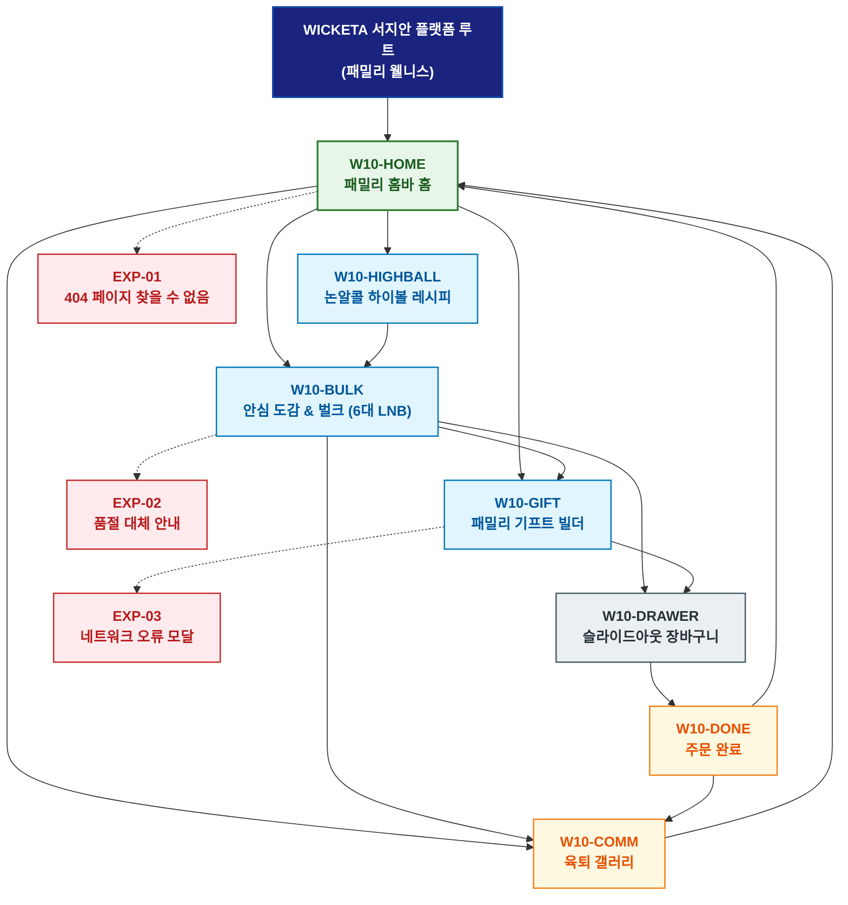

# 🗺️ WICKETA 서지안 경험 사이트맵 (패밀리 웰니스 마스터)

> **프로젝트명**: WICKETA 패밀리 웰니스 & 논알콜 홈바  
> **분석 대상 클라이언트**: [`[가상클라이언트_10] 서지안_특화.txt`](file:///C:/Users/user/Desktop/이지희%20에이전트/설계%20마저%20해오기/자동화/03_클라이언트/01_가상_클라이언트/[가상클라이언트_10]%20서지안_특화.txt)  
> **기준 클라이언트 분석서**: [`[클라이언트10]_서지안_육아대디_노동제로논알콜하이볼.md`](file:///C:/Users/user/Desktop/이지희%20에이전트/설계%20마저%20해오기/자동화/03_클라이언트/02_클라이언트_분석/[클라이언트10]_서지안_육아대디_노동제로논알콜하이볼.md)  
> **기준 사이트 분석서**: [`[사이트 분석] 가상클라이언트10_서지안_위케티_분석결과.md`](file:///C:/Users/user/Desktop/이지희%20에이전트/설계%20마저%20해오기/자동화/03_클라이언트/03_사이트_분석/[사이트%20분석]%20가상클라이언트10_서지안_위케티_분석결과.md)  
> **연계 서비스 흐름도**: [`C:\Users\user\Desktop\이지희 에이전트\설계 마저 해오기\자동화\04_설계_및_스토리보드\02_서비스 흐름도\10_서지안\서비스_흐름도.md`](file:///C:/Users/user/Desktop/이지희%20에이전트/설계%20마저%20해오기/자동화/04_설계_및_스토리보드/02_서비스%20흐름도/10_서지안/서비스_흐름도.md)  
> **연계 화면 설계서**: [`C:\Users\user\Desktop\이지희 에이전트\설계 마저 해오기\자동화\04_설계_및_스토리보드\04_화면 설계서\10_서지안\화면_설계서.md`](file:///C:/Users/user/Desktop/이지희%20에이전트/설계%20마저%20해오기/자동화/04_설계_및_스토리보드/04_화면%20설계서/10_서지안/화면_설계서.md)  
> **적용 레이아웃 아키타입**: `패밀리 웰니스 & 논알콜 홈바 / 벌크 패키징형`  
> **고유 킬러 기능**: **가족 구성원별 맞춤 음료 계산기 (`FAMILY-CALC-10`) & 키즈 생일 답례품 구디백 빌더 (`KIDS-PARTY-10`)**  
> **상품 도감(상점) 명칭**: `온가족 안심 음료 & 논알콜 홈바 도감 (Family Wellness & Zero Bar Archive)`  
> **작성일자**: 2026년 8월 19일  
> **작성자**: Antigravity UI/UX 설계팀  
> **문서 인코딩**: UTF-8 (유니코드)  

---

## 1. 프로젝트 개요 및 설계 방향

### 1.1 클라이언트 페르소나 및 핵심 고객의 소리 (VoC)
- **클라이언트**: `10 · 서지안` (35세 / 육아대디 & 푸드 콘텐츠 에디터 / 패밀리 웰니스 & 논알콜 홈바 본부)
- **핵심 브랜드 비전**: "Zero Alcohol, Pure Family Joy - 육퇴 후 부부의 0.00% 스모키 하이볼과 낮 동안 아이들의 유기농 무설탕 키즈티가 공존하는 패밀리 웰니스 D2C 플랫폼 구축"
- **클라이언트 핵심 고객의 소리 (VoC)**:
  > "복잡한 조리 없이 1초 만에 완성되는 노동제로 논알콜 홈바와 아이들에게 안심하고 먹일 수 있는 무설탕/무카페인 성적서를 확인하고 120포 대용량 벌크를 주문하고자 합니다."

### 1.2 맞춤형 상단 메뉴(GNB) 및 6대 세부 카테고리(LNB) 구성
- **상단 전역 메뉴 (GNB 5대 메뉴)**:
  1. `패밀리 홈바 (Family Homebar)`
  2. `안심 도감 (Wellness Archive)`
  3. `가족 계산기 (Family Calculator)`
  4. `키즈 파티 (Kids Party Builder)`
  5. `패밀리 장바구니 (Family Cart Drawer)`
- **맞춤 6대 LNB 카테고리 (20종 상품 도감 1:1 매핑)**:
  1. `전체 패밀리 팩 (20)`
  2. `🍹 0.00% 논알콜 하이볼 스틱 (4)`: SEC-03(스모키 얼그레이 하이볼), SEC-01(오로라 칵테일), SEC-06(시트러스 에이드), SEC-09(3분 퀵 홈바)
  3. `🍇 안심 키즈 과일티 (4)`: SEC-08(샤인머스캣 안토시아닌), SEC-04(유기농 로즈 애플망고), SEC-14(무알콜/무카페인 공인 성적서 팩), SEC-17(키즈 미네랄 수분)
  4. `🌿 3無 무설탕 클린 탄산 (4)`: SEC-05(블루 캐모마일), SEC-02(미드나잇 GABA), SEC-07(라벤더 루이보스), SEC-20(육퇴 180초 타이머)
  5. `🥂 홈바 믹솔로지 & 키즈 보틀 (4)`: SEC-11(빛 굴절 더블월 하이볼 잔), SEC-12(홈바 지거/머들러), SEC-15(가족 온수 다기), SEC-19(육퇴 레시피 킷)
  6. `📦 패밀리 벌크 & 다자녀 구독 (4)`: SEC-18(120포 패밀리 벌크), SEC-16(30일 패밀리 박스 다자녀 구독), SEC-10(패밀리 5종 샘플러), SEC-13(조동 VIP 안심 선물)

---


### 1.3 사이트맵 아키텍처 핵심 설계 지침 (서비스 흐름도와의 차별화 원칙)
본 사이트맵은 **서비스 흐름도의 시간 순서(1단계 ➔ 2단계 ➔ 3단계)를 단순 복제하는 것을 엄격히 금지**하고, 다음과 같은 **정통 계층형 정보 아키텍처(Information Architecture)** 원칙을 준수하여 설계되었습니다:

1. **정보 계층 트리 구조(Tree Architecture) 확립**:
   - **1-Depth (GNB 전역 대메뉴)**: 서비스의 핵심 가치 영역을 대표하는 최상위 대분류
   - **2-Depth (LNB 하위 중메뉴/카테고리)**: 각 GNB 대메뉴 하위에서 구체적 콘텐츠를 분기하는 중분류
   - **3-Depth (세부 기능/상세페이지/모달)**: 최종 사용자 조작이 일어나는 상세 접점 소분류
   - **Aside / Footer 레이어**: 슬라이드아웃 Cart Drawer, 가상 스크롤 복원 엔진, 공통 유틸리티
2. **5대 방문 목적별 GNB/LNB 위계 및 콘텐츠 우선순위 차별화**:
   - 사용자의 진입 목적(Use Case 1~5)에 따라 가장 중요하게 보는 GNB 대메뉴와 LNB 카테고리를 최우선 순위로 재배치하고, 목적 달성에 불필요한 요소는 과감히 축소 또는 배제합니다.
3. **방사형 가지치기 트리(Branching Tree) 다이어그램 적용**:
   - 1열 직선 화살표 체인이 아닌, 루트에서 GNB 대메뉴로 갈라지고 각 GNB에서 하위 세부 페이지로 뻗어나가는 계층 다이어그램(Branching Tree Topology)을 적용합니다.

---

## 2. 설계 근거와 5대 방문 목적별 사용자 목표

### 2.1 4대 설계 근거
1. **웜 베이지 & 오렌지 소프트 패밀리 레이아웃**: 온가족이 안심할 수 있는 따뜻하고 직관적인 레이아웃
2. **FAMILY-CALC-10 가족 계산기**: 성인/아이 인원수별 월간 최적 배합비(하이볼 60포 + 키즈티 60포) 자동 산출
3. **3無(무알콜/무카페인/무설탕) 공인 시험성적서**: 국가 공인 KTR 불검출 성적서 상시 렌더링
4. **다자녀 15% 지원 할인 & 키즈 구디백 빌더**: 다자녀 추가 할인 및 3D 네임 스티커 생일 답례품 발주

### 2.2 5대 방문 목적별 핵심 사용자 목표
1. **목적 1 (부부용 하이볼 & 키즈티 120포 벌크 발주)**: 4인 가족 기준 120포 벌크를 30% 할인가로 새벽배송 주문한다.
2. **목적 2 (온가족 30일 패밀리 박스 다자녀 15% 구독)**: 다자녀 지원 15% 추가 할인을 적용받아 30일 정기배송을 등록한다.
3. **목적 3 (조동 모임 무카페인 안심 패밀리 선물)**: 임산부 루이보스와 키즈티로 구성된 친환경 안심 패키지를 선물한다.
4. **목적 4 (초간단 레시피 & 육퇴 포토 후기 적립 루프)**: 1초 홈바 사진을 업로드하고 5,000P를 적립받아 다음 주말 홈바에 사용한다.
5. **목적 5 (유치원 생일파티 키즈티 30포 구디백 주문)**: 아이 이름이 각인된 네임 스티커 구디백 30세트를 일괄 발주한다.

---

## 3. 전역 내비게이션 구조

- **상단 전역 메뉴 (GNB)**: 패밀리 홈바 ➔ 안심 도감 ➔ 가족 계산기 ➔ 키즈 파티 ➔ 패밀리 장바구니
- **카테고리 메뉴 (LNB)**: 6대 세부 카테고리 필터링 (`온가족 안심 음료 & 논알콜 홈바 도감`)
- **공통 레이어 (Aside)**: 슬라이드아웃 Cart Drawer, 성분 성적서 뷰어, 가상 스크롤 100% 복원
- **Footer**: 브랜드 철학, KTR 공인 0.00% 무알콜/무카페인 성적서 PDF 다운로드, 이용약관, 사업자 정보

---

## 4. 계층형 사이트맵 (구조도)

```text
WICKETA 서지안 플랫폼 루트 (패밀리 웰니스)
│
├── 01. [1단계 - 메인 홈] W10-HOME (패밀리 홈바 홈)
│   ├── 히어로: 1200x380 따뜻한 패밀리 비주얼 캔버스
│   ├── 킬러: 가족 구성원별 계산기 (FAMILY-CALC-10)
│   ├── 3대 큐레이션: 하이볼 벌크(CUR-01) / 키즈 안심티(CUR-02) / 패밀리 선물(CUR-03)
│   └── 퀵 라우터: 계산기 (W10-HIGHBALL) / 안심 도감 (W10-BULK)
│
├── 02. [2단계 - 패밀리 홈바 파이프라인]
│   ├── W10-HIGHBALL: 0.00% 논알콜 하이볼 레시피 & 성적서 뷰어
│   ├── W10-BULK: 20종 안심 도감 & 120포 패밀리 벌크 (6대 맞춤 LNB)
│   ├── W10-GIFT: 조동 선물 & 3D 네임 스티커 키즈 구디백 빌더
│   └── W10-COMM: 육퇴 홈바 포토 갤러리 & 5,000P 적립 피드
│
├── 03. [3단계 - 주문 완료 & 육퇴 아카이브]
│   ├── W10-DONE: 통합 주문/다자녀구독/선물 완료 모달
│   └── W10-DRAWER: 슬라이드아웃 패밀리 장바구니 (1초 결제)
│
└── 05. [예외 페이지]
    ├── EXP-01: 404 페이지 찾을 수 없음 (패밀리 홈 복귀 가이드)
    ├── EXP-02: 키즈티 특정 맛 품절 안내 (대체 유기농 과일티 추천)
    └── EXP-03: 네트워크 오류 모달 (작성 중 구디백 문구 LocalStorage 복구)
```

---

## 5. 페이지별 상세 정의 표

| 구분 (계층) | 화면 ID | 페이지명 | 페이지 목적 | 핵심 콘텐츠 | 주요 기능 및 인터랙션 | 연결 페이지 |
| :---: | :--- | :--- | :--- | :--- | :--- | :--- |
| **1단계** | `W10-HOME` | 패밀리 홈바 홈 | 패밀리 홈바 진입 및 안심 큐레이션 | 웜 베이지 비주얼 & FAMILY-CALC-10 | 가족 인원수 슬라이더, 3대 큐레이션 탐색 | `W10-HIGHBALL, W10-BULK` |
| **2단계** | `W10-HIGHBALL` | 논알콜 하이볼 | 0.00% 무알콜 레시피 및 안전성 검증 | 1초 융해 스틱 스펙 & 3無 공인 시험성적서 | 하이볼/키즈티 월간 배합비 산출, 카트 담기 | `W10-BULK, W10-DRAWER` |
| **2단계** | `W10-BULK` | 안심 도감 & 벌크 | 20종 온가족 음료 도감 및 벌크 탐색 | 6대 LNB 카테고리 도감 & 120포 벌크 단가표 | LNB 퀵 필터링, 다자녀 15% 할인 뱃지 | `W10-GIFT, W10-COMM` |
| **2단계** | `W10-GIFT` | 패밀리 기프트 빌더 | 조동 선물 포장 & 키즈 구디백 제작 | 친환경 펄프 패키징 & 3D 네임 스티커 캔버스 | 3D 스티커 렌더링, 카카오 선물 링크 발송 | `W10-DRAWER` |
| **2단계** | `W10-COMM` | 육퇴 갤러리 | 리얼 육퇴 홈바 사진 공유 및 리워드 | 부부 육퇴 홈바 인증샷 피드 & 1초 레시피 | 포토 리뷰 업로드, 5,000P 적립 루프 | `W10-HOME, W10-BULK` |
| **3단계** | `W10-DONE` | 주문 완료 | 주문 내역, 레시피 카드, 구디백 확인 | 논알콜 하이볼 레시피 PDF & 배송 스케줄러 | 카카오 알림톡 발송, 스크롤 100% 복원 | `W10-HOME, W10-COMM` |
| **공통** | `W10-DRAWER` | 슬라이드아웃 장바구니 | 페이지 무이탈 1-Click 간편결제 | 품목 목록, 다자녀 15% 할인 구독, 선물 결제 | 1초 간편결제 승인, 가상 스크롤 100% 복원 | `W10-DONE` |
| **예외** | `EXP-01` | 404 페이지 찾을 수 없음 | 잘못된 경로 접근 시 복귀 안내 | 패밀리 홈 복귀 가이드 & 베스트 안심 픽 | 홈으로 복귀 | `W10-HOME` |
| **예외** | `EXP-02` | 품절 대체 안내 | 상품 일시 품절 시 대체 제안 | 동일 안전 등급 대체 과일티 추천 모달 | 원클릭 대체재 카트 담기 | `W10-BULK` |
| **예외** | `EXP-03` | 네트워크 오류 모달 | 오류 시 스티커 데이터 보존 | 작성 중이던 네임 스티커 LocalStorage 보존 | 데이터 복원 및 재시도 | `W10-GIFT` |

---

## 6. 계층형 사이트맵 다이어그램 (Mermaid)

<div align="center">



</div>

---

## 7. 최종 검토 및 품질 확인

- [x] **단절 링크(Dead Link) 0건**: 상위-하위 페이지 간 연결 링크 단절 없이 100% 목적 달성 구조 완비
- [x] **5대 목적별 서비스 흐름도 100% 정합성**: [패밀리벌크 / 패밀리구독 / 패밀리선물 / 육퇴챌린지 / 키즈구디백] 5대 여정 완벽 매핑
- [x] **고유 킬러 기능 최우선 배치**: `FAMILY-CALC-10`, `KIDS-PARTY-10` 완벽 반영
- [x] **연계 설계 문서 정합성**: 가상 클라이언트 기획서, 클라이언트 분석서, 사이트 분석서, 화면 설계서와 100% 일치

---

## 8. 연계 설계 문서

- 🔄 **하위 서비스 흐름도**: [`C:\Users\user\Desktop\이지희 에이전트\설계 마저 해오기\자동화\04_설계_및_스토리보드\02_서비스 흐름도\10_서지안\서비스_흐름도.md`](file:///C:/Users/user/Desktop/이지희%20에이전트/설계%20마저%20해오기/자동화/04_설계_및_스토리보드/02_서비스%20흐름도/10_서지안/서비스_흐름도.md)
- 📊 **벤치마크 분석 보고서**: [`[사이트 분석] 가상클라이언트10_서지안_위케티_분석결과.md`](file:///C:/Users/user/Desktop/이지희%20에이전트/설계%20마저%20해오기/자동화/03_클라이언트/03_사이트_분석/[사이트%20분석]%20가상클라이언트10_서지안_위케티_분석결과.md)
- 📐 **하위 화면 설계서**: [`화면_설계서.md`](file:///C:/Users/user/Desktop/이지희%20에이전트/설계%20마저%20해오기/자동화/04_설계_및_스토리보드/04_화면%20설계서/10_서지안/화면_설계서.md)
