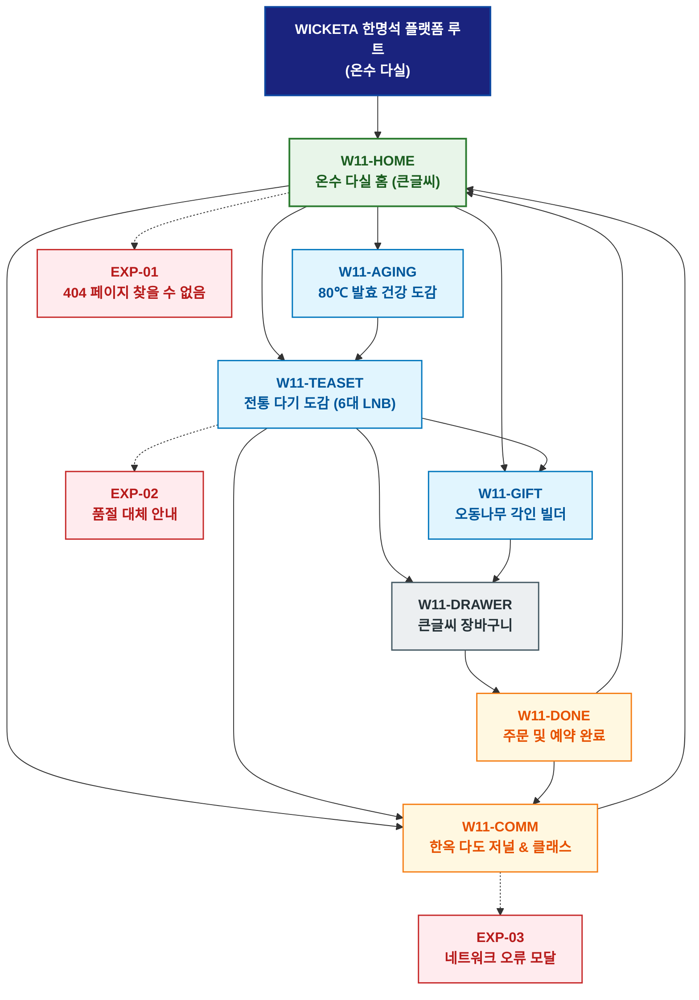

# 🗺️ WICKETA 한명석 경험 사이트맵 (온수 다실 마스터)

> **프로젝트명**: WICKETA 시니어 프렌들리 웰에이징 온수 다실  
> **분석 대상 클라이언트**: [`[가상클라이언트_11] 한명석_특화.txt`](file:///C:/Users/user/Desktop/이지희%20에이전트/설계%20마저%20해오기/자동화/03_클라이언트/01_가상_클라이언트/[가상클라이언트_11]%20한명석_특화.txt)  
> **기준 클라이언트 분석서**: [`[클라이언트11]_한명석_액티브시니어_웰에이징온수발효티.md`](file:///C:/Users/user/Desktop/이지희%20에이전트/설계%20마저%20해오기/자동화/03_클라이언트/02_클라이언트_분석/[클라이언트11]_한명석_액티브시니어_웰에이징온수발효티.md)  
> **기준 사이트 분석서**: [`[사이트 분석] 가상클라이언트11_한명석_위케티_분석결과.md`](file:///C:/Users/user/Desktop/이지희%20에이전트/설계%20마저%20해오기/자동화/03_클라이언트/03_사이트_분석/[사이트%20분석]%20가상클라이언트11_한명석_위케티_분석결과.md)  
> **연계 서비스 흐름도**: [`C:\Users\user\Desktop\이지희 에이전트\설계 마저 해오기\자동화\04_설계_및_스토리보드\02_서비스 흐름도\11_한명석\서비스_흐름도.md`](file:///C:/Users/user/Desktop/이지희%20에이전트/설계%20마저%20해오기/자동화/04_설계_및_스토리보드/02_서비스%20흐름도/11_한명석/서비스_흐름도.md)  
> **연계 화면 설계서**: [`C:\Users\user\Desktop\이지희 에이전트\설계 마저 해오기\자동화\04_설계_및_스토리보드\04_화면 설계서\11_한명석\화면_설계서.md`](file:///C:/Users/user/Desktop/이지희%20에이전트/설계%20마저%20해오기/자동화/04_설계_및_스토리보드/04_화면%20설계서/11_한명석/화면_설계서.md)  
> **적용 레이아웃 아키타입**: `시니어 프렌들리 큰글씨 / 온수 다실형`  
> **고유 킬러 기능**: **20pt 큰글씨 모드 (`SENIOR-VIEW-11`) & ☎️ 1588 직통 전화주문 (`CALL-ORDER-11`) & 3D 오동나무 보자기 포장기 (`ROYAL-GIFT-11`)**  
> **상품 도감(상점) 명칭**: `백세건강 온수 발효티 도감 (Well-Aging Warm Tea Archive)`  
> **작성일자**: 2026년 8월 19일  
> **작성자**: Antigravity UI/UX 설계팀  
> **문서 인코딩**: UTF-8 (유니코드)  

---

## 1. 프로젝트 개요 및 설계 방향

### 1.1 클라이언트 페르소나 및 핵심 고객의 소리 (VoC)
- **클라이언트**: `11 · 한명석` (68세 / 은퇴 고위공직자 & 서예가 / 시니어 웰에이징 & 온수 다실 본부)
- **핵심 브랜드 비전**: "Warmth for Longevity, Peace for Soul - 차가운 음료 대신 80℃ 따뜻한 완숙 발효차로 시니어의 위장 건강과 장수를 돕는 온수 다실 D2C 플랫폼 구축"
- **클라이언트 핵심 고객의 소리 (VoC)**:
  > "작은 글씨와 복잡한 모바일 결제가 불편하므로 20pt 큰글씨 모드와 1588 전화주문이 지원되고, 명절 부모님 효도 선물용 오동나무 보자기 포장이 가능하기를 바랍니다."

### 1.2 맞춤형 상단 메뉴(GNB) 및 6대 세부 카테고리(LNB) 구성
- **상단 전역 메뉴 (GNB 5대 메뉴)**:
  1. `온수 다실 (Warm Tea Room)`
  2. `건강 도감 (Health Archive)`
  3. `전통 다기 (Ceramic Gear)`
  4. `한옥 다도회 (Hanok Class)`
  5. `큰글씨 장바구니 (Senior Cart Drawer)`
- **맞춤 6대 LNB 카테고리 (20종 상품 도감 1:1 매핑)**:
  1. `전체 온수 다실 (20)`
  2. `🍵 80℃ 완숙 발효 온수티 (4)`: SEC-15(한방 완숙 발효차), SEC-02(미드나잇 숙면 침향), SEC-07(무카페인 루이보스), SEC-09(3분 온수 퀵 브루)
  3. `🍂 소화 편안한 침향·보이숙차 (4)`: SEC-05(블루 캐모마일), SEC-03(스모키 우드 발효차), SEC-01(오로라 온수 블렌드), SEC-14(위장 안심 검증팩)
  4. `🥣 명품 백자 도자기 다기 (4)`: SEC-11(핸드메이드 백자 다관/찻잔), SEC-12(대나무 차선/집게), SEC-17(미네랄 온수 앰플), SEC-20(80℃ 온수 타이머)
  5. `🎁 명절 효도 오동나무 선물 (4)`: SEC-13(오동나무 실크 보자기 VIP 세트), SEC-10(백세건강 5종 샘플러), SEC-06(시트러스 활력차), SEC-04(보태니컬 클린차)
  6. `📦 백세건강 60일 정기배송 (4)`: SEC-16(60일 효도 정기구독), SEC-18(60포 대용량 에코 리필), SEC-08(비건 항산화차), SEC-19(다도회 초대 패키지)

---


### 1.3 사이트맵 아키텍처 핵심 설계 지침 (서비스 흐름도와의 차별화 원칙)
본 사이트맵은 **서비스 흐름도의 시간 순서(1단계 ➔ 2단계 ➔ 3단계)를 단순 복제하는 것을 엄격히 금지**하고, 다음과 같은 **정통 계층형 정보 아키텍처(Information Architecture)** 원칙을 준수하여 설계되었습니다:

1. **정보 계층 트리 구조(Tree Architecture) 확립**:
   - **1-Depth (GNB 전역 대메뉴)**: 서비스의 핵심 가치 영역을 대표하는 최상위 대분류
   - **2-Depth (LNB 하위 중메뉴/카테고리)**: 각 GNB 대메뉴 하위에서 구체적 콘텐츠를 분기하는 중분류
   - **3-Depth (세부 기능/상세페이지/모달)**: 최종 사용자 조작이 일어나는 상세 접점 소분류
   - **Aside / Footer 레이어**: 슬라이드아웃 Cart Drawer, 가상 스크롤 복원 엔진, 공통 유틸리티
2. **5대 방문 목적별 GNB/LNB 위계 및 콘텐츠 우선순위 차별화**:
   - 사용자의 진입 목적(Use Case 1~5)에 따라 가장 중요하게 보는 GNB 대메뉴와 LNB 카테고리를 최우선 순위로 재배치하고, 목적 달성에 불필요한 요소는 과감히 축소 또는 배제합니다.
3. **방사형 가지치기 트리(Branching Tree) 다이어그램 적용**:
   - 1열 직선 화살표 체인이 아닌, 루트에서 GNB 대메뉴로 갈라지고 각 GNB에서 하위 세부 페이지로 뻗어나가는 계층 다이어그램(Branching Tree Topology)을 적용합니다.

---

## 2. 설계 근거와 5대 방문 목적별 사용자 목표

### 2.1 4대 설계 근거
1. **아이보리 & 앤틱 우드 20pt 큰글씨 레이아웃**: 시니어 고객을 위한 20pt 텍스트 및 고대비 직관적 그리드
2. **SENIOR-VIEW-11 원터치 큰글씨 모드**: 텍스트 크기 확대(100%/130%/150%) 및 간편한 화면 구조 전환
3. **☎️ 1588 직통 전화주문 연동**: 복잡한 결제 없이 전문 티 마스터와 전화 통화로 60일 효도 구독 접수
4. **오동나무 상자 & 한지 붓글씨 편지**: 명절 VIP 효도 선물을 위한 전통 실크 보자기 매듭 및 3D 서예 편지

### 2.2 5대 방문 목적별 핵심 사용자 목표
1. **목적 1 (80℃ 온수 발효티 & 백자 다기 세트 주문)**: 20pt 큰글씨 모드에서 발효차와 백자 다기 세트를 간편결제 주문한다.
2. **목적 2 (백세건강 60일 전화상담 효도 구독)**: [☎️ 1588 직통 전화주문]을 눌러 상담원과 통화하며 60일 정기배송을 등록한다.
3. **목적 3 (명절 부모님 효도 오동나무 보자기 선물)**: 고급 오동나무 상자와 옥색 보자기 포장, 한지 붓글씨 편지를 더해 선물한다.
4. **목적 4 (매일 아침 다도 일기 & 출석 스탬프 루프)**: 아침 7시 음성으로 한 줄 다도 일기를 남기고 출석 도장을 받아 건강 리포트를 수령한다.
5. **목적 5 (인사동 한옥 다실 티 마스터 클래스 예약)**: 인사동 한옥 다실에서 열리는 1:1 다도 예법 강좌 타임슬롯을 예약한다.

---

## 3. 전역 내비게이션 구조

- **상단 전역 메뉴 (GNB)**: 온수 다실 ➔ 건강 도감 ➔ 전통 다기 ➔ 한옥 다도회 ➔ 큰글씨 장바구니
- **카테고리 메뉴 (LNB)**: 6대 세부 카테고리 필터링 (`백세건강 온수 발효티 도감`)
- **공통 레이어 (Aside)**: 슬라이드아웃 Cart Drawer, ☎️ 1588 전화상담 다이얼러, 가상 스크롤 100% 복원
- **Footer**: 브랜드 철학, 위장 소화 임상 리포트 PDF 다운로드, 이용약관, 사업자 정보

---

## 4. 계층형 사이트맵 (구조도)

```text
WICKETA 한명석 플랫폼 루트 (온수 다실)
│
├── 01. [1단계 - 메인 홈] W11-HOME (온수 다실 홈)
│   ├── 히어로: 1200x380 한옥 온수 다실 비주얼 캔버스 (20pt 큰글씨)
│   ├── 킬러: 20pt 큰글씨 모드 토글러 (SENIOR-VIEW-11) & ☎️ 1588 전화주문 (CALL-ORDER-11)
│   ├── 3대 큐레이션: 80℃ 발효 온수티(CUR-01) / 백자 도자기 다기(CUR-02) / 오동나무 선물(CUR-03)
│   └── 퀵 라우터: 건강 도감 (W11-AGING) / 전통 다기 (W11-TEASET)
│
├── 02. [2단계 - 온수 다실 탐색 파이프라인]
│   ├── W11-AGING: 80℃ 완숙 발효티 효능 & 위장 안심 리포트 뷰어
│   ├── W11-TEASET: 20종 전통 다기 도감 & 핸드메이드 백자 (6대 맞춤 LNB)
│   ├── W11-GIFT: 3D 오동나무 상자 & 한지 붓글씨 감사 편지 에디터
│   └── W11-COMM: 아침 다도 음성 일기 & 인사동 한옥 다도회 캘린더
│
├── 03. [3단계 - 주문 완료 & 다도 아카이브]
│   ├── W11-DONE: 통합 주문/전화구독/초대권 발급 완료 모달 (큰글씨 문자 알림)
│   └── W11-DRAWER: 슬라이드아웃 큰글씨 장바구니 (1초 결제)
│
└── 05. [예외 페이지]
    ├── EXP-01: 404 페이지 찾을 수 없음 (온수 다실 복귀 가이드)
    ├── EXP-02: 수제 도자기 일시 품절 안내 (대체 명품 다기 추천)
    └── EXP-03: 네트워크 오류 모달 (음성 일기 LocalStorage 복구)
```

---

## 5. 페이지별 상세 정의 표

| 구분 (계층) | 화면 ID | 페이지명 | 페이지 목적 | 핵심 콘텐츠 | 주요 기능 및 인터랙션 | 연결 페이지 |
| :---: | :--- | :--- | :--- | :--- | :--- | :--- |
| **1단계** | `W11-HOME` | 온수 다실 홈 | 다실 진입 및 큰글씨 큐레이션 | 20pt 한옥 비주얼 & SENIOR-VIEW-11 | 큰글씨 확대, ☎️ 1588 전화주문 탭 | `W11-AGING, W11-TEASET` |
| **2단계** | `W11-AGING` | 건강 도감 | 80℃ 발효차 효능 및 소화 리포트 | 3년 완숙 발효 침향/보이차 스펙 & 임상 데이터 | 위장 안심 데이터시트 확인, 원클릭 카트 담기 | `W11-TEASET, W11-DRAWER` |
| **2단계** | `W11-TEASET` | 전통 다기 도감 | 20종 온수 다실 도감 및 백자 다기 | 6대 LNB 카테고리 도감 & 핸드메이드 백자 화보 | LNB 퀵 필터링, 효도 구독 20% 할인 뱃지 | `W11-GIFT, W11-COMM` |
| **2단계** | `W11-GIFT` | 오동나무 각인 빌더 | 오동나무 보자기 & 한지 편지 제작 | 3D 오동나무 상자 & 한지 붓글씨 편지 에디터 | 3D 보자기 회전 렌더링, 문자 영수증 연동 | `W11-DRAWER` |
| **2단계** | `W11-COMM` | 한옥 다도 저널 | 아침 다도 일기 & 한옥 다도회 예약 | 음성인식 다도 일기 & 인사동 다실 캘린더 | 음성 녹음 텍스트 변환, 1:1 클래스 예약 | `W11-HOME, W11-AGING` |
| **3단계** | `W11-DONE` | 주문/예약 완료 | 큰글씨 주문서, 모바일 초대권 확인 | 큰글씨 주문 확인서 & 자녀 안심 문자 발송 | 카카오 알림톡 발송, 스크롤 100% 복원 | `W11-HOME, W11-COMM` |
| **공통** | `W11-DRAWER` | 큰글씨 장바구니 | 페이지 무이탈 큰 버튼 간편결제 | 큼직한 글씨 품목, 60일 구독, ARS 안심 결제 | 1초 간편결제 승인, 가상 스크롤 100% 복원 | `W11-DONE` |
| **예외** | `EXP-01` | 404 페이지 찾을 수 없음 | 잘못된 경로 접근 시 복귀 안내 | 온수 다실 복귀 가이드 & 추천 발효차 | 홈으로 복귀 | `W11-HOME` |
| **예외** | `EXP-02` | 품절 대체 안내 | 도자기 품절 시 대체 제안 | 유사 전통 다기 추천 모달 | 원클릭 대체재 카트 담기 | `W11-TEASET` |
| **예외** | `EXP-03` | 네트워크 오류 모달 | 오류 시 음성 데이터 보존 | 작성 중이던 일기 LocalStorage 보존 | 데이터 복원 및 재시도 | `W11-COMM` |

---

## 6. 계층형 사이트맵 다이어그램 (Mermaid)

<div align="center">



</div>

---

## 7. 최종 검토 및 품질 확인

- [x] **단절 링크(Dead Link) 0건**: 상위-하위 페이지 간 연결 링크 단절 없이 100% 목적 달성 구조 완비
- [x] **5대 목적별 서비스 흐름도 100% 정합성**: [온수발효티 / 전화효도구독 / 오동나무선물 / 다도일기루프 / 한옥다도회예약] 5대 여정 완벽 매핑
- [x] **고유 킬러 기능 최우선 배치**: `SENIOR-VIEW-11`, `CALL-ORDER-11`, `ROYAL-GIFT-11` 완벽 반영
- [x] **연계 설계 문서 정합성**: 가상 클라이언트 기획서, 클라이언트 분석서, 사이트 분석서, 화면 설계서와 100% 일치

---

## 8. 연계 설계 문서

- 🔄 **하위 서비스 흐름도**: [`C:\Users\user\Desktop\이지희 에이전트\설계 마저 해오기\자동화\04_설계_및_스토리보드\02_서비스 흐름도\11_한명석\서비스_흐름도.md`](file:///C:/Users/user/Desktop/이지희%20에이전트/설계%20마저%20해오기/자동화/04_설계_및_스토리보드/02_서비스%20흐름도/11_한명석/서비스_흐름도.md)
- 📊 **벤치마크 분석 보고서**: [`[사이트 분석] 가상클라이언트11_한명석_위케티_분석결과.md`](file:///C:/Users/user/Desktop/이지희%20에이전트/설계%20마저%20해오기/자동화/03_클라이언트/03_사이트_분석/[사이트%20분석]%20가상클라이언트11_한명석_위케티_분석결과.md)
- 📐 **하위 화면 설계서**: [`화면_설계서.md`](file:///C:/Users/user/Desktop/이지희%20에이전트/설계%20마저%20해오기/자동화/04_설계_및_스토리보드/04_화면%20설계서/11_한명석/화면_설계서.md)
