# 🗺️ WICKETA 차은채 통합 사이트맵 (Master Integrated Information Architecture)

> **프로젝트명**: WICKETA D2C 안식처 플랫폼 (에디토리얼 안식처 마스터 통합 IA)  
> **분석 대상 클라이언트**: [`[가상클라이언트_01] 차은채_WICKETA총괄디렉터_D2C안식처.txt`](file:///C:/Users/user/Desktop/이지희%20에이전트/설계%20마저%20해오기/자동화/03_클라이언트/01_가상_클라이언트/[가상클라이언트_01] 차은채_WICKETA총괄디렉터_D2C안식처.txt)  
> **연계 통합 서비스 흐름도**: [`C:\Users\SBS\Desktop\0819 이지희\한명씩 화면 설계도 진행\자동화\04_설계_및_스토리보드\02_서비스 흐름도\12. 클라이언트별 통합\01_차은채_서비스_흐름도_통합.md`](file:///C:/Users/SBS/Desktop/0819%20%EC%9D%B4%EC%A7%80%ED%9D%AC/%ED%95%9C%EB%AA%85%EC%94%A9%20%ED%99%94%EB%A9%B4%20%EC%84%A4%EA%B3%84%EB%8F%84%20%EC%A7%84%ED%96%89/%EC%9E%90%EB%8F%99%ED%99%94/04_%EC%84%A4%EA%B3%84_%EB%B0%8F_%EC%8A%A4%ED%86%A0%EB%A6%AC%EB%B3%B4%EB%93%9C/02_%EC%84%9C%EB%B9%84%EC%8A%A4%20%ED%9D%90%EB%A6%84%EB%8F%84/12.%20%ED%81%B4%EB%9D%BC%EC%9D%B4%EC%96%B8%ED%8A%B8%EB%B3%84%20%ED%86%B5%ED%95%A9/01_차은채_서비스_흐름도_통합.md)  
> **적용 레이아웃 아키타입**: `A-1 에디토리얼 스토리텔링형 (Editorial Sanctuary)`  
> **통합 핵심 킬러 기능**: **디렉터스 큐레이션 편집기 (`COLLECTION-EDITOR-01`) & 3축 감정 진단기 (`DIAGNOSTIC-DIAL-01`) & 3D 레이저 각인기 (`TIN-ENGRAVER-01`) & 180초 안식 플레이어 (`RITUAL-PLAYER-01`) & VIP 아틀리에 (`VIP-ATELIER-01`)**  
> **상품 도감(상점) 명칭**: `디렉터스 아카이브 & 에디토리얼 컬렉션 (Director's Archive)`  
> **작성일자**: 2026년 8월 19일  
> **작성자**: Antigravity UI/UX 총괄 설계팀  
> **문서 인코딩**: UTF-8 (유니코드)  

---

## 1. 통합 정보 구조(IA) 기획 배경 및 통합 원칙

본 문서는 차은채 클라이언트의 **5대 독립적 방문 목적(Use Cases 1~5)**을 종합 분석하여, **중복 화면을 단일 정보 허브(GNB/LNB)로 통합**하고 **고유 목적별 경로(User Journey Path)와 핵심 요구사항을 누락 없이 체계화한 마스터 통합 사이트맵**입니다.

### 1.1 서비스 흐름도 vs 사이트맵 차별화 원칙
- **서비스 흐름도**: 사용자가 목적을 달성하기 위해 이동하는 **시간 순서의 행동 여정 (시작 ➔ 상호작용 ➔ 조건 분기 ➔ 결제/예약 ➔ 사후 관리)**
- **통합 사이트맵**: 웹사이트 내 모든 정보와 기능이 질서정연하게 배치된 **계층형 공간 정보 구조 (1-Depth 루트 ➔ 2-Depth GNB 대메뉴 ➔ 3-Depth LNB 중분류 ➔ 4-Depth 세부 기능 소분류 ➔ Aside/Footer 레이어)**

---

## 2. 전역 내비게이션 및 메뉴 아키텍처 (GNB / LNB / Aside)

### 2.1 상단 전역 메뉴 (GNB 5대 메뉴)
- **GNB-01**: `안식 저널 (Journal)` - 브랜드 세계관, 아포테케리 철학, 패럴랙스 에세이
- **GNB-02**: `디렉터 컬렉션 (Collection)` - 6대 맞춤 LNB 20종 상품 도감 & 틴 룩북
- **GNB-03**: `감정 브루잉 (Mood Brewing)` - 3축 감정 다이얼 진단 & 1초 융해 탐색기
- **GNB-04**: `3D 비스포크 (Bespoke Atelier)` - 3D 레이저 각인, VIP 골드 라벨링, 패브릭 포장
- **GNB-05**: `프라이빗 시향 (Private Tasting)` - 성수 쇼룸 1:1 시향 세레머니 타임슬롯 예약

### 2.2 맞춤 6대 LNB 카테고리 (20종 상품 도감 1:1 매핑)
1. `전체 아카이브 (20)`
1. `✨ 디렉터스 론칭 시그니처 (4) [SEC-01, 03, 09, 17]`
1. `📖 에디토리얼 심신 안식티 (4) [SEC-02, 05, 07, 20]`
1. `🌿 캄테크 0kcal 클린티 (4) [SEC-04, 06, 08, 14]`
1. `🥂 빛 굴절 더블월 다기 & 머들러 (4) [SEC-11, 12, 15, 19]`
1. `🎁 D2C 리미티드 기프트 & 정기구독 (4) [SEC-10, 13, 16, 18]`

### 2.3 공통 레이어 (Aside Layer & Footer)
- **Aside Layer (Slide-out Cart Drawer)**: 1-Click 간편결제 / 30일 정기구독 / 카카오톡 선물하기 / 가상 스크롤 100% 위치 복원 엔진
- **Footer**: 브랜드 철학, 공인 시험성적서 PDF 다운로드, 이용약관, 사업자 정보, 고객센터

---

## 3. 전사 마스터 통합 계층 구조도 (Master Hierarchical IA Tree)

```text
WICKETA 차은채 통합 정보 아키텍처 (에디토리얼 안식처 마스터)
│
├── 🏠 1. [1-Depth] W01-HOME (에디토리얼 안식처 메인 허브)
│   ├── HERO-01: 1200x380 시네마틱 3D 무중력 비주얼 캔버스
│   ├── COLLECTION-EDITOR-01: 디렉터스 큐레이션 편집기 (메인 60% 비중)
│   ├── CUR-01~03: 3대 시그니처 큐레이션 팩 퀵뷰
│   └── 5대 목적 라우터: 가상쇼룸 / 감정진단 / 룩북 / 리추얼 / VIP
│
├── 📖 2. [2-Depth: GNB-01] W01-ESSAY (안식 저널 & 쇼룸)
│   ├── W01-SPACE: 3D 가상 아포테케리 쇼룸 (360도 공간 투어 & 앰비언트)
│   ├── W01-PHILOSOPHY: 차은채 디렉터 조향 철학 에세이 (패럴랙스)
│   └── W01-NOTE: 시즌 한정 원료 아카이브 (심야 침향, 희귀 백차)
│
├── 🍵 3. [2-Depth: GNB-02] W01-COLLECT (디렉터 컬렉션)
│   ├── 6대 맞춤 LNB 카테고리 필터링 (20종 상품 도감 매핑)
│   ├── W01-DETAIL: 상품별 테이스팅 노트, 조향 포뮬러, 3D 틴 뷰어
│   └── W01-LOOKBOOK: 디렉터스 리미티드 에디션 감성 화보집
│
├── 🎛️ 4. [2-Depth: GNB-03] W01-DIAG (감정 브루잉 & 진단)
│   ├── DIAGNOSTIC-DIAL-01: 번아웃 / 수면부족 / 카페인 3축 슬라이더 콘솔
│   ├── W01-MIX: 1:1 맞춤 티 3안 처방 & 1초 융해 3D 수색 모션
│   └── W01-CERT: KTR / SGS 공인 0kcal 무카페인 시험성적서 뷰어
│
├── 🛠️ 5. [2-Depth: GNB-04] W01-BUILD (3D 비스포크 아틀리에)
│   ├── TIN-ENGRAVER-01: 실시간 3D 레이저 버닝 틴 각인기
│   ├── VIP-ATELIER-01: VIP 전용 골드 포일 영문 각인 시뮬레이터
│   └── W01-WRAP: 친환경 패브릭 보자기 포장 & 캘리그래피 카드 작성
│
├── 📅 6. [2-Depth: GNB-05] W01-RESERVE (프라이빗 시향)
│   ├── W01-PROGRAM: 성수 쇼룸 1:1 시향 세레머니 소개
│   ├── W01-CALENDAR: 실시간 타임슬롯(1일 5팀) 예약 캘린더
│   └── W01-PASS: 모바일 티켓 발급 및 카카오 알림톡 연동
│
├── 🛒 7. [Aside Layer] W01-DRAWER (Slide-out Cart Drawer)
│   ├── 1-Click 간편결제 (Apple Pay / KakaoPay / Toss)
│   ├── 15~25% 정기구독 플랜 (30일 주기) & 선물 배송지 입력
│   └── 가상 스크롤 100% 위치 복원 엔진
│
└── 🔄 8. [Footer / Comm] W01-COMM (리추얼 아카이브 & 순환 허브)
    ├── RITUAL-PLAYER-01: 432Hz 사운드 & 180초 원형 펄스 타이머
    ├── DAILY-DIARY-01: 1줄 감정 일기 아카이브 & 30일 챌린지 뱃지
    └── 배송 추적 대시보드 및 카카오 알림톡 루프
```

---

## 4. 통합 사이트맵 상세 명세표 (Unified Sitemap Specification Table)

| 접점 ID | Depth | 화면/메뉴 명칭 | 주요 탑재 컴포넌트 & 기능 | 연계 목적 | 진입 및 전환 트리거 |
| :---: | :---: | :--- | :--- | :---: | :--- |
| `W01-HOME` | 1-Depth | 에디토리얼 안식처 메인 | HERO-01 비주얼 캔버스, COLLECTION-EDITOR-01 | 목적 1~5 | 루트 접속 / 5대 목적 퀵독 클릭 |
| `W01-SPACE` | 2-Depth | 3D 가상 쇼룸 | 360도 공간 투어, 핫스팟, 앰비언트 사운드 | 목적 1 | [공간 투어 시작] 클릭 |
| `W01-ESSAY` | 2-Depth | 브랜드 에세이 저널 | 패럴랙스 스토리텔링, 침향/백차 원료 노트 | 목적 1, 5 | [디렉터 에세이] 클릭 |
| `W01-COLLECT` | 2-Depth | 디렉터 컬렉션 | 6대 맞춤 LNB 20종 도감, 틴 룩북 | 목적 3 | [컬렉션 룩북] 클릭 |
| `W01-DIAG` | 2-Depth | 3축 감정 진단 콘솔 | DIAGNOSTIC-DIAL-01 3축 슬라이더, 맞춤 처방 | 목적 2 | [감정 진단 시작] 클릭 |
| `W01-MIX` | 3-Depth | 믹솔로지 & 1초 융해 | 1초 융해 3D 수색 모션, KTR 시험성적서 | 목적 2 | [처방 티 확인] 탭 |
| `W01-BUILD` | 2-Depth | 3D 비스포크 아틀리에 | TIN-ENGRAVER-01 각인기, VIP-ATELIER-01 | 목적 3, 5 | [각인 선물 제작] 클릭 |
| `W01-RESERVE`| 2-Depth | 프라이빗 시향 예약 | 1:1 시향 타임슬롯 캘린더, 잔여석 검증 | 목적 1, 5 | [시향 세션 예약] 클릭 |
| `W01-RITUAL` | 2-Depth | 180초 안식 플레이어 | RITUAL-PLAYER-01 432Hz 사운드, 호흡 타이머 | 목적 4 | [180초 리추얼] 클릭 |
| `W01-DRAWER` | Aside | Slide-out 결제 드로어| 1-Click 간편결제, 30일 정기구독, 선물 결제 | 목적 1,2,3,5 | [구매/구독/선물하기] 탭 |
| `W01-DONE` | Modal | 주문/예약 완료 모달 | 모바일 초대권, 선물 바우처, 승인증 발급 | 목적 1~5 | 결제/예약 승인 시 |
| `W01-COMM` | 2-Depth | 리추얼 아카이브 | 데일리 감정 일기, 30일 챌린지 뱃지, 트래킹 | 목적 4 | [감정 일기 저장] 탭 |

---

## 5. 방사형 가지치기 트리 다이어그램 (Mermaid Branching Tree)

```mermaid
graph TD
    classDef root fill:#0D47A1,stroke:#01579B,stroke-width:2px,color:#FFFFFF,font-weight:bold;
    classDef gnb fill:#1A237E,stroke:#0D47A1,stroke-width:2px,color:#FFFFFF,font-weight:bold;
    classDef lnb fill:#E8F5E9,stroke:#2E7D32,stroke-width:1.5px,color:#1B5E20,font-weight:bold;
    classDef detail fill:#FFF8E1,stroke:#F57F17,stroke-width:1.5px,color:#E65100;
    classDef aside fill:#E1F5FE,stroke:#0277BD,stroke-width:1.5px,color:#01579B;

    ROOT["🏠 W01-HOME (에디토리얼 안식처 메인)<br/>• HERO-01 시네마틱 캔버스<br/>• COLLECTION-EDITOR-01 큐레이션"]

    %% GNB 대메뉴 분기
    GNB1["📖 GNB-01: 안식 저널<br/>(W01-ESSAY)"]
    GNB2["🍵 GNB-02: 디렉터 컬렉션<br/>(W01-COLLECT)"]
    GNB3["🎛️ GNB-03: 감정 브루잉<br/>(W01-DIAG)"]
    GNB4["🛠️ GNB-04: 3D 비스포크<br/>(W01-BUILD)"]
    GNB5["📅 GNB-05: 프라이빗 시향<br/>(W01-RESERVE)"]

    ROOT --> GNB1
    ROOT --> GNB2
    ROOT --> GNB3
    ROOT --> GNB4
    ROOT --> GNB5

    %% GNB1 하위
    SPACE["🏛️ W01-SPACE (3D 쇼룸)"]
    NOTE["📜 W01-NOTE (침향/백차 원료)"]
    GNB1 --> SPACE
    GNB1 --> NOTE

    %% GNB2 하위
    LNB21["✨ 론칭 시그니처 (4)"]
    LNB22["📖 심신 안식티 (4)"]
    LNB23["🌿 0kcal 클린티 (4)"]
    LNB24["🎁 리미티드 기프트 (4)"]
    GNB2 --> LNB21
    GNB2 --> LNB22
    GNB2 --> LNB23
    GNB2 --> LNB24

    %% GNB3 하위
    DIAL["🎛️ DIAGNOSTIC-DIAL-01 (3축 진단)"]
    MIX["🧪 W01-MIX (1초 융해 & KTR 성적서)"]
    GNB3 --> DIAL
    GNB3 --> MIX

    %% GNB4 하위
    ENGRAVE["⚡ TIN-ENGRAVER-01 (3D 각인)"]
    WRAP["🎁 W01-WRAP (보자기 포장)"]
    GNB4 --> ENGRAVE
    GNB4 --> WRAP

    %% GNB5 하위
    CALENDAR["📅 W01-CALENDAR (1:1 타임슬롯)"]
    PASS["🎫 W01-PASS (모바일 초대권)"]
    GNB5 --> CALENDAR
    GNB5 --> PASS

    %% Aside / Footer
    DRAWER["🛒 Aside: W01-DRAWER<br/>• 1-Click 간편결제 / 30일 정기구독"]
    COMM["🔄 Comm: W01-COMM<br/>• 180초 리추얼 & 감정 일기 아카이브"]

    ROOT -.-> DRAWER
    ROOT -.-> COMM

    class ROOT root;
    class GNB1,GNB2,GNB3,GNB4,GNB5 gnb;
    class LNB21,LNB22,LNB23,LNB24,SPACE,NOTE lnb;
    class DIAL,MIX,ENGRAVE,WRAP,CALENDAR,PASS detail;
    class DRAWER,COMM aside;
```

<div align="center">



</div>

---

## 6. 품질 검토 및 연계 설계 산출물 정합성 체크

- [x] **5대 목적 정보 전수 통합**: 5가지 서로 다른 방문 목적의 모든 상세 페이지와 킬러 기능이 누락 없이 수록됨
- [x] **중복 화면 단일화**: 공통 메인 홈, 카탈로그, 드로어, 완료 화면이 고유 ID로 일원화됨
- [x] **정통 계층 구조(IA) 확립**: 시간 순서 나열이 아닌 GNB ➔ LNB ➔ Detail 정통 트리 위계 준수
- [x] **연계 산출물 라벨 1:1 일치**: `12. 클라이언트별 통합` 서비스 흐름도와 접점 ID 및 화면명이 100% 동기화됨
- [x] **고해상도 벡터 그래픽(SVG) 동시 컴파일 완료**
