# 🗺️ WICKETA 신유진 통합 사이트맵 (Master Integrated Information Architecture)

> **프로젝트명**: WICKETA 홈바 믹솔로지 & 바이럴 레시피 랩 (Viral Mixology Lab IA)  
> **분석 대상 클라이언트**: [`[가상클라이언트_02] 신유진_홈텐더인플루언서_믹솔로지실험실.txt`](file:///C:/Users/user/Desktop/이지희%20에이전트/설계%20마저%20해오기/자동화/03_클라이언트/01_가상_클라이언트/[가상클라이언트_02] 신유진_홈텐더인플루언서_믹솔로지실험실.txt)  
> **연계 통합 서비스 흐름도**: [`C:\Users\SBS\Desktop\0819 이지희\한명씩 화면 설계도 진행\자동화\04_설계_및_스토리보드\02_서비스 흐름도\12. 클라이언트별 통합\02_신유진_서비스_흐름도_통합.md`](file:///C:/Users/SBS/Desktop/0819%20%EC%9D%B4%EC%A7%80%ED%9D%AC/%ED%95%9C%EB%AA%85%EC%94%A9%20%ED%99%94%EB%A9%B4%20%EC%84%A4%EA%B3%84%EB%8F%84%20%EC%A7%84%ED%96%89/%EC%9E%90%EB%8F%99%ED%99%94/04_%EC%84%A4%EA%B3%84_%EB%B0%8F_%EC%8A%A4%ED%86%A0%EB%A6%AC%EB%B3%B4%EB%93%9C/02_%EC%84%9C%EB%B9%84%EC%8A%A4%20%ED%9D%90%EB%A6%84%EB%8F%84/12.%20%ED%81%B4%EB%9D%BC%EC%9D%B4%EC%96%B8%ED%8A%B8%EB%B3%84%20%ED%86%B5%ED%95%A9/02_신유진_서비스_흐름도_통합.md)  
> **적용 레이아웃 아키타입**: `B-1 인터랙티브 쇼케이스형 (Viral Mixology Lab)`  
> **통합 핵심 킬러 기능**: **60포 대용량 홈파티 계산기 (`PARTY-BULK-01`) & 8대 후각 다이얼 처방기 (`OLFACTORY-DIAL-01`) & 3D 커스텀 각인기 (`STARTER-ENGRAVER-01`) & 숏폼 믹솔로지 챌린지 (`REELS-CHALLENGE-01`) & 0.1g 조향 포뮬러 등록기 (`FORMULA-REGISTER-01`)**  
> **상품 도감(상점) 명칭**: `홈바 믹솔로지 & 레시피 스튜디오 (Mixology Studio)`  
> **작성일자**: 2026년 8월 19일  
> **작성자**: Antigravity UI/UX 총괄 설계팀  
> **문서 인코딩**: UTF-8 (유니코드)  

---

## 1. 통합 정보 구조(IA) 기획 배경 및 통합 원칙

본 문서는 신유진 클라이언트의 **5대 독립적 방문 목적(Use Cases 1~5)**을 종합 분석하여, **중복 화면을 단일 정보 허브(GNB/LNB)로 통합**하고 **고유 목적별 경로(User Journey Path)와 핵심 요구사항을 누락 없이 체계화한 마스터 통합 사이트맵**입니다.

### 1.1 서비스 흐름도 vs 사이트맵 차별화 원칙
- **서비스 흐름도**: 사용자가 목적을 달성하기 위해 이동하는 **시간 순서의 행동 여정 (시작 ➔ 상호작용 ➔ 조건 분기 ➔ 결제/예약 ➔ 사후 관리)**
- **통합 사이트맵**: 웹사이트 내 모든 정보와 기능이 질서정연하게 배치된 **계층형 공간 정보 구조 (1-Depth 루트 ➔ 2-Depth GNB 대메뉴 ➔ 3-Depth LNB 중분류 ➔ 4-Depth 세부 기능 소분류 ➔ Aside/Footer 레이어)**

---

## 2. 전역 내비게이션 및 메뉴 아키텍처 (GNB / LNB / Aside)

### 2.1 상단 전역 메뉴 (GNB 5대 메뉴)
- **GNB-01**: `믹솔로지 랩 (Mixology Lab)` - 1초 융해 3단 층분리 뷰어 & 20종 원료 도감
- **GNB-02**: `후각 조향 스튜디오 (Scent Studio)` - 8대 향미 슬라이더 처방 & 0.1g 포뮬러 등록
- **GNB-03**: `홈바 스타터 빌더 (Starter Builder)` - 4+2 스타터 틴 & 바텐더 툴 3D 각인 아틀리에
- **GNB-04**: `홈파티 벌크 계산기 (Party Bulk)` - 인원수 기반 60포 대용량 번들 & 툴 할인
- **GNB-05**: `숏폼 챌린지 룸 (Reels Room)` - 15초 릴스 레시피 피드 & 실시간 투표 랭킹

### 2.2 맞춤 6대 LNB 카테고리 (20종 상품 도감 1:1 매핑)
1. `전체 믹솔로지 팩 (20)`
1. `🍹 0.1초 융해 스파클링 에이드 (4) [SEC-01, 04, 06, 08]`
1. `🌙 나이트 아로마 & 수면 이완 블렌드 (4) [SEC-02, 05, 07, 14]`
1. `🍸 홈텐더 입문 바텐더 툴킷 (4) [SEC-11, 12, 17, 19]`
1. `🧪 0.1g 비스포크 조향 포뮬러 킷 (4) [SEC-03, 09, 10, 15]`
1. `🎉 홈파티 60포 대용량 리필 벌크 (4) [SEC-13, 16, 18, 20]`

### 2.3 공통 레이어 (Aside Layer & Footer)
- **Aside Layer (Slide-out Cart Drawer)**: 1-Click 간편결제 / 30일 정기구독 / 카카오톡 선물하기 / 가상 스크롤 100% 위치 복원 엔진
- **Footer**: 브랜드 철학, 공인 시험성적서 PDF 다운로드, 이용약관, 사업자 정보, 고객센터

---

## 3. 전사 마스터 통합 계층 구조도 (Master Hierarchical IA Tree)

```text
WICKETA 신유진 통합 정보 아키텍처 (믹솔로지 실험실 마스터)
│
├── 🏠 1. [1-Depth] W02-HOME (믹솔로지 실험실 메인 허브)
│   ├── HERO-01: 3D 인터랙티브 칵테일 쉐이커 캔버스
│   ├── 5대 목적 퀵독: 벌크계산기 / 후각다이얼 / 스타터선물 / 챌린지 / 조향랩
│   └── 실시간 트렌딩 레시피 3선 카루셀
│
├── 🍹 2. [2-Depth: GNB-01] W02-RECIPE (바이럴 레시피 랩)
│   ├── 1초 융해 3D 수색 레이어링 뷰어 & 배합비 가이드
│   ├── 6대 맞춤 LNB 카테고리 필터링 (20종 상품 도감)
│   └── KTR 공인 0.00% 무알콜/0kcal 성적서 뷰어
│
├── 🎛️ 3. [2-Depth: GNB-02] W02-STUDIO (후각 조향 스튜디오)
│   ├── OLFACTORY-DIAL-01: 8대 향미 슬라이더 수면/이완 처방기
│   ├── FORMULA-REGISTER-01: 0.1g 조향 고유 Hash ID 등록기
│   └── 30일 아로마 티 정기구독 플랜 셀렉터
│
├── 🛠️ 4. [2-Depth: GNB-03] W02-BUILD (홈바 스타터 빌더)
│   ├── STARTER-ENGRAVER-01: 바텐더 툴 & 틴 3D 레이저 각인기
│   ├── 4+2 스타터 틴 패키지 3D 시뮬레이터
│   └── 카카오톡 선물하기 메시지 카드 작성기
│
├── 🧮 5. [2-Depth: GNB-04] W02-ESTIMATE (홈파티 벌크 계산기)
│   ├── PARTY-BULK-01: 인원수(4~12인) 기반 60포 황금비율 계산기
│   └── 바텐더 툴 세트 20% 번들 할인 견적기
│
├── 🎬 6. [2-Depth: GNB-05] W02-COMM (숏폼 챌린지 룸)
│   ├── REELS-CHALLENGE-01: 실시간 15초 릴스 피드 & 투표 보드
│   ├── 내 레시피 영상 업로드 & 태그 검수기
│   └── 셰어링 랩 레시피 로열티 수익 정산 대시보드
│
└── 🛒 7. [Aside Layer] W02-DRAWER (Slide-out 패스트 체크아웃)
    ├── 1-Click 간편결제 (카카오페이 / 토스 / 카드)
    ├── 3초 패스트 체크아웃 & 새벽배송 지정
    └── 가상 스크롤 100% 위치 복원 엔진
```

---

## 4. 통합 사이트맵 상세 명세표 (Unified Sitemap Specification Table)

| 접점 ID | Depth | 화면/메뉴 명칭 | 주요 탑재 컴포넌트 & 기능 | 연계 목적 | 진입 및 전환 트리거 |
| :---: | :--- | :--- | :--- | :---: | :--- |
| `W02-HOME` | 1-Depth | 믹솔로지 랩 메인 | HERO-01 3D 쉐이커 캔버스, 5대 퀵독 | 목적 1~5 | 루트 접속 / 퀵독 클릭 |
| `W02-RECIPE` | 2-Depth | 바이럴 레시피 랩 | 1초 융해 3D 수색 뷰어, 20종 원료 도감 | 목적 1, 4 | [레시피 탐색] 클릭 |
| `W02-STUDIO` | 2-Depth | 후각 조향 스튜디오 | OLFACTORY-DIAL-01, FORMULA-REGISTER-01 | 목적 2, 5 | [후각 다이얼] 클릭 |
| `W02-BUILD` | 2-Depth | 홈바 스타터 빌더 | STARTER-ENGRAVER-01 3D 각인, 선물 패키지 | 목적 3 | [스타터 각인 선물] 클릭 |
| `W02-ESTIMATE`| 2-Depth | 홈파티 벌크 계산기 | PARTY-BULK-01 60포 계산기, 툴 번들 할인 | 목적 1 | [홈파티 벌크 주문] 클릭 |
| `W02-DRAWER` | Aside | Slide-out 패스트 결제| 1-Click 간편결제, 30일 구독, 카카오 선물 | 목적 1~4 | [1초 결제하기] 탭 |
| `W02-DONE` | Modal | 주문/등록 완료 모달 | 레시피북 PDF, 조향 등록증, 선물 바우처 | 목적 1~5 | 결제/등록 완료 시 |
| `W02-COMM` | 2-Depth | 숏폼 챌린지 룸 | REELS-CHALLENGE-01 투표 보드, 로열티 정산 | 목적 4, 5 | [챌린지 참여] 탭 |

---

## 5. 방사형 가지치기 트리 다이어그램 (Mermaid Branching Tree)

```mermaid
graph TD
    classDef root fill:#0D47A1,stroke:#01579B,stroke-width:2px,color:#FFFFFF,font-weight:bold;
    classDef gnb fill:#1A237E,stroke:#0D47A1,stroke-width:2px,color:#FFFFFF,font-weight:bold;
    classDef lnb fill:#E8F5E9,stroke:#2E7D32,stroke-width:1.5px,color:#1B5E20,font-weight:bold;
    classDef detail fill:#FFF8E1,stroke:#F57F17,stroke-width:1.5px,color:#E65100;
    classDef aside fill:#E1F5FE,stroke:#0277BD,stroke-width:1.5px,color:#01579B;

    ROOT["🏠 W02-HOME (믹솔로지 랩 허브)<br/>• 3D 쉐이커 캔버스<br/>• 5대 목적 퀵독"]

    GNB1["🍹 GNB-01: 레시피 랩<br/>(W02-RECIPE)"]
    GNB2["🎛️ GNB-02: 후각 스튜디오<br/>(W02-STUDIO)"]
    GNB3["🛠️ GNB-03: 스타터 빌더<br/>(W02-BUILD)"]
    GNB4["🧮 GNB-04: 벌크 계산기<br/>(W02-ESTIMATE)"]
    GNB5["🎬 GNB-05: 챌린지 룸<br/>(W02-COMM)"]

    ROOT --> GNB1
    ROOT --> GNB2
    ROOT --> GNB3
    ROOT --> GNB4
    ROOT --> GNB5

    %% GNB1
    LNB11["🍹 0.1초 융해 에이드"]
    LNB12["🌙 나이트 아로마"]
    GNB1 --> LNB11
    GNB1 --> LNB12

    %% GNB2
    DIAL["🎛️ 8대 향미 슬라이더"]
    FORMULA["🧪 0.1g 조향 등록증"]
    GNB2 --> DIAL
    GNB2 --> FORMULA

    %% GNB3
    ENGRAVE["⚡ 3D 지거/틴 각인기"]
    GIFT["🎁 카카오 선물 뷰어"]
    GNB3 --> ENGRAVE
    GNB3 --> GIFT

    %% GNB4
    CALC["🧮 60포 벌크 비율"]
    BUNDLE["🍸 바텐더 툴 20%"]
    GNB4 --> CALC
    GNB4 --> BUNDLE

    %% GNB5
    FEED["🎬 15초 릴스 피드"]
    VOTE["🏆 실시간 투표 랭킹"]
    GNB5 --> FEED
    GNB5 --> VOTE

    DRAWER["🛒 Aside: W02-DRAWER<br/>• 3초 패스트 체크아웃 / 새벽배송"]
    ROOT -.-> DRAWER

    class ROOT root;
    class GNB1,GNB2,GNB3,GNB4,GNB5 gnb;
    class LNB11,LNB12 lnb;
    class DIAL,FORMULA,ENGRAVE,GIFT,CALC,BUNDLE,FEED,VOTE detail;
    class DRAWER aside;
```

<div align="center">



</div>

---

## 6. 품질 검토 및 연계 설계 산출물 정합성 체크

- [x] **5대 목적 정보 전수 통합**: 5가지 서로 다른 방문 목적의 모든 상세 페이지와 킬러 기능이 누락 없이 수록됨
- [x] **중복 화면 단일화**: 공통 메인 홈, 카탈로그, 드로어, 완료 화면이 고유 ID로 일원화됨
- [x] **정통 계층 구조(IA) 확립**: 시간 순서 나열이 아닌 GNB ➔ LNB ➔ Detail 정통 트리 위계 준수
- [x] **연계 산출물 라벨 1:1 일치**: `12. 클라이언트별 통합` 서비스 흐름도와 접점 ID 및 화면명이 100% 동기화됨
- [x] **고해상도 벡터 그래픽(SVG) 동시 컴파일 완료**
