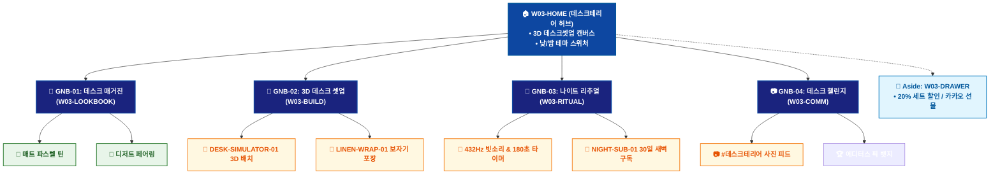

# 🗺️ WICKETA 윤서연 통합 사이트맵 (Master Integrated Information Architecture)

> **프로젝트명**: WICKETA 감성 데스크테리어 & 나이트 리추얼 (Aesthetic Deskterior IA)  
> **분석 대상 클라이언트**: [`[가상클라이언트_03] 윤서연_인스타그래머_감성데스크테리어.txt`](file:///C:/Users/user/Desktop/이지희%20에이전트/설계%20마저%20해오기/자동화/03_클라이언트/01_가상_클라이언트/[가상클라이언트_03] 윤서연_인스타그래머_감성데스크테리어.txt)  
> **연계 통합 서비스 흐름도**: [`C:\Users\SBS\Desktop\0819 이지희\한명씩 화면 설계도 진행\자동화\04_설계_및_스토리보드\02_서비스 흐름도\12. 클라이언트별 통합\03_윤서연_서비스_흐름도_통합.md`](file:///C:/Users/SBS/Desktop/0819%20%EC%9D%B4%EC%A7%80%ED%9D%AC/%ED%95%9C%EB%AA%85%EC%94%A9%20%ED%99%94%EB%A9%B4%20%EC%84%A4%EA%B3%84%EB%8F%84%20%EC%A7%84%ED%96%89/%EC%9E%90%EB%8F%99%ED%99%94/04_%EC%84%A4%EA%B3%84_%EB%B0%8F_%EC%8A%A4%ED%86%A0%EB%A6%AC%EB%B3%B4%EB%93%9C/02_%EC%84%9C%EB%B9%84%EC%8A%A4%20%ED%9D%90%EB%A6%84%EB%8F%84/12.%20%ED%81%B4%EB%9D%BC%EC%9D%B4%EC%96%B8%ED%8A%B8%EB%B3%84%20%ED%86%B5%ED%95%A9/03_윤서연_서비스_흐름도_통합.md)  
> **적용 레이아웃 아키타입**: `A-2 감성 큐레이션 매거진형 (Aesthetic Deskterior)`  
> **통합 핵심 킬러 기능**: **3D 데스크셋업 인테리어 시뮬레이터 (`DESK-SIMULATOR-01`) & 미드나잇 GABA 나이트 구독 (`NIGHT-SUB-01`) & 린넨 보자기 360도 뷰어 (`LINEN-WRAP-01`) & 데스크테리어 챌린지 보드 (`DESK-CHALLENGE-01`) & 티 & 디저트 페어링 가이드 (`DESSERT-PAIRING-01`)**  
> **상품 도감(상점) 명칭**: `데스크테리어 오브제 갤러리 (Deskterior Gallery)`  
> **작성일자**: 2026년 8월 19일  
> **작성자**: Antigravity UI/UX 총괄 설계팀  
> **문서 인코딩**: UTF-8 (유니코드)  

---

## 1. 통합 정보 구조(IA) 기획 배경 및 통합 원칙

본 문서는 윤서연 클라이언트의 **5대 독립적 방문 목적(Use Cases 1~5)**을 종합 분석하여, **중복 화면을 단일 정보 허브(GNB/LNB)로 통합**하고 **고유 목적별 경로(User Journey Path)와 핵심 요구사항을 누락 없이 체계화한 마스터 통합 사이트맵**입니다.

### 1.1 서비스 흐름도 vs 사이트맵 차별화 원칙
- **서비스 흐름도**: 사용자가 목적을 달성하기 위해 이동하는 **시간 순서의 행동 여정 (시작 ➔ 상호작용 ➔ 조건 분기 ➔ 결제/예약 ➔ 사후 관리)**
- **통합 사이트맵**: 웹사이트 내 모든 정보와 기능이 질서정연하게 배치된 **계층형 공간 정보 구조 (1-Depth 루트 ➔ 2-Depth GNB 대메뉴 ➔ 3-Depth LNB 중분류 ➔ 4-Depth 세부 기능 소분류 ➔ Aside/Footer 레이어)**

---

## 2. 전역 내비게이션 및 메뉴 아키텍처 (GNB / LNB / Aside)

### 2.1 상단 전역 메뉴 (GNB 5대 메뉴)
- **GNB-01**: `데스크 매거진 (Desk Magazine)` - 감성 데스크셋업 화보 & 톤앤매너 스타일링 가이드
- **GNB-02**: `오브제 룩북 (Object Lookbook)` - 매트 파스텔 틴, 린넨 매트, 글래스웨어 도감
- **GNB-03**: `3D 데스크 셋업 (3D Desk Setup)` - 가상 테이블 3D 오브제 드래그 배치 & 조화도 검증
- **GNB-04**: `나이트 리추얼 (Night Ritual)` - 432Hz 빗소리 사운드 & 180초 GABA 무카페인 브루잉
- **GNB-05**: `데스크 챌린지 (Desk Challenge)` - #데스크테리어 사진 피드 & 에디터스 픽 뱃지 루프

### 2.2 맞춤 6대 LNB 카테고리 (20종 상품 도감 1:1 매핑)
1. `전체 데스크 오브제 (20)`
1. `🎨 매트 파스텔 오브제 틴 (4) [SEC-01, 05, 08, 10]`
1. `🌿 린넨 패브릭 매트 & 코스터 (4) [SEC-04, 07, 13, 14]`
1. `🥂 빛 굴절 더블월 글래스웨어 (4) [SEC-03, 11, 12, 17]`
1. `🌙 미드나잇 GABA 0.00mg 무카페인 (4) [SEC-02, 06, 09, 20]`
1. `🍰 티 & 구움과자 디저트 페어링 (4) [SEC-15, 16, 18, 19]`

### 2.3 공통 레이어 (Aside Layer & Footer)
- **Aside Layer (Slide-out Cart Drawer)**: 1-Click 간편결제 / 30일 정기구독 / 카카오톡 선물하기 / 가상 스크롤 100% 위치 복원 엔진
- **Footer**: 브랜드 철학, 공인 시험성적서 PDF 다운로드, 이용약관, 사업자 정보, 고객센터

---

## 3. 전사 마스터 통합 계층 구조도 (Master Hierarchical IA Tree)

```text
WICKETA 윤서연 통합 정보 아키텍처 (감성 데스크테리어 마스터)
│
├── 🏠 1. [1-Depth] W03-HOME (데스크테리어 매거진 허브)
│   ├── HERO-01: 3D 감성 데스크셋업 캔버스 (낮/밤 테마 스위처)
│   ├── 5대 목적 퀵독: 데스크셋업 / 나이트구독 / 린넨선물 / 챌린지 / 디저트페어링
│   └── 에디터스 픽 이달의 데스크 셋업 쇼케이스
│
├── 📖 2. [2-Depth: GNB-01] W03-MAGAZINE (데스크 매거진)
│   ├── 계절별 데스크 인테리어 톤앤매너 룩북
│   ├── 구움과자 x 스모키 얼그레이 디저트 페어링 가이드
│   └── 6대 맞춤 LNB 카테고리 필터링 (20종 오브제 도감)
│
├── 📐 3. [2-Depth: GNB-02] W03-BUILD (3D 데스크 셋업 룸)
│   ├── DESK-SIMULATOR-01: 가상 데스크 3D 오브제 배치기
│   ├── LINEN-WRAP-01: 린넨 보자기 360도 패키징 뷰어
│   └── 감성 응원 엽서 에디터 & 20% 세트 할인 번들기
│
├── 🌙 4. [2-Depth: GNB-03] W03-RITUAL (나이트 리추얼 & 구독)
│   ├── 432Hz 빗소리 앰비언트 사운드 & 180초 타이머
│   ├── NIGHT-SUB-01: 미드나잇 GABA 30일 새벽구독 플래너
│   └── KTR 공인 0.00mg 무카페인 성적서 뷰어
│
├── 📷 5. [2-Depth: GNB-04] W03-COMM (데스크 챌린지 보드)
│   ├── DESK-CHALLENGE-01: #데스크테리어 실시간 사진 피드
│   ├── 월간 Top 10 투표 및 에디터스 픽 뱃지 수여
│   └── 30일 나이트 저널 스탬프 캘린더
│
└── 🛒 6. [Aside Layer] W03-DRAWER (Slide-out 감성 결제 드로어)
    ├── 1-Click 간편결제 / 30일 새벽구독 / 카카오 선물
    └── 가상 스크롤 100% 위치 복원 엔진
```

---

## 4. 통합 사이트맵 상세 명세표 (Unified Sitemap Specification Table)

| 접점 ID | Depth | 화면/메뉴 명칭 | 주요 탑재 컴포넌트 & 기능 | 연계 목적 | 진입 및 전환 트리거 |
| :---: | :--- | :--- | :--- | :---: | :--- |
| `W03-HOME` | 1-Depth | 데스크 매거진 메인 | HERO-01 3D 데스크 캔버스, 낮/밤 스위처 | 목적 1~5 | 루트 접속 / 퀵독 클릭 |
| `W03-LOOKBOOK`| 2-Depth | 오브제 화보 & 페어링 | 파스텔 틴 룩북, 디저트 페어링 가이드 | 목적 2, 5 | [오브제 룩북] 클릭 |
| `W03-BUILD` | 2-Depth | 3D 데스크 셋업 룸 | DESK-SIMULATOR-01, LINEN-WRAP-01 | 목적 1, 3 | [3D 셋업 시작] 클릭 |
| `W03-RITUAL` | 2-Depth | 나이트 리추얼 | 432Hz 사운드, 180초 타이머, GABA 구독 | 목적 2, 4 | [나이트 리추얼] 클릭 |
| `W03-DRAWER` | Aside | Slide-out 결제 드로어| 1-Click 간편결제, 20% 세트 할인, 카카오 선물 | 목적 1,2,3,5 | [구매/구독하기] 탭 |
| `W03-DONE` | Modal | 주문 승인 완료 모달 | 스타일링 PDF, 모바일 엽서, 챌린지 쿠폰 | 목적 1~5 | 결제 완료 시 |
| `W03-COMM` | 2-Depth | 데스크 챌린지 보드 | DESK-CHALLENGE-01 투표, 30일 캘린더 | 목적 4 | [챌린지 보드] 탭 |

---

## 5. 방사형 가지치기 트리 다이어그램 (Mermaid Branching Tree)

<div align="center">



</div>

---

## 6. 품질 검토 및 연계 설계 산출물 정합성 체크

- [x] **5대 목적 정보 전수 통합**: 5가지 서로 다른 방문 목적의 모든 상세 페이지와 킬러 기능이 누락 없이 수록됨
- [x] **중복 화면 단일화**: 공통 메인 홈, 카탈로그, 드로어, 완료 화면이 고유 ID로 일원화됨
- [x] **정통 계층 구조(IA) 확립**: 시간 순서 나열이 아닌 GNB ➔ LNB ➔ Detail 정통 트리 위계 준수
- [x] **연계 산출물 라벨 1:1 일치**: `12. 클라이언트별 통합` 서비스 흐름도와 접점 ID 및 화면명이 100% 동기화됨
- [x] **고해상도 벡터 그래픽(SVG) 동시 컴파일 완료**
