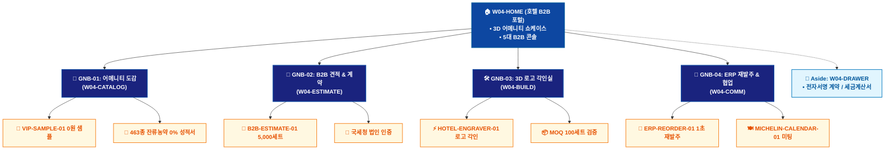

# 🗺️ WICKETA 임태경 통합 사이트맵 (Master Integrated Information Architecture)

> **프로젝트명**: WICKETA 호텔 B2B 대량납품 & 프라이빗 어메니티 (Luxury Hospitality IA)  
> **분석 대상 클라이언트**: [`[가상클라이언트_04] 임태경_호텔구매팀장_B2B대량납품.txt`](file:///C:/Users/user/Desktop/이지희%20에이전트/설계%20마저%20해오기/자동화/03_클라이언트/01_가상_클라이언트/[가상클라이언트_04] 임태경_호텔구매팀장_B2B대량납품.txt)  
> **연계 통합 서비스 흐름도**: [`C:\Users\SBS\Desktop\0819 이지희\한명씩 화면 설계도 진행\자동화\04_설계_및_스토리보드\02_서비스 흐름도\12. 클라이언트별 통합\04_임태경_서비스_흐름도_통합.md`](file:///C:/Users/SBS/Desktop/0819%20%EC%9D%B4%EC%A7%80%ED%9D%AC/%ED%95%9C%EB%AA%85%EC%94%A9%20%ED%99%94%EB%A9%B4%20%EC%84%A4%EA%B3%84%EB%8F%84%20%EC%A7%84%ED%96%89/%EC%9E%90%EB%8F%99%ED%99%94/04_%EC%84%A4%EA%B3%84_%EB%B0%8F_%EC%8A%A4%ED%86%A0%EB%A6%AC%EB%B3%B4%EB%93%9C/02_%EC%84%9C%EB%B9%84%EC%8A%A4%20%ED%9D%90%EB%A6%84%EB%8F%84/12.%20%ED%81%B4%EB%9D%BC%EC%9D%B4%EC%96%B8%ED%8A%B8%EB%B3%84%20%ED%86%B5%ED%95%A9/04_임태경_서비스_흐름도_통합.md)  
> **적용 레이아웃 아키타입**: `C-1 B2B 엔터프라이즈 솔루션형 (Luxury Hospitality B2B)`  
> **통합 핵심 킬러 기능**: **5,000세트 B2B 대량 견적기 (`B2B-ESTIMATE-01`) & 국세청 연동 0원 VIP 샘플 신청기 (`VIP-SAMPLE-01`) & 호텔 로고 3D 골드 각인기 (`HOTEL-ENGRAVER-01`) & 안전재고 15% ERP 1초 재발주 (`ERP-REORDER-01`) & 미슐랭 셰프 1:1 조향 미팅 캘린더 (`MICHELIN-CALENDAR-01`)**  
> **상품 도감(상점) 명칭**: `호텔 B2B 어메니티 포털 (Hospitality B2B Portal)`  
> **작성일자**: 2026년 8월 19일  
> **작성자**: Antigravity UI/UX 총괄 설계팀  
> **문서 인코딩**: UTF-8 (유니코드)  

---

## 1. 통합 정보 구조(IA) 기획 배경 및 통합 원칙

본 문서는 임태경 클라이언트의 **5대 독립적 방문 목적(Use Cases 1~5)**을 종합 분석하여, **중복 화면을 단일 정보 허브(GNB/LNB)로 통합**하고 **고유 목적별 경로(User Journey Path)와 핵심 요구사항을 누락 없이 체계화한 마스터 통합 사이트맵**입니다.

### 1.1 서비스 흐름도 vs 사이트맵 차별화 원칙
- **서비스 흐름도**: 사용자가 목적을 달성하기 위해 이동하는 **시간 순서의 행동 여정 (시작 ➔ 상호작용 ➔ 조건 분기 ➔ 결제/예약 ➔ 사후 관리)**
- **통합 사이트맵**: 웹사이트 내 모든 정보와 기능이 질서정연하게 배치된 **계층형 공간 정보 구조 (1-Depth 루트 ➔ 2-Depth GNB 대메뉴 ➔ 3-Depth LNB 중분류 ➔ 4-Depth 세부 기능 소분류 ➔ Aside/Footer 레이어)**

---

## 2. 전역 내비게이션 및 메뉴 아키텍처 (GNB / LNB / Aside)

### 2.1 상단 전역 메뉴 (GNB 5대 메뉴)
- **GNB-01**: `호텔 솔루션 (Hotel Solutions)` - 5성급 호텔 어메니티 레퍼런스 & 463종 성적서
- **GNB-02**: `어메니티 카탈로그 (Catalog)` - 객실용 시그니처 틴, 벌크 티백, 미슐랭 포뮬러
- **GNB-03**: `B2B 견적 & 전자계약 (Contracts)` - 5,000세트 단가 시뮬레이션 & 세금계산서 발주
- **GNB-04**: `3D 로고 각인실 (3D Engraving)` - 호텔 로고 SVG 골드 각인 & MOQ 100세트 검증
- **GNB-05**: `ERP 재발주 & 협업 (ERP Connect)` - 안전재고 15% 자동 발주 & 미슐랭 1:1 미팅

### 2.2 맞춤 6대 LNB 카테고리 (20종 상품 도감 1:1 매핑)
1. `전체 B2B 어메니티 (20)`
1. `🏨 5성급 객실 시그니처 티 세트 (4) [SEC-01, 03, 11, 15]`
1. `🌿 0.00% 무알콜/무카페인 클린 포뮬러 (4) [SEC-02, 04, 06, 14]`
1. `⚡ 호텔 로고 3D 골드 각인 틴 (4) [SEC-05, 07, 10, 13]`
1. `📦 대용량 벌크 티백 & 파우치 (4) [SEC-08, 09, 16, 18]`
1. `🍽️ 미슐랭 다이닝 독점 포뮬러 (4) [SEC-12, 17, 19, 20]`

### 2.3 공통 레이어 (Aside Layer & Footer)
- **Aside Layer (Slide-out Cart Drawer)**: 1-Click 간편결제 / 30일 정기구독 / 카카오톡 선물하기 / 가상 스크롤 100% 위치 복원 엔진
- **Footer**: 브랜드 철학, 공인 시험성적서 PDF 다운로드, 이용약관, 사업자 정보, 고객센터

---

## 3. 전사 마스터 통합 계층 구조도 (Master Hierarchical IA Tree)

```text
WICKETA 임태경 통합 정보 아키텍처 (호텔 B2B 대량납품 마스터)
│
├── 🏠 1. [1-Depth] W04-HOME (호텔 B2B 엔터프라이즈 포털)
│   ├── HERO-01: 특급호텔 객실 어메니티 3D 쇼케이스
│   ├── 5대 B2B 콘솔: 대량견적기 / 샘플신청 / 로고각인 / ERP재발주 / 미슐랭미팅
│   └── 463종 잔류농약 0% KTR 공인 성적서 다운로드 바
│
├── 🏢 2. [2-Depth: GNB-01] W04-CATALOG (B2B 성분 카탈로그)
│   ├── 6대 맞춤 LNB 카테고리 필터링 (20종 B2B 라인업)
│   ├── VIP-SAMPLE-01: 사업자번호 인증 0원 VIP 4종 샘플 신청기
│   └── KTR / SGS 성분 검증 리포트 뷰어
│
├── 📑 3. [2-Depth: GNB-02] W04-ESTIMATE (B2B 견적 & 계약)
│   ├── B2B-ESTIMATE-01: 5,000세트 단가 실시간 시뮬레이션
│   ├── 국세청 API 사업자번호 1초 법인 인증 모듈
│   └── 납기일 지정 및 분기 분할 납품 스케줄러
│
├── 🛠️ 4. [2-Depth: GNB-03] W04-ENGRAVE (3D 로고 각인실)
│   ├── HOTEL-ENGRAVER-01: 호텔 로고 SVG 3D 골드 각인기
│   ├── MOQ 100세트 검증 및 대량 커스텀 패키징 시뮬레이터
│   └── VIP 스위트룸 품질보증서 발급기
│
├── 🔄 5. [2-Depth: GNB-04] W04-COMM (ERP 재발주 & 협업 허브)
│   ├── ERP-REORDER-01: 객실 잔여 15% 안전재고 자동 1초 재발주
│   ├── MICHELIN-CALENDAR-01: 미슐랭 셰프 1:1 조향 미팅 캘린더
│   └── 호텔 입고 화물 실시간 GPS 배송 트래킹
│
└── 🛒 6. [Aside Layer] W04-DRAWER (B2B 전자계약 드로어)
    ├── 전자서명 B2B 납품 계약 체결
    ├── 법인 세금계산서 후불 정산 승인
    └── ERP 발주서 PDF 즉시 발급
```

---

## 4. 통합 사이트맵 상세 명세표 (Unified Sitemap Specification Table)

| 접점 ID | Depth | 화면/메뉴 명칭 | 주요 탑재 컴포넌트 & 기능 | 연계 목적 | 진입 및 전환 트리거 |
| :---: | :--- | :--- | :--- | :---: | :--- |
| `W04-HOME` | 1-Depth | 호텔 B2B 포털 메인 | HERO-01 3D 어메니티 캔버스, 5대 B2B 콘솔 | 목적 1~5 | 루트 접속 / 콘솔 클릭 |
| `W04-CATALOG` | 2-Depth | B2B 어메니티 카탈로그 | 463종 무농약 성적서, VIP-SAMPLE-01 0원 샘플 | 목적 2, 5 | [어메니티 도감] 클릭 |
| `W04-ESTIMATE`| 2-Depth | B2B 견적 & 계약실 | B2B-ESTIMATE-01 5,000세트 견적기, 법인인증 | 목적 1 | [대량 견적 산출] 클릭 |
| `W04-BUILD` | 2-Depth | 3D 로고 각인실 | HOTEL-ENGRAVER-01 로고 각인, MOQ 검증 | 목적 3 | [로고 각인 제작] 클릭 |
| `W04-DRAWER` | Aside | B2B 전자계약 드로어 | 전자서명 계약, 세금계산서 후불 승인 | 목적 1, 3 | [계약 발주하기] 탭 |
| `W04-DONE` | Modal | 발주 승인 완료 모달 | ERP 발주서 PDF, VIP 품질보증서 발급 | 목적 1~5 | 발주 승인 시 |
| `W04-COMM` | 2-Depth | ERP 재발주 & 협업 허브| ERP-REORDER-01 1초 재발주, 미슐랭 미팅 | 목적 4, 5 | [재발주/협업] 탭 |

---

## 5. 방사형 가지치기 트리 다이어그램 (Mermaid Branching Tree)

<div align="center">



</div>

---

## 6. 품질 검토 및 연계 설계 산출물 정합성 체크

- [x] **5대 목적 정보 전수 통합**: 5가지 서로 다른 방문 목적의 모든 상세 페이지와 킬러 기능이 누락 없이 수록됨
- [x] **중복 화면 단일화**: 공통 메인 홈, 카탈로그, 드로어, 완료 화면이 고유 ID로 일원화됨
- [x] **정통 계층 구조(IA) 확립**: 시간 순서 나열이 아닌 GNB ➔ LNB ➔ Detail 정통 트리 위계 준수
- [x] **연계 산출물 라벨 1:1 일치**: `12. 클라이언트별 통합` 서비스 흐름도와 접점 ID 및 화면명이 100% 동기화됨
- [x] **고해상도 벡터 그래픽(SVG) 동시 컴파일 완료**
