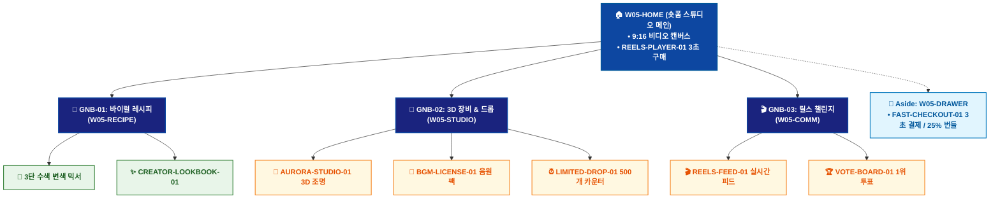

# 🗺️ WICKETA 송아린 통합 사이트맵 (Master Integrated Information Architecture)

> **프로젝트명**: WICKETA 숏폼 믹솔로지 & 바이럴 크리에이터 스튜디오 (Short-form Studio IA)  
> **분석 대상 클라이언트**: [`[가상클라이언트_05] 송아린_푸드크리에이터_숏폼믹솔로지.txt`](file:///C:/Users/user/Desktop/이지희%20에이전트/설계%20마저%20해오기/자동화/03_클라이언트/01_가상_클라이언트/[가상클라이언트_05] 송아린_푸드크리에이터_숏폼믹솔로지.txt)  
> **연계 통합 서비스 흐름도**: [`C:\Users\SBS\Desktop\0819 이지희\한명씩 화면 설계도 진행\자동화\04_설계_및_스토리보드\02_서비스 흐름도\12. 클라이언트별 통합\05_송아린_서비스_흐름도_통합.md`](file:///C:/Users/SBS/Desktop/0819%20%EC%9D%B4%EC%A7%80%ED%9D%AC/%ED%95%9C%EB%AA%85%EC%94%A9%20%ED%99%94%EB%A9%B4%20%EC%84%A4%EA%B3%84%EB%8F%84%20%EC%A7%84%ED%96%89/%EC%9E%90%EB%8F%99%ED%99%94/04_%EC%84%A4%EA%B3%84_%EB%B0%8F_%EC%8A%A4%ED%86%A0%EB%A6%AC%EB%B3%B4%EB%93%9C/02_%EC%84%9C%EB%B9%84%EC%8A%A4%20%ED%9D%90%EB%A6%84%EB%8F%84/12.%20%ED%81%B4%EB%9D%BC%EC%9D%B4%EC%96%B8%ED%8A%B8%EB%B3%84%20%ED%86%B5%ED%95%A9/05_송아린_서비스_흐름도_통합.md)  
> **적용 레이아웃 아키타입**: `B-2 숏폼 미디어 커머스형 (Short-form Reels Studio)`  
> **통합 핵심 킬러 기능**: **9:16 숏폼 레시피 플레이어 (`REELS-PLAYER-01`) & 3초 패스트 체크아웃 (`FAST-CHECKOUT-01`) & 3D 스튜디오 장비 시뮬레이터 (`AURORA-STUDIO-01`) & 크리에이터 트렌드 구독 (`VIRAL-SUB-01`) & 선착순 한정판 드롭 (`LIMITED-DROP-01`)**  
> **상품 도감(상점) 명칭**: `크리에이터 숏폼 스튜디오 샵 (Short-form Studio Shop)`  
> **작성일자**: 2026년 8월 19일  
> **작성자**: Antigravity UI/UX 총괄 설계팀  
> **문서 인코딩**: UTF-8 (유니코드)  

---

## 1. 통합 정보 구조(IA) 기획 배경 및 통합 원칙

본 문서는 송아린 클라이언트의 **5대 독립적 방문 목적(Use Cases 1~5)**을 종합 분석하여, **중복 화면을 단일 정보 허브(GNB/LNB)로 통합**하고 **고유 목적별 경로(User Journey Path)와 핵심 요구사항을 누락 없이 체계화한 마스터 통합 사이트맵**입니다.

### 1.1 서비스 흐름도 vs 사이트맵 차별화 원칙
- **서비스 흐름도**: 사용자가 목적을 달성하기 위해 이동하는 **시간 순서의 행동 여정 (시작 ➔ 상호작용 ➔ 조건 분기 ➔ 결제/예약 ➔ 사후 관리)**
- **통합 사이트맵**: 웹사이트 내 모든 정보와 기능이 질서정연하게 배치된 **계층형 공간 정보 구조 (1-Depth 루트 ➔ 2-Depth GNB 대메뉴 ➔ 3-Depth LNB 중분류 ➔ 4-Depth 세부 기능 소분류 ➔ Aside/Footer 레이어)**

---

## 2. 전역 내비게이션 및 메뉴 아키텍처 (GNB / LNB / Aside)

### 2.1 상단 전역 메뉴 (GNB 5대 메뉴)
- **GNB-01**: `숏폼 스튜디오 (Reels Studio)` - 9:16 세로형 릴스 플레이어 & 3초 구매 버튼
- **GNB-02**: `바이럴 레시피 랩 (Viral Recipes)` - 15초 3단 수색 변색 배합비 & 20종 원료 도감
- **GNB-03**: `3D 촬영 장비실 (Creator Gear)` - 더블월 잔, 쉐이커, 조명 3D 가상 배치기
- **GNB-04**: `크리에이터 구독 & 드롭 (Drop & Sub)` - 월간 바이럴 팩 15% 정기구독 & 500개 한정판 드롭
- **GNB-05**: `#15초 챌린지 룸 (Challenge Feed)` - 실시간 투표 랭킹 피드 & 언박싱 페이백

### 2.2 맞춤 6대 LNB 카테고리 (20종 상품 도감 1:1 매핑)
1. `전체 숏폼 믹솔로지 (20)`
1. `🍹 15초 3단 수색 변색 믹서 (4) [SEC-01, 04, 06, 08]`
1. `📸 더블월 잔 & 바텐더 쉐이커 (4) [SEC-11, 12, 17, 19]`
1. `🎵 릴스 BGM 음원 라이선스 팩 (4) [SEC-02, 05, 07, 14]`
1. `✨ 송아린 한정판 홀로그램 틴 (4) [SEC-03, 10, 13, 15]`
1. `🎬 크리에이터 스튜디오 풀세트 (4) [SEC-09, 16, 18, 20]`

### 2.3 공통 레이어 (Aside Layer & Footer)
- **Aside Layer (Slide-out Cart Drawer)**: 1-Click 간편결제 / 30일 정기구독 / 카카오톡 선물하기 / 가상 스크롤 100% 위치 복원 엔진
- **Footer**: 브랜드 철학, 공인 시험성적서 PDF 다운로드, 이용약관, 사업자 정보, 고객센터

---

## 3. 전사 마스터 통합 계층 구조도 (Master Hierarchical IA Tree)

```text
WICKETA 송아린 통합 정보 아키텍처 (숏폼 믹솔로지 스튜디오 마스터)
│
├── 🏠 1. [1-Depth] W05-HOME (크리에이터 스튜디오 메인 허브)
│   ├── HERO-01: 9:16 세로형 숏폼 비디오 캔버스 & BGM 스트리밍
│   ├── REELS-PLAYER-01: [영상 속 재료 3초 만에 사기] 플로팅 CTA
│   └── 5대 목적 퀵독: 릴스구매 / 장비세트 / 바이럴구독 / 챌린지 / 한정판드롭
│
├── 🍹 2. [2-Depth: GNB-01] W05-RECIPE (바이럴 레시피 랩)
│   ├── 15초 3단 수색 변환 배합비 & 스펙 가이드
│   ├── 6대 맞춤 LNB 카테고리 필터링 (20종 상품 도감)
│   └── CREATOR-LOOKBOOK-01: 송아린 시그니처 화보 룩북
│
├── 📸 3. [2-Depth: GNB-02] W05-STUDIO (3D 가상 스튜디오 & 음원)
│   ├── AURORA-STUDIO-01: 3D 글래스 & 조명 가상 배치 시뮬레이터
│   ├── BGM-LICENSE-01: 상업용 릴스 BGM 음원 3종 스트리밍
│   └── LIMITED-DROP-01: 선착순 500개 실시간 잔여 카운터
│
├── 🎬 4. [2-Depth: GNB-03] W05-COMM (릴스 챌린지 & 피드)
│   ├── REELS-FEED-01: #15초믹솔로지 실시간 영상 피드
│   ├── VOTE-BOARD-01: 시청자 투표 랭킹 & 1위 상금 정산
│   └── 언박싱 숏폼 인증 & 페이백 이벤트 등록
│
└── 🛒 5. [Aside Layer] W05-DRAWER (Slide-out 3초 패스트 체크아웃)
    ├── FAST-CHECKOUT-01: 1-Click 카카오페이 3초 결제
    ├── VIRAL-SUB-01: 15% 정기구독 & BGM 무료 라이선스
    ├── CREATOR-BUNDLE-01: 25% 장비 풀세트 할인 적용
    └── 송아린 라이브 팬미팅 모바일 초대권 발급
```

---

## 4. 통합 사이트맵 상세 명세표 (Unified Sitemap Specification Table)

| 접점 ID | Depth | 화면/메뉴 명칭 | 주요 탑재 컴포넌트 & 기능 | 연계 목적 | 진입 및 전환 트리거 |
| :---: | :--- | :--- | :--- | :--- | :--- |
| `W05-HOME` | 1-Depth | 숏폼 스튜디오 메인 | HERO-01 9:16 비디오 캔버스, REELS-PLAYER-01 | 목적 1~5 | 루트 접속 / 퀵독 클릭 |
| `W05-RECIPE` | 2-Depth | 바이럴 레시피 랩 | 3단 변색 배합비, CREATOR-LOOKBOOK-01 | 목적 1, 5 | [레시피 보기] 클릭 |
| `W05-STUDIO` | 2-Depth | 3D 스튜디오 & 드롭 | AURORA-STUDIO-01 3D 조명, LIMITED-DROP-01 | 목적 2, 3, 5 | [스튜디오/드롭] 클릭 |
| `W05-DRAWER` | Aside | 3초 패스트 체크아웃 | FAST-CHECKOUT-01 1초 결제, 25% 번들 할인 | 목적 1,2,3,5 | [3초 구매하기] 탭 |
| `W05-DONE` | Modal | 주문 승인 완료 모달 | 릴스 촬영 PDF, BGM 라이선스, 팬미팅 초대권 | 목적 1~5 | 결제 완료 시 |
| `W05-COMM` | 2-Depth | 릴스 챌린지 룸 | REELS-FEED-01 투표 보드, 언박싱 페이백 | 목적 4 | [챌린지 참여] 탭 |

---

## 5. 방사형 가지치기 트리 다이어그램 (Mermaid Branching Tree)

<div align="center">



</div>

---

## 6. 품질 검토 및 연계 설계 산출물 정합성 체크

- [x] **5대 목적 정보 전수 통합**: 5가지 서로 다른 방문 목적의 모든 상세 페이지와 킬러 기능이 누락 없이 수록됨
- [x] **중복 화면 단일화**: 공통 메인 홈, 카탈로그, 드로어, 완료 화면이 고유 ID로 일원화됨
- [x] **정통 계층 구조(IA) 확립**: 시간 순서 나열이 아닌 GNB ➔ LNB ➔ Detail 정통 트리 위계 준수
- [x] **연계 산출물 라벨 1:1 일치**: `12. 클라이언트별 통합` 서비스 흐름도와 접점 ID 및 화면명이 100% 동기화됨
- [x] **고해상도 벡터 그래픽(SVG) 동시 컴파일 완료**
