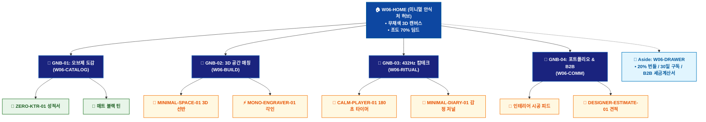

# 🗺️ WICKETA 이도은 통합 사이트맵 (Master Integrated Information Architecture)

> **프로젝트명**: WICKETA 미니멀 인테리어 & 캄테크 안식처 (Minimal Calm-Tech IA)  
> **분석 대상 클라이언트**: [`[가상클라이언트_06] 이도은_인테리어디자이너_미니멀캄테크.txt`](file:///C:/Users/user/Desktop/이지희%20에이전트/설계%20마저%20해오기/자동화/03_클라이언트/01_가상_클라이언트/[가상클라이언트_06] 이도은_인테리어디자이너_미니멀캄테크.txt)  
> **연계 통합 서비스 흐름도**: [`C:\Users\SBS\Desktop\0819 이지희\한명씩 화면 설계도 진행\자동화\04_설계_및_스토리보드\02_서비스 흐름도\12. 클라이언트별 통합\06_이도은_서비스_흐름도_통합.md`](file:///C:/Users/SBS/Desktop/0819%20%EC%9D%B4%EC%A7%80%ED%9D%AC/%ED%95%9C%EB%AA%85%EC%94%A9%20%ED%99%94%EB%A9%B4%20%EC%84%A4%EA%B3%84%EB%8F%84%20%EC%A7%84%ED%96%89/%EC%9E%90%EB%8F%99%ED%99%94/04_%EC%84%A4%EA%B3%84_%EB%B0%8F_%EC%8A%A4%ED%86%A0%EB%A6%AC%EB%B3%B4%EB%93%9C/02_%EC%84%9C%EB%B9%84%EC%8A%A4%20%ED%9D%90%EB%A6%84%EB%8F%84/12.%20%ED%81%B4%EB%9D%BC%EC%9D%B4%EC%96%B8%ED%8A%B8%EB%B3%84%20%ED%86%B5%ED%95%A9/06_이도은_서비스_흐름도_통합.md)  
> **적용 레이아웃 아키타입**: `A-3 미니멀 건축/오브제 갤러리형 (Minimal Calm-Tech)`  
> **통합 핵심 킬러 기능**: **미니멀 3D 공간 뷰어 (`MINIMAL-SPACE-01`) & KTR 공인 무카페인 성적서 뷰어 (`ZERO-KTR-01`) & 모노그램 3D 레이저 각인기 (`MONO-ENGRAVER-01`) & 432Hz 캄테크 플레이어 (`CALM-PLAYER-01`) & 디자이너 B2B 견적기 (`DESIGNER-ESTIMATE-01`)**  
> **상품 도감(상점) 명칭**: `미니멀 오브제 아카이브 (Minimal Object Archive)`  
> **작성일자**: 2026년 8월 19일  
> **작성자**: Antigravity UI/UX 총괄 설계팀  
> **문서 인코딩**: UTF-8 (유니코드)  

---

## 1. 통합 정보 구조(IA) 기획 배경 및 통합 원칙

본 문서는 이도은 클라이언트의 **5대 독립적 방문 목적(Use Cases 1~5)**을 종합 분석하여, **중복 화면을 단일 정보 허브(GNB/LNB)로 통합**하고 **고유 목적별 경로(User Journey Path)와 핵심 요구사항을 누락 없이 체계화한 마스터 통합 사이트맵**입니다.

### 1.1 서비스 흐름도 vs 사이트맵 차별화 원칙
- **서비스 흐름도**: 사용자가 목적을 달성하기 위해 이동하는 **시간 순서의 행동 여정 (시작 ➔ 상호작용 ➔ 조건 분기 ➔ 결제/예약 ➔ 사후 관리)**
- **통합 사이트맵**: 웹사이트 내 모든 정보와 기능이 질서정연하게 배치된 **계층형 공간 정보 구조 (1-Depth 루트 ➔ 2-Depth GNB 대메뉴 ➔ 3-Depth LNB 중분류 ➔ 4-Depth 세부 기능 소분류 ➔ Aside/Footer 레이어)**

---

## 2. 전역 내비게이션 및 메뉴 아키텍처 (GNB / LNB / Aside)

### 2.1 상단 전역 메뉴 (GNB 5대 메뉴)
- **GNB-01**: `미니멀 아카이브 (Minimal Archive)` - 무채색 공간 철학 & 모노크롬 화보
- **GNB-02**: `모노크롬 오브제 (Monochrome Objects)` - 매트 블랙 틴, 글래스웨어, 0.00mg 무카페인 티
- **GNB-03**: `3D 공간 매칭 (3D Space Matching)` - 가상 선반 오브제 3D 배치 & 영문 모노그램 각인
- **GNB-04**: `432Hz 캄테크 (Calm-Tech Ritual)` - 432Hz 자연 음향 & 180초 원형 펄스 타이머
- **GNB-05**: `디자이너 B2B (Designer B2B)` - 쇼룸 다기 오브제 3D 배치 & 20% B2B 견적

### 2.2 맞춤 6대 LNB 카테고리 (20종 상품 도감 1:1 매핑)
1. `전체 미니멀 오브제 (20)`
1. `🖤 매트 블랙 & 무채색 모노크롬 틴 (4) [SEC-01, 03, 07, 10]`
1. `🌿 0.00mg 무카페인 안식 클린티 (4) [SEC-02, 04, 06, 14]`
1. `⚡ 영문 모노그램 레이저 각인 킷 (4) [SEC-05, 08, 11, 13]`
1. `🏺 도예 작가 협업 다기 오브제 (4) [SEC-09, 12, 15, 17]`
1. `🌙 30일 캄테크 심야 정기구독 (4) [SEC-16, 18, 19, 20]`

### 2.3 공통 레이어 (Aside Layer & Footer)
- **Aside Layer (Slide-out Cart Drawer)**: 1-Click 간편결제 / 30일 정기구독 / 카카오톡 선물하기 / 가상 스크롤 100% 위치 복원 엔진
- **Footer**: 브랜드 철학, 공인 시험성적서 PDF 다운로드, 이용약관, 사업자 정보, 고객센터

---

## 3. 전사 마스터 통합 계층 구조도 (Master Hierarchical IA Tree)

```text
WICKETA 이도은 통합 정보 아키텍처 (미니멀 캄테크 안식처 마스터)
│
├── 🏠 1. [1-Depth] W06-HOME (미니멀 안식처 메인 허브)
│   ├── HERO-01: 무채색 모노크롬 3D 캔버스 (조도 70% 딤드 전환)
│   ├── 5대 미니멀 콘솔: 공간매칭 / 캄테크구독 / 모노그램선물 / 180초명상 / 쇼룸오브제
│   └── 3D 무채색 선반 오브제 인터랙션 뷰어
│
├── 🏢 2. [2-Depth: GNB-01] W06-CATALOG (무채색 오브제 도감)
│   ├── 6대 맞춤 LNB 카테고리 필터링 (20종 오브제 도감)
│   ├── ZERO-KTR-01: KTR 공인 0.00mg 무카페인 성적서 뷰어
│   └── 도예 작가 협업 한정판 다기 스펙
│
├── 📐 3. [2-Depth: GNB-02] W06-BUILD (3D 공간 매칭 & 각인실)
│   ├── MINIMAL-SPACE-01: 3D 가상 선반 오브제 배치 & 조화도 검증
│   ├── MONO-ENGRAVER-01: 영문 모노그램 3D 레이저 각인기
│   └── OBJECT-PLACER-01: 쇼룸 테이블 전용 다기 오브제 3D 배치기
│
├── 🌙 4. [2-Depth: GNB-03] W06-RITUAL (432Hz 캄테크 리추얼)
│   ├── CALM-PLAYER-01: 432Hz 자연 음향 & 180초 원형 펄스 타이머
│   └── MINIMAL-DIARY-01: 1줄 무채색 감정 저널 & 30일 챌린지 캘린더
│
├── 📑 5. [2-Depth: GNB-04] W06-COMM (공간 포트폴리오 & B2B)
│   ├── 미니멀 인테리어 시공 사진 & 공간 스타일링 피드
│   └── DESIGNER-ESTIMATE-01: 디자이너 회원 인증 20% B2B 견적기
│
└── 🛒 6. [Aside Layer] W06-DRAWER (Slide-out 미니멀 결제 드로어)
    ├── 1-Click 간편결제 / 30일 캄테크 구독 / B2B 세금계산서
    └── 도예 작가 공식 작품 보증서 PDF 발급
```

---

## 4. 통합 사이트맵 상세 명세표 (Unified Sitemap Specification Table)

| 접점 ID | Depth | 화면/메뉴 명칭 | 주요 탑재 컴포넌트 & 기능 | 연계 목적 | 진입 및 전환 트리거 |
| :---: | :--- | :--- | :--- | :--- | :--- |
| `W06-HOME` | 1-Depth | 미니멀 안식처 메인 | HERO-01 무채색 3D 캔버스, 5대 미니멀 콘솔 | 목적 1~5 | 루트 접속 / 콘솔 클릭 |
| `W06-CATALOG` | 2-Depth | 무채색 오브제 도감 | ZERO-KTR-01 성적서, 매트 블랙 틴 스펙 | 목적 2, 5 | [오브제 도감] 클릭 |
| `W06-BUILD` | 2-Depth | 3D 공간 매칭 & 각인 | MINIMAL-SPACE-01, MONO-ENGRAVER-01 | 목적 1, 3, 5 | [공간 매칭 시작] 클릭 |
| `W06-RITUAL` | 2-Depth | 432Hz 캄테크 리추얼 | CALM-PLAYER-01 432Hz 사운드, 180초 타이머 | 목적 4 | [180초 명상] 클릭 |
| `W06-DRAWER` | Aside | Slide-out 결제 드로어| 20% 번들 할인, 30일 구독, B2B 세금계산서 | 목적 1,2,3,5 | [구매/구독하기] 탭 |
| `W06-DONE` | Modal | 주문 승인 완료 모달 | 스타일링 PDF, 작가 보증서, 모바일 바우처 | 목적 1~5 | 결제 완료 시 |
| `W06-COMM` | 2-Depth | 포트폴리오 & 저널 | MINIMAL-DIARY-01 저널, 인테리어 피드 | 목적 4 | [감정 일기 저장] 탭 |

---

## 5. 방사형 가지치기 트리 다이어그램 (Mermaid Branching Tree)

<div align="center">



</div>

---

## 6. 품질 검토 및 연계 설계 산출물 정합성 체크

- [x] **5대 목적 정보 전수 통합**: 5가지 서로 다른 방문 목적의 모든 상세 페이지와 킬러 기능이 누락 없이 수록됨
- [x] **중복 화면 단일화**: 공통 메인 홈, 카탈로그, 드로어, 완료 화면이 고유 ID로 일원화됨
- [x] **정통 계층 구조(IA) 확립**: 시간 순서 나열이 아닌 GNB ➔ LNB ➔ Detail 정통 트리 위계 준수
- [x] **연계 산출물 라벨 1:1 일치**: `12. 클라이언트별 통합` 서비스 흐름도와 접점 ID 및 화면명이 100% 동기화됨
- [x] **고해상도 벡터 그래픽(SVG) 동시 컴파일 완료**
