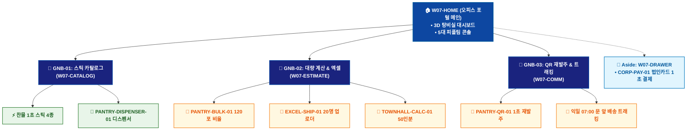

# 🗺️ WICKETA 박지후 통합 사이트맵 (Master Integrated Information Architecture)

> **프로젝트명**: WICKETA 오피스 탕비실 웰니스 & 퀵커머스 (Office Wellness IA)  
> **분석 대상 클라이언트**: [`[가상클라이언트_07] 박지후_스타트업피플팀_오피스탕비실.txt`](file:///C:/Users/user/Desktop/이지희%20에이전트/설계%20마저%20해오기/자동화/03_클라이언트/01_가상_클라이언트/[가상클라이언트_07] 박지후_스타트업피플팀_오피스탕비실.txt)  
> **연계 통합 서비스 흐름도**: [`C:\Users\SBS\Desktop\0819 이지희\한명씩 화면 설계도 진행\자동화\04_설계_및_스토리보드\02_서비스 흐름도\12. 클라이언트별 통합\07_박지후_서비스_흐름도_통합.md`](file:///C:/Users/SBS/Desktop/0819%20%EC%9D%B4%EC%A7%80%ED%9D%AC/%ED%95%9C%EB%AA%85%EC%94%A9%20%ED%99%94%EB%A9%B4%20%EC%84%A4%EA%B3%84%EB%8F%84%20%EC%A7%84%ED%96%89/%EC%9E%90%EB%8F%99%ED%99%94/04_%EC%84%A4%EA%B3%84_%EB%B0%8F_%EC%8A%A4%ED%86%A0%EB%A6%AC%EB%B3%B4%EB%93%9C/02_%EC%84%9C%EB%B9%84%EC%8A%A4%20%ED%9D%90%EB%A6%84%EB%8F%84/12.%20%ED%81%B4%EB%9D%BC%EC%9D%B4%EC%96%B8%ED%8A%B8%EB%B3%84%20%ED%86%B5%ED%95%A9/07_박지후_서비스_흐름도_통합.md)  
> **적용 레이아웃 아키타입**: `C-2 오피스 퀵커머스 & 대용량 벌크형 (Office Wellness)`  
> **통합 핵심 킬러 기능**: **탕비실 120포 대용량 계산기 (`PANTRY-BULK-01`) & 아크릴 디스펜서 0원 렌탈 (`PANTRY-DISPENSER-01`) & 엑셀 대량 주소지 업로더 (`EXCEL-SHIP-01`) & 탕비실 QR 즉시 발주기 (`PANTRY-QR-01`) & 타운홀 케이터링 계산기 (`TOWNHALL-CALC-01`)**  
> **상품 도감(상점) 명칭**: `오피스 웰니스 탕비실 포털 (Pantry Wellness Portal)`  
> **작성일자**: 2026년 8월 19일  
> **작성자**: Antigravity UI/UX 총괄 설계팀  
> **문서 인코딩**: UTF-8 (유니코드)  

---

## 1. 통합 정보 구조(IA) 기획 배경 및 통합 원칙

본 문서는 박지후 클라이언트의 **5대 독립적 방문 목적(Use Cases 1~5)**을 종합 분석하여, **중복 화면을 단일 정보 허브(GNB/LNB)로 통합**하고 **고유 목적별 경로(User Journey Path)와 핵심 요구사항을 누락 없이 체계화한 마스터 통합 사이트맵**입니다.

### 1.1 서비스 흐름도 vs 사이트맵 차별화 원칙
- **서비스 흐름도**: 사용자가 목적을 달성하기 위해 이동하는 **시간 순서의 행동 여정 (시작 ➔ 상호작용 ➔ 조건 분기 ➔ 결제/예약 ➔ 사후 관리)**
- **통합 사이트맵**: 웹사이트 내 모든 정보와 기능이 질서정연하게 배치된 **계층형 공간 정보 구조 (1-Depth 루트 ➔ 2-Depth GNB 대메뉴 ➔ 3-Depth LNB 중분류 ➔ 4-Depth 세부 기능 소분류 ➔ Aside/Footer 레이어)**

---

## 2. 전역 내비게이션 및 메뉴 아키텍처 (GNB / LNB / Aside)

### 2.1 상단 전역 메뉴 (GNB 5대 메뉴)
- **GNB-01**: `오피스 웰니스 (Office Wellness)` - 찬물 1초 스틱 라인업 & 4단 아크릴 디스펜서
- **GNB-02**: `탕비실 대량 계산기 (Pantry Calc)` - 120포 벌크 비율 계산 & 법인카드 1초 결제
- **GNB-03**: `240포 오피스 구독 (Office Sub)` - 매월 240포 정기배송 & 디스펜서 무료 렌탈
- **GNB-04**: `신규 입사자 웰컴 (Welcome Kit)` - 엑셀 20명 일괄 업로드 & 텀블러 온보딩 킷
- **GNB-05**: `QR 재발주 & 케이터링 (Quick Reorder)` - 디스펜서 QR 1초 재발주 & 타운홀 50인분

### 2.2 맞춤 6대 LNB 카테고리 (20종 상품 도감 1:1 매핑)
1. `전체 탕비실 라인업 (20)`
1. `⚡ 찬물 1초 3종 믹스 벌크 (4) [SEC-01, 04, 07, 09]`
1. `🏢 4단 아크릴 디스펜서 렌탈 (4) [SEC-03, 08, 11, 15]`
1. `🎁 신규 입사자 웰컴 텀블러 킷 (4) [SEC-05, 10, 13, 17]`
1. `🍹 전사 타운홀 50인분 케이터링 (4) [SEC-06, 12, 14, 19]`
1. `📦 240포 대용량 오피스 정기구독 (4) [SEC-02, 16, 18, 20]`

### 2.3 공통 레이어 (Aside Layer & Footer)
- **Aside Layer (Slide-out Cart Drawer)**: 1-Click 간편결제 / 30일 정기구독 / 카카오톡 선물하기 / 가상 스크롤 100% 위치 복원 엔진
- **Footer**: 브랜드 철학, 공인 시험성적서 PDF 다운로드, 이용약관, 사업자 정보, 고객센터

---

## 3. 전사 마스터 통합 계층 구조도 (Master Hierarchical IA Tree)

```text
WICKETA 박지후 통합 정보 아키텍처 (오피스 탕비실 웰니스 마스터)
│
├── 🏠 1. [1-Depth] W07-HOME (오피스 웰니스 포털 메인 허브)
│   ├── HERO-01: 오피스 탕비실 웰니스 3D 대시보드
│   ├── 5대 피플팀 콘솔: 120포벌크 / 240포구독 / 웰컴킷 / QR재발주 / 타운홀
│   └── 당일 탕비실 안전재고 현황 위젯
│
├── 🏢 2. [2-Depth: GNB-01] W07-CATALOG (찬물 1초 스틱 카탈로그)
│   ├── 6대 맞춤 LNB 카테고리 필터링 (20종 오피스 상품)
│   ├── 찬물 1초 스틱 4종 스펙 & KTR 0.00% 시험성적서
│   └── PANTRY-DISPENSER-01: 아크릴 4단 수납함 3D 뷰어
│
├── 📑 3. [2-Depth: GNB-02] W07-ESTIMATE (탕비실 계산 & 엑셀 업로드)
│   ├── PANTRY-BULK-01: 직원수(30명) 기반 120포 황금비율 계산기
│   ├── EXCEL-SHIP-01: 20명 입사자 주소지 일괄 파싱 모듈
│   └── TOWNHALL-CALC-01: 타운홀 50인분 스파클링 산출기
│
├── 📱 4. [2-Depth: GNB-03] W07-COMM (탕비실 재고 & QR 루프)
│   ├── PANTRY-QR-01: 디스펜서 QR 스캔 1초 모바일 재발주기
│   ├── 익일 오전 07:00 문 앞 새벽배송 알림톡 대시보드
│   └── 20명 입사자 개별 배송 실시간 트래킹
│
└── 🛒 5. [Aside Layer] W07-DRAWER (법인 간편결제 드로어)
    ├── CORP-PAY-01: 법인카드 1-Click 승인 및 영수증 자동 발급
    ├── 세금계산서 후불 정산 승인
    └── 익일 07:00 도착 새벽배송 스케줄러
```

---

## 4. 통합 사이트맵 상세 명세표 (Unified Sitemap Specification Table)

| 접점 ID | Depth | 화면/메뉴 명칭 | 주요 탑재 컴포넌트 & 기능 | 연계 목적 | 진입 및 전환 트리거 |
| :---: | :--- | :--- | :--- | :--- | :--- |
| `W07-HOME` | 1-Depth | 오피스 포털 메인 | HERO-01 3D 탕비실 대시보드, 5대 콘솔 | 목적 1~5 | 루트 접속 / 콘솔 클릭 |
| `W07-CATALOG` | 2-Depth | 찬물 1초 스틱 카탈로그 | 1초 스틱 4종, PANTRY-DISPENSER-01 뷰어 | 목적 1, 2, 5 | [스틱 도감] 클릭 |
| `W07-ESTIMATE`| 2-Depth | 대량 계산 & 엑셀 업로더| PANTRY-BULK-01, EXCEL-SHIP-01 엑셀 파서 | 목적 1, 3, 5 | [계산기/엑셀] 클릭 |
| `W07-DRAWER` | Aside | 법인 간편결제 드로어 | CORP-PAY-01 법인카드 승인, 익일 07:00 새벽배송 | 목적 1~5 | [법인 결제하기] 탭 |
| `W07-DONE` | Modal | 발주 승인 완료 모달 | 법인 영수증 PDF, 디스펜서 매뉴얼 발급 | 목적 1~5 | 결제 승인 시 |
| `W07-COMM` | 2-Depth | 탕비실 재고 & QR 루프 | PANTRY-QR-01 1초 재발주, 배송 트래킹 | 목적 4 | QR 스캔 / 배송 알림 |

---

## 5. 방사형 가지치기 트리 다이어그램 (Mermaid Branching Tree)

<div align="center">



</div>

---

## 6. 품질 검토 및 연계 설계 산출물 정합성 체크

- [x] **5대 목적 정보 전수 통합**: 5가지 서로 다른 방문 목적의 모든 상세 페이지와 킬러 기능이 누락 없이 수록됨
- [x] **중복 화면 단일화**: 공통 메인 홈, 카탈로그, 드로어, 완료 화면이 고유 ID로 일원화됨
- [x] **정통 계층 구조(IA) 확립**: 시간 순서 나열이 아닌 GNB ➔ LNB ➔ Detail 정통 트리 위계 준수
- [x] **연계 산출물 라벨 1:1 일치**: `12. 클라이언트별 통합` 서비스 흐름도와 접점 ID 및 화면명이 100% 동기화됨
- [x] **고해상도 벡터 그래픽(SVG) 동시 컴파일 완료**
