# 🗺️ WICKETA 이지민 통합 사이트맵 (Master Integrated Information Architecture)

> **프로젝트명**: WICKETA Z세대 틱톡 믹솔로지 & 숏폼 챌린지 (TikTok Mixology IA)  
> **분석 대상 클라이언트**: [`[가상클라이언트_08] 이지민_대학생틱톡커_Z세대믹솔로지.txt`](file:///C:/Users/user/Desktop/이지희%20에이전트/설계%20마저%20해오기/자동화/03_클라이언트/01_가상_클라이언트/[가상클라이언트_08] 이지민_대학생틱톡커_Z세대믹솔로지.txt)  
> **연계 통합 서비스 흐름도**: [`C:\Users\SBS\Desktop\0819 이지희\한명씩 화면 설계도 진행\자동화\04_설계_및_스토리보드\02_서비스 흐름도\12. 클라이언트별 통합\08_이지민_서비스_흐름도_통합.md`](file:///C:/Users/SBS/Desktop/0819%20%EC%9D%B4%EC%A7%80%ED%9D%AC/%ED%95%9C%EB%AA%85%EC%94%A9%20%ED%99%94%EB%A9%B4%20%EC%84%A4%EA%B3%84%EB%8F%84%20%EC%A7%84%ED%96%89/%EC%9E%90%EB%8F%99%ED%99%94/04_%EC%84%A4%EA%B3%84_%EB%B0%8F_%EC%8A%A4%ED%86%A0%EB%A6%AC%EB%B3%B4%EB%93%9C/02_%EC%84%9C%EB%B9%84%EC%8A%A4%20%ED%9D%90%EB%A6%84%EB%8F%84/12.%20%ED%81%B4%EB%9D%BC%EC%9D%B4%EC%96%B8%ED%8A%B8%EB%B3%84%20%ED%86%B5%ED%95%A9/08_이지민_서비스_흐름도_통합.md)  
> **적용 레이아웃 아키타입**: `B-3 Z세대 바이럴 숏폼 커머스형 (TikTok Mixology)`  
> **통합 핵심 킬러 기능**: **3D 매직 변색 에이드 뷰어 (`MAGIC-COLOR-01`) & Z세대 맞춤 구독 드로어 (`TIKTOK-SUB-01`) & 3D 이모지 레이저 각인기 (`EMOJI-ENGRAVER-01`) & Z세대 브이로그 피드 (`VLOG-FEED-01`) & 축제 부스 대용량 계산기 (`FESTIVAL-CALC-01`)**  
> **상품 도감(상점) 명칭**: `Z세대 틱톡 믹서 룸 (TikTok Mixology Room)`  
> **작성일자**: 2026년 8월 19일  
> **작성자**: Antigravity UI/UX 총괄 설계팀  
> **문서 인코딩**: UTF-8 (유니코드)  

---

## 1. 통합 정보 구조(IA) 기획 배경 및 통합 원칙

본 문서는 이지민 클라이언트의 **5대 독립적 방문 목적(Use Cases 1~5)**을 종합 분석하여, **중복 화면을 단일 정보 허브(GNB/LNB)로 통합**하고 **고유 목적별 경로(User Journey Path)와 핵심 요구사항을 누락 없이 체계화한 마스터 통합 사이트맵**입니다.

### 1.1 서비스 흐름도 vs 사이트맵 차별화 원칙
- **서비스 흐름도**: 사용자가 목적을 달성하기 위해 이동하는 **시간 순서의 행동 여정 (시작 ➔ 상호작용 ➔ 조건 분기 ➔ 결제/예약 ➔ 사후 관리)**
- **통합 사이트맵**: 웹사이트 내 모든 정보와 기능이 질서정연하게 배치된 **계층형 공간 정보 구조 (1-Depth 루트 ➔ 2-Depth GNB 대메뉴 ➔ 3-Depth LNB 중분류 ➔ 4-Depth 세부 기능 소분류 ➔ Aside/Footer 레이어)**

---

## 2. 전역 내비게이션 및 메뉴 아키텍처 (GNB / LNB / Aside)

### 2.1 상단 전역 메뉴 (GNB 5대 메뉴)
- **GNB-01**: `틱톡 믹서 룸 (TikTok Mixers)` - 파스텔 메탈 틴 & 트렌디 믹서 도감
- **GNB-02**: `매직 변색 랩 (Magic Color Lab)` - 레몬즙 3단 수색 변환 3D 시뮬레이터
- **GNB-03**: `파스텔 기프트 (Pastel Gifting)` - 하트/별 이모지 3D 레이저 각인 & 틱톡 엽서
- **GNB-04**: `브이로그 챌린지 (Vlog Challenge)` - 15초 홈카페 영상 피드 & 장학금 50만원
- **GNB-05**: `동아리 축제 부스 (Festival Booth)` - 100잔 대용량 계산기 & X배너 PDF 발급

### 2.2 맞춤 6대 LNB 카테고리 (20종 상품 도감 1:1 매핑)
1. `전체 틱톡 팩 (20)`
1. `🍹 3단 수색 변색 매직 에이드 (4) [SEC-01, 04, 06, 08]`
1. `🎀 파스텔 홀로그램 메탈 틴 (4) [SEC-03, 05, 10, 13]`
1. `⚡ 3D 이모지 레이저 각인 킷 (4) [SEC-07, 11, 12, 17]`
1. `🎪 대학 축제 100잔 대용량 키트 (4) [SEC-09, 14, 16, 18]`
1. `✨ Z세대 트렌디 믹서 정기구독 (4) [SEC-02, 15, 19, 20]`

### 2.3 공통 레이어 (Aside Layer & Footer)
- **Aside Layer (Slide-out Cart Drawer)**: 1-Click 간편결제 / 30일 정기구독 / 카카오톡 선물하기 / 가상 스크롤 100% 위치 복원 엔진
- **Footer**: 브랜드 철학, 공인 시험성적서 PDF 다운로드, 이용약관, 사업자 정보, 고객센터

---

## 3. 전사 마스터 통합 계층 구조도 (Master Hierarchical IA Tree)

```text
WICKETA 이지민 통합 정보 아키텍처 (Z세대 틱톡 믹솔로지 마스터)
│
├── 🏠 1. [1-Depth] W08-HOME (틱톡 믹솔로지 메인 허브)
│   ├── HERO-01: 9:16 틱톡 숏폼 비주얼 캔버스
│   ├── 5대 목적 퀵독: 변색에이드 / 홈카페구독 / 이모지선물 / 브이로그 / 축제부스
│   └── 실시간 틱톡커 인기 믹서 3선
│
├── 🍹 2. [2-Depth: GNB-01] W08-CATALOG (트렌디 믹서 도감)
│   ├── 6대 맞춤 LNB 카테고리 필터링 (20종 상품 도감)
│   ├── 파스텔 홀로그램 메탈 틴 스펙
│   └── 대학 축제 100잔 대용량 믹서 라인업
│
├── 🧪 3. [2-Depth: GNB-02] W08-SIMULATE (3D 매직 변색 랩)
│   ├── MAGIC-COLOR-01: 레몬즙 투입 시 3단 수색 변환 렌더링
│   └── 3초 패스트 체크아웃 연동 버튼
│
├── 🛠️ 4. [2-Depth: GNB-03] W08-BUILD (3D 이모지 각인실)
│   ├── EMOJI-ENGRAVER-01: 틴케이스 영문 + 하트/별 이모지 3D 각인
│   └── 틱톡 스티커 감성 생일 축하 엽서 에디터
│
├── 📑 5. [2-Depth: GNB-04] W08-ESTIMATE (축제 100잔 계산기)
│   ├── FESTIVAL-CALC-01: 100잔 수량 & 30% 학생 단체 할인 산출
│   └── BANNER-PDF-01: 동아리명 맞춤 X배너 인쇄용 PDF 생성기
│
├── 🎬 6. [2-Depth: GNB-05] W08-COMM (브이로그 챌린지 룸)
│   ├── VLOG-FEED-01: #과제탈출믹솔로지 실시간 영상 피드
│   └── TIKTOK-RANK-01: 실시간 투표 랭킹 & 장학금 50만원 정산
│
└── 🛒 7. [Aside Layer] W08-DRAWER (Slide-out 학생할인 패스트 체크아웃)
    ├── TIKTOK-PAY-01: 카카오페이 1초 결제 & 15% 학생할인
    ├── TIKTOK-SUB-01: 30일 정기구독 & 홀로그램 스티커 팩
    └── 15초 틱톡 촬영 꿀팁 가이드북 PDF 발급
```

---

## 4. 통합 사이트맵 상세 명세표 (Unified Sitemap Specification Table)

| 접점 ID | Depth | 화면/메뉴 명칭 | 주요 탑재 컴포넌트 & 기능 | 연계 목적 | 진입 및 전환 트리거 |
| :---: | :--- | :--- | :--- | :--- | :--- |
| `W08-HOME` | 1-Depth | 틱톡 믹솔로지 메인 | HERO-01 9:16 비디오 캔버스, 5대 퀵독 | 목적 1~5 | 루트 접속 / 퀵독 클릭 |
| `W08-CATALOG` | 2-Depth | 트렌디 믹서 도감 | 파스텔 틴 스펙, 100잔 대용량 믹서 | 목적 2, 5 | [믹서 도감] 클릭 |
| `W08-SIMULATE`| 2-Depth | 3D 매직 변색 랩 | MAGIC-COLOR-01 3단 수색 변환 뷰어 | 목적 1 | [변색 뷰어] 클릭 |
| `W08-BUILD` | 2-Depth | 3D 이모지 각인실 | EMOJI-ENGRAVER-01 각인기, 틱톡 엽서 | 목적 3 | [이모지 선물] 클릭 |
| `W08-ESTIMATE`| 2-Depth | 축제 100잔 계산기 | FESTIVAL-CALC-01 30% 할인, BANNER-PDF-01 | 목적 5 | [축제 키트 주문] 클릭 |
| `W08-DRAWER` | Aside | 학생할인 패스트 결제 | TIKTOK-PAY-01 15% 할인, 1초 결제 | 목적 1,2,3,5 | [구매/구독하기] 탭 |
| `W08-DONE` | Modal | 주문 승인 완료 모달 | 15초 촬영 PDF, 스티커 팩, 장학금 증서 | 목적 1~5 | 결제 완료 시 |
| `W08-COMM` | 2-Depth | 브이로그 챌린지 룸 | VLOG-FEED-01 피드, TIKTOK-RANK-01 투표 | 목적 4 | [챌린지 참여] 탭 |

---

## 5. 방사형 가지치기 트리 다이어그램 (Mermaid Branching Tree)

```mermaid
graph TD
    classDef root fill:#0D47A1,stroke:#01579B,stroke-width:2px,color:#FFFFFF,font-weight:bold;
    classDef gnb fill:#1A237E,stroke:#0D47A1,stroke-width:2px,color:#FFFFFF,font-weight:bold;
    classDef lnb fill:#E8F5E9,stroke:#2E7D32,stroke-width:1.5px,color:#1B5E20,font-weight:bold;
    classDef detail fill:#FFF8E1,stroke:#F57F17,stroke-width:1.5px,color:#E65100;
    classDef aside fill:#E1F5FE,stroke:#0277BD,stroke-width:1.5px,color:#01579B;

    ROOT["🏠 W08-HOME (틱톡 믹서 허브)<br/>• 9:16 숏폼 캔버스<br/>• 5대 목적 퀵독"]

    GNB1["🍹 GNB-01: 트렌디 믹서<br/>(W08-CATALOG)"]
    GNB2["🧪 GNB-02: 매직 변색 랩<br/>(W08-SIMULATE)"]
    GNB3["🛠️ GNB-03: 이모지 각인실<br/>(W08-BUILD)"]
    GNB4["📑 GNB-04: 축제 100잔 계산<br/>(W08-ESTIMATE)"]
    GNB5["🎬 GNB-05: 브이로그 챌린지<br/>(W08-COMM)"]

    ROOT --> GNB1
    ROOT --> GNB2
    ROOT --> GNB3
    ROOT --> GNB4
    ROOT --> GNB5

    %% GNB1
    LNB11["🎀 파스텔 메탈 틴"]
    LNB12["✨ 트렌디 믹서 구독"]
    GNB1 --> LNB11
    GNB1 --> LNB12

    %% GNB2
    MAGIC["🧪 MAGIC-COLOR-01 3단 변색"]
    GNB2 --> MAGIC

    %% GNB3
    EMOJI["⚡ EMOJI-ENGRAVER-01 각인"]
    CARD["💌 틱톡 스티커 엽서"]
    GNB3 --> EMOJI
    GNB3 --> CARD

    %% GNB4
    FESTIVAL["🧮 FESTIVAL-CALC-01 30%"]
    BANNER["🎪 BANNER-PDF-01 X배너"]
    GNB4 --> FESTIVAL
    GNB4 --> BANNER

    %% GNB5
    FEED["🎬 VLOG-FEED-01 실시간 피드"]
    RANK["🏆 TIKTOK-RANK-01 투표"]
    GNB5 --> FEED
    GNB5 --> RANK

    DRAWER["🛒 Aside: W08-DRAWER<br/>• TIKTOK-PAY-01 15% 학생할인 1초 결제"]
    ROOT -.-> DRAWER

    class ROOT root;
    class GNB1,GNB2,GNB3,GNB4,GNB5 gnb;
    class LNB11,LNB12 lnb;
    class MAGIC,EMOJI,CARD,FESTIVAL,BANNER,FEED,RANK detail;
    class DRAWER aside;
```

<div align="center">



</div>

---

## 6. 품질 검토 및 연계 설계 산출물 정합성 체크

- [x] **5대 목적 정보 전수 통합**: 5가지 서로 다른 방문 목적의 모든 상세 페이지와 킬러 기능이 누락 없이 수록됨
- [x] **중복 화면 단일화**: 공통 메인 홈, 카탈로그, 드로어, 완료 화면이 고유 ID로 일원화됨
- [x] **정통 계층 구조(IA) 확립**: 시간 순서 나열이 아닌 GNB ➔ LNB ➔ Detail 정통 트리 위계 준수
- [x] **연계 산출물 라벨 1:1 일치**: `12. 클라이언트별 통합` 서비스 흐름도와 접점 ID 및 화면명이 100% 동기화됨
- [x] **고해상도 벡터 그래픽(SVG) 동시 컴파일 완료**
