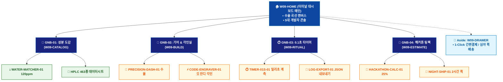

# 🗺️ WICKETA 윤기준 통합 사이트맵 (Master Integrated Information Architecture)

> **프로젝트명**: WICKETA 데이터 엔지니어링 & 초정밀 계측 브루잉 (Precision Data Brewing IA)  
> **분석 대상 클라이언트**: [`[가상클라이언트_09] 윤기준_풀스택개발자_초정밀계측브루잉.txt`](file:///C:/Users/user/Desktop/이지희%20에이전트/설계%20마저%20해오기/자동화/03_클라이언트/01_가상_클라이언트/[가상클라이언트_09] 윤기준_풀스택개발자_초정밀계측브루잉.txt)  
> **연계 통합 서비스 흐름도**: [`C:\Users\SBS\Desktop\0819 이지희\한명씩 화면 설계도 진행\자동화\04_설계_및_스토리보드\02_서비스 흐름도\12. 클라이언트별 통합\09_윤기준_서비스_흐름도_통합.md`](file:///C:/Users/SBS/Desktop/0819%20%EC%9D%B4%EC%A7%80%ED%9D%AC/%ED%95%9C%EB%AA%85%EC%94%A9%20%ED%99%94%EB%A9%B4%20%EC%84%A4%EA%B3%84%EB%8F%84%20%EC%A7%84%ED%96%89/%EC%9E%90%EB%8F%99%ED%99%94/04_%EC%84%A4%EA%B3%84_%EB%B0%8F_%EC%8A%A4%ED%86%A0%EB%A6%AC%EB%B3%B4%EB%93%9C/02_%EC%84%9C%EB%B9%84%EC%8A%A4%20%ED%9D%90%EB%A6%84%EB%8F%84/12.%20%ED%81%B4%EB%9D%BC%EC%9D%B4%EC%96%B8%ED%8A%B8%EB%B3%84%20%ED%86%B5%ED%95%A9/09_윤기준_서비스_흐름도_통합.md)  
> **적용 레이아웃 아키타입**: `C-3 엔지니어링 데이터 대시보드형 (Precision Data Brewing)`  
> **통합 핵심 킬러 기능**: **초정밀 계측 대시보드 (`PRECISION-DASH-01`) & 수질 데이터 매칭기 (`WATER-MATCHER-01`) & 코드 구문 3D 레이저 각인기 (`CODE-ENGRAVER-01`) & 0.1초 정밀 브루잉 타이머 (`TIMER-01S-01`) & 해커톤 팀팩 계산기 (`HACKATHON-CALC-01`)**  
> **상품 도감(상점) 명칭**: `개발자 초정밀 기어 & 데이터 랩 (Precision Gear Lab)`  
> **작성일자**: 2026년 8월 19일  
> **작성자**: Antigravity UI/UX 총괄 설계팀  
> **문서 인코딩**: UTF-8 (유니코드)  

---

## 1. 통합 정보 구조(IA) 기획 배경 및 통합 원칙

본 문서는 윤기준 클라이언트의 **5대 독립적 방문 목적(Use Cases 1~5)**을 종합 분석하여, **중복 화면을 단일 정보 허브(GNB/LNB)로 통합**하고 **고유 목적별 경로(User Journey Path)와 핵심 요구사항을 누락 없이 체계화한 마스터 통합 사이트맵**입니다.

### 1.1 서비스 흐름도 vs 사이트맵 차별화 원칙
- **서비스 흐름도**: 사용자가 목적을 달성하기 위해 이동하는 **시간 순서의 행동 여정 (시작 ➔ 상호작용 ➔ 조건 분기 ➔ 결제/예약 ➔ 사후 관리)**
- **통합 사이트맵**: 웹사이트 내 모든 정보와 기능이 질서정연하게 배치된 **계층형 공간 정보 구조 (1-Depth 루트 ➔ 2-Depth GNB 대메뉴 ➔ 3-Depth LNB 중분류 ➔ 4-Depth 세부 기능 소분류 ➔ Aside/Footer 레이어)**

---

## 2. 전역 내비게이션 및 메뉴 아키텍처 (GNB / LNB / Aside)

### 2.1 상단 전역 메뉴 (GNB 5대 메뉴)
- **GNB-01**: `터미널 대시보드 (Terminal Home)` - 추출 수율 곡선 & 5대 개발자 콘솔
- **GNB-02**: `HPLC 성분 도감 (HPLC Data Catalog)` - 463종 성분 데이터시트 & 수질 맞춤 티
- **GNB-03**: `0.1g 기어 & 각인 랩 (Gear & Code)` - TDS 농도계, 0.1g 저울, 깃 잔디 각인
- **GNB-04**: `0.1초 타이머 & 로그 (Timer & JSON)` - 밀리초 타이머 계측 & JSON 로그 내보내기
- **GNB-05**: `해커톤 부스트 팩 (Hackathon Packs)` - 10인 100포 계산기 & 심야 2시간 퀵배송

### 2.2 맞춤 6대 LNB 카테고리 (20종 상품 도감 1:1 매핑)
1. `전체 엔지니어링 팩 (20)`
1. `💻 TDS 농도계 & 0.1g 정밀 스마트 저울 (4) [SEC-01, 03, 11, 12]`
1. `💧 거주지 수질(120ppm) 맞춤 처방 티 (4) [SEC-04, 07, 09, 15]`
1. `⚡ 깃허브 커밋 잔디 & 10줄 코드 각인 (4) [SEC-05, 08, 10, 13]`
1. `🌙 24시간 무카페인/GABA 해커톤 팀팩 (4) [SEC-02, 06, 14, 17]`
1. `📊 브루잉 알고리즘 데이터시트 & 로그 (4) [SEC-16, 18, 19, 20]`

### 2.3 공통 레이어 (Aside Layer & Footer)
- **Aside Layer (Slide-out Cart Drawer)**: 1-Click 간편결제 / 30일 정기구독 / 카카오톡 선물하기 / 가상 스크롤 100% 위치 복원 엔진
- **Footer**: 브랜드 철학, 공인 시험성적서 PDF 다운로드, 이용약관, 사업자 정보, 고객센터

---

## 3. 전사 마스터 통합 계층 구조도 (Master Hierarchical IA Tree)

```text
WICKETA 윤기준 통합 정보 아키텍처 (초정밀 계측 브루잉 마스터)
│
├── 🏠 1. [1-Depth] W09-HOME (터미널 데이터 대시보드 메인)
│   ├── HERO-01: 실시간 추출 수율 곡선 캔버스 (다크 터미널 테마)
│   ├── 5대 개발자 콘솔: 기어번들 / 수질구독 / 코드각인 / 타이머로그 / 해커톤
│   └── HPLC 463종 성분표 & 0.00mg 무카페인 데이터시트 바
│
├── 🏢 2. [2-Depth: GNB-01] W09-CATALOG (HPLC 성분 도감)
│   ├── 6대 맞춤 LNB 카테고리 필터링 (20종 기어 및 데이터 상품)
│   ├── WATER-MATCHER-01: 거주 지역 수질(TDS 120ppm) 맞춤 티 알고리즘
│   └── 30일 수질 맞춤 정기배송 플래너
│
├── 📐 3. [2-Depth: GNB-02] W09-BUILD (파라미터 & 코드 각인실)
│   ├── PRECISION-DASH-01: 수온(92℃)/시간(180초)/수율(19.8%) 실시간 연산기
│   ├── CODE-ENGRAVER-01: 매트 블랙 틴 깃 잔디 & 10줄 코드 3D 각인기
│   └── GEAR-BUNDLE-01: 20% 개발자 기어 번들 할인기
│
├── ⏱️ 4. [2-Depth: GNB-03] W09-RITUAL (0.1초 타이머 & JSON 로그)
│   ├── TIMER-01S-01: 0.1초 단위 밀리초 카운팅 & 교반 알림
│   └── LOG-EXPORT-01: JSON / CSV 추출 로그 원클릭 다운로더
│
├── 📑 5. [2-Depth: GNB-04] W09-ESTIMATE (해커톤 팀팩 계산기)
│   ├── HACKATHON-CALC-01: 10인 100포 세트 & 25% 팀 할인
│   └── NIGHT-SHIP-01: 심야 2시간 도착 특급 퀵배송 지정
│
└── 🛒 6. [Aside Layer] W09-DRAWER (Slide-out 개발자 결제 드로어)
    ├── 1-Click 간편결제 / 수질 구독 / 법인카드 승인
    ├── 브루잉 알고리즘 데이터시트 PDF 발급
    └── 깃허브 오픈소스 레포지토리 & 디스코드 웹훅 알림
```

---

## 4. 통합 사이트맵 상세 명세표 (Unified Sitemap Specification Table)

| 접점 ID | Depth | 화면/메뉴 명칭 | 주요 탑재 컴포넌트 & 기능 | 연계 목적 | 진입 및 전환 트리거 |
| :---: | :--- | :--- | :--- | :--- | :--- |
| `W09-HOME` | 1-Depth | 터미널 대시보드 메인 | HERO-01 수율 곡선 캔버스, 5대 개발자 콘솔 | 목적 1~5 | 루트 접속 / 콘솔 클릭 |
| `W09-CATALOG` | 2-Depth | HPLC 성분 데이터 도감 | WATER-MATCHER-01 수질 매칭, 성분 데이터시트 | 목적 2, 5 | [성분 도감] 클릭 |
| `W09-BUILD` | 2-Depth | 파라미터 & 코드 각인실 | PRECISION-DASH-01 연산기, CODE-ENGRAVER-01 | 목적 1, 3 | [기어 번들/각인] 클릭 |
| `W09-RITUAL` | 2-Depth | 0.1초 정밀 계측실 | TIMER-01S-01 밀리초 타이머, LOG-EXPORT-01 | 목적 4 | [0.1초 타이머] 클릭 |
| `W09-ESTIMATE`| 2-Depth | 해커톤 팀팩 계산기 | HACKATHON-CALC-01 25% 할인, NIGHT-SHIP-01 | 목적 5 | [해커톤 팀팩] 클릭 |
| `W09-DRAWER` | Aside | 개발자 결제 드로어 | 1-Click 간편결제, 수질 구독, 심야 퀵 | 목적 1,2,3,5 | [결제/발주하기] 탭 |
| `W09-DONE` | Modal | 발주 승인 완료 모달 | 브루잉 알고리즘 PDF, 터미널 바우처 발급 | 목적 1~5 | 결제 승인 시 |
| `W09-COMM` | 2-Depth | 오픈소스 & 로그 허브 | LOG-EXPORT-01 JSON 다운로드, 디스코드 알림 | 목적 4 | [로그 내보내기] 탭 |

---

## 5. 방사형 가지치기 트리 다이어그램 (Mermaid Branching Tree)

<div align="center">



</div>

---

## 6. 품질 검토 및 연계 설계 산출물 정합성 체크

- [x] **5대 목적 정보 전수 통합**: 5가지 서로 다른 방문 목적의 모든 상세 페이지와 킬러 기능이 누락 없이 수록됨
- [x] **중복 화면 단일화**: 공통 메인 홈, 카탈로그, 드로어, 완료 화면이 고유 ID로 일원화됨
- [x] **정통 계층 구조(IA) 확립**: 시간 순서 나열이 아닌 GNB ➔ LNB ➔ Detail 정통 트리 위계 준수
- [x] **연계 산출물 라벨 1:1 일치**: `12. 클라이언트별 통합` 서비스 흐름도와 접점 ID 및 화면명이 100% 동기화됨
- [x] **고해상도 벡터 그래픽(SVG) 동시 컴파일 완료**
