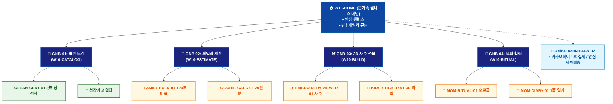

# 🗺️ WICKETA 서지안 통합 사이트맵 (Master Integrated Information Architecture)

> **프로젝트명**: WICKETA 온가족 안심 웰니스 & 패밀리 케어 (Family Wellness IA)  
> **분석 대상 클라이언트**: [`[가상클라이언트_10] 서지안_워킹맘육아인플루언서_온가족안심웰니스.txt`](file:///C:/Users/user/Desktop/이지희%20에이전트/설계%20마저%20해오기/자동화/03_클라이언트/01_가상_클라이언트/[가상클라이언트_10] 서지안_워킹맘육아인플루언서_온가족안심웰니스.txt)  
> **연계 통합 서비스 흐름도**: [`C:\Users\SBS\Desktop\0819 이지희\한명씩 화면 설계도 진행\자동화\04_설계_및_스토리보드\02_서비스 흐름도\12. 클라이언트별 통합\10_서지안_서비스_흐름도_통합.md`](file:///C:/Users/SBS/Desktop/0819%20%EC%9D%B4%EC%A7%80%ED%9D%AC/%ED%95%9C%EB%AA%85%EC%94%A9%20%ED%99%94%EB%A9%B4%20%EC%84%A4%EA%B3%84%EB%8F%84%20%EC%A7%84%ED%96%89/%EC%9E%90%EB%8F%99%ED%99%94/04_%EC%84%A4%EA%B3%84_%EB%B0%8F_%EC%8A%A4%ED%86%A0%EB%A6%AC%EB%B3%B4%EB%93%9C/02_%EC%84%9C%EB%B9%84%EC%8A%A4%20%ED%9D%90%EB%A6%84%EB%8F%84/12.%20%ED%81%B4%EB%9D%BC%EC%9D%B4%EC%96%B8%ED%8A%B8%EB%B3%84%20%ED%86%B5%ED%95%A9/10_서지안_서비스_흐름도_통합.md)  
> **적용 레이아웃 아키타입**: `A-4 온가족 안심 웰니스 매거진형 (Family Wellness)`  
> **통합 핵심 킬러 기능**: **온가족 안심 120포 계산기 (`FAMILY-BULK-01`) & 성장기 맞춤 티 플래너 (`FAMILY-PLANNER-01`) & 3D 자수 라벨 시뮬레이터 (`EMBROIDERY-VIEWER-01`) & 육퇴 안식 플레이어 (`MOM-RITUAL-01`) & 키즈 구디백 계산기 (`GOODIE-CALC-01`)**  
> **상품 도감(상점) 명칭**: `온가족 안심 웰니스 매거진 샵 (Family Wellness Shop)`  
> **작성일자**: 2026년 8월 19일  
> **작성자**: Antigravity UI/UX 총괄 설계팀  
> **문서 인코딩**: UTF-8 (유니코드)  

---

## 1. 통합 정보 구조(IA) 기획 배경 및 통합 원칙

본 문서는 서지안 클라이언트의 **5대 독립적 방문 목적(Use Cases 1~5)**을 종합 분석하여, **중복 화면을 단일 정보 허브(GNB/LNB)로 통합**하고 **고유 목적별 경로(User Journey Path)와 핵심 요구사항을 누락 없이 체계화한 마스터 통합 사이트맵**입니다.

### 1.1 서비스 흐름도 vs 사이트맵 차별화 원칙
- **서비스 흐름도**: 사용자가 목적을 달성하기 위해 이동하는 **시간 순서의 행동 여정 (시작 ➔ 상호작용 ➔ 조건 분기 ➔ 결제/예약 ➔ 사후 관리)**
- **통합 사이트맵**: 웹사이트 내 모든 정보와 기능이 질서정연하게 배치된 **계층형 공간 정보 구조 (1-Depth 루트 ➔ 2-Depth GNB 대메뉴 ➔ 3-Depth LNB 중분류 ➔ 4-Depth 세부 기능 소분류 ➔ Aside/Footer 레이어)**

---

## 2. 전역 내비게이션 및 메뉴 아키텍처 (GNB / LNB / Aside)

### 2.1 상단 전역 메뉴 (GNB 5대 메뉴)
- **GNB-01**: `패밀리 매거진 (Family Magazine)` - 안심 육아 스토리 & 0.00mg 무카페인 도감
- **GNB-02**: `클린 포뮬러 도감 (Clean Formulas)` - KTR 3無 성적서 & 성장기 과일티 스펙
- **GNB-03**: `패밀리 벌크 & 구독 (Family Bulk & Sub)` - 120포 계산기 & 30일 성장기 구독 플래너
- **GNB-04**: `3D 자수 선물 랩 (Embroidery Gifting)` - 오가닉 파우치 3D 자수 & 유치원 구디백
- **GNB-05**: `밤 23:00 육퇴 힐링 (Mom's Ritual)` - 432Hz 오르골 & 1줄 육아 감정 일기

### 2.2 맞춤 6대 LNB 카테고리 (20종 상품 도감 1:1 매핑)
1. `전체 온가족 라인업 (20)`
1. `🌿 0.00mg 무카페인/무설탕 클린티 (4) [SEC-01, 04, 07, 14]`
1. `👶 성장기 아이 맞춤 비타민 과일티 (4) [SEC-02, 06, 08, 10]`
1. `🧵 3D 아이 이름 자수 오가닉 파우치 (4) [SEC-05, 11, 13, 17]`
1. `🎈 유치원 생일파티 20인분 구디백 (4) [SEC-09, 12, 15, 19]`
1. `🌙 맘스 나이트 안식 & 정기구독 팩 (4) [SEC-03, 16, 18, 20]`

### 2.3 공통 레이어 (Aside Layer & Footer)
- **Aside Layer (Slide-out Cart Drawer)**: 1-Click 간편결제 / 30일 정기구독 / 카카오톡 선물하기 / 가상 스크롤 100% 위치 복원 엔진
- **Footer**: 브랜드 철학, 공인 시험성적서 PDF 다운로드, 이용약관, 사업자 정보, 고객센터

---

## 3. 전사 마스터 통합 계층 구조도 (Master Hierarchical IA Tree)

```text
WICKETA 서지안 통합 정보 아키텍처 (온가족 안심 웰니스 마스터)
│
├── 🏠 1. [1-Depth] W10-HOME (온가족 웰니스 매거진 메인)
│   ├── HERO-01: 온가족 안심 비주얼 캔버스 (낮/육퇴 23:00 테마)
│   ├── 5대 패밀리 콘솔: 120포벌크 / 패밀리구독 / 자수선물 / 육퇴힐링 / 키즈구디백
│   └── CLEAN-CERT-01: KTR 공인 0.00mg 무카페인 3無 성적서 바
│
├── 🏢 2. [2-Depth: GNB-01] W10-CATALOG (클린 포뮬러 도감)
│   ├── 6대 맞춤 LNB 카테고리 필터링 (20종 안심 패밀리 상품)
│   ├── CLEAN-CERT-01: 0.00mg 무카페인/0kcal/무인공색소 성분표
│   └── 성장기 과일티 & 오가닉 무표백 파우치 스펙
│
├── 📑 3. [2-Depth: GNB-02] W10-ESTIMATE (패밀리 계산 & 플래너)
│   ├── FAMILY-BULK-01: 4인 가족 맞춤 120포 황금비율 계산기
│   ├── FAMILY-PLANNER-01: 아이 과일티 + 부모 안식티 30일 구독 플래너
│   └── GOODIE-CALC-01: 유치원 생일파티 20인분 단체 20% 할인기
│
├── 🛠️ 4. [2-Depth: GNB-03] W10-BUILD (3D 자수 선물 & 라벨러)
│   ├── EMBROIDERY-VIEWER-01: 오가닉 파우치 3D 자수 시뮬레이터
│   ├── KIDS-STICKER-01: 아이 사진/캐릭터 3D 스티커 라벨러
│   └── 따뜻한 육아 응원 엽서 에디터
│
├── 🌙 5. [2-Depth: GNB-04] W10-RITUAL (밤 23:00 육퇴 힐링 룸)
│   ├── MOM-RITUAL-01: 432Hz 오르골 음향 & 180초 호흡 가이드
│   ├── MOM-DIARY-01: 5색 육아 감정 선택 & 1줄 마이크로 저널
│   └── 30일 맘스 챌린지 스탬프 & 스파 이용권 뱃지
│
└── 🛒 6. [Aside Layer] W10-DRAWER (Slide-out 안심 결제 드로어)
    ├── 카카오페이 1초 간편결제 / 30일 패밀리 구독
    ├── 안심 새벽배송 (익일 07:00 문 앞 배송)
    └── 온가족 건강 음료 레시피북 PDF & 파티 가랜드 증정
```

---

## 4. 통합 사이트맵 상세 명세표 (Unified Sitemap Specification Table)

| 접점 ID | Depth | 화면/메뉴 명칭 | 주요 탑재 컴포넌트 & 기능 | 연계 목적 | 진입 및 전환 트리거 |
| :---: | :--- | :--- | :--- | :--- | :--- |
| `W10-HOME` | 1-Depth | 온가족 웰니스 메인 | HERO-01 안심 캔버스, 5대 패밀리 콘솔 | 목적 1~5 | 루트 접속 / 콘솔 클릭 |
| `W10-CATALOG` | 2-Depth | 클린 포뮬러 도감 | CLEAN-CERT-01 3無 성적서, 과일티 스펙 | 목적 1, 2, 5 | [성분 도감] 클릭 |
| `W10-ESTIMATE`| 2-Depth | 패밀리 계산 & 플래너 | FAMILY-BULK-01, GOODIE-CALC-01 20인분 | 목적 1, 5 | [벌크/구디백] 클릭 |
| `W10-BUILD` | 2-Depth | 3D 자수 선물 랩 | EMBROIDERY-VIEWER-01 3D 자수, 스티커 | 목적 3, 5 | [자수 선물 제작] 클릭 |
| `W10-RITUAL` | 2-Depth | 육퇴 힐링 룸 | MOM-RITUAL-01 오르골 사운드, 180초 타이머 | 목적 4 | [육퇴 힐링] 클릭 |
| `W10-DRAWER` | Aside | 안심 결제 드로어 | 카카오페이 1초 결제, 안심 새벽배송 | 목적 1,2,3,5 | [구매/구독하기] 탭 |
| `W10-DONE` | Modal | 주문 승인 완료 모달 | 건강 레시피 PDF, 생일 가랜드 PDF 발급 | 목적 1~5 | 결제 완료 시 |
| `W10-COMM` | 2-Depth | 육아 일기 & 커뮤니티 | MOM-DIARY-01 저널, 맘스 피드 | 목적 4 | [감정 일기 저장] 탭 |

---

## 5. 방사형 가지치기 트리 다이어그램 (Mermaid Branching Tree)

<div align="center">



</div>

---

## 6. 품질 검토 및 연계 설계 산출물 정합성 체크

- [x] **5대 목적 정보 전수 통합**: 5가지 서로 다른 방문 목적의 모든 상세 페이지와 킬러 기능이 누락 없이 수록됨
- [x] **중복 화면 단일화**: 공통 메인 홈, 카탈로그, 드로어, 완료 화면이 고유 ID로 일원화됨
- [x] **정통 계층 구조(IA) 확립**: 시간 순서 나열이 아닌 GNB ➔ LNB ➔ Detail 정통 트리 위계 준수
- [x] **연계 산출물 라벨 1:1 일치**: `12. 클라이언트별 통합` 서비스 흐름도와 접점 ID 및 화면명이 100% 동기화됨
- [x] **고해상도 벡터 그래픽(SVG) 동시 컴파일 완료**
