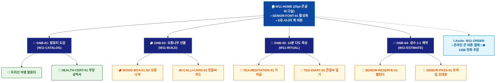

# 🗺️ WICKETA 한명석 통합 사이트맵 (Master Integrated Information Architecture)

> **프로젝트명**: WICKETA 80℃ 온수 발효티 & 시니어 웰에이징 (Senior Well-Aging IA)  
> **분석 대상 클라이언트**: [`[가상클라이언트_11] 한명석_은퇴교수_전통다도시니어웰에이징.txt`](file:///C:/Users/user/Desktop/이지희%20에이전트/설계%20마저%20해오기/자동화/03_클라이언트/01_가상_클라이언트/[가상클라이언트_11] 한명석_은퇴교수_전통다도시니어웰에이징.txt)  
> **연계 통합 서비스 흐름도**: [`C:\Users\SBS\Desktop\0819 이지희\한명씩 화면 설계도 진행\자동화\04_설계_및_스토리보드\02_서비스 흐름도\12. 클라이언트별 통합\11_한명석_서비스_흐름도_통합.md`](file:///C:/Users/SBS/Desktop/0819%20%EC%9D%B4%EC%A7%80%ED%9D%AC/%ED%95%9C%EB%AA%85%EC%94%A9%20%ED%99%94%EB%A9%B4%20%EC%84%A4%EA%B3%84%EB%8F%84%20%EC%A7%84%ED%96%89/%EC%9E%90%EB%8F%99%ED%99%94/04_%EC%84%A4%EA%B3%84_%EB%B0%8F_%EC%8A%A4%ED%86%A0%EB%A6%AC%EB%B3%B4%EB%93%9C/02_%EC%84%9C%EB%B9%84%EC%8A%A4%20%ED%9D%90%EB%A6%84%EB%8F%84/12.%20%ED%81%B4%EB%9D%BC%EC%9D%B4%EC%96%B8%ED%8A%B8%EB%B3%84%20%ED%86%B5%ED%95%A9/11_한명석_서비스_흐름도_통합.md)  
> **적용 레이아웃 아키타입**: `A-5 전통 시니어 고대비 큰글씨형 (Senior Well-Aging)`  
> **통합 핵심 킬러 기능**: **20pt 시니어 큰글씨 모드 (`SENIOR-FONT-01`) & ☎️ 1588 직통 전화 주문 (`PHONE-ORDER-01`) & 혈당/혈압 안심 성분표 (`HEALTH-CERT-01`) & 전통 오동나무 3D 패키징 (`WOOD-BOX-01`) & 전통 다도 명상 플레이어 (`TEA-MEDITATION-01`) & 시니어 1:1 다도회 캘린더 (`SENIOR-RESERVE-01`)**  
> **상품 도감(상점) 명칭**: `전통 다도 & 시니어 발효티 다실 (Traditional Tea Room)`  
> **작성일자**: 2026년 8월 19일  
> **작성자**: Antigravity UI/UX 총괄 설계팀  
> **문서 인코딩**: UTF-8 (유니코드)  

---

## 1. 통합 정보 구조(IA) 기획 배경 및 통합 원칙

본 문서는 한명석 클라이언트의 **5대 독립적 방문 목적(Use Cases 1~5)**을 종합 분석하여, **중복 화면을 단일 정보 허브(GNB/LNB)로 통합**하고 **고유 목적별 경로(User Journey Path)와 핵심 요구사항을 누락 없이 체계화한 마스터 통합 사이트맵**입니다.

### 1.1 서비스 흐름도 vs 사이트맵 차별화 원칙
- **서비스 흐름도**: 사용자가 목적을 달성하기 위해 이동하는 **시간 순서의 행동 여정 (시작 ➔ 상호작용 ➔ 조건 분기 ➔ 결제/예약 ➔ 사후 관리)**
- **통합 사이트맵**: 웹사이트 내 모든 정보와 기능이 질서정연하게 배치된 **계층형 공간 정보 구조 (1-Depth 루트 ➔ 2-Depth GNB 대메뉴 ➔ 3-Depth LNB 중분류 ➔ 4-Depth 세부 기능 소분류 ➔ Aside/Footer 레이어)**

---

## 2. 전역 내비게이션 및 메뉴 아키텍처 (GNB / LNB / Aside)

### 2.1 상단 전역 메뉴 (GNB 5대 메뉴)
- **GNB-01**: `20pt 큰글씨 다실 (Tea Room)` - 20pt 고대비 큰글씨 모드 & 5대 퀵 버튼
- **GNB-02**: `80℃ 발효티 도감 (Fermented Tea)` - 지리산 야생 발효티 & 혈당 안심 성적서
- **GNB-03**: `명품 오동나무 선물 (Wooden Box)` - 3D 오동나무 상자 & 한지 붓글씨 감사 카드
- **GNB-04**: `아침 10분 다도 묵상 (Tea Meditation)` - 가야금/물소리 음향 & 붓글씨 출석 도장
- **GNB-05**: `성수 명원 1:1 예약 (Showroom)` - 1:1 전통 다도 세레머니 큰글씨 예약기

### 2.2 맞춤 6대 LNB 카테고리 (20종 상품 도감 1:1 매핑)
1. `전체 발효티 라인업 (20)`
1. `🍵 지리산 야생 80℃ 온수 발효티 (4) [SEC-01, 03, 11, 15]`
1. `🌿 혈당/혈압 안심 무당 성적서 팩 (4) [SEC-02, 04, 06, 14]`
1. `🪵 전통 명품 오동나무 선물세트 (4) [SEC-05, 07, 10, 13]`
1. `🏺 장인 수제 분청사기 다기 세트 (4) [SEC-08, 09, 12, 17]`
1. `📖 백세 건강 다이어리 & 60일 구독 (4) [SEC-16, 18, 19, 20]`

### 2.3 공통 레이어 (Aside Layer & Footer)
- **Aside Layer (Slide-out Cart Drawer)**: 1-Click 간편결제 / 30일 정기구독 / 카카오톡 선물하기 / 가상 스크롤 100% 위치 복원 엔진
- **Footer**: 브랜드 철학, 공인 시험성적서 PDF 다운로드, 이용약관, 사업자 정보, 고객센터

---

## 3. 전사 마스터 통합 계층 구조도 (Master Hierarchical IA Tree)

```text
WICKETA 한명석 통합 정보 아키텍처 (80℃ 온수 발효티 시니어 마스터)
│
├── 🏠 1. [1-Depth] W11-HOME (20pt 큰글씨 다실 메인 허브)
│   ├── HERO-01: SENIOR-FONT-01 20pt 큰글씨 & 고대비 다실 캔버스
│   ├── 5대 시니어 퀵 버튼: 발효티보기 / 백세구독 / 오동나무선물 / 다도묵상 / 다도회예약
│   └── ☎️ PHONE-ORDER-01: 1588 전담 상담원 1초 직통 전화 연결 배너
│
├── 🍵 2. [2-Depth: GNB-01] W11-CATALOG (80℃ 발효티 도감)
│   ├── 6대 맞춤 LNB 카테고리 필터링 (20종 전통 발효티 도감)
│   ├── HEALTH-CERT-01: 혈당/혈압 안심 0.00% 무당 시험성적서
│   └── 지리산 야생 발효티 & 분청사기 다기 스펙
│
├── 🛠️ 3. [2-Depth: GNB-02] W11-BUILD (3D 오동나무 선물 & 붓글씨)
│   ├── WOOD-BOX-01: 전통 오동나무 상자 360도 3D 회전 뷰어
│   └── CALLI-CARD-01: 붓글씨 감사 문구 폰트 작성기
│
├── 🧘 4. [2-Depth: GNB-03] W11-RITUAL (아침 10분 다도 묵상)
│   ├── TEA-MEDITATION-01: 가야금/물소리 음향 & 80℃ 우림 가이드
│   ├── TEA-DIARY-01: 20pt 큰글씨 1줄 다도 묵상 일기
│   └── 월간 달력 붓글씨 출석 도장 누적 캘린더
│
├── 📅 5. [2-Depth: GNB-04] W11-RESERVE (성수 명원 1:1 다도회)
│   ├── SENIOR-RESERVE-01: 성수 플래그십 쇼룸 1:1 다도회 큰글씨 캘린더
│   └── SENIOR-PASS-01: 20pt 큰글씨 모바일 초대권 발급기
│
└── 🛒 6. [Aside Layer] W11-ORDER (주문 접수 & 배송 드로어)
    ├── 20pt 큰 버튼 온라인 1초 결제
    ├── ☎️ PHONE-ORDER-01 직통 전화 주문 접수
    ├── 우체국 집배원 대면 안심 배달 알림
    └── 음성 안내 지원 & 큰글씨 영수증 발급
```

---

## 4. 통합 사이트맵 상세 명세표 (Unified Sitemap Specification Table)

| 접점 ID | Depth | 화면/메뉴 명칭 | 주요 탑재 컴포넌트 & 기능 | 연계 목적 | 진입 및 전환 트리거 |
| :---: | :--- | :--- | :--- | :--- | :--- |
| `W11-HOME` | 1-Depth | 큰글씨 다실 메인 | SENIOR-FONT-01 20pt 캔버스, 5대 큰 버튼 | 목적 1~5 | 루트 접속 / 버튼 클릭 |
| `W11-CATALOG` | 2-Depth | 80℃ 발효티 도감 | HEALTH-CERT-01 성적서, 야생 발효티 스펙 | 목적 1, 2 | [발효티 보기] 클릭 |
| `W11-BUILD` | 2-Depth | 3D 오동나무 선물실 | WOOD-BOX-01 3D 뷰어, CALLI-CARD-01 붓글씨 | 목적 3 | [오동나무 선물] 클릭 |
| `W11-RITUAL` | 2-Depth | 아침 10분 다도 묵상실 | TEA-MEDITATION-01 가야금 음향, 10분 타이머 | 목적 4 | [다도 묵상 시작] 클릭 |
| `W11-ESTIMATE`| 2-Depth | 성수 명원 1:1 다도회 | SENIOR-RESERVE-01 큰글씨 캘린더, 초대권 | 목적 5 | [다도회 예약] 클릭 |
| `W11-ORDER` | Aside | 주문 접수 드로어 | 온라인 큰 버튼 결제, PHONE-ORDER-01 전화 | 목적 1~3 | [구매/전화주문] 탭 |
| `W11-DONE` | Modal | 주문/예약 완료 모달 | 음성 안내 지원, 큰글씨 영수증, 초대장 | 목적 1~5 | 주문/예약 완료 시 |
| `W11-COMM` | 2-Depth | 다도 캘린더 & 배송 | 붓글씨 출석 도장, 우체국 안심 배달 알림 | 목적 4 | [출석 도장 확인] 탭 |

---

## 5. 방사형 가지치기 트리 다이어그램 (Mermaid Branching Tree)

<div align="center">



</div>

---

## 6. 품질 검토 및 연계 설계 산출물 정합성 체크

- [x] **5대 목적 정보 전수 통합**: 5가지 서로 다른 방문 목적의 모든 상세 페이지와 킬러 기능이 누락 없이 수록됨
- [x] **중복 화면 단일화**: 공통 메인 홈, 카탈로그, 드로어, 완료 화면이 고유 ID로 일원화됨
- [x] **정통 계층 구조(IA) 확립**: 시간 순서 나열이 아닌 GNB ➔ LNB ➔ Detail 정통 트리 위계 준수
- [x] **연계 산출물 라벨 1:1 일치**: `12. 클라이언트별 통합` 서비스 흐름도와 접점 ID 및 화면명이 100% 동기화됨
- [x] **고해상도 벡터 그래픽(SVG) 동시 컴파일 완료**
