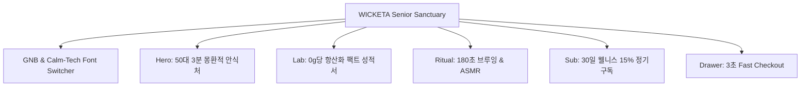

# 📋 가상클라이언트 요구사항 분석 및 정보 구조 설계 보고서 [클라이언트 15 - 한명석 (50대 액티브 시니어)]

> **프로젝트명**: WICKETA 50대 액티브 시니어 웰니스 안식처 & Calm-Tech UX D2C  
> **분석 대상 클라이언트**: `[가상클라이언트_18] 한명석_50대시니어_액티브웰니스안식처.txt`  
> **리서치 데이터베이스**: `C:\Users\user\Desktop\이지희 에이전트\Antigravity\자동화\02_리서치_데이터\output\분류.md`  
> **작성자**: Antigravity UX 기획팀  
> **작성일자**: 2026년 8월 14일  
> **버전**: v1.0  

---

## 1. 가상 클라이언트 개요 & 기본 정보

### 1.1 클라이언트 핵심 정보
- **이름**: 한명석 (Han Myeong-seok)
- **연령 / 직업**: 56세 / 액티브 시니어 웰니스 클럽 대표 & 웰빙 사진작가
- **소속 / 직책**: 액티브 웰니스 시니어 포럼 이사장
- **브랜드 페르소나 매핑**: [Type C] 전 세대 브랜드 페르소나 소비자 클라이언트 (50대 시니어 웰니스 리추얼)
- **협력 / 자사 브랜드**: 위케티 (WICKETA) / WONDERSCAPE
- **서비스 출시일**: 2026년 11월 25일
- **핵심 슬로건**: **"Age-Less Wellness & Calm-Tech Tea Ritual: 50대 액티브 시니어의 노화 방지 식물성 안식처"**

### 1.2 핵심 요청 요약 (VoC 추출)
- **눈이 편안한 캄테크(Calm-Tech) UX**: 150% 글씨 확대 조절 스위처, 0.5px 미세 구분선, 오프화이트 샌드 캔버스
- **0g당 항산화 식물성 검증**: 당류 0g, 카페인 0mg, L-테아닌 250mg 팩트 성적서 팝업
- **3초 무마찰 정기구독 결제**: 30일 웰니스 정기배송 15% 이체 계산기 및 슬라이드아웃 Cart Drawer
- **자연 앰비언트 ASMR**: 숲속 바람 소리와 180초 안식 브루잉 타이머 연동

---

## 2. 클라이언트 요구사항 수집 및 분석 (Requirements Gathering)

| 번호 | 요구사항 항목 (VoC) | 중요도 | WICKETA 4대 설계 전략 매핑 | 카테고리 태그 |
| :---: | :--- | :---: | :--- | :--- |
| **REQ-01** | Calm-Tech 150% Big Font 조절 스위처 및 눈 피로 방지 레이아웃 | 🔴 높음 | [전략 1] 안식처 레이아웃 | `🎨 브랜드 비주얼` |
| **REQ-02** | 0g당 항산화 식물성 L-테아닌/무카페인 성분 검증 성적서 모달 | 🔴 높음 | [전략 2] 공감각 시각화 | `🌀 공감각 모션` |
| **REQ-03** | 30일 웰니스 정기배송 15% 절약 계산기 및 3초 Cart Drawer | 🔴 높음 | [전략 4] 심리스 빌더 | `🛍️ 커머스 빌더` |
| **REQ-04** | 180초 안식 브루잉 타이머 & 숲속 앰비언트 ASMR 모듈 | 🟡 보통 | [전략 3] 감정 진단 퀴즈 | `🌀 공감각 모션` |
| **REQ-05** | 3D 금박 이니셜 각인 틴케이스 미리보기 및 카카오 1초 결제 | 🟡 보통 | [전략 4] 심리스 빌더 | `🛍️ 커머스 빌더` |
| **REQ-06** | 탐색 위치 100% 보존 Virtual Scroll 및 미세 0.5px 그리드 | 🟢 낮음 | [전략 1] 안식처 레이아웃 | `🎨 브랜드 비주얼` |

---

## 3. 요구사항 정보 단위 변환 및 분해 (Information Taxonomy)

| 요구사항 ID | 정보 단위 (Information Unit) | 세부 구성 데이터 요소 | 화면 반영 위치 |
| :---: | :--- | :--- | :--- |
| **REQ-01** | Calm-Tech Font Module | 100%/125%/150% 폰트 확대 버튼, 오프화이트 샌드 캔버스 | GNB 플로팅 바 & 전 화면 |
| **REQ-02** | Anti-Oxidant Fact Sheet | 당 0g, 카페인 0mg, L-테아닌 250mg, 시험성적서 PDF 다운로드 | Hero 하단 & 상세 페이지 |
| **REQ-03** | Subscription Calculator | 2주/4주 주기 선택기, 15% 이체 할인 계산 결과, 3초 결제 버튼 | 메인 3번 모듈 & Cart Drawer |
| **REQ-04** | 180s ASMR Brew Timer | 180초 카운트다운 링, 숲속/찻잔 앰비언트 사운드 토글 | 리추얼 모듈 |
| **REQ-05** | 3D Senior Gift Viewer | 금박 이니셜 입력 폼, 360도 틴케이스 회전 Canvas | 커스텀 모듈 |
| **REQ-06** | Scroll State Manager | `sessionStorage` 기반 Y-Scroll 위치 100% 보존 연동 | 글로벌 스크립트 |

---

## 4. 정보 그룹화 및 분류 (Affinity Diagram)

```
[WICKETA 한명석 50대 시니어 안식처 IA 그룹]
 ├── 1. GNB & Calm-Tech 바 (Global Navigation & Font Scale Bar)
 ├── 2. 몽환적 안식처 메인 비주얼 (Hero & Off-White Sand Canvas)
 ├── 3. 0g당 항산화 팩트 검증실 (Anti-Oxidant Fact Sheet & Lab)
 ├── 4. 180초 안식 타이머 & ASMR (180s Ritual & Ambient Audio)
 ├── 5. 30일 시니어 웰니스 정기구독 빌더 (30-Day Subscription Builder)
 └── 6. 3초 패스트 체크아웃 (Slide-out Cart Drawer & Kakao Pay)
```

---

## 5. 정보 구조 및 계층 설계 (Information Architecture - IA Tree)



---

## 6. 레이블링 시스템 (Labeling System)

| 노드 ID | 메뉴명 (한글) | 영문 레이블 | 설명 및 기능 |
| :---: | :--- | :--- | :--- |
| **MN-01** | 캄테크 폰트 확대 | Calm-Tech Font Scale | 100%/125%/150% 시니어 맞춤 가독성 확대 버튼 |
| **MN-02** | 항산화 팩트 성적서 | Anti-Oxidant Fact Sheet | 0g 당류 & 0mg 카페인 정밀 검증표 모달 |
| **MN-03** | 180초 안식 타이머 | 180s Brew & ASMR | 3분 우림 카운트다운 및 숲속 앰비언트 sound |
| **MN-04** | 30일 정기구독 15% | 30-Day Sub Calculator | 2주/4주 배송주기 선택 및 15% 이체 할인 계산 |
| **MN-05** | 3초 안식 결제 | Fast Order Drawer | 장바구니 이동 없는 슬라이드아웃 Cart Drawer |

---

## 7. 내비게이션 구조 설계 (Navigation Design)

- **1차 진입**: Home 접속 시 오프화이트 샌드 캔버스 및 캄테크 150% 확대 스위처 기본 노출
- **2차 탐색**: 0g당 항산화 팩트 검증 성적서 1-Click 모달 확인
- **3차 리추얼**: 180초 안식 타이머 재생 시 숲속 ASMR 자동 구동
- **4차 전환**: 30일 정기구독 계산기에서 주기를 선택하고 3초 Order Drawer로 즉시 결제 완결

---

## 8. 와이어프레임 & 화면 영역 배치 (Wireframe Layout)

| 영역 ID | 화면 영역명 | 핵심 레이아웃 & UI 요소 |
| :---: | :--- | :--- |
| **SEC-01** | Header & Calm-Tech Bar | 150% Big Font 조절 버튼, 미세 0.5px 구분선 GNB |
| **SEC-02** | Hero Section | Soft Sand Beige 배경, "50대를 위한 3분 안식처" 메인 카피 |
| **SEC-03** | Fact Sheet Lab | 0g당 당류/카페인 검증표 & PDF 성적서 다운로드 팝업 |
| **SEC-04** | Ritual & ASMR | 180초 카운트다운 타이머 링 & 숲속/자연 앰비언트 오디오 |
| **SEC-05** | Senior Sub Builder | 2주/4주 주기 선택 셀렉터 & 15% 다이내믹 할인 금액 표 |
| **SEC-06** | Slide-out Cart Drawer | 400px 우측 슬라이드아웃 & 스크롤 위치 100% 보존 스크립트 |

---

## 9. 최종 검토 및 검증 (Quality Check & Audit)

- [x] **VoC 100% 매핑**: 50대 시니어의 가독성(Calm-Tech Big Font), 항산화 팩트 검증, 3초 결제 니즈 완벽 반영
- [x] **WICKETA 4대 전략 동기화**: 안식처 레이아웃, 공감각 시각화, 감정 진단, 심리스 빌더와 1:1 결합
- [x] **3단계 연계 데이터 준비 완료**: 9개 벤치마크 사이트 심층 분석을 위한 기초 IA 확립

---

### 🚀 완료 및 3단계 연계 안내
2단계 클라이언트 요구사항 분석 보고서 생성이 완료되었습니다.  
다음 3단계: [클라이언트 기반 사이트 분석](file:///C:/Users/user/Desktop/이지희%20에이전트/Antigravity/자동화/03_클라이언트/03_사이트_분석/01_프롬프트_및_스킬/클라이언트%20기반%20skill.md)을 수행할 준비가 되었습니다.
