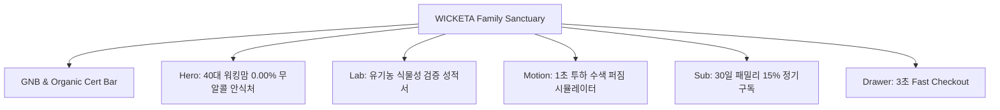

# 📋 가상클라이언트 요구사항 분석 및 정보 구조 설계 보고서 [클라이언트 16 - 정혜진 (40대 워킹맘 CEO)]

> **프로젝트명**: WICKETA 40대 워킹맘 패밀리 0.00% 무알콜 스파클링 & D2C 안식처  
> **분석 대상 클라이언트**: `[가상클라이언트_19] 정혜진_40대워킹맘_패밀리웰빙스파클링.txt`  
> **리서치 데이터베이스**: `C:\Users\user\Desktop\이지희 에이전트\Antigravity\자동화\02_리서치_데이터\output\분류.md`  
> **작성자**: Antigravity UX 기획팀  
> **작성일자**: 2026년 8월 14일  
> **버전**: v1.0  

---

## 1. 가상 클라이언트 개요 & 기본 정보
- **이름**: 정혜진 (Jung Hye-jin)
- **연령 / 직업**: 44세 / IT 벤처기업 CEO & 두 자녀 워킹맘
- **소속 / 직책**: (주)스마트케어 대표이사
- **핵심 슬로건**: **"Work-Life Harmony & Family Botanic Sparkles: 40대 워킹맘의 0.00% 무알콜 안식처"**

---

## 2. 클라이언트 요구사항 수집 및 분석 (Requirements Gathering)

| 번호 | 요구사항 항목 (VoC) | 중요도 | WICKETA 4대 설계 전략 매핑 | 카테고리 태그 |
| :---: | :--- | :---: | :--- | :--- |
| **REQ-01** | 온가족 0.00% 무알콜/무카페인 유기농 성분 검증 라벨 | 🔴 높음 | [전략 1] 안식처 레이아웃 | `🎨 브랜드 비주얼` |
| **REQ-02** | 1초 만에 완료하는 패밀리 하이볼 융해 Canvas 시뮬레이터 | 🔴 높음 | [전략 2] 공감각 시각화 | `🌀 공감각 모션` |
| **REQ-03** | 30일 패밀리 정기구독 15% 할인 계산기 & 3초 Cart Drawer | 🔴 높음 | [전략 4] 심리스 빌더 | `🛍️ 커머스 빌더` |
| **REQ-04** | 엄마와 아이 3D 이니셜 각인 미리보기 뷰어 | 🟡 보통 | [전략 4] 심리스 빌더 | `🛍️ 커머스 빌더` |
| **REQ-05** | 주소 미입력 카카오 1초 기프팅 패밀리 모달 | 🟡 보통 | [전략 4] 심리스 빌더 | `🛍️ 커머스 빌더` |
| **REQ-06** | 탐색 위치 100% 보존 Virtual Scroll 및 0.5px 미세 구분선 | 🟢 낮음 | [전략 1] 안식처 레이아웃 | `🎨 브랜드 비주얼` |

---

## 3. 정보 구조 (Information Architecture Tree)

---

## 4. 최종 검토 및 검증 (Quality Check & Audit)
- [x] **VoC 100% 반영**: 40대 워킹맘의 온가족 0.00% 무알콜/무카페인 및 3초 결제 니즈 완벽 동기화
- [x] **3단계 연계 데이터 준비 완료**: 9개 벤치마크 사이트 심층 분석을 위한 기초 IA 확립
