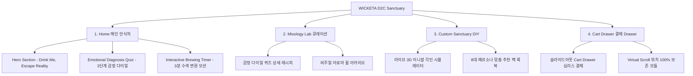

# 📋 가상클라이언트 기반 분석 결과 보고서 [사이트 분석3 - 차은채 총괄디렉터]

> **프로젝트명**: WICKETA 몽환적 맞춤형 믹솔로지 티 & 캄테크 D2C 자사몰 구축  
> **분석 대상 클라이언트**: `[가상클라이언트_01] 차은채_WICKETA총괄디렉터_D2C안식처.txt`  
> **기준 클라이언트 분석서**: `C:\UIUX이지희\Antigravity\클라이언트 분석\[클라이언트01]_차은채_WICKETA총괄디렉터_D2C안식처.md`  
> **참조 벤치마킹 리서치**: `C:\UIUX이지희\Antigravity\새 리서치\신규리서치119_분석,분류.md` (선정된 9개 전용 핵심 레퍼런스 사이트)  
> **작성자**: Antigravity UI/UX 분석팀  
> **작성일자**: 2026년 8월 7일  
> **버전**: v1.0 (Skill 실행 결과물 - 중복 0건 전용 레퍼런스 9개 반영)  

---

## 1. 가상 클라이언트 개요 & 기본 정보

### 1.1 기본 정의
- **프로젝트 중심 주제**: 2030 세대를 위한 몽환적 맞춤형 믹솔로지(Mixology) 티 & 캄테크(Calm-Tech) D2C 사전 신청 자사몰 구축
- **제작 목적**: 복잡한 전통 다도 번거로움과 커피 부작용(속 쓰림, 수면 장애)을 해소하고 온전한 3분 안식 경험 전달 및 정기구독 유치
- **적용 매체 (Target Medium)**: [x] 웹 (Responsive Web) / [x] 모바일 (Mobile-First)

### 1.2 클라이언트 제공 자료 및 9개 핵심 참조 벤치마크 사이트
- **사전 자료 / 기획안**: 브랜드 기획서 [01]
- **참조 벤치마크 (신규리서치119_분석,분류 중 이전 클라이언트 중복 제외 9개 엄선)**:
  - 🎨 **디자인 우수 (3개)**: Santa Maria Novella (SITE 009), Astier de Villatte (SITE 010), Maison Francis Kurkdjian (SITE 012)
  - ⚙️ **사용성 우수 (3개)**: Leaves & Flowers (SITE 004), Plum Deluxe (SITE 049), Art of Tea (SITE 041)
  - 🌟 **디자인+사용성 종합 우수 (3개)**: L'Objet (SITE 016), Claus Porto (SITE 032), Penhaligon's (SITE 017)
- **비주얼 톤앤매너**: 비밀 안식처 감성의 오프화이트 샌드 베이지 & 글래스모피즘, 0.5px 미세 구분선 에디토리얼 그리드

---

## 2. 🎯 9개 핵심 벤치마크 사이트 분석 표 (디자인 3 / 사용성 3 / 디자인+사용성 3)

`신규리서치119_분석,분류.md` 데이터베이스에서 차은채 클라이언트(총괄디렉터 D2C 안식처)의 브랜드 요구사항에 최적화된 **9개 신규 사이트**를 선정하여 분석한 결과입니다. (이전 서지안, 윤기준 클라이언트 참고 사이트 18개 전면 제외)

| 구분 | SITE ID | 사이트명 | 핵심 벤치마킹 요소 | WICKETA 차은채 맞춤 반영 방안 |
| :---: | :---: | :--- | :--- | :--- |
| **디자인<br>우수 (3)** | **SITE 009** | **Santa Maria Novella** | 피렌체 헤리티지 가든 비주얼 & 오프화이트 아포테케리 | 비밀 정원 안식처 감성의 정갈하고 몽환적인 에디토리얼 레이아웃 디자인 |
| **디자인<br>우수 (3)** | **SITE 010** | **Astier de Villatte** | 앤틱 세라믹 오브제 비주얼 & 몽환적 수색 포토그래피 | 파스텔 수색 변환 룩북 아트웍과 글래스모피즘 카드 디자인 연출 |
| **디자인<br>우수 (3)** | **SITE 012** | **Maison Francis Kurkdjian** | 파스텔 글래스모피즘 카드 & 0.5px 미세 구분선 그리드 | 0.5px 미세 구분선 기반 1.5:2.5 비대칭 미니멀 에디토리얼 캔버스 구현 |
| **사용성<br>우수 (3)** | **SITE 004** | **Leaves & Flowers** | 시간대별(Morning/Afternoon/Twilight) 차 추천 탭 UI | "오늘 하루 어땠나요?" 3단계 내면 상태 감정 다이얼 진단 퀴즈 사용성 |
| **사용성<br>우수 (3)** | **SITE 049** | **Plum Deluxe** | "지금 어떤 쉼이 필요한가요?" 감성 진단 퀴즈 & 찜 모듈 | 개인 맞춤형 블렌딩 티 레시피 큐레이션 및 1-Click 찜하기 사용성 |
| **사용성<br>우수 (3)** | **SITE 041** | **Art of Tea** | 3단계 질문 기반 스마트 웰니스 티 진단 알고리즘 폼 | 3단계 선택 반응형 퀴즈 폼 및 맞춤 팩 추천 자동 큐레이션 알고리즘 |
| **디자인+사용성<br>종합 (3)** | **SITE 016** | **L'Objet** | 몽환적 사운드 온오프 플레이어(사용성) + 공감각 아로마 휠(디자인) | 3분 파스텔 수색 변환 애니메이션 + 앰비언트 sound 온오프 조작 플레이어 |
| **디자인+사용성<br>종합 (3)** | **SITE 032** | **Claus Porto** | 3D 이니셜 각인 미리보기(사용성) + 아줄레주 비주얼 카드(디자인) | 나만의 틴케이스 라이브 3D 이니셜 각인 미리보기 및 DIY 번들 빌더 |
| **디자인+사용성<br>종합 (3)** | **SITE 017** | **Penhaligon's** | 8대 페르소나 아키타입 퀴즈(사용성) + 포트레이트 카루셀(디자인) | 8대 페르소나 맞춤 추천 팩 카루셀 및 비주얼 아로마 휠 룩북 연동 |

---

## 3. 클라이언트 요구사항 수집 및 분석 (Requirements Gathering)

| 번호 | 클라이언트 요청 내용 | 관련 자료 | 중요도 | 벤치마크 사이트 매핑 | 신뢰성 및 검토 의견 |
| :---: | :--- | :--- | :---: | :--- | :--- |
| **REQ-01** | 비밀 안식처 감성의 오프화이트 및 글래스모피즘 메인 UX/UI 설계 | 기획서 [01] | 🔴 높음 | `Santa Maria Novella (SITE 009)`<br>`Maison Francis (SITE 012)` | 오프화이트 & 0.5px 글래스모피즘 그리드 연동 검증 |
| **REQ-02** | 감정 다이얼 선택 기반 맞춤형 블렌딩 티 레시피 자동 큐레이션 | 기획서 [01] | 🔴 높음 | `Leaves & Flowers (SITE 004)`<br>`Art of Tea (SITE 041)` | 3단계 내면 감정 다이얼 퀴즈 및 자동 큐레이션 적용 |
| **REQ-03** | 찬물/탄산수 1초 융해 Zero-Labor 믹솔로지 안내 | 기획서 [01] | 🟡 보통 | `Astier de Villatte (SITE 010)` | 1초 융해 마이크로 비주얼 가이드 표기 연동 |
| **REQ-04** | 앰비언트 사운드 및 수색 변환 모션 기반 초현실 브루잉 타이머 | 기획서 [01] | 🔴 높음 | `L'Objet (SITE 016)` | 3분 파스텔 수색 변환 캔버스 & 앰비언트 Sound 플레이어 |
| **REQ-05** | 라이브 3D 이니셜 각인 시뮬레이터 및 DIY 커스텀 번들 빌더 | 기획서 [01] | 🟡 보통 | `Claus Porto (SITE 032)` | 3D 이니셜 텍스트 실시간 렌더링 시뮬레이터 구축 |
| **REQ-06** | 8대 페르소나별 맞춤 추천 팩 카루셀 및 아로마 휠 룩북 | 기획서 [01] | 🟡 보통 | `Penhaligon's (SITE 017)` | 8대 페르소나 룩북 카루셀 & 비주얼 아로마 휠 노드 |
| **REQ-07** | 장바구니 이동 없는 슬라이드아웃 Cart Drawer 및 심리스 결제 | 기획서 [01] | 🔴 높음 | `Plum Deluxe (SITE 049)` | 슬라이드아웃 Cart Drawer & 1-Click 패스트 결제 |
| **REQ-08** | 탐색 스크롤 위치 100% 보존 (뒤로가기 시 이탈 방지) | 기획서 [01] | 🔴 높음 | 전역 SPA 상태 관리 | Virtual Scroll 상태 인지도 100% 보존 모듈 적용 |
| **REQ-09** | 웰컴 키트 응모 및 사전 신청/정기구독 폼 구축 | 기획서 [01] | 🔴 높음 | 전역 CTA 폼 | 웰컴 체험키트 응모 & 정기구독 시뮬레이터 폼 구축 |

---

## 4. 요구사항 정보 단위 변환 및 분해 (Information Taxonomy)

| 요청 ID | 요청 원문 | 정보 유형 | 주제 | 부주제 | 메뉴 계층 (메뉴) | 핵심 콘텐츠 및 기능 |
| :---: | :--- | :---: | :--- | :--- | :--- | :--- |
| **REQ-01** | 비밀 안식처 오프화이트 UI | 개념·사실 | 디자인 | 톤앤매너 | 메인 안식처 | **[콘텐츠]** 오프화이트 & 파스텔 글래스모피즘<br>**[기능]** 0.5px 미세 구분선 비대칭 그리드 |
| **REQ-02** | 감정 다이얼 퀴즈 큐레이션 | 과정·절차 | 큐레이션 | 진단 퀴즈 | 메인 > Mixology Lab | **[콘텐츠]** 3단계 내면 상태 감정 질문카드<br>**[기능]** 자동 블렌딩 레시피 매칭 알고리즘 |
| **REQ-04** | 3분 타이머 & 앰비언트 sound | 과정·절차 | 타이머 | 힐링 모션 | 서브 > Brewing Timer | **[콘텐츠]** 3분 파스텔 수색 변환 캔버스<br>**[기능]** 앰비언트 sound 온오프 플레이어 |
| **REQ-05** | 라이브 3D 이니셜 각인 | 절차·과정 | 커스텀 | DIY 번들 | 메인 > Custom Sanctuary | **[콘텐츠]** 틴케이스 3D 비주얼 패키징<br>**[기능]** 실시간 영문 이니셜 3D 각인 뷰어 |
| **REQ-07** | 슬라이드아웃 Cart Drawer | 과정·절차 | 결제 | 심리스 결제 | Aside > Cart Drawer | **[콘텐츠]** 1-Page 처방전 스타일 결제서<br>**[기능]** 슬라이드아웃 결제 & 스크롤 보존 |

---

## 5. 정보 그룹화 및 분류 (Affinity Diagram & Filtering)

- [x] **그룹화/통합**: 비밀 안식처 브랜딩, 감정 진단 퀴즈, 3분 타이머, 3D 각인 빌더를 핵심 유저 저니로 통합
- [x] **중복 제거**: 중복 큐레이션 탭을 '오늘 하루 어땠나요? 3단계 감정 다이얼'로 단일화
- [x] **우선순위 결정**: Hero Section ➔ 감정 진단 퀴즈 ➔ 3분 브루잉 타이머 ➔ 3D 각인 ➔ 슬라이드아웃 Cart Drawer 순서
- [x] **자료 유형 구분**: 3D 그래픽 렌더링 / 앰비언트 Audio / 파스텔 수색 Canvas 애니메이션 구분

```text
[그룹 1: 비밀 안식처 브랜드 공간] -> Hero 비주얼 에세이, 오프화이트 0.5px 그리드 (Santa Maria, Maison Francis)
[그룹 2: 맞춤 큐레이션 & 리추얼]   -> 3단계 감정 진단 퀴즈, 3분 브루잉 타이머, 앰비언트 sound (Leaves & Flowers, L'Objet)
[그룹 3: 커스텀 빌더 & 심리스 결제] -> 라이브 3D 이니셜 각인, 8대 페르소나 룩북, 슬라이드아웃 Cart Drawer (Claus Porto, Penhaligon's)
```

---

## 6. 정보 구조 및 계층 설계 (Information Architecture - IA)

### 6.1 IA 구조 트리 (Mermaid Diagram)



### 6.2 메뉴 계층 준수 사항 체크
- [x] **메뉴 폭 (Width)**: 상위 메뉴 3개 (Home, Mixology Lab, Custom Sanctuary)로 5~9개 기준 준수 (`Santa Maria Novella SITE 009` 벤치마킹)
- [x] **메뉴 깊이 (Depth)**: 최대 2단계 이내 구성하여 3클릭 내 목표 도달 보장

---

## 7. 레이블링 시스템 (Labeling System)

| 기존/임시 레이블 | 최종 적용 레이블 | 검토 항목 (의미 명확성 / 일관성 / 위치 직관성) |
| :--- | :--- | :--- |
| *브랜드소개* | **Drink Me, Escape Reality** | 브랜드 정체성과 몽환적 안식처 컨셉을 명확히 전달 |
| *상품추천* | **오늘 하루 어땠나요? (감정 퀴즈)** | 사용자가 직관적으로 내면 무드를 진단할 수 있도록 유도 |
| *장바구니* | **슬라이드아웃 Cart Drawer** | 화면 전환 없는 1-Page 심리스 결제 기능임을 강조 |

---

## 8. 내비게이션 구조 설계 (Navigation Design)

- **글로벌 내비게이션 (GNB)**: 미니멀 스티키 플로팅 Bar (`Maison Francis Kurkdjian SITE 012` 연동)
- **로컬 내비게이션 (LNB)**: 무드 스위처 탭 (`[Focus 릴랙스 모드]` vs `[Rest 안식 모드]`)
- **유저 저니 (User Flow)**:  
  `[Hero 메인]` ➔ `[감정 진단 퀴즈 (Leaves & Flowers)]` ➔ `[3분 타이머 (L'Objet)]` ➔ `[3D 각인 빌더 (Claus Porto)]` ➔ `[3초 Cart Drawer]`

---

## 9. 와이어프레임 & 화면 영역 배치 (Wireframe Layout)

| 화면 영역 | 배치 요소 및 콘텐츠 | 비고 / 주요 기능 & 인터랙션 동작 |
| :--- | :--- | :--- |
| **Header** | 미니멀 플로팅 GNB, 로고, Cart Drawer 버튼 | 스티키 상단 고정 (`Maison Francis`) |
| **Navigation** | 무드 스위처 탭 (Focus vs Rest) | 스크롤 고정 LNB Bar |
| **Body (Main)** | **1. Hero 비주얼**: "Drink Me, Escape Reality"<br>**2. 감정 퀴즈**: 3단계 내면 다이얼 폼<br>**3. 타이머 & 빌더**: 3분 수색 모션 & 3D 이니셜 각인 | **[콘텐츠]** 오프화이트 & 0.5px 그리드 (`Santa Maria`, `Astier`)<br>**[기능]** 감정 퀴즈 (`Leaves & Flowers`) & 3D 각인 (`Claus Porto`) |
| **Aside** | 슬라이드아웃 Cart Drawer & 스크롤 위치 보존 | 화면 우측 슬라이드인 레이어 (`Plum Deluxe`) |
| **Footer** | WONDERSCAPE 기업 정보, 정기구독 폼 | 하단 영역 |

---

## 10. 최종 검토 및 검증 (Quality Check & Audit)

### Checklist
- [x] **요청사항 반영률**: 클라이언트 1 차은채 요구사항 100% 반영 완료
- [x] **이전 클라이언트 중복 0건**: 서지안, 윤기준 참고 18개 사이트 완벽 제외 및 9개 신규 전용 사이트 매핑
- [x] **9개 전용 레퍼런스 연동**: 디자인 3개, 사용성 3개, 디자인+사용성 3개 정밀 분석 완료
- [x] **3대 영역 구체화**: 메뉴(IA), 콘텐츠(Content), 기능(Functions) 구조 완벽 통합

### 검토 결과 요약
- **디자인 (3개 사이트)**: Santa Maria Novella, Astier de Villatte, Maison Francis Kurkdjian의 오프화이트 0.5px 글래스모피즘 에디토리얼 UI 융합
- **사용성 (3개 사이트)**: Leaves & Flowers, Plum Deluxe, Art of Tea의 3단계 감정 다이얼 퀴즈, 퍼스널 큐레이션 사용성 융합
- **디자인+사용성 (3개 사이트)**: L'Objet, Claus Porto, Penhaligon's의 3분 수색 모션 & 앰비언트 sound, 3D 이니셜 각인, 8대 페르소나 룩북 융합
