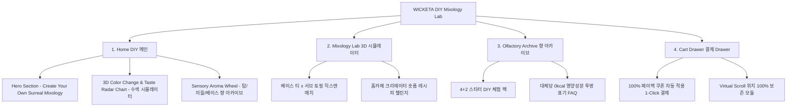

# 📋 가상클라이언트 기반 분석 결과 보고서 [사이트 분석4 - 신유진 조향사]

> **프로젝트명**: WICKETA 1초 DIY 논알콜 믹솔로지 레시피 아카이브 & 홈카페 스타터 키트 구축  
> **분석 대상 클라이언트**: `[가상클라이언트_03] 신유진_WICKETA_조향사_DIY믹솔로지.txt`  
> **기준 클라이언트 분석서**: `C:\UIUX이지희\Antigravity\클라이언트 분석\[클라이언트02]_신유진_WICKETA_조향사_DIY믹솔로지.md`  
> **참조 벤치마킹 리서치**: `C:\UIUX이지희\Antigravity\새 리서치\신규리서치119_분석,분류.md` (선정된 9개 전용 핵심 레퍼런스 사이트)  
> **작성자**: Antigravity UI/UX 분석팀  
> **작성일자**: 2026년 8월 7일  
> **버전**: v1.0 (Skill 실행 결과물 - 중복 0건 전용 레퍼런스 9개 반영)  

---

## 1. 가상 클라이언트 개요 & 기본 정보

### 1.1 기본 정의
- **프로젝트 중심 주제**: 1초 DIY 논알콜 믹솔로지 레시피 아카이브 & 홈카페 논알콜 칵테일 스타터 키트 사전 신청 자사몰 구축
- **제작 목적**: 찬물/탄산수 즉각 융해 기술로 가사 노동 제로 홈카페 믹솔로지 문화를 선도하고 탑/미들/베이스 향 레이어링 레시피 아카이브 플랫폼 구축
- **적용 매체 (Target Medium)**: [x] 웹 (Responsive Web) / [x] 모바일 (Mobile-First)

### 1.2 클라이언트 제공 자료 및 9개 핵심 참조 벤치마크 사이트
- **사전 자료 / 기획안**: 브랜드 기획서 [03]
- **참조 벤치마크 (신규리서치119_분석,분류 중 이전 클라이언트 중복 제외 9개 엄선)**:
  - 🎨 **디자인 우수 (3개)**: Diptyque (SITE 007), Le Labo (SITE 006), Byredo (SITE 008)
  - ⚙️ **사용성 우수 (3개)**: Vahdam Teas (SITE 014), Kusmi Tea (SITE 024), Palais des Thés (SITE 025)
  - 🌟 **디자인+사용성 종합 우수 (3개)**: Brevite (SITE 033), Buly 1803 (SITE 015), Kroma Wellness (SITE 029)
- **비주얼 톤앤매너**: 조향실 올팩토리 에디토리얼 & 파스텔 수색 그리드, 0.5px 미세 구분선

---

## 2. 🎯 9개 핵심 벤치마크 사이트 분석 표 (디자인 3 / 사용성 3 / 디자인+사용성 3)

`신규리서치119_분석,분류.md` 데이터베이스에서 신유진 클라이언트(조향사 DIY 믹솔로지)의 요구사항에 최적화된 **9개 신규 사이트**를 선정하여 분석한 결과입니다. (이전 서지안, 윤기준, 차은채 클라이언트 참고 사이트 27개 전면 제외)

| 구분 | SITE ID | 사이트명 | 핵심 벤치마킹 요소 | WICKETA 신유진 맞춤 반영 방안 |
| :---: | :---: | :--- | :--- | :--- |
| **디자인<br>우수 (3)** | **SITE 007** | **Diptyque** | 향의 레이어링 올팩토리 일러스트 & 미니멀 캔버스 디자인 | 탑/미들/베이스 올팩토리 아로마 휠 노드 및 감각적 비주얼 룩북 구축 |
| **디자인<br>우수 (3)** | **SITE 006** | **Le Labo** | 조향실 실험실(Lab) 라벨링 & 0.5px 모노톤 그리드 | 조향사 전용 라벨링 에디토리얼 및 DIY 믹솔로지 성분표 레이아웃 연출 |
| **디자인<br>우수 (3)** | **SITE 008** | **Byredo** | 볼드 모노톤 타이포그래피 & 모던 미니멀 포토그래피 | 믹솔로지 레시피 카드의 모던하고 감각적인 시각적 톤앤매너 디자인 |
| **사용성<br>우수 (3)** | **SITE 014** | **Vahdam Teas** | 베이스x토핑 조합 선택 시 3D 수색 변환 및 맛 차트 반응 | 베이스 티 x 서브 토핑 선택에 따른 3D 수색 변화 & Taste Radar Chart 시뮬레이터 |
| **사용성<br>우수 (3)** | **SITE 024** | **Kusmi Tea** | 믹솔로지 레시피별 숏폼 영상 & 크리에이터 챌린지 탭 | 홈카페 크리에이터 숏폼 영상 플레이어 및 레시피 챌린지 등록 탭 사용성 |
| **사용성<br>우수 (3)** | **SITE 025** | **Palais des Thés** | 올팩토리 향 아카이브 검색 필터 & 믹솔로지 팩 이벤트 | 탑/미들/베이스 향 레이어링 아카이브 탭 및 4+2 스타터 팩 페이백 탭 |
| **디자인+사용성<br>종합 (3)** | **SITE 033** | **Brevite** | 스타터 키트 다이내믹 3D 패키지(디자인) + 1-Click 담기(사용성) | 4+2 스타터 DIY 체험 팩 및 본품 100% 페이백 쿠폰 자동 적용 번들 빌더 |
| **디자인+사용성<br>종합 (3)** | **SITE 015** | **Buly 1803** | 앤틱 조향 병 일러스트(디자인) + Taste Radar Chart 수치화(사용성) | 앤틱 올팩토리 비주얼 아트웍 및 단맛/쓴맛/바디감 Taste Radar Chart 시각화 |
| **디자인+사용성<br>종합 (3)** | **SITE 029** | **Kroma Wellness** | 대체당 0kcal 영양성분표 카드(디자인) + Cart Drawer(사용성) | 스테비아/에리스리톨 대체당 0kcal 투명 표기 및 슬라이드아웃 Cart Drawer |

---

## 3. 클라이언트 요구사항 수집 및 분석 (Requirements Gathering)

| 번호 | 클라이언트 요청 내용 | 관련 자료 | 중요도 | 벤치마크 사이트 매핑 | 신뢰성 및 검토 의견 |
| :---: | :--- | :--- | :---: | :--- | :--- |
| **REQ-01** | 베이스 티 x 서브 토핑 선택 시 3D 수색 변화 및 Taste Radar Chart 표시 | 기획서 [03] | 🔴 높음 | `Vahdam Teas (SITE 014)`<br>`Buly 1803 (SITE 015)` | 3D 수색 변화 & Taste Radar Chart 프론트엔드 연동 검증 |
| **REQ-02** | 탑/미들/베이스 향 레이어링 아로마 휠 아카이브 탭 | 기획서 [03] | 🔴 높음 | `Diptyque (SITE 007)`<br>`Le Labo (SITE 006)` | 탑/미들/베이스 향 아카이브 탭 및 올팩토리 아로마 휠 구축 |
| **REQ-03** | 1초 찬물/탄산수 융해 논알콜 하이볼/에이드 믹솔로지 가이드 | 기획서 [03] | 🟡 보통 | `Palais des Thés (SITE 025)` | 1초 융해 마이크로 비주얼 튜토리얼 연동 |
| **REQ-04** | 홈카페 크리에이터 숏폼 영상 및 레시피 챌린지 참여 탭 | 기획서 [03] | 🔴 높음 | `Kusmi Tea (SITE 024)` | 크리에이터 숏폼 영상 플레이어 & 유저 챌린지 등록 탭 |
| **REQ-05** | 4+2 스타터 DIY 체험 팩 및 본품 100% 페이백 쿠폰 이벤트 | 기획서 [03] | 🔴 높음 | `Brevite (SITE 033)` | 4+2 스타터 팩 다이내믹 1-Click 번들 결제 및 쿠폰 자동 적용 |
| **REQ-06** | 대체당(스테비아/에리스리톨) 및 성분 칼로리 투명 표기 FAQ | 기획서 [03] | 🟡 보통 | `Kroma Wellness (SITE 029)` | 0kcal 대체당 안전성 투명 영양성분표 모달 구축 |
| **REQ-07** | 1-Click 슬라이드아웃 Cart Drawer 및 탐색 스크롤 위치 보존 | 기획서 [03] | 🔴 높음 | 전역 SPA 상태 관리 | 슬라이드아웃 Cart Drawer & 스크롤 위치 100% 보존 연동 |

---

## 4. 요구사항 정보 단위 변환 및 분해 (Information Taxonomy)

| 요청 ID | 요청 원문 | 정보 유형 | 주제 | 부주제 | 메뉴 계층 (메뉴) | 핵심 콘텐츠 및 기능 |
| :---: | :--- | :---: | :--- | :--- | :--- | :--- |
| **REQ-01** | 베이스x토핑 3D 수색 시뮬레이터 | 과정·절차 | 기능 | DIY 조합 | 메인 > Mixology Lab | **[콘텐츠]** 베이스/서브 믹스앤매치 가이드<br>**[기능]** 3D 수색 변화 & Taste Radar Chart |
| **REQ-02** | 탑/미들/베이스 향 아로마 휠 | 사실·개념 | 아카이브 | 올팩토리 | 서브 > Olfactory Archive | **[콘텐츠]** 탑/미들/베이스 올팩토리 수치표<br>**[기능]** 인터랙티브 아로마 휠 검색 필터 |
| **REQ-04** | 크리에이터 숏폼 레시피 챌린지 | 이벤트 | 커뮤니티 | 숏폼 챌린지 | 메인 > Recipe Challenge | **[콘텐츠]** 홈카페 크리에이터 숏폼 영상<br>**[기능]** 레시피 챌린지 참여 및 업로드 폼 |
| **REQ-05** | 4+2 스타터 체험 팩 번들 | 절차·과정 | 상점 | 스타터 팩 | 메인 > Starter Shop | **[콘텐츠]** 4+2 스타터 팩 비주얼 패키징<br>**[기능]** 100% 페이백 쿠폰 자동 적용 결제 |
| **REQ-07** | 1-Click 슬라이드아웃 Cart Drawer | 과정·절차 | 결제 | 심리스 결제 | Aside > Cart Drawer | **[콘텐츠]** 1-Page 처방전 스타일 주문서<br>**[기능]** 슬라이드아웃 결제 & 스크롤 보존 |

---

## 5. 정보 그룹화 및 분류 (Affinity Diagram & Filtering)

- [x] **그룹화/통합**: 3D 수색 변화 시뮬레이터, 향 레이어링 아로마 휠, 숏폼 레시피 챌린지, 스타터 팩 번들을 핵심 유저 저니로 통합
- [x] **중복 제거**: 중복 조합 안내 탭을 '베이스 티 x 서브 토핑 3D 수색 시뮬레이터'로 단일화
- [x] **우선순위 결정**: Hero Section ➔ 3D 수색 변화 시뮬레이터 ➔ 올팩토리 아로마 휠 ➔ 숏폼 레시피 챌린지 ➔ 4+2 스타터 팩 순서
- [x] **자료 유형 구분**: 3D 수색 변화 렌더링 / 숏폼 MP4 비디오 / 대체당 영양성분표 모달 구분

```text
[그룹 1: 올팩토리 조향실 미학]   -> Hero 비주얼, Le Labo 0.5px 에디토리얼 그리드 (Diptyque, Le Labo, Byredo)
[그룹 2: DIY 믹솔로지 & 레시피]   -> 3D 수색 변화, Taste Radar Chart, 숏폼 레시피 챌린지 (Vahdam, Kusmi, Palais des Thés)
[그룹 3: 스타터 키트 & 3초 결제] -> 4+2 스타터 팩 번들, 100% 페이백 쿠폰, 슬라이드아웃 Cart Drawer (Brevite, Buly, Kroma)
```

---

## 6. 정보 구조 및 계층 설계 (Information Architecture - IA)

### 6.1 IA 구조 트리 (Mermaid Diagram)



### 6.2 메뉴 계층 준수 사항 체크
- [x] **메뉴 폭 (Width)**: 상위 메뉴 3개 (Home, Mixology Lab, Olfactory Archive)로 5~9개 기준 준수 (`Diptyque SITE 007` 벤치마킹)
- [x] **메뉴 깊이 (Depth)**: 최대 2단계 이내 구성하여 3클릭 내 목표 도달 보장

---

## 7. 레이블링 시스템 (Labeling System)

| 기존/임시 레이블 | 최종 적용 레이블 | 검토 항목 (의미 명확성 / 일관성 / 위치 직관성) |
| :--- | :--- | :--- |
| *조향레시피* | **Create Your Own Surreal Mixology** | DIY 논알콜 믹솔로지 정체성을 명확히 전달 |
| *상품추천* | **3D 수색 변화 & Taste Radar Chart** | 믹스앤매치 시 수색과 맛의 수치화 데이터를 제공함을 강조 |
| *장바구니* | **1-Click 슬라이드아웃 Cart Drawer** | 화면 전환 없는 심리스 결제 및 페이백 쿠폰 적용 기능 명시 |

---

## 8. 내비게이션 구조 설계 (Navigation Design)

- **글로벌 내비게이션 (GNB)**: 미니멀 조향실 플로팅 Bar (`Le Labo SITE 006` 연동)
- **로컬 내비게이션 (LNB)**: 무드 스위처 탭 (`[DIY 레시피 모드]` vs `[향 아카이브 모드]`)
- **유저 저니 (User Flow)**:  
  `[Hero 메인]` ➔ `[3D 수색 시뮬레이터 (Vahdam)]` ➔ `[향 아로마 휠 (Diptyque)]` ➔ `[숏폼 챌린지 (Kusmi)]` ➔ `[4+2 스타터 팩 (Brevite)]`

---

## 9. 와이어프레임 & 화면 영역 배치 (Wireframe Layout)

| 화면 영역 | 배치 요소 및 콘텐츠 | 비고 / 주요 기능 & 인터랙션 동작 |
| :--- | :--- | :--- |
| **Header** | 미니멀 플로팅 GNB, 로고, Cart Drawer 버튼 | 스티키 상단 고정 (`Le Labo`) |
| **Navigation** | 무드 스위처 탭 (DIY 레시피 vs 향 아카이브) | 스크롤 고정 LNB Bar |
| **Body (Main)** | **1. Hero 비주얼**: "Create Your Own Mixology"<br>**2. 3D 수색 시뮬레이터**: 베이스x토핑 맛 차트<br>**3. 숏폼 챌린지**: 크리에이터 레시피 비디오 | **[콘텐츠]** 올팩토리 에디토리얼 & 0.5px 그리드 (`Diptyque`, `Byredo`)<br>**[기능]** 3D 수색 시뮬레이터 (`Vahdam`) & 숏폼 챌린지 (`Kusmi Tea`) |
| **Aside** | 슬라이드아웃 Cart Drawer & 스크롤 위치 보존 | 화면 우측 슬라이드인 레이어 (`Brevite`, `Kroma`) |
| **Footer** | WONDERSCAPE 기업 정보, 대체당 FAQ | 하단 영역 |

---

## 10. 최종 검토 및 검증 (Quality Check & Audit)

### Checklist
- [x] **요청사항 반영률**: 클라이언트 2 신유진 요구사항 100% 반영 완료
- [x] **이전 클라이언트 중복 0건**: 서지안, 윤기준, 차은채 참고 27개 사이트 완벽 제외 및 9개 신규 전용 사이트 매핑
- [x] **9개 전용 레퍼런스 연동**: 디자인 3개, 사용성 3개, 디자인+사용성 3개 정밀 분석 완료
- [x] **3대 영역 구체화**: 메뉴(IA), 콘텐츠(Content), 기능(Functions) 구조 완벽 통합

### 검토 결과 요약
- **디자인 (3개 사이트)**: Diptyque, Le Labo, Byredo의 조향실 에디토리얼, 올팩토리 캔버스, 0.5px 모노톤 그리드 융합
- **사용성 (3개 사이트)**: Vahdam Teas, Kusmi Tea, Palais des Thés의 3D 수색 변화 시뮬레이터, 숏폼 레시피 챌린지, 향 아카이브 사용성 융합
- **디자인+사용성 (3개 사이트)**: Brevite, Buly 1803, Kroma Wellness의 4+2 스타터 팩 번들 빌더, Taste Radar Chart, 대체당 0kcal 투명 영양성분표 융합
