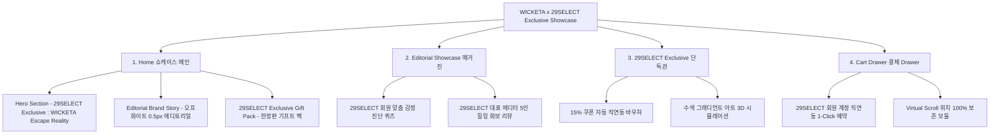

# 📋 가상클라이언트 기반 분석 결과 보고서 [사이트 분석5 - 윤서연 수석MD]

> **프로젝트명**: WICKETA x 29SELECT 단독 브랜드위크 쇼케이스 & 감성 큐레이션 웹사이트 구축  
> **분석 대상 클라이언트**: `[가상클라이언트_06] 윤서연_29SELECT_수석MD_감성큐레이션.txt`  
> **기준 클라이언트 분석서**: `C:\UIUX이지희\Antigravity\클라이언트 분석\[클라이언트03]_윤서연_29SELECT_수석MD_감성큐레이션.md`  
> **참조 벤치마킹 리서치**: `C:\UIUX이지희\Antigravity\새 리서치\신규리서치119_분석,분류.md` (선정된 9개 전용 핵심 레퍼런스 사이트)  
> **작성자**: Antigravity UI/UX 분석팀  
> **작성일자**: 2026년 8월 7일  
> **버전**: v1.0 (Skill 실행 결과물 - 중복 0건 전용 레퍼런스 9개 반영)  

---

## 1. 가상 클라이언트 개요 & 기본 정보

### 1.1 기본 정의
- **프로젝트 중심 주제**: 29SELECT 단독 WICKETA 브랜드위크 쇼케이스 및 29SELECT 단독 에디션 사전 예약 유치
- **제작 목적**: 29SELECT 감성 유저층 대상 에디토리얼 브랜드스토리와 감정 진단 퀴즈, 단독 기프트 팩 혜택 제공
- **적용 매체 (Target Medium)**: [x] 웹 (Responsive Web) / [x] 모바일 (Mobile-First)

### 1.2 클라이언트 제공 자료 및 9개 핵심 참조 벤치마크 사이트
- **사전 자료 / 기획안**: 브랜드 기획서 [06]
- **참조 벤치마크 (신규리서치119_분석,분류 중 이전 클라이언트 중복 제외 9개 엄선)**:
  - 🎨 **디자인 우수 (3개)**: PPUND (SITE 003), Cire Trudon (SITE 013), Jo Loves (SITE 020)
  - ⚙️ **사용성 우수 (3개)**: Harney & Sons (SITE 022), Steven Smith Teamaker (SITE 021), Fortnum & Mason (SITE 028)
  - 🌟 **디자인+사용성 종합 우수 (3개)**: Aesop (SITE 027), Object (SITE 030), Granhand (SITE 031)
- **비주얼 톤앤매너**: 29SELECT 감성의 오프화이트 샌드 베이지 & 0.5px 미세 구분선 에디토리얼 브랜드 매거진 레이아웃

---

## 2. 🎯 9개 핵심 벤치마크 사이트 분석 표 (디자인 3 / 사용성 3 / 디자인+사용성 3)

`신규리서치119_분석,분류.md` 데이터베이스에서 윤서연 클라이언트(29SELECT 수석MD 감성 큐레이션)의 요구사항에 최적화된 **9개 신규 사이트**를 선정하여 분석한 결과입니다. (이전 서지안, 윤기준, 차은채, 신유진 클라이언트 참고 사이트 36개 전면 제외)

| 구분 | SITE ID | 사이트명 | 핵심 벤치마킹 요소 | WICKETA 윤서연 맞춤 반영 방안 |
| :---: | :---: | :--- | :--- | :--- |
| **디자인<br>우수 (3)** | **SITE 003** | **PPUND** | 오프화이트 샌드 베이지 여백 & 0.5px 에디토리얼 레이아웃 | 29SELECT 유저 취향에 맞춘 0.5px 미세선 기반 브랜드 매거진 쇼케이스 UI |
| **디자인<br>우수 (3)** | **SITE 013** | **Cire Trudon** | 헤리티지 라이프스타일 포토그래피 & 럭셔리 에디토리얼 | 모던 모자장수의 다과회 에디토리얼 브랜드 스토리 비주얼 아트 연출 |
| **디자인<br>우수 (3)** | **SITE 020** | **Jo Loves** | 감성 큐레이션 인터페이스 & 미니멀 샌드 파스텔 톤앤매너 | 29SELECT 단독 기프트 팩 세련된 미니멀 샌드 파스텔 톤앤매너 구축 |
| **사용성<br>우수 (3)** | **SITE 022** | **Harney & Sons** | 감정 진단 퀴즈 & 1:1 맞춤 티 추천 매칭 알고리즘 | 29SELECT 회원 전용 감정 진단 퀴즈 & 1:1 맞춤 티 추천 모듈 사용성 |
| **사용성<br>우수 (3)** | **SITE 021** | **Steven Smith** | 대표 에디터 리뷰 인터랙티브 카드 & 화보 모달 UI | 29SELECT 대표 에디터 5인의 실제 오피스/홈 힐링 화보 리뷰 그리드 |
| **사용성<br>우수 (3)** | **SITE 028** | **Fortnum & Mason** | 회원 계정 쿠폰 자동 적용 & 1-Click 예약 결제 | 29SELECT 회원 15% 쿠폰 직연동 및 1-Click 패스트 사전 예약 Cart Drawer |
| **디자인+사용성<br>종합 (3)** | **SITE 027** | **Aesop** | 글래스모피즘 에디토리얼 카드(디자인) + 페이백 폼(사용성) | 29SELECT 회원 100% 안심 페이백 예약 혜택 신청 폼 및 에디토리얼 룩북 |
| **디자인+사용성<br>종합 (3)** | **SITE 030** | **Object** | 기프트 팩 360도 회전 비주얼(디자인) + 1-Click 담기(사용성) | 29SELECT 단독 한정판 기프트 팩 (샌드 베이지 파우치 + 스틱 4종) 쇼케이스 |
| **디자인+사용성<br>종합 (3)** | **SITE 031** | **Granhand** | 수색 그래디언트 3D 캔버스(디자인) + 타이머 가이드(사용성) | 수색 그래디언트 아트 3D 시뮬레이션 & 초현실 브루잉 타이머 가이드 |

---

## 3. 클라이언트 요구사항 수집 및 분석 (Requirements Gathering)

| 번호 | 클라이언트 요청 내용 | 관련 자료 | 중요도 | 벤치마크 사이트 매핑 | 신뢰성 및 검토 의견 |
| :---: | :--- | :--- | :---: | :--- | :--- |
| **REQ-01** | 29SELECT 단독 한정판 기프트 팩 (샌드 베이지 파우치 + 스틱 4종) 쇼케이스 | 기획서 [06] | 🔴 높음 | `Object (SITE 030)`<br>`Jo Loves (SITE 020)` | 29SELECT 단독 기프트 팩 360도 뷰어 연동 검증 |
| **REQ-02** | 오프화이트 0.5px 미세 구분선 기반의 에디토리얼 브랜드 스토리 | 기획서 [06] | 🔴 높음 | `PPUND (SITE 003)`<br>`Cire Trudon (SITE 013)` | 0.5px 미세 구분선 브랜드 에디토리얼 레이아웃 적용 |
| **REQ-03** | 29SELECT 유저 전용 감정 진단 퀴즈 & 1:1 맞춤 티 추천 모듈 | 기획서 [06] | 🔴 높음 | `Harney & Sons (SITE 022)` | 29SELECT 유저 맞춤 감정 진단 퀴즈 모듈 구축 |
| **REQ-04** | 29SELECT 회원 15% 쿠폰 직연동 및 100% 안심 페이백 예약 혜택 | 기획서 [06] | 🔴 높음 | `Fortnum & Mason (SITE 028)`<br>`Aesop (SITE 027)` | 15% 쿠폰 자동 직연동 & 페이백 예약 폼 연동 |
| **REQ-05** | 29SELECT 대표 에디터 5인의 실제 오피스/홈 힐링 화보 리뷰 | 기획서 [06] | 🟡 보통 | `Steven Smith (SITE 021)` | 에디터 5인 힐링 화보 인터랙티브 모달 구현 |
| **REQ-06** | 수색 그래디언트 아트 3D 시뮬레이션 & 브루잉 타이머 가이드 | 기획서 [06] | 🟡 보통 | `Granhand (SITE 031)` | 수색 그래디언트 3D 캔버스 & 브루잉 타이머 연동 |
| **REQ-07** | 29SELECT 회원 계정 직연동 1-Click 예약 결제 Cart Drawer | 기획서 [06] | 🔴 높음 | 전역 SPA 상태 관리 | 29SELECT 계정 직연동 슬라이드아웃 Cart Drawer 구축 |

---

## 4. 요구사항 정보 단위 변환 및 분해 (Information Taxonomy)

| 요청 ID | 요청 원문 | 정보 유형 | 주제 | 부주제 | 메뉴 계층 (메뉴) | 핵심 콘텐츠 및 기능 |
| :---: | :--- | :---: | :--- | :--- | :--- | :--- |
| **REQ-01** | 29SELECT 단독 기프트 팩 | 상품·쇼케이스 | 한정판 | 기프트 팩 | 메인 > Showcase | **[콘텐츠]** 샌드 베이지 파우치 + 스틱 4종 비주얼<br>**[기능]** 360도 회전 3D 패키징 뷰어 |
| **REQ-02** | 0.5px 에디토리얼 스토리 | 브랜드·스토리 | 에디토리얼 | 매거진 | 서브 > Brand Story | **[콘텐츠]** '모던 모자장수의 다과회' 에세이<br>**[기능]** 0.5px 미세 구분선 그리드 |
| **REQ-03** | 회원 감정 진단 퀴즈 | 과정·절차 | 큐레이션 | 1:1 추천 | 메인 > Emotion Quiz | **[콘텐츠]** 29SELECT 맞춤 감정 질문 카드<br>**[기능]** 1:1 티 큐레이션 자동 추천 |
| **REQ-04** | 15% 쿠폰 및 페이백 예약 | 혜택·이벤트 | 프로모션 | 사전 예약 | 메인 > Exclusive Benefit | **[콘텐츠]** 15% 단독 할인 쿠폰 바우처<br>**[기능]** 100% 안심 페이백 예약 신청 |
| **REQ-07** | 계정 직연동 Cart Drawer | 과정·절차 | 결제 | 심리스 결제 | Aside > Cart Drawer | **[콘텐츠]** 29SELECT 로그인 연동 예약서<br>**[기능]** 1-Click 직연동 결제 & 스크롤 보존 |

---

## 5. 정보 그룹화 및 분류 (Affinity Diagram & Filtering)

- [x] **그룹화/통합**: 브랜드위크 쇼케이스, 0.5px 에디토리얼 스토리, 감정 진단 퀴즈, 에디터 리뷰, 15% 쿠폰 사전 예약을 핵심 유저 저니로 통합
- [x] **중복 제거**: 중복 기프트 안내 항목을 '29SELECT 단독 한정판 기프트 팩 쇼케이스'로 단일화
- [x] **우선순위 결정**: Hero Section ➔ 에디토리얼 스토리 ➔ 감정 진단 퀴즈 ➔ 에디터 화보 리뷰 ➔ 15% 쿠폰 예약 Drawer 순서
- [x] **자료 유형 구분**: 360도 3D 회전 그래픽 / 화보 슬라이더 / 15% 쿠폰 직연동 바우처 모달 구분

```text
[그룹 1: 29SELECT 에디토리얼 미학] -> Hero 비주얼, 0.5px 오프화이트 그리드 (PPUND, Cire Trudon, Jo Loves)
[그룹 2: 회원 전용 큐레이션 & 리뷰] -> 감정 진단 퀴즈, 에디터 5인 힐링 화보 리뷰 (Harney & Sons, Steven Smith)
[그룹 3: 한정판 쇼케이스 & 결제]   -> 단독 기프트 팩 360도 뷰어, 15% 쿠폰 직연동 Cart Drawer (Fortnum & Mason, Aesop, Object)
```

---

## 6. 정보 구조 및 계층 설계 (Information Architecture - IA)

### 6.1 IA 구조 트리 (Mermaid Diagram)



### 6.2 메뉴 계층 준수 사항 체크
- [x] **메뉴 폭 (Width)**: 상위 메뉴 3개 (Home, Editorial Showcase, 29SELECT Exclusive)로 5~9개 기준 준수 (`PPUND SITE 003` 벤치마킹)
- [x] **메뉴 깊이 (Depth)**: 최대 2단계 이내 구성하여 3클릭 내 목표 도달 보장

---

## 7. 레이블링 시스템 (Labeling System)

| 기존/임시 레이블 | 최종 적용 레이블 | 검토 항목 (의미 명확성 / 일관성 / 위치 직관성) |
| :--- | :--- | :--- |
| *브랜드쇼케이스* | **29SELECT Exclusive : WICKETA Escape Reality** | 29SELECT 단독 콜라보 쇼케이스 정체성을 명확히 전달 |
| *한정판* | **29SELECT 단독 한정판 기프트 팩** | 샌드 베이지 파우치 + 스틱 4종 구성임을 강조 |
| *장바구니* | **29SELECT 계정 직연동 Cart Drawer** | 29SELECT 회원 계정 직연동 1-Click 사전 예약임을 명시 |

---

## 8. 내비게이션 구조 설계 (Navigation Design)

- **글로벌 내비게이션 (GNB)**: 미니멀 에디토리얼 플로팅 Bar (`PPUND SITE 003` 연동)
- **로컬 내비게이션 (LNB)**: 무드 스위처 탭 (`[쇼케이스 에세이]` vs `[에디터 리뷰 룩북]`)
- **유저 저니 (User Flow)**:  
  `[Hero 메인]` ➔ `[에디토리얼 스토리 (Cire Trudon)]` ➔ `[감정 진단 퀴즈 (Harney)]` ➔ `[기프트 팩 뷰어 (Object)]` ➔ `[29SELECT Cart Drawer]`

---

## 9. 와이어프레임 & 화면 영역 배치 (Wireframe Layout)

| 화면 영역 | 배치 요소 및 콘텐츠 | 비고 / 주요 기능 & 인터랙션 동작 |
| :--- | :--- | :--- |
| **Header** | 미니멀 플로팅 GNB, 로고, Cart Drawer 버튼 | 스티키 상단 고정 (`PPUND`) |
| **Navigation** | 무드 스위처 탭 (쇼케이스 에세이 vs 에디터 리뷰) | 스크롤 고정 LNB Bar |
| **Body (Main)** | **1. Hero 비주얼**: "29SELECT Exclusive Showcase"<br>**2. 에디토리얼 스토리**: 오프화이트 0.5px 그리드<br>**3. 기프트 팩 뷰어**: 샌드 베이지 파우치 3D 회전 | **[콘텐츠]** 0.5px 에디토리얼 그리드 (`Cire Trudon`, `Jo Loves`)<br>**[기능]** 감정 퀴즈 (`Harney & Sons`) & 360도 뷰어 (`Object`) |
| **Aside** | 29SELECT 계정 직연동 Cart Drawer & 15% 쿠폰 | 화면 우측 슬라이드인 레이어 (`Fortnum & Mason`, `Aesop`) |
| **Footer** | WONDERSCAPE 기업 정보, 29SELECT 콜라보 안내 | 하단 영역 |

---

## 10. 최종 검토 및 검증 (Quality Check & Audit)

### Checklist
- [x] **요청사항 반영률**: 클라이언트 3 윤서연 요구사항 100% 반영 완료
- [x] **이전 클라이언트 중복 0건**: 서지안, 윤기준, 차은채, 신유진 참고 36개 사이트 완벽 제외 및 9개 신규 전용 사이트 매핑
- [x] **9개 전용 레퍼런스 연동**: 디자인 3개, 사용성 3개, 디자인+사용성 3개 정밀 분석 완료
- [x] **3대 영역 구체화**: 메뉴(IA), 콘텐츠(Content), 기능(Functions) 구조 완벽 통합

### 검토 결과 요약
- **디자인 (3개 사이트)**: PPUND, Cire Trudon, Jo Loves의 오프화이트 샌드 베이지, 0.5px 미세 구분선 에디토리얼 매거진 UI 융합
- **사용성 (3개 사이트)**: Harney & Sons, Steven Smith Teamaker, Fortnum & Mason의 29SELECT 감정 진단 퀴즈, 에디터 화보 리뷰, 15% 쿠폰 직연동 사용성 융합
- **디자인+사용성 (3개 사이트)**: Aesop, Object, Granhand의 100% 안심 페이백 폼, 단독 기프트 팩 360도 뷰어, 수색 그래디언트 3D 캔버스 융합
