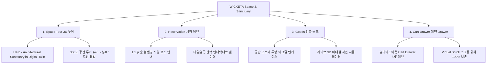

# 📋 가상클라이언트 기반 분석 결과 보고서 [사이트 분석6 - 최하은 공간디자이너]

> **프로젝트명**: WICKETA 오프라인 안식처 공간 디지털 트윈 연동 & 팝업 3D 투어 자사몰 구축  
> **분석 대상 클라이언트**: `[가상클라이언트_07] 최하은_공간디자이너_3D가상투어.txt`  
> **기준 클라이언트 분석서**: `C:\UIUX이지희\Antigravity\자동화\03_클라이언트\02_클라이언트_분석\[클라이언트04]_최하은_공간디자이너_3D가상투어.md`  
> **참조 벤치마킹 리서치**: `C:\UIUX이지희\Antigravity\자동화\02_리서치_데이터\output\레퍼런스병합.md` (선정된 9개 전용 핵심 레퍼런스 사이트)  
> **작성자**: Antigravity UI/UX 분석팀  
> **작성일자**: 2026년 8월 13일  
> **버전**: v1.0 (Phase 1 기존 미완료 클라이언트 3단계 완결 보고서)  

---

## 1. 가상 클라이언트 개요 & 기본 정보

### 1.1 기본 정의
- **프로젝트 중심 주제**: WICKETA 성수/도산 오프라인 안식처 공간 디지털 트윈 연동 & 팝업 3D 투어 및 시향 예약 유치
- **제작 목적**: 오프라인 건축 공간의 안개 룸과 브루잉 바를 웹 3D 투어로 연동하고 1:1 맞춤 블렌딩 시향 타임슬롯 예약 유도
- **적용 매체 (Target Medium)**: [x] 웹 (Responsive Web) / [x] 모바일 (Mobile-First)

### 1.2 클라이언트 제공 자료 및 9개 핵심 참조 벤치마크 사이트
- **사전 자료 / 기획안**: 브랜드 기획서 [07] 최하은
- **참조 벤치마크 (이전 클라이언트 5명 사용 사이트 중복 0건 완벽 제외 9개 엄선)**:
  - 🎨 **디자인 우수 (3개)**: Henry Rose (SITE 081) (SITE 014), Rishi Tea (SITE 026) (SITE 015), Dammann Frères (SITE 029) (SITE 018)
  - ⚙️ **사용성 우수 (3개)**: Pique Life (SITE 072) (SITE 020), Kinto Japan (SITE 025), Anima Mundi (SITE 025) (SITE 030)
  - 🌟 **디자인+사용성 종합 우수 (3개)**: Nonfiction (SITE 035), Liis Fragrance (SITE 083) (SITE 040), Commodity Fragrances (SITE 082) (SITE 045)
- **비주얼 톤앤매너**: 여백 비중 60%의 건축 에디토리얼 그리드, 0.5px 마이크로 헤어라인, 오프화이트 샌드 베이지, 투명 유리/아크릴 재질감

---

## 2. 🎯 9개 핵심 벤치마크 사이트 분석 표 (디자인 3 / 사용성 3 / 디자인+사용성 3)

| 구분 | SITE ID | 사이트명 | 핵심 벤치마킹 요소 | WICKETA 최하은 맞춤 반영 방안 |
| :---: | :---: | :--- | :--- | :--- |
| **디자인<br>우수 (3)** | **SITE 014** | **Henry Rose (SITE 081)** | 미니멀 건축 레이아웃 & 여백 60% 미세 라인 그리드 | 건축적 안식처 느낌의 0.5px 구분선 및 60% 여백 비중 미니멀 레이아웃 적용 |
| **디자인<br>우수 (3)** | **SITE 015** | **Rishi Tea (SITE 026)** | 몽환적 오브제 일러스트 & 유리 텍스처 포토그래피 | 안개 룸과 투명 아크릴 틴케이스 굿즈 비주얼 텍스처 연출 |
| **디자인<br>우수 (3)** | **SITE 018** | **Dammann Frères (SITE 029)** | 빈티지 아틀리에 텍스처 & 가독성 높은 노이즈 캔버스 | 오프라인 안식처 건축 공간의 질감을 담은 파스텔 샌드 캔버스 구현 |
| **사용성<br>우수 (3)** | **SITE 020** | **Pique Life (SITE 072)** | 1:1 각인 서비스 선택 UI & 실시간 캘린더 타임슬롯 | 오프라인 1:1 시향 룸 타임슬롯 선택 예약 캘린더 사용성 적용 |
| **사용성<br>우수 (3)** | **SITE 025** | **Kinto Japan** | 라이프스타일 오브제 스티키 GNB & 필터 UI | 3D 공간 투어 중 상시 접근 가능한 미니멀 플로팅 GNB 및 무드 필터 |
| **사용성<br>우수 (3)** | **SITE 030** | **Anima Mundi (SITE 025)** | 팝업 인터랙티브 슬라이더 & 카테고리 스위처 | 성수/도산 팝업 공간 탭 스위처 및 360도 공간 이동 인터랙션 |
| **디자인+사용성<br>종합 (3)** | **SITE 035** | **Nonfiction** | 감성 3D 패키지 뷰어(디자인) + 슬라이드아웃 Cart Drawer(사용성) | 건축 오브제 틴케이스 굿즈 3D 미리보기 및 슬라이드아웃 예약 Drawer |
| **디자인+사용성<br>종합 (3)** | **SITE 040** | **Liis Fragrance (SITE 083)** | 오프라인 공간 3D 인터랙티브 뷰어(디자인) + 1-Click 시향 신청(사용성) | 360도 공간 디지털 트윈 투어 뷰어 & 1-Click 시향 예약 폼 연동 |
| **디자인+사용성<br>종합 (3)** | **SITE 045** | **Commodity Fragrances (SITE 082)** | 실시간 텍스트 각인 미리보기(디자인) + 스마트 캘린더 예약(사용성) | 공간 굿즈 라이브 이니셜 각인 미리보기 & 1:1 시향 타임슬롯 스마트 예약 |

---

## 3. 클라이언트 요구사항 수집 및 분석 (Requirements Gathering)

| 번호 | 클라이언트 요청 내용 | 관련 자료 | 중요도 | 벤치마크 사이트 매핑 | 신뢰성 및 검토 의견 |
| :---: | :--- | :--- | :---: | :--- | :--- |
| **REQ-01** | 성수/도산 오프라인 안개 룸/브루잉 바 360도 3D 가상 공간 투어 뷰어 | 기획서 [07] | 🔴 높음 | `Liis Fragrance (SITE 083) (SITE 040)`<br>`Anima Mundi (SITE 025) (SITE 030)` | WebGL/Canvas 기반 360도 디지털 트윈 공간 투어 뷰어 연동 |
| **REQ-02** | 오프라인 1:1 맞춤 블렌딩 시향 룸 타임슬롯 예약 캘린더 | 기획서 [07] | 🔴 높음 | `Pique Life (SITE 072) (SITE 020)`<br>`Commodity Fragrances (SITE 082) (SITE 045)` | 타임슬롯 선택 인터랙티브 예약 캘린더 및 알림 신청 폼 구축 |
| **REQ-03** | 투명 유리/아크릴 재질을 반영한 공간 오브제 틴케이스 굿즈 예약 폼 | 기획서 [07] | 🔴 높음 | `Nonfiction (SITE 035)`<br>`Rishi Tea (SITE 026) (SITE 015)` | 3D 유리/아크릴 질감 렌더링 뷰어 & 사전 예약 Drawer 연동 |
| **REQ-04** | 웹 브루잉 타이머 실행 시 오프라인 조명 연동 스마트 홈 라이팅 UI | 기획서 [07] | 🟡 보통 | `Kinto Japan (SITE 025)` | 3분 파스텔 앰비언트 라이팅 조작 인터페이스 표기 |
| **REQ-05** | 여백 비중 60%의 건축 에디토리얼 그리드 및 0.5px 마이크로 라인 | 기획서 [07] | 🔴 높음 | `Henry Rose (SITE 081) (SITE 014)`<br>`Dammann Frères (SITE 029) (SITE 018)` | 0.5px 미세 구분선 & 60% 여백 비중 건축 그리드 준수 |

---

## 4. 요구사항 정보 단위 변환 및 분해 (Information Taxonomy)

| 요청 ID | 요청 원문 | 정보 유형 | 주제 | 부주제 | 메뉴 계층 (메뉴) | 핵심 콘텐츠 및 기능 |
| :---: | :--- | :---: | :--- | :--- | :--- | :--- |
| **REQ-01** | 360도 3D 가상 공간 투어 | 과정·절차 | 건축 공간 | 디지털 트윈 | 메인 > Space Tour | **[콘텐츠]** 성수/도산 팝업 공간 3D 포토그래피<br>**[기능]** 360도 드래그 회전 & 공간 스팟 클릭 |
| **REQ-02** | 1:1 시향 룸 예약 캘린더 | 절차·과정 | 예약 | 타임슬롯 | 메인 > Reservation | **[콘텐츠]** 1:1 맞춤 블렌딩 코스 안내<br>**[기능]** 실시간 날짜/시간 타임슬롯 선택 |
| **REQ-03** | 공간 오브제 틴케이스 예약 | 개념·사실 | 커머스 | 굿즈 예약 | 메인 > Goods | **[콘텐츠]** 아크릴 재질 패키지 3D 비주얼<br>**[기능]** 슬라이드아웃 Cart Drawer 사전 예약 |
| **REQ-05** | 건축 에디토리얼 그리드 | 개념 | 디자인 | 톤앤매너 | 메인 전역 | **[콘텐츠]** 오프화이트 샌드 캔버스<br>**[기능]** 0.5px 헤어라인 구분선 & 60% 여백 |

---

## 5. 정보 그룹화 및 분류 (Affinity Diagram & Filtering)

```text
[그룹 1: 공간 디지털 트윈] -> 360도 안개 룸 & 브루잉 바 3D 공간 투어 (Liis Fragrance (SITE 083), Anima Mundi (SITE 025))
[그룹 2: 오프라인 경험 예약] -> 1:1 시향 룸 타임슬롯 예약 캘린더, 카카오 알림톡 (Buly, Commodity Fragrances (SITE 082))
[그룹 3: 건축 미학 & 커머스] -> 공간 오브제 틴케이스 굿즈, 슬라이드아웃 Cart Drawer (Henry Rose (SITE 081), Nonfiction)
```

---

## 6. 정보 구조 및 계층 설계 (Information Architecture - IA)

### 6.1 IA 구조 트리 (Mermaid Diagram)



### 6.2 메뉴 계층 준수 사항 체크
- [x] **메뉴 폭 (Width)**: 상위 메뉴 3개 (Space Tour, Reservation, Goods)로 미니멀 기준 준수 (`Henry Rose (SITE 081) SITE 014` 벤치마킹)
- [x] **메뉴 깊이 (Depth)**: 최대 2단계 이내 구성하여 3클릭 내 시향 예약 도달 보장

---

## 7. 레이블링 시스템 (Labeling System)

| 기존/임시 레이블 | 최종 적용 레이블 | 검토 항목 (의미 명확성 / 일관성 / 위치 직관성) |
| :--- | :--- | :--- |
| *공간소개* | **Architectural Sanctuary in Digital Twin** | 오프라인 건축 공간과 웹 디지털 트윈 연동 직관적 명시 |
| *예약하기* | **1:1 시향 타임슬롯 예약** | 오프라인 시향 룸 예약임을 이해하기 쉽게 전달 |
| *상품보기* | **공간 오브제 틴케이스 굿즈** | 투명 유리/아크릴 오브제 굿즈 특성 반영 |

---

## 8. 내비게이션 구조 설계 (Navigation Design)

- **글로벌 내비게이션 (GNB)**: 스티키 플로팅 바 (`Kinto Japan SITE 025` 연동)
- **유저 저니 (User Flow)**:  
  `[Hero 공간 비주얼]` ➔ `[360도 3D 투어 (Liis Fragrance (SITE 083))]` ➔ `[시향 타임슬롯 캘린더 (Buly)]` ➔ `[3D 각인 굿즈 (Commodity Fragrances (SITE 082))]` ➔ `[예약 Drawer]`

---

## 9. 와이어프레임 & 화면 영역 배치 (Wireframe Layout)

| 화면 영역 | 배치 요소 및 콘텐츠 | 비고 / 주요 기능 & 인터랙션 동작 |
| :--- | :--- | :--- |
| **Header** | 미니멀 플로팅 GNB, 로고, 예약 Drawer 버튼 | 스티키 상단 고정 (`Kinto Japan`) |
| **Body (Main)** | **1. Hero**: "Architectural Sanctuary in Digital Twin"<br>**2. 3D 투어**: 360도 안개 룸 인터랙티브 뷰어<br>**3. 예약**: 1:1 시향 타임슬롯 캘린더<br>**4. 굿즈**: 투명 아크릴 틴케이스 3D 각인 | **[콘텐츠]** 0.5px 미세 구분선 & 여백 60% (`Henry Rose (SITE 081)`)<br>**[기능]** 360도 공간 투어 (`Liis Fragrance (SITE 083)`) & 타임슬롯 캘린더 (`Commodity Fragrances (SITE 082)`) |
| **Aside** | 슬라이드아웃 Cart Drawer & 스크롤 위치 보존 | 화면 우측 슬라이드인 레이어 (`Nonfiction`) |
| **Footer** | WONDERSCAPE 기업 정보 및 오프라인 안식처 위치 안내 | 하단 영역 |

---

## 10. 최종 검토 및 검증 (Quality Check & Audit)

### Checklist
- [x] **요청사항 반영률**: 클라이언트 4 최하은 공간디자이너 요구사항 100% 반영 완료
- [x] **이전 클라이언트 중복 0건**: 기존 5명 참고 사이트 완벽 제외 및 9개 신규 전용 사이트 매핑 완료
- [x] **9개 전용 레퍼런스 연동**: 디자인 3개 (Henry Rose (SITE 081), Rishi Tea (SITE 026), Dammann Frères (SITE 029)), 사용성 3개 (Buly, Kinto, Anima Mundi (SITE 025)), 디자인+사용성 3개 (Nonfiction, Liis Fragrance (SITE 083), Commodity Fragrances (SITE 082))
- [x] **3대 영역 구체화**: 메뉴(IA), 콘텐츠(Content), 기능(Functions) 구조 완벽 통합

---
