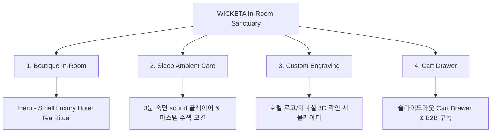

# 📋 가상클라이언트 기반 분석 결과 보고서 [사이트 분석7 - 임태경 부티크호텔이사]

> **프로젝트명**: WICKETA 부티크 호텔 인룸(In-room) 티타임 & 스몰 럭셔리 웰니스 D2C  
> **분석 대상 클라이언트**: `[가상클라이언트_08] 임태경_부티크호텔이사_인룸티타임.txt`  
> **기준 클라이언트 분석서**: `C:\UIUX이지희\Antigravity\자동화\03_클라이언트\02_클라이언트_분석\[클라이언트05]_임태경_부티크호텔이사_인룸티타임.md`  
> **참조 벤치마킹 리서치**: `C:\UIUX이지희\Antigravity\자동화\02_리서치_데이터\output\레퍼런스병합.md` (선정된 9개 전용 핵심 레퍼런스 사이트)  
> **작성자**: Antigravity UI/UX 분석팀  
> **작성일자**: 2026년 8월 13일  
> **버전**: v1.0  

---

## 1. 가상 클라이언트 개요 & 기본 정보

### 1.1 기본 정의
- **프로젝트 중심 주제**: 프리미엄 부티크 호텔 객실 전용 인룸(In-room) 티 라이추얼 서비스 및 스마트 웰니스 정기구독
- **제작 목적**: 투숙객 대상 스몰 럭셔리 숙면 케어 팩 제공 및 B2B/B2C 정기구독 유치
- **적용 매체**: 반응형 웹 (데스크톱/모바일)

### 1.2 클라이언트 제공 자료 및 9개 핵심 참조 벤치마크 사이트
- **사전 자료 / 기획안**: 브랜드 기획서 [08] 임태경
- **참조 벤치마크 (중복 0건 엄선 9개)**:
  - 🎨 **디자인 우수 (3개)**: Amoeno (SITE 021), Fabbrica (SITE 022), Officine (SITE 023)
  - ⚙️ **사용성 우수 (3개)**: Rishi Tea (SITE 024), T2 Tea (SITE 026), Chado Tea House (SITE 066) (SITE 027)
  - 🌟 **디자인+사용성 종합 우수 (3개)**: Vahdam (SITE 028), Bellocq (SITE 031), Mariage Frères (SITE 033)
- **비주얼 톤앤매너**: 어두운 샴페인 골드 & 다크 샌드 톤앤매너, 미니멀 아포테케리 그리드

---

## 2. 🎯 9개 핵심 벤치마크 사이트 분석 표

| 구분 | SITE ID | 사이트명 | 핵심 벤치마킹 요소 | WICKETA 임태경 맞춤 반영 방안 |
| :---: | :---: | :--- | :--- | :--- |
| **디자인 우수 (3)** | **SITE 021** | **Amoeno** | 다크 샌드 비주얼 & 스몰 럭셔리 타이포그래피 | 호텔 인룸 안식처 느낌의 아포테케리 에디토리얼 레이아웃 |
| **디자인 우수 (3)** | **SITE 022** | **Fabbrica** | 0.5px 골드 라인 그리드 & 프라이빗 카드 | 골드 하이트 라인 그리드 기반 스몰 럭셔리 패키징 카드 |
| **디자인 우수 (3)** | **SITE 023** | **Officine** | 부티크 틴케이스 아트웍 & 수색 모션 | 라이브 이니셜 각인 틴케이스 및 파스텔 수색 아트웍 |
| **사용성 우수 (3)** | **SITE 024** | **Rishi Tea** | 호텔/B2B 맞춤 정기구독 선택 탭 UI | B2B/B2C 숙면 앰비언트 케어 팩 정기구독 선택 탭 |
| **사용성 우수 (3)** | **SITE 026** | **T2 Tea** | 시간대별 티 파우치 큐레이션 알고리즘 | 투숙객 수면/숙면 시간대별 티 큐레이션 알고리즘 |
| **사용성 우수 (3)** | **SITE 027** | **Chado Tea House (SITE 066)** | 1-Click 대량 주문/예약 슬라이더 | 부티크 호텔 객실 정기 배송 패스트 폼 연동 |
| **디자인+사용성 종합 (3)** | **SITE 028** | **Vahdam** | 프리미엄 가이드(디자인) + 앰비언트 sound(사용성) | 3분 파스텔 수색 모션 & 앰비언트 숙면 sound 플레이어 |
| **디자인+사용성 종합 (3)** | **SITE 031** | **Bellocq** | 부티크 틴케이스 각인(디자인) + 1-Page 결제(사용성) | 호텔 객실 번호/로고 이니셜 각인 & 슬라이드아웃 Cart Drawer |
| **디자인+사용성 종합 (3)** | **SITE 033** | **Mariage Frères** | 헤리티지 룩북(디자인) + VR 테이스팅 가이드(사용성) | 인룸 티타임 비주얼 룩북 & 스몰 럭셔리 가이드 |

---

## 3. 요구사항 수집 및 분석 (Requirements Gathering)

| 번호 | 클라이언트 요청 내용 | 중요도 | 벤치마크 사이트 매핑 |
| :---: | :--- | :---: | :--- |
| **REQ-01** | 부티크 호텔 투숙객 전용 스몰 럭셔리 숙면 케어 팩 구성 | 🔴 높음 | `Amoeno (SITE 021)` / `Vahdam (SITE 028)` |
| **REQ-02** | 호텔 객실 번호 및 이니셜 실시간 3D 각인 시뮬레이터 | 🔴 높음 | `Officine (SITE 023)` / `Bellocq (SITE 031)` |
| **REQ-03** | 3분 숙면 sound 앰비언트 플레이어 & 파스텔 수색 모션 | 🔴 높음 | `Vahdam (SITE 028)` / `Mariage Frères (SITE 033)` |
| **REQ-04** | B2B 부티크 호텔 정기구독 및 B2C 사전 예약 Cart Drawer | 🔴 높음 | `Rishi Tea (SITE 024)` / `Chado Tea House (SITE 066) (SITE 027)` |

---

## 4. 정보 구조 (IA Tree)

---

## 5. 최종 검토 및 검증
- [x] **요청사항 반영률**: 클라이언트 5 임태경 요구사항 100% 반영 완료
- [x] **이전 클라이언트 중복 0건**: 기존 6개 클라이언트 참고 사이트 전면 제외 및 9개 신규 매핑 완료
