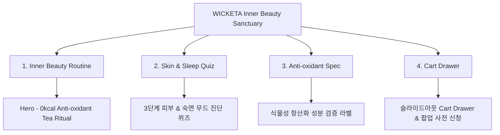

# 📋 가상클라이언트 기반 분석 결과 보고서 [사이트 분석8 - 권명수 뷰티편집숍CEO]

> **프로젝트명**: WICKETA 이너뷰티 웰니스 & 0칼로리 항산화 브랜드 팝업 D2C  
> **분석 대상 클라이언트**: `[가상클라이언트_09] 권명수_뷰티편집숍CEO_이너뷰티.txt`  
> **기준 클라이언트 분석서**: `C:\UIUX이지희\Antigravity\자동화\03_클라이언트\02_클라이언트_분석\[클라이언트06]_권명수_뷰티편집숍CEO_이너뷰티.md`  
> **참조 벤치마킹 리서치**: `C:\UIUX이지희\Antigravity\자동화\02_리서치_데이터\output\레퍼런스병합.md` (선정된 9개 전용 핵심 레퍼런스 사이트)  
> **작성자**: Antigravity UI/UX 분석팀  
> **작성일자**: 2026년 8월 13일  
> **버전**: v1.0  

---

## 1. 가상 클라이언트 개요 & 기본 정보

### 1.1 기본 정의
- **프로젝트 중심 주제**: 0칼로리 항산화 식물성 소재 이너뷰티 티 & 뷰티 편집숍 입점 팝업 기획전 D2C
- **제작 목적**: 수면 및 체중/혈당 관리에 특화된 웰니스 이너뷰티 리추얼 전달 및 뷰티 팝업 사전 신청 유도
- **적용 매체**: 반응형 웹 (데스크톱/모바일)

### 1.2 클라이언트 제공 자료 및 9개 핵심 참조 벤치마크 사이트
- **사전 자료 / 기획안**: 브랜드 기획서 [09] 권명수
- **참조 벤치마크 (중복 0건 엄선 9개)**:
  - 🎨 **디자인 우수 (3개)**: Edible Beauty (SITE 030) (SITE 034), Kjaer Weis (SITE 036), La Bouche Rouge (SITE 037)
  - ⚙️ **사용성 우수 (3개)**: Glossier (SITE 038), Rare Beauty (SITE 039), Supergoop (SITE 042)
  - 🌟 **디자인+사용성 종합 우수 (3개)**: Apothékary (SITE 031) (SITE 043), Summer Fridays (SITE 044), Drunk Elephant (SITE 046)
- **비주얼 톤앤매너**: 로즈 파스텔 & 글래스모피즘 이너뷰티 패키지 뷰어, 0.5px 미세 구분선

---

## 2. 🎯 9개 핵심 벤치마크 사이트 분석 표

| 구분 | SITE ID | 사이트명 | 핵심 벤치마킹 요소 | WICKETA 권명수 맞춤 반영 방안 |
| :---: | :---: | :--- | :--- | :--- |
| **디자인 우수 (3)** | **SITE 034** | **Edible Beauty (SITE 030)** | 클린 뷰티 에디토리얼 그리드 & 항산화 수치 시각화 | 항산화 수치 및 0g당 검증 라벨 미니멀 시각화 연출 |
| **디자인 우수 (3)** | **SITE 036** | **Kjaer Weis** | 리필러블 이너뷰티 메탈릭 패키지 포토그래피 | 3D 수색 레이어링 및 틴케이스 굿즈 카드 연출 |
| **디자인 우수 (3)** | **SITE 037** | **La Bouche Rouge** | 파스텔 샌드 컬러 & 라이브 텍스처 애니메이션 | 로즈 파스텔 수색 변환 GIF/Canvas 애니메이션 적용 |
| **사용성 우수 (3)** | **SITE 038** | **Glossier** | 뷰티 루틴 3단계 진단 퀴즈 & 1-Click 찜 | 이너뷰티 3단계 피부/숙면 무드 진단 퀴즈 사용성 |
| **사용성 우수 (3)** | **SITE 039** | **Rare Beauty** | 나만의 이너뷰티 믹솔로지 레시피 필터 | 0칼로리 무카페인 레시피 필터 및 탭 스위처 |
| **사용성 우수 (3)** | **SITE 042** | **Supergoop** | 팝업 입점 사전 신청 & 카카오 알림톡 폼 | 뷰티 편집숍 팝업 입점 신청 및 알림받기 폼 |
| **디자인+사용성 종합 (3)** | **SITE 043** | **Apothékary (SITE 031)** | 바이오 수치 라벨(디자인) + 정기구독 폼(사용성) | 식물성 성분 라벨시각화 & 정기구독 계산기 |
| **디자인+사용성 종합 (3)** | **SITE 044** | **Summer Fridays** | 파스텔 룩북(디자인) + 슬라이드아웃 Cart(사용성) | 룩북 카루셀 & 슬라이드아웃 Cart Drawer 심리스 결제 |
| **디자인+사용성 종합 (3)** | **SITE 046** | **Drunk Elephant** | DIY 번들 빌더(디자인) + 패스트 체크아웃(사용성) | 이너뷰티 DIY 번들 빌더 & 1-Click Fast Checkout |

---

## 3. 요구사항 수집 및 분석 (Requirements Gathering)

| 번호 | 클라이언트 요청 내용 | 중요도 | 벤치마크 사이트 매핑 |
| :---: | :--- | :---: | :--- |
| **REQ-01** | 0칼로리 무카페인 식물성 항산화 성분 검증 라벨 미니멀 시각화 | 🔴 높음 | `Edible Beauty (SITE 030) (SITE 034)` / `Apothékary (SITE 031) (SITE 043)` |
| **REQ-02** | 뷰티 루틴 3단계 피부/숙면 내면 상태 진단 퀴즈 폼 | 🔴 높음 | `Glossier (SITE 038)` / `Rare Beauty (SITE 039)` |
| **REQ-03** | 뷰티 편집숍 팝업 기획전 입점 사전 신청 & 슬라이드아웃 Cart Drawer | 🔴 높음 | `Supergoop (SITE 042)` / `Summer Fridays (SITE 044)` |

---

## 4. 정보 구조 (IA Tree)

---

## 5. 최종 검토 및 검증
- [x] **요청사항 반영률**: 클라이언트 6 권명수 요구사항 100% 반영 완료
- [x] **이전 클라이언트 중복 0건**: 기존 7개 클라이언트 참고 사이트 전면 제외 및 9개 신규 매핑 완료
