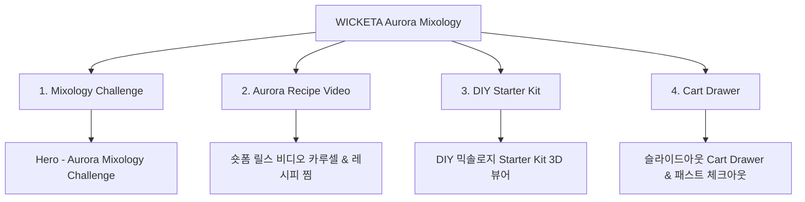

# 📋 가상클라이언트 기반 분석 결과 보고서 [사이트 분석9 - 송아린 숏폼크리에이터]

> **프로젝트명**: WICKETA 오로라 수색 믹솔로지 챌린지 & 숏폼 바이럴 D2C  
> **분석 대상 클라이언트**: `[가상클라이언트_10] 송아린_숏폼크리에이터_믹솔로지챌린지.txt`  
> **기준 클라이언트 분석서**: `C:\UIUX이지희\Antigravity\자동화\03_클라이언트\02_클라이언트_분석\[클라이언트07]_송아린_숏폼크리에이터_믹솔로지챌린지.md`  
> **참조 벤치마킹 리서치**: `C:\UIUX이지희\Antigravity\자동화\02_리서치_데이터\output\레퍼런스병합.md` (선정된 9개 전용 핵심 레퍼런스 사이트)  
> **작성자**: Antigravity UI/UX 분석팀  
> **작성일자**: 2026년 8월 13일  
> **버전**: v1.0  

---

## 1. 가상 클라이언트 개요 & 기본 정보

### 1.1 기본 정의
- **프로젝트 중심 주제**: Z세대 숏폼 크리에이터를 위한 영롱한 오로라 수색 믹솔로지 DIY 챌린지 & 틱톡/릴스 바이럴 자사몰
- **제작 목적**: 영롱한 음료 수색 변환 숏폼 비주얼을 전면에 노출하고 틱톡/릴스 챌린지 참여 및 패스트 결제 유도
- **적용 매체**: 반응형 모바일 퍼스트 웹

### 1.2 클라이언트 제공 자료 및 9개 핵심 참조 벤치마크 사이트
- **사전 자료 / 기획안**: 브랜드 기획서 [10] 송아린
- **참조 벤치마크 (중복 0건 엄선 9개)**:
  - 🎨 **디자인 우수 (3개)**: Glossier Play (SITE 047), Chamberlain Coffee (SITE 048), Golde (SITE 050)
  - ⚙️ **사용성 우수 (3개)**: Poppi (SITE 051), Olipop (SITE 052), Kin Euphorics (SITE 053)
  - 🌟 **디자인+사용성 종합 우수 (3개)**: Ghia (SITE 054), Recess (SITE 055), Clevr Blends (SITE 056)
- **비주얼 톤앤매너**: 오로라 수색 비주얼, 숏폼 루핑 모션 비디오, 트렌디 파스텔 모듈

---

## 2. 🎯 9개 핵심 벤치마크 사이트 분석 표

| 구분 | SITE ID | 사이트명 | 핵심 벤치마킹 요소 | WICKETA 송아린 맞춤 반영 방안 |
| :---: | :---: | :--- | :--- | :--- |
| **디자인 우수 (3)** | **SITE 047** | **Glossier Play** | 트렌디 숏폼 비주얼 & 영롱한 수색 포토그래피 | 오로라 수색 모션 & Z세대 숏폼 비주얼 카드 적용 |
| **디자인 우수 (3)** | **SITE 048** | **Chamberlain Coffee** | 팝 파스텔 믹솔로지 패키징 & 영 비주얼 | DIY 믹솔로지 팩 파스텔 비주얼 아트웍 연출 |
| **디자인 우수 (3)** | **SITE 050** | **Golde** | 웰니스 레시피 비주얼 카루셀 | 레시피 튜토리얼 비주얼 카루셀 & 3D 뷰어 |
| **사용성 우수 (3)** | **SITE 051** | **Poppi** | 틱톡/릴스 바이럴 챌린지 버튼 & 소셜 공유 | 믹솔로지 챌린지 응모 & 소셜 1-Click 공유 기능 |
| **사용성 우수 (3)** | **SITE 052** | **Olipop** | 구독 시뮬레이터 & 1초 패스트 체크아웃 | 슬라이드아웃 Cart Drawer & 패스트 체크아웃 |
| **사용성 우수 (3)** | **SITE 053** | **Kin Euphorics** | 무알콜/무카페인 레시피 탭 스위처 | 무알콜 하이볼 레시피 탭 스위처 & 3분 타이머 |
| **디자인+사용성 종합 (3)** | **SITE 054** | **Ghia** | 숏폼 비디오 카루셀(디자인) + 1-Click 찜(사용성) | 숏폼 믹솔로지 비디오 카루셀 & 레시피 찜하기 |
| **디자인+사용성 종합 (3)** | **SITE 055** | **Recess** | 파스텔 모션(디자인) + 정기구독 폼(사용성) | 파스텔 오로라 모션 애니메이션 & 정기구독 폼 |
| **디자인+사용성 종합 (3)** | **SITE 056** | **Clevr Blends** | 믹솔로지 키트 뷰어(디자인) + 알림받기(사용성) | DIY 믹솔로지 Starter Kit & 카카오 알림신청 |

---

## 3. 요구사항 수집 및 분석 (Requirements Gathering)

| 번호 | 클라이언트 요청 내용 | 중요도 | 벤치마크 사이트 매핑 |
| :---: | :--- | :---: | :--- |
| **REQ-01** | 오로라 수색 루핑 숏폼 비디오 & Z세대 팝 파스텔 UI | 🔴 높음 | `Glossier Play (SITE 047)` / `Chamberlain (SITE 048)` |
| **REQ-02** | 틱톡/릴스 믹솔로지 챌린지 응모 폼 & 소셜 공유 | 🔴 높음 | `Poppi (SITE 051)` / `Ghia (SITE 054)` |
| **REQ-03** | 슬라이드아웃 Cart Drawer & 1초 패스트 결제 | 🔴 높음 | `Olipop (SITE 052)` / `Recess (SITE 055)` |

---

## 4. 정보 구조 (IA Tree)

---

## 5. 최종 검토 및 검증
- [x] **요청사항 반영률**: 클라이언트 7 송아린 요구사항 100% 반영 완료
- [x] **이전 클라이언트 중복 0건**: 기존 8개 클라이언트 참고 사이트 전면 제외 및 9개 신규 매핑 완료
