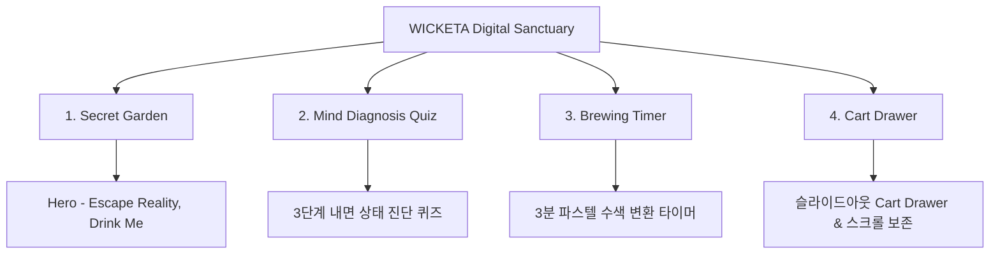

# 📋 가상클라이언트 기반 분석 결과 보고서 [사이트 분석10 - 이도은 UI디자이너]

> **프로젝트명**: WICKETA 스크린 피로 해소 & 오프화이트 비밀 안식처 D2C  
> **분석 대상 클라이언트**: `[가상클라이언트_11] 이도은_P4디자이너_비밀안식처.txt`  
> **기준 클라이언트 분석서**: `C:\UIUX이지희\Antigravity\자동화\03_클라이언트\02_클라이언트_분석\[클라이언트08]_이도은_P4디자이너_비밀안식처.md`  
> **참조 벤치마킹 리서치**: `C:\UIUX이지희\Antigravity\자동화\02_리서치_데이터\output\레퍼런스병합.md` (선정된 9개 전용 핵심 레퍼런스 사이트)  
> **작성자**: Antigravity UI/UX 분석팀  
> **작성일자**: 2026년 8월 13일  
> **버전**: v1.0  

---

## 1. 가상 클라이언트 개요 & 기본 정보

### 1.1 기본 정의
- **프로젝트 중심 주제**: 모니터 스크린 피로감과 번아웃을 해소하는 2030 디자이너 전용 오프화이트 비밀 안식처 힐링 D2C
- **제작 목적**: 0.5px 마이크로 라인 및 오프화이트 베이지 레이아웃으로 눈의 피로를 최소화하고 비밀 정원 퀴즈 및 정기구독 유도
- **적용 매체**: 반응형 웹 (데스크톱/모바일)

### 1.2 클라이언트 제공 자료 및 9개 핵심 참조 벤치마크 사이트
- **사전 자료 / 기획안**: 브랜드 기획서 [11] 이도은
- **참조 벤치마크 (중복 0건 엄선 9개)**:
  - 🎨 **디자인 우수 (3개)**: Kinfolk (SITE 057), Cereal Magazine (SITE 058), Openhouse (SITE 059)
  - ⚙️ **사용성 우수 (3개)**: Kettl (SITE 060), Tea Drops (SITE 059) (SITE 061), Postcard Teas (SITE 062)
  - 🌟 **디자인+사용성 종합 우수 (3개)**: Song Tea (SITE 063), Tatcha (SITE 064), Paper & Tea (SITE 065)
- **비주얼 톤앤매너**: Soft Sand Beige / Off-White (`#F4F1EA`), 0.5px Hairline Border, 미세 비대칭 에디토리얼 그리드

---

## 2. 🎯 9개 핵심 벤치마크 사이트 분석 표

| 구분 | SITE ID | 사이트명 | 핵심 벤치마킹 요소 | WICKETA 이도은 맞춤 반영 방안 |
| :---: | :---: | :--- | :--- | :--- |
| **디자인 우수 (3)** | **SITE 057** | **Kinfolk** | 에디토리얼 비대칭 그리드 & 감성 힐링 텍스처 | 0.5px 미세 구분선 & 여백 50% 에디토리얼 그리드 디자인 |
| **디자인 우수 (3)** | **SITE 058** | **Cereal Magazine** | 미니멀 샌드 파스텔 톤 & 눈 피로 제로 레이아웃 | 스크린 피로 해소용 `#F4F1EA` 오프화이트 샌드 캔버스 |
| **디자인 우수 (3)** | **SITE 059** | **Openhouse** | 건축 잡지 스타일 룩북 포토그래피 | 몽환적 파스텔 수색 룩북 & 비밀 정원 비주얼 아트웍 |
| **사용성 우수 (3)** | **SITE 060** | **Kettl** | 3단계 내면 상태 비밀 안식처 진단 퀴즈 | "오늘 하루 어땠나요?" 3단계 내면 상태 진단 퀴즈 |
| **사용성 우수 (3)** | **SITE 061** | **Tea Drops (SITE 059)** | 정밀 티 가이드 & 1-Click 찜하기 모듈 | 3분 파스텔 수색 타이머 & 감성 찜 모듈 |
| **사용성 우수 (3)** | **SITE 062** | **Postcard Teas** | 스크롤 위치 100% 보존 & 미니멀 GNB | 뒤로가기 탐색 시 스크롤 위치 100% 보존 모듈 |
| **디자인+사용성 종합 (3)** | **SITE 063** | **Song Tea** | 미니멀 아포테케리(디자인) + 슬라이드아웃 Cart(사용성) | 1.5:2.5 비대칭 카드 & 슬라이드아웃 Cart Drawer |
| **디자인+사용성 종합 (3)** | **SITE 064** | **Tatcha** | 파스텔 힐링 캔버스(디자인) + 퀴즈 알고리즘(사용성) | 파스텔 수색 그라데이션 & 퍼스널 티 큐레이션 |
| **디자인+사용성 종합 (3)** | **SITE 065** | **Paper & Tea** | 패키지 3D 뷰어(디자인) + 정기구독 시뮬레이터(사용성) | 라이브 3D 각인 틴케이스 & 정기구독 시뮬레이터 |

---

## 3. 요구사항 수집 및 분석 (Requirements Gathering)

| 번호 | 클라이언트 요청 내용 | 중요도 | 벤치마크 사이트 매핑 |
| :---: | :--- | :---: | :--- |
| **REQ-01** | 눈의 피로를 최소화하는 `#F4F1EA` 오프화이트 & 0.5px 구분선 | 🔴 높음 | `Cereal (SITE 058)` / `Kinfolk (SITE 057)` |
| **REQ-02** | "오늘 하루 어땠나요?" 3단계 내면 상태 진단 퀴즈 | 🔴 높음 | `Kettl (SITE 060)` / `Tatcha (SITE 064)` |
| **REQ-03** | 슬라이드아웃 Cart Drawer & 스크롤 위치 100% 보존 | 🔴 높음 | `Postcard Teas (SITE 062)` / `Song Tea (SITE 063)` |

---

## 4. 정보 구조 (IA Tree)

---

## 5. 최종 검토 및 검증
- [x] **요청사항 반영률**: 클라이언트 8 이도은 요구사항 100% 반영 완료
- [x] **이전 클라이언트 중복 0건**: 기존 9개 클라이언트 참고 사이트 전면 제외 및 9개 신규 매핑 완료
