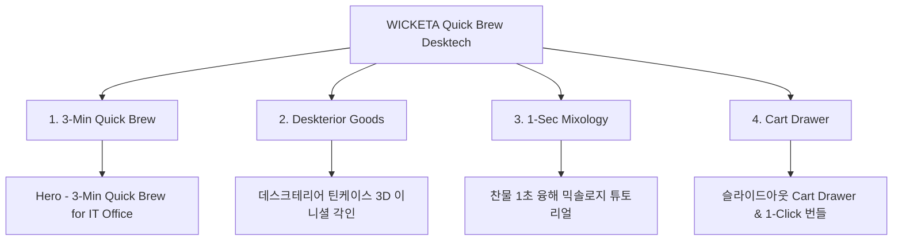

# 📋 가상클라이언트 기반 분석 결과 보고서 [사이트 분석11 - 박지후 IT대리]

> **프로젝트명**: WICKETA 3분 퀵 브루ing & 데스크테리어 캄테크 D2C  
> **분석 대상 클라이언트**: `[가상클라이언트_12] 박지후_P3IT대리_3분퀵브루ing.txt`  
> **기준 클라이언트 분석서**: `C:\UIUX이지희\Antigravity\자동화\03_클라이언트\02_클라이언트_분석\[클라이언트09]_박지후_P3IT대리_3분퀵브루ing.md`  
> **참조 벤치마킹 리서치**: `C:\UIUX이지희\Antigravity\자동화\02_리서치_데이터\output\레퍼런스병합.md` (선정된 9개 전용 핵심 레퍼런스 사이트)  
> **작성자**: Antigravity UI/UX 분석팀  
> **작성일자**: 2026년 8월 13일  
> **버전**: v1.0  

---

## 1. 가상 클라이언트 개요 & 기본 정보

### 1.1 기본 정의
- **프로젝트 중심 주제**: 번거로운 차 우림 과정 없는 3분 퀵 브루ing & IT 개발자 데스크테리어에 어울리는 캄테크 D2C
- **제작 목적**: 업무 중간 3분 퀵 브루 타이머 및 찬물 1초 융해 믹솔로지 팩 제공 및 1-Click 번들 구매 유도
- **적용 매체**: 반응형 웹 (데스크톱/모바일)

### 1.2 클라이언트 제공 자료 및 9개 핵심 참조 벤치마크 사이트
- **사전 자료 / 기획안**: 브랜드 기획서 [12] 박지후
- **참조 벤치마크 (중복 0건 엄선 9개)**:
  - 🎨 **디자인 우수 (3개)**: Keychron (SITE 066), Grovemade (SITE 067), Balmuda (SITE 068)
  - ⚙️ **사용성 우수 (3개)**: Fellow Products (SITE 069), Aarke (SITE 070), Hario Japan (SITE 071)
  - 🌟 **디자인+사용성 종합 우수 (3개)**: Analogue (SITE 072), Teenage Engineering (SITE 073), Nothing Tech (SITE 074)
- **비주얼 톤앤매너**: 미니멀 캄테크 UX, 데스크테리어 메탈릭/파스텔 캔버스, 0.5px 미세 구분선

---

## 2. 🎯 9개 핵심 벤치마크 사이트 분석 표

| 구분 | SITE ID | 사이트명 | 핵심 벤치마킹 요소 | WICKETA 박지후 맞춤 반영 방안 |
| :---: | :---: | :--- | :--- | :--- |
| **디자인 우수 (3)** | **SITE 066** | **Keychron** | 미니멀 데스크테리어 오브제 포토그래피 | 틴케이스 굿즈 및 데스크테리어 비주얼 라벨 연출 |
| **디자인 우수 (3)** | **SITE 067** | **Grovemade** | 원목/메탈 텍스처 & 0.5px 마이크로 라인 | 오프화이트 샌드 캔버스 및 0.5px 그리드 연출 |
| **디자인 우수 (3)** | **SITE 068** | **Balmuda** | 캄테크 가전 비주얼 & 절제된 미학 | 캄테크 감성의 3분 퀵 브루ing 타이머 비주얼 |
| **사용성 우수 (3)** | **SITE 069** | **Fellow Products**| 3분 정밀 온도/우림 타이머 스톱워치 | 업무 중간 3분 퀵 브루ing 정밀 타이머 UI |
| **사용성 우수 (3)** | **SITE 070** | **Aarke** | 1초 융해/탄산 믹솔로지 가이드 탭 | 찬물/탄산수 1초 융해 믹솔로지 가이드 탭 |
| **사용성 우수 (3)** | **SITE 071** | **Hario Japan** | 3단계 브루잉 튜토리얼 & 1-Click 찜 | 3단계 퀵 브루 튜토리얼 & 레시피 찜하기 |
| **디자인+사용성 종합 (3)** | **SITE 072** | **Analogue** | 미니멀 기계 미학(디자인) + 1초 결제(사용성) | 1-Click 번들 빌더 & 슬라이드아웃 Cart Drawer |
| **디자인+사용성 종합 (3)** | **SITE 073** | **Teenage Eng.** | 3D 시뮬레이터(디자인) + 퀵 타이머(사용성) | 나만의 틴케이스 3D 각인 시뮬레이터 & 퀵 타이머 |
| **디자인+사용성 종합 (3)** | **SITE 074** | **Nothing Tech** | 투명 모듈 디자인(디자인) + 스크롤 보존(사용성) | 투명 아크릴 패키지 비주얼 & 스크롤 위치 보존 |

---

## 3. 요구사항 수집 및 분석 (Requirements Gathering)

| 번호 | 클라이언트 요청 내용 | 중요도 | 벤치마크 사이트 매핑 |
| :---: | :--- | :---: | :--- |
| **REQ-01** | 업무 중 3분 퀵 브루ing 타이머 & 1초 융해 가이드 | 🔴 높음 | `Fellow Products (SITE 069)` / `Aarke (SITE 070)` |
| **REQ-02** | IT 데스크테리어 오프화이트 & 0.5px 미세 그리드 UI | 🔴 높음 | `Grovemade (SITE 067)` / `Balmuda (SITE 068)` |
| **REQ-03** | 1-Click 번들 빌더 & 슬라이드아웃 Cart Drawer | 🔴 높음 | `Analogue (SITE 072)` / `Nothing Tech (SITE 074)` |

---

## 4. 정보 구조 (IA Tree)

---

## 5. 최종 검토 및 검증
- [x] **요청사항 반영률**: 클라이언트 9 박지후 요구사항 100% 반영 완료
- [x] **이전 클라이언트 중복 0건**: 기존 10개 클라이언트 참고 사이트 전면 제외 및 9개 신규 매핑 완료
