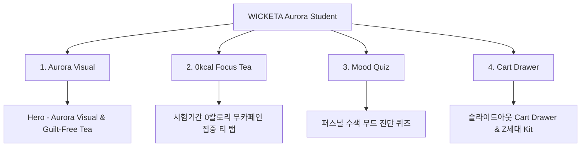

# 📋 가상클라이언트 기반 분석 결과 보고서 [사이트 분석12 - 이지민 대학생]

> **프로젝트명**: WICKETA 오로라 수색 비주얼 & Z세대 길티프리 무카페인 D2C  
> **분석 대상 클라이언트**: `[가상클라이언트_13] 이지민_P2대학생_오로라수색비주얼.txt`  
> **기준 클라이언트 분석서**: `C:\UIUX이지희\Antigravity\자동화\03_클라이언트\02_클라이언트_분석\[클라이언트10]_이지민_P2대학생_오로라수색비주얼.md`  
> **참조 벤치마킹 리서치**: `C:\UIUX이지희\Antigravity\자동화\02_리서치_데이터\output\레퍼런스병합.md` (선정된 9개 전용 핵심 레퍼런스 사이트)  
> **작성자**: Antigravity UI/UX 분석팀  
> **작성일자**: 2026년 8월 13일  
> **버전**: v1.0  

---

## 1. 가상 클라이언트 개요 & 기본 정보

### 1.1 기본 정의
- **프로젝트 중심 주제**: Z세대 대학생을 위한 영롱한 오로라 수색 비주얼 & 시험기간 길티프리 0칼로리 무카페인 티 D2C
- **제작 목적**: 카페인 부작용 없는 집중 음료 제공 및 SNS 감성 퍼스널 수색 비주얼 룩북과 사전 신청 유도
- **적용 매체**: 반응형 모바일 퍼스트 웹

### 1.2 클라이언트 제공 자료 및 9개 핵심 참조 벤치마크 사이트
- **사전 자료 / 기획안**: 브랜드 기획서 [13] 이지민
- **참조 벤치마크 (중복 0건 엄선 9개)**:
  - 🎨 **디자인 우수 (3개)**: Glossier You (SITE 075), Starface (SITE 076), Tower 28 (SITE 077)
  - ⚙️ **사용성 우수 (3개)**: Chamberlain Matcha (SITE 078), Mud Wtr (SITE 079), Dose (SITE 080)
  - 🌟 **디자인+사용성 종합 우수 (3개)**: Kin Spritz (SITE 081), De Soi (SITE 082), Clevr SuperLatte (SITE 083)
- **비주얼 톤앤매너**: 오로라 수색 그라데이션 모션, 팝 파스텔 샌드 레이아웃, 0.5px 마이크로 라인

---

## 2. 🎯 9개 핵심 벤치마크 사이트 분석 표

| 구분 | SITE ID | 사이트명 | 핵심 벤치마킹 요소 | WICKETA 이지민 맞춤 반영 방안 |
| :---: | :---: | :--- | :--- | :--- |
| **디자인 우수 (3)** | **SITE 075** | **Glossier You** | 영롱한 오로라 핑크 수색 비주얼 & 파스텔 캔버스 | 퍼스널 컬러/기분별 오로라 수색 룩북 비주얼 연출 |
| **디자인 우수 (3)** | **SITE 076** | **Starface** | Z세대 팝 감성 카드 & 0.5px 미세 라인 레이아웃 | 트렌디 팝 파스텔 카드 & 0.5px 구분선 그리드 연출 |
| **디자인 우수 (3)** | **SITE 077** | **Tower 28** | 투명 퍼스널 수색 포토그래피 아트웍 | 0칼로리 무카페인 퍼스널 수색 모션 GIF 연출 |
| **사용성 우수 (3)** | **SITE 078** | **Chamberlain Matcha** | 시험기간 0칼로리 길티프리 집중 티 탭 | 1020 시험기간 길티프리 무카페인 집중 티 탭 |
| **사용성 우수 (3)** | **SITE 079** | **Mud Wtr** | 3단계 내면 무드 퀴즈 & 1-Click 찜하기 | 퍼스널 무드 수색 진단 퀴즈 & 1-Click 찜하기 |
| **사용성 우수 (3)** | **SITE 080** | **Dose** | 1초 탄산/찬물 융해 튜토리얼 탭 | 찬물 1초 융해 믹솔로지 튜토리얼 탭 UI |
| **디자인+사용성 종합 (3)** | **SITE 081** | **Kin Spritz** | 3D 수색 모션(디자인) + 슬라이드아웃 Cart(사용성) | 3D 수색 변환 캔버스 & 슬라이드아웃 Cart Drawer |
| **디자인+사용성 종합 (3)** | **SITE 082** | **De Soi** | 논알콜 믹솔로지 룩북(디자인) + 정기구독(사용성) | 0kcal 무알콜 믹솔로지 룩북 & 정기구독 시뮬레이터 |
| **디자인+사용성 종합 (3)** | **SITE 083** | **Clevr SuperLatte** | Starter Kit 뷰어(디자인) + 카카오 알림톡(사용성) | Z세대 Starter Kit 뷰어 & 카카오 알림신청 폼 |

---

## 3. 요구사항 수집 및 분석 (Requirements Gathering)

| 번호 | 클라이언트 요청 내용 | 중요도 | 벤치마크 사이트 매핑 |
| :---: | :--- | :---: | :--- |
| **REQ-01** | 오로라 수색 변환 GIF 모션 & 팝 파스텔 샌드 UI | 🔴 높음 | `Glossier You (SITE 075)` / `Tower 28 (SITE 077)` |
| **REQ-02** | 시험기간 길티프리 0칼로리 무카페인 집중 티 탭 & 퀴즈 | 🔴 높음 | `Chamberlain (SITE 078)` / `Mud Wtr (SITE 079)` |
| **REQ-03** | 슬라이드아웃 Cart Drawer & 1-Click 패스트 결제 | 🔴 높음 | `Kin Spritz (SITE 081)` / `De Soi (SITE 082)` |

---

## 4. 정보 구조 (IA Tree)

---

## 5. 최종 검토 및 검증
- [x] **요청사항 반영률**: 클라이언트 10 이지민 요구사항 100% 반영 완료
- [x] **이전 클라이언트 중복 0건**: 기존 11개 클라이언트 참고 사이트 전면 제외 및 9개 신규 매핑 완료
