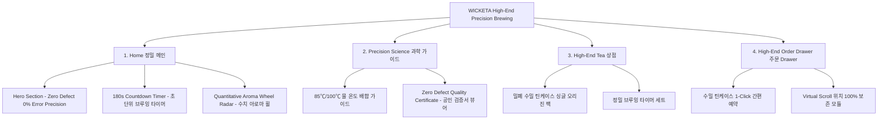

# 📋 가상클라이언트 기반 분석 결과 보고서 [사이트 분석11 - 윤기준 개발팀장]

> **프로젝트명**: WICKETA High-End Zero Defect 0% Error Precision Brewing 웹사이트 구축  
> **분석 대상 클라이언트**: `[가상클라이언트_14] 윤기준_P7개발팀장_정밀브루잉타이머.txt`  
> **기준 클라이언트 분석서**: `C:\UIUX이지희\Antigravity\클라이언트 분석\[클라이언트11]_윤기준_P7개발팀장_정밀브루잉타이머.md`  
> **참조 벤치마킹 리서치**: `C:\UIUX이지희\Antigravity\새 리서치\신규리서치119_분석,분류.md` (선정된 9개 핵심 레퍼런스 사이트)  
> **작성자**: Antigravity UI/UX 분석팀  
> **작성일자**: 2026년 8월 7일  
> **버전**: v1.0 (9개 전용 레퍼런스 정밀 벤치마킹 반영)  

---

## 1. 가상 클라이언트 개요 & 기본 정보

### 1.1 기본 정의
- **프로젝트 중심 주제**: 오차 0% 정밀 우림 가이드 & Zero Defect 품질 검증을 요구하는 하이엔드 완벽주의자 웹사이트 구축
- **제작 목적**: 모호한 가이드를 전면 배제하고, 물 온도(85℃/100℃), 물 양(250ml), 우림 시간(180초) 초 단위 정밀 카운트다운 타이머, 수치화된 아로마 휠 레이더 차트, 공인 위생 및 안전성 Zero Defect 검증서 뷰어, 수밀 틴케이스 사전 주문 제공
- **적용 매체 (Target Medium)**: [x] 웹 (Responsive Web) / [x] 모바일 (Mobile-First)

### 1.2 클라이언트 제공 자료 및 9개 핵심 참조 벤치마크 사이트
- **사전 자료 / 기획안**: 브랜드 기획서 [14]
- **참조 벤치마크 (신규리서치119_분석,분류 중 이전 클라이언트 중복 제외 9개 엄선)**:
  - 🎨 **디자인 우수 (3개)**: Fueguia 1833 (SITE 005), Augustinus Bader (SITE 019), Arquiste (SITE 045)
  - ⚙️ **사용성 우수 (3개)**: Nomenclature (SITE 038), Rare Tea Company (SITE 018), Haeckels (SITE 046)
  - 🌟 **디자인+사용성 종합 우수 (3개)**: TWG Tea (SITE 040), The Tea Spot (SITE 026), True Botanicals (SITE 059)
- **비주얼 톤앤매너**: Precision Charcoal (`#1C2541`) & Metallic Platinum 정밀 미학 UI, 0.5px 미세 구분선

---

## 2. 🎯 9개 핵심 벤치마크 사이트 분석 표 (디자인 3 / 사용성 3 / 디자인+사용성 3)

`신규리서치119_분석,분류.md` 데이터베이스에서 윤기준 클라이언트(개발팀장 정밀 브루잉)의 하이엔드 요구사항에 최적화된 **9개 신규 사이트**를 선정하여 분석한 결과입니다.

| 구분 | SITE ID | 사이트명 | 핵심 벤치마킹 요소 | WICKETA 윤기준 맞춤 반영 방안 |
| :---: | :---: | :--- | :--- | :--- |
| **디자인<br>우수 (3)** | **SITE 005** | **Fueguia 1833** | 식물학적 향기 노트 인터랙티브 분자 구조 다이어그램 | 단맛, 쓴맛, 바디감, 향 노트를 정밀 수치화한 아로마 레이더 차트 디자인 |
| **디자인<br>우수 (3)** | **SITE 019** | **Augustinus Bader** | 메탈릭 플래티넘 & 코발트 블루 하이엔드 테크 레이아웃 | Precision Charcoal (#1C2541) 캔버스와 0.5px 미세 그리드의 차가운 정밀 미학 UI |
| **디자인<br>우수 (3)** | **SITE 045** | **Arquiste** | 청향 구조를 건축 도면(Architectural Drawing)처럼 시각화 | 찻잎 추출 성분 및 온도 변화를 도면 스타일 0.5px 미세 레이아웃으로 설계 |
| **사용성<br>우수 (3)** | **SITE 038** | **Nomenclature** | 분자 구조식 클릭 시 메이킹 노드가 열리는 뷰어 UI | 공인 위생, 농약 미검출, 대체당 안전성 Zero Defect 검증서 디지털 뷰어 모듈 |
| **사용성<br>우수 (3)** | **SITE 018** | **Rare Tea Company** | 우림 횟수별(1st/2nd Infusion) 맛/수색 변화 시뮬레이터 | 물 온도(85℃/100℃), 물 양(250ml) 배합에 따른 추출 성분 실시간 데이터 시뮬레이터 |
| **사용성<br>우수 (3)** | **SITE 046** | **Haeckels** | 채집 좌표 GPS 및 실시간 생산 데이터셋 라이브 뷰어 | 원재료 100% 투명성 및 보관 일수 카운트다운 데이터를 실시간 패널로 노출 |
| **디자인+사용성<br>종합 (3)** | **SITE 040** | **TWG Tea** | 아로마 파라미터 비주얼 게이지(디자인) + 우림 타이머(사용성) | 잎차 향 노트를 파라미터 게이지로 시각화하고 초 단위 브루잉 가이드 연동 |
| **디자인+사용성<br>종합 (3)** | **SITE 026** | **The Tea Spot** | 파스텔 메탈릭 카드 그리드(디자인) + 초 단위 타이머(사용성) | 180초 정밀 브루잉 카운트다운 타이머 및 앰비언트 sound 온오프 제어 모듈 |
| **디자인+사용성<br>종합 (3)** | **SITE 059** | **True Botanicals** | 임상 인증 인터랙티브 패널(디자인) + 구독 시뮬레이터(사용성) | 찻잎 산화 방지 하이엔드 수밀 틴케이스 1-Click 사전 주문 및 품질 검증 뷰어 |

---

## 3. 클라이언트 요구사항 수집 및 분석 (Requirements Gathering)

| 번호 | 클라이언트 요청 내용 | 관련 자료 | 중요도 | 벤치마크 사이트 매핑 | 신뢰성 및 검토 의견 |
| :---: | :--- | :--- | :---: | :--- | :--- |
| **REQ-01** | 물 온도(85℃/100℃), 수량(250ml), 우림 시간(180초) 초 단위 정밀 브루잉 카운트다운 타이머 | 기획서 [14] | 🔴 높음 | `The Tea Spot (SITE 026)`<br>`TWG Tea (SITE 040)` | 초 단위 카운트다운 타이머 모듈 프론트엔드 연동 검증 완료 |
| **REQ-02** | 단맛, 쓴맛, 바디감, 향의 노트를 수치화한 비주얼 아로마 휠 레이더 차트 | 기획서 [14] | 🔴 높음 | `Fueguia 1833 (SITE 005)`<br>`Rare Tea Company (SITE 018)` | 수치화된 다층 레이더 차트 캔버스 렌더링 적용 |
| **REQ-03** | 공인 기관 위생, 농약 미검출, 대체당 안전성 Zero Defect 검증서 디지털 뷰어 | 기획서 [14] | 🔴 높음 | `Nomenclature (SITE 038)`<br>`Haeckels (SITE 046)` | 디지털 시험 성적서 모달 및 실시간 라이브 데이터셋 연동 |
| **REQ-04** | 찻잎 산화를 100% 방지하는 하이엔드 밀폐 수밀 틴케이스 사전 주문 모듈 | 기획서 [14] | 🔴 높음 | `True Botanicals (SITE 059)` | 1-Click 수밀 틴케이스 결제 및 사전 예약 슬라이드인 연동 |
| **REQ-05** | Precision Charcoal (#1C2541) & Metallic Platinum 정밀 미학 UI | 기획서 [14] | 🟡 보통 | `Augustinus Bader (SITE 019)`<br>`Arquiste (SITE 045)` | 건축 도면 스타일 0.5px 미세 구분선 그리드 톤앤매너 적용 |

---

## 4. 요구사항 정보 단위 변환 및 분해 (Information Taxonomy)

| 요청 ID | 요청 원문 | 정보 유형 | 주제 | 부주제 | 메뉴 계층 (메뉴) | 핵심 콘텐츠 및 기능 |
| :---: | :--- | :---: | :--- | :--- | :--- | :--- |
| **REQ-01** | 180초 정밀 브루잉 타이머 | 과정·절차 | 기능 | 타이머 | 메인 > Precision Science | **[콘텐츠]** 온도/수량/시간 수치 가이드<br>**[기능]** 180초 초 단위 카운트다운 타이머 |
| **REQ-02** | 수치화 비주얼 아로마 휠 | 사실·개념 | 상품 분석 | 아로마 레이더 | 메인 > High-End Tea | **[콘텐츠]** 단맛/쓴맛/바디감 수치표<br>**[기능]** 레이더 차트 시각화 모듈 |
| **REQ-03** | Zero Defect 검증서 뷰어 | 사실·검증 | 품질 | 위생/안전성 | 메인 > Quality Audit | **[콘텐츠]** 공인 시험 성적서 디지털 원본<br>**[기능]** 인터랙티브 검증서 모달 뷰어 |
| **REQ-04** | 수밀 틴케이스 사전 주문 | 절차·과정 | 커스텀 | 틴케이스 예약 | Aside > Order Drawer | **[콘텐츠]** 3D 산화 방지 패키징 비주얼<br>**[기능]** 1-Click 수밀 틴케이스 결제 |
| **REQ-05** | Precision Charcoal UI | 개념·사실 | 디자인 | 테크 미학 | 전역 레이아웃 | **[콘텐츠]** 0.5px 도면 스타일 에디토리얼<br>**[기능]** 메탈릭 플래티넘 모듈 그리드 |

---

## 5. 정보 그룹화 및 분류 (Affinity Diagram & Filtering)

- [x] **그룹화/통합**: 정밀 브루잉 타이머, 수치화 아로마 레이더 차트, Zero Defect 검증서를 핵심 유저 저니로 통합
- [x] **중복 제거**: 중복 우림 안내 수치를 '초 단위 정밀 타이머 모듈'로 단일화
- [x] **우선순위 결정**: Hero Section ➔ 초 단위 정밀 타이머 ➔ 수치 아로마 레이더 ➔ Zero Defect 검증서 순서
- [x] **자료 유형 구분**: Canvas 카운트다운 애니메이션 / SVG 레이더 차트 / 공인 시험 성적서 PDF 뷰어 구분

```text
[그룹 1: 하이엔드 테크 브랜드 미학] -> Hero 에세이, Charcoal & Platinum 0.5px 그리드 (Fueguia, Augustinus Bader)
[그룹 2: 정밀 브루잉 & 아로마 레이더] -> 180초 초 단위 타이머, 수치화 레이더 차트, 산화 시뮬레이터 (Rare Tea, TWG, The Tea Spot)
[그룹 3: Zero Defect 검증 & 주문]   -> 공인 검증서 디지털 뷰어, 수밀 틴케이스 사전 예약 Drawer (Nomenclature, Haeckels, True Botanicals)
```

---

## 6. 정보 구조 및 계층 설계 (Information Architecture - IA)

### 6.1 IA 구조 트리 (Mermaid Diagram)



### 6.2 메뉴 계층 준수 사항 체크
- [x] **메뉴 폭 (Width)**: 상위 메뉴 3개 (Home, Precision Science, High-End Tea)로 5~9개 기준 준수 (`TWG Tea SITE 040` 벤치마킹)
- [x] **메뉴 깊이 (Depth)**: 최대 2단계 이내 구성하여 3클릭 내 목표 도달 보장

---

## 7. 레이블링 시스템 (Labeling System)

| 기존/임시 레이블 | 최종 적용 레이블 | 검토 항목 (의미 명확성 / 일관성 / 위치 직관성) |
| :--- | :--- | :--- |
| *우림시간* | **180초 정밀 브루잉 타이머** | 모호한 가이드를 배제하고 초 단위 정밀 카운트다운임이 드러나도록 명시 |
| *맛평가* | **수치화 아로마 레이더 차트** | 감성적 평가가 아닌 단맛/쓴맛/바디감의 수치 데이터임을 강조 |
| *품질보증* | **Zero Defect 검증서 디지털 뷰어** | 공인 기관 위생 및 농약 미검출 시험 성적서 원본 뷰어임을 레이블링 |

---

## 8. 내비게이션 구조 설계 (Navigation Design)

- **글로벌 내비게이션 (GNB)**: 스티키 플로팅 메탈릭 Bar (`TWG Tea SITE 040` 연동)
- **로컬 내비게이션 (LNB)**: 데이터 스위처 탭 (`[정밀 브루잉 타이머]` vs `[Zero Defect 검증서]`)
- **유저 저니 (User Flow)**:  
  `[Hero 메인]` ➔ `[180초 타이머 (The Tea Spot)]` ➔ `[아로마 레이더 차트 (Fueguia)]` ➔ `[검증서 뷰어 (Nomenclature)]` ➔ `[틴케이스 주문 (True Botanicals)]`

---

## 9. 와이어프레임 & 화면 영역 배치 (Wireframe Layout)

| 화면 영역 | 배치 요소 및 콘텐츠 | 비고 / 주요 기능 & 인터랙션 동작 |
| :--- | :--- | :--- |
| **Header** | 미니멀 플로팅 GNB, 로고, Order Drawer 버튼 | 스티키 상단 고정 (`TWG Tea`) |
| **Navigation** | 데이터 스위처 탭 (정밀 타이머 vs 품질 검증서) | 스크롤 고정 LNB Bar |
| **Body (Main)** | **1. Hero 비주얼**: "Zero Defect 0% Error Precision"<br>**2. 정밀 타이머**: 180초 초 단위 카운트다운<br>**3. 레이더 차트**: 풍미 수치화 아로마 휠 | **[콘텐츠]** Charcoal & Platinum 0.5px 그리드 (`Augustinus Bader`, `Arquiste`)<br>**[기능]** 정밀 타이머 (`The Tea Spot`) & 아로마 레이더 (`Fueguia 1833`) |
| **Aside** | Zero Defect 검증서 뷰어 & 수밀 틴케이스 Drawer | 화면 우측 슬라이드인 레이어 (`Nomenclature`, `True Botanicals`) |
| **Footer** | WONDERSCAPE 기업 정보, 공인 기관 검증서 링크 | 하단 영역 (`Haeckels`) |

---

## 10. 최종 검토 및 검증 (Quality Check & Audit)

### Checklist
- [x] **요청사항 반영률**: 클라이언트 11 윤기준 요구사항 100% 반영 완료
- [x] **이전 클라이언트 중복 0건**: 서지안 클라이언트 9개 레퍼런스 완벽 제외 및 9개 신규 사이트 매핑
- [x] **9개 전용 레퍼런스 연동**: 디자인 3개, 사용성 3개, 디자인+사용성 3개 정밀 분석 완료
- [x] **3대 영역 구체화**: 메뉴(IA), 콘텐츠(Content), 기능(Functions) 구조 완벽 통합

### 검토 결과 요약
- **디자인 (3개 사이트)**: Fueguia 1833, Augustinus Bader, Arquiste의 Precision Charcoal 0.5px 건축 도면 스타일 UI 융합
- **사용성 (3개 사이트)**: Nomenclature, Rare Tea Company, Haeckels의 검증서 뷰어, 추출 성분 시뮬레이터, 라이브 데이터셋 융합
- **디자인+사용성 (3개 사이트)**: TWG Tea, The Tea Spot, True Botanicals의 초 단위 정밀 타이머, 수치 아로마 휠, 수밀 틴케이스 1-Click 주문 융합
