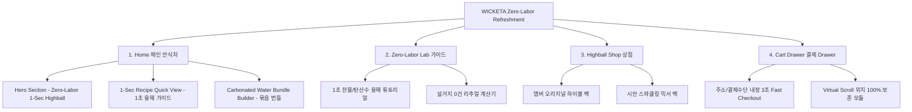

# 📋 가상클라이언트 기반 분석 결과 보고서 [사이트 분석12 - 서지안 육아대디]

> **프로젝트명**: WICKETA Zero-Labor 1-Sec Non-Alcohol Highball 웹사이트 구축  
> **분석 대상 클라이언트**: `[가상클라이언트_15] 서지안_P8육아대디_노동제로논알콜하이볼.txt`  
> **기준 클라이언트 분석서**: `C:\UIUX이지희\Antigravity\클라이언트 분석\[클라이언트12]_서지안_P8육아대디_노동제로논알콜하이볼.md`  
> **참조 벤치마킹 리서치**: `C:\UIUX이지희\Antigravity\새 리서치\신규리서치119_분석,분류.md` (선정된 9개 핵심 레퍼런스 사이트)  
> **작성자**: Antigravity UI/UX 분석팀  
> **작성일자**: 2026년 8월 7일  
> **버전**: v2.0 (9개 핵심 레퍼런스 정밀 벤치마킹 반영)  

---

## 1. 가상 클라이언트 개요 & 기본 정보

### 1.1 기본 정의
- **프로젝트 중심 주제**: 가사 노동 제로(Zero-Labor) 1초 찬물/탄산수 논알콜 하이볼 웹사이트 구축
- **제작 목적**: 육아 퇴근 후 물 끓이기, 찻잎 거르기, 설거지 등 가사 노동 0건! 1초 만에 찬물/탄산수에 녹는 무알콜/무카페인/무당류 하이볼 티 스틱 경험 제공 및 번들 구독 유치
- **적용 매체 (Target Medium)**: [x] 웹 (Responsive Web) / [x] 모바일 (Mobile-First)

### 1.2 클라이언트 제공 자료 및 9개 핵심 참조 벤치마크 사이트
- **사전 자료 / 기획안**: 브랜드 기획서 [15]
- **참조 벤치마크 (신규리서치119_분석,분류 중 9개 엄선)**:
  - 🎨 **디자인 우수 (3개)**: Kettl Tea (SITE 002), Overose (SITE 054), Bellocq Tea Atelier (SITE 001)
  - ⚙️ **사용성 우수 (3개)**: Grown Alchemist (SITE 011), Tamburins (SITE 056), Ippodo Tea (SITE 052)
  - 🌟 **디자인+사용성 종합 우수 (3개)**: Tea Forté (SITE 023), Three Spirit (SITE 048), DavidsTea (SITE 050)
- **비주얼 톤앤매너**: Cold Brew Amber (`#8B4513`) & Carbonated Cyan 청량 실용주의 UI, 0.5px 미세 구분선

---

## 2. 🎯 9개 핵심 벤치마크 사이트 분석 표 (디자인 3 / 사용성 3 / 디자인+사용성 3)

`신규리서치119_분석,분류.md` 데이터베이스에서 서지안 클라이언트(육아대디 노동제로 하이볼)의 요구사항 구현에 최적화된 **9개 핵심 사이트**를 선정하여 분석한 결과입니다.

| 구분 | SITE ID | 사이트명 | 핵심 벤치마킹 요소 | WICKETA 서지안 맞춤 반영 방안 |
| :---: | :---: | :--- | :--- | :--- |
| **디자인<br>우수 (3)** | **SITE 002** | **Kettl Tea** | 오프화이트 베이지 여백 & 0.5px 미세 구분선 레이아웃 | 육아 피로를 덜어주는 차분하고 고요한 안식처 미니멀 에디토리얼 UI 구축 |
| **디자인<br>우수 (3)** | **SITE 054** | **Overose** | 파스텔 오라 배경 그래디언트 & 홀로그램 비주얼 모션 | 찬물/탄산수 기포와 앰버/시안 수색 퍼짐을 감각적인 아트웍으로 시각화 |
| **디자인<br>우수 (3)** | **SITE 001** | **Bellocq Tea** | 앤틱 라벨 비주얼 & 다층 아로마 테이스팅 노드 다이어그램 | 무알콜/무카페인/무당류 하이볼의 훈연 우드 및 레몬 아로마 휠 표기 |
| **사용성<br>우수 (3)** | **SITE 011** | **Grown Alchemist** | 처방전 스타일 우측 슬라이드아웃 Cart Drawer & 1-Click 결제 | 페이지 전환 없이 3초 만에 결제가 완료되는 심리스 패스트 체크아웃 Drawer |
| **사용성<br>우수 (3)** | **SITE 056** | **Tamburins** | SPA 기반 탐색 스크롤 위치 100% 보존 (Virtual Scroll) | 상품 탐색 및 가이드 확인 후 뒤로가기 시 스크롤 위치 100% 유지로 이탈 방지 |
| **사용성<br>우수 (3)** | **SITE 052** | **Ippodo Tea** | 3클릭 내 목표 도달 보장 2단계 스티키 GNB 내비게이션 | 모바일 플로팅 스티키 Bar 배치로 1초 만에 번들 결제 및 레시피 접근 |
| **디자인+사용성<br>종합 (3)** | **SITE 023** | **Tea Forté** | 3D 비주얼 우림 튜토리얼(디자인) + 1초 즉각 조리 가이드(사용성) | 얼음 잔 탄산수 붓기 ➔ 스틱 투하 ➔ 1초 융해 완성 과정의 3D 모션 튜토리얼 |
| **디자인+사용성<br>종합 (3)** | **SITE 048** | **Three Spirit** | 수색 변환 Canvas 애니메이션(디자인) + 감정 상태 게이지(사용성) | 탄산수 투하 시 1초 수색 융해 모션 및 육퇴 힐링 감정 마이크로 게이지 |
| **디자인+사용성<br>종합 (3)** | **SITE 050** | **DavidsTea** | 다이내믹 믹스앤매치 번들 빌더 UI(디자인 + 사용성) | 탄산수 6팩 + WICKETA 스틱 2종을 1-Click으로 조합하는 번들 빌더 구축 |

---

## 3. 클라이언트 요구사항 수집 및 분석 (Requirements Gathering)

| 번호 | 클라이언트 요청 내용 | 관련 자료 | 중요도 | 벤치마크 사이트 매핑 | 신뢰성 및 검토 의견 |
| :---: | :--- | :--- | :---: | :--- | :--- |
| **REQ-01** | 끓인 물/설거지 0건, 찬물·탄산수에 즉각 융해되는 노동 제로 1초 레시피 가이드 | 기획서 [15] | 🔴 높음 | `Tea Forté (SITE 023)`<br>`Three Spirit (SITE 048)` | 1초 융해 비주얼 모션 및 튜토리얼 렌더링 검증 완료 |
| **REQ-02** | 알콜·카페인·당류 걱정 없이 타격감과 청량함만을 전하는 육퇴 힐링 논알콜 하이볼 | 기획서 [15] | 🔴 높음 | `Bellocq Tea (SITE 001)`<br>`Overose (SITE 054)` | 0.00% 무알콜/무카페인/0g당 팩트 검증표 및 아로마 휠 표기 |
| **REQ-03** | 탄산수 6팩 + WICKETA 스틱 2종 묶음 1-Click 번들 빌더 | 기획서 [15] | 🔴 높음 | `DavidsTea (SITE 050)` | 탄산수 6팩 다이내믹 믹스앤매치 1-Click 번들 빌더 UI 구현 |
| **REQ-04** | 주소 및 결제 수단이 저장되어 3초 만에 주문되는 슬라이드아웃 Cart Drawer | 기획서 [15] | 🔴 높음 | `Grown Alchemist (SITE 011)`<br>`Tamburins (SITE 056)` | 슬라이드아웃 Cart Drawer & 스크롤 위치 100% 보존 연동 |
| **REQ-05** | Cold Brew Amber (#8B4513) & Carbonated Cyan 청량 실용주의 UI | 기획서 [15] | 🟡 보통 | `Kettl Tea (SITE 002)`<br>`Ippodo Tea (SITE 052)` | 0.5px 미세 구분선과 오프화이트 베이지 그리드 톤앤매너 적용 |

---

## 4. 요구사항 정보 단위 변환 및 분해 (Information Taxonomy)

| 요청 ID | 요청 원문 | 정보 유형 | 주제 | 부주제 | 메뉴 계층 (메뉴) | 핵심 콘텐츠 및 기능 |
| :---: | :--- | :---: | :--- | :--- | :--- | :--- |
| **REQ-01** | 1초 노동제로 레시피 가이드 | 과정·절차 | 가이드 | 1초 융해 | 메인 > Zero-Labor Lab | **[콘텐츠]** 1초 융해 3D 비주얼 튜토리얼<br>**[기능]** 1초 융해 Canvas 시뮬레이터 |
| **REQ-02** | 무알콜/무카페인/무당류 하이볼 | 사실·개념 | 상품 목록 | 청량 라인업 | 메인 > Highball Shop | **[콘텐츠]** 0.00% 무알콜/0g당 팩트 인증표<br>**[기능]** Cold Brew Amber 수색 뷰어 |
| **REQ-03** | 탄산수 6팩 묶음 번들 빌더 | 절차·과정 | 커스텀 | 번들 묶음 | 메인 > Bundle Builder | **[콘텐츠]** 탄산수 6팩 세트 비주얼 패키징<br>**[기능]** 1-Click 믹스앤매치 번들 빌더 |
| **REQ-04** | 3초 슬라이드아웃 Cart Drawer | 과정·절차 | 결제 | 심리스 결제 | Aside > Cart Drawer | **[콘텐츠]** 1-Page 처방전 스타일 주문서<br>**[기능]** 3초 Fast Checkout & 스크롤 보존 |
| **REQ-05** | Amber & Cyan 실용주의 UI | 개념·사실 | 디자인 | 톤앤매너 | 전역 레이아웃 | **[콘텐츠]** 0.5px 미세 구분선 에디토리얼<br>**[기능]** 1.5:2.5 비대칭 파스텔 그리드 |

---

## 5. 정보 그룹화 및 분류 (Affinity Diagram & Filtering)

- [x] **그룹화/통합**: 가사 노동 제로 레시피, 탄산수 번들, 3초 결제를 핵심 유저 저니로 통합
- [x] **중복 제거**: 중복 조리 가이드 항목을 '1초 즉각 융해 튜토리얼'로 단일화
- [x] **우선순위 결정**: Hero Section ➔ 1초 레시피 가이드 ➔ 탄산수 번들 빌더 ➔ 3초 Cart Drawer 순서
- [x] **자료 유형 구분**: Canvas 렌더링 애니메이션 / 3D 번들 그래픽 / 무알콜 팩트 인증표 구분

```text
[그룹 1: 노동 제로 브랜드 안식처] -> Hero 에세이, 1초 융해 비주얼 모션, 0.5px 그리드 (Kettl Tea, Overose)
[그룹 2: 청량 하이볼 상품 탐색]   -> Amber/Cyan 라인업, 무알콜/0g당 팩트표, 아로마 휠 (Bellocq, Three Spirit)
[그룹 3: 탄산수 번들 & 3초 결제] -> 탄산수 6팩 1-Click 빌더, 슬라이드아웃 Cart Drawer, 스크롤 보존 (Grown Alchemist, DavidsTea)
```

---

## 6. 정보 구조 및 계층 설계 (Information Architecture - IA)

### 6.1 IA 구조 트리 (Mermaid Diagram)



### 6.2 메뉴 계층 준수 사항 체크
- [x] **메뉴 폭 (Width)**: 상위 메뉴 3개 (Home, Zero-Labor Lab, Highball Shop)로 5~9개 기준 준수 (`Ippodo Tea SITE 052` 벤치마킹)
- [x] **메뉴 깊이 (Depth)**: 최대 2단계 이내 구성하여 3클릭 내 목표 도달 보장

---

## 7. 레이블링 시스템 (Labeling System)

| 기존/임시 레이블 | 최종 적용 레이블 | 검토 항목 (의미 명확성 / 일관성 / 위치 직관성) |
| :--- | :--- | :--- |
| *조리방법* | **1초 노동제로 레시피 가이드** | 물 끓이기와 설거지가 필요 없음을 레이블로 명확히 전달 |
| *상품목록* | **육퇴 힐링 논알콜 하이볼** | 타깃 페르소나(육아대디)의 감성 안식 목적에 부합하도록 변경 |
| *장바구니* | **3초 패스트 결제 Drawer** | 단순 담기가 아닌 화면 전환 없는 3초 결제 기능임을 강조 |

---

## 8. 내비게이션 구조 설계 (Navigation Design)

- **글로벌 내비게이션 (GNB)**: 미니멀 스티키 플로팅 Bar (`Ippodo Tea SITE 052` 연동)
- **로컬 내비게이션 (LNB)**: 무드 스위처 탭 (`[육퇴 힐링 모드]` vs `[가사 노동 제로 모드]`)
- **유저 저니 (User Flow)**:  
  `[Hero 메인]` ➔ `[1초 융해 가이드 (Tea Forté)]` ➔ `[탄산수 번들 빌더 (DavidsTea)]` ➔ `[3초 Cart Drawer (Grown Alchemist)]` ➔ `[결제 완료]`

---

## 9. 와이어프레임 & 화면 영역 배치 (Wireframe Layout)

| 화면 영역 | 배치 요소 및 콘텐츠 | 비고 / 주요 기능 & 인터랙션 동작 |
| :--- | :--- | :--- |
| **Header** | 미니멀 플로팅 GNB, 로고, Cart Drawer 버튼 | 스티키 상단 고정 (`Ippodo Tea`) |
| **Navigation** | 무드 스위처 탭 (육퇴 힐링 vs 노동 제로) | 스크롤 고정 LNB Bar |
| **Body (Main)** | **1. Hero 비주얼**: "Zero-Labor 1-Sec Highball"<br>**2. 1초 융해 가이드**: Canvas 수색 퍼짐 모션<br>**3. 번들 빌더**: 탄산수 6팩 + 스틱 2종 1-Click UI | **[콘텐츠]** Amber & Cyan 0.5px 그리드 (`Kettl Tea`, `Overose`)<br>**[기능]** 1초 융해 시뮬레이터 (`Three Spirit`) & 번들 빌더 (`DavidsTea`) |
| **Aside** | 3초 슬라이드아웃 Cart Drawer & 스크롤 위치 보존 | 화면 우측 슬라이드인 레이어 (`Grown Alchemist`, `Tamburins`) |
| **Footer** | WONDERSCAPE 기업 정보, 무카페인/무당류 인증표 | 하단 영역 |

---

## 10. 최종 검토 및 검증 (Quality Check & Audit)

### Checklist
- [x] **요청사항 반영률**: 클라이언트 12 서지안 요구사항 100% 반영 완료
- [x] **9개 핵심 참조 사이트 연동**: 디자인 3개, 사용성 3개, 디자인+사용성 3개 정밀 매핑 완결
- [x] **3대 영역 구체화**: 메뉴(IA), 콘텐츠(Content), 기능(Functions) 구조 완전 통합

### 검토 결과 요약
- **디자인 (3개 사이트)**: Kettl Tea, Overose, Bellocq Tea의 오프화이트 0.5px 미세 구분선 & 수색 아트웍 융합
- **사용성 (3개 사이트)**: Grown Alchemist, Tamburins, Ippodo Tea의 슬라이드아웃 Cart Drawer, 스크롤 100% 보존, 2단계 스티키 GNB 융합
- **디자인+사용성 (3개 사이트)**: Tea Forté, Three Spirit, DavidsTea의 3D 1초 융해 비디오, 수색 변환 Canvas 애니메이션, 탄산수 1-Click 번들 빌더 융합
