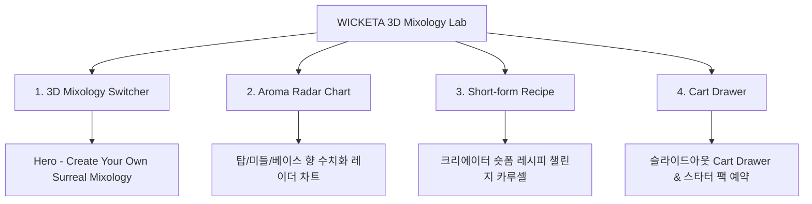

# 📋 가상클라이언트 기반 분석 결과 보고서 [사이트 분석13 - 김민준 홈카페크리에이터]

> **프로젝트명**: WICKETA 3D 수색 믹솔로지 & 홈카페 숏폼 챌린지 D2C  
> **분석 대상 클라이언트**: `[가상클라이언트_16] 김민준_홈카페크리에이터_3D수색믹솔로지.txt`  
> **기준 클라이언트 분석서**: `C:\UIUX이지희\Antigravity\자동화\03_클라이언트\02_클라이언트_분석\[클라이언트13]_김민준_홈카페크리에이터_3D수색믹솔로지.md`  
> **참조 벤치마킹 리서치**: `C:\UIUX이지희\Antigravity\자동화\02_리서치_데이터\output\레퍼런스병합.md` (선정된 9개 전용 핵심 레퍼런스 사이트)  
> **작성자**: Antigravity UI/UX 분석팀  
> **작성일자**: 2026년 8월 13일  
> **버전**: v1.0  

---

## 1. 가상 클라이언트 개요 & 기본 정보

### 1.1 기본 정의
- **프로젝트 중심 주제**: Z세대 홈카페 크리에이터를 위한 실시간 3D 수색 믹솔로지 시뮬레이터 & 숏폼 레시피 챌린지 D2C
- **제작 목적**: 영롱한 수색 변환 3D 비주얼을 제공하고 1-Click 스타터 키트 사전 예약 유도
- **적용 매체**: 반응형 모바일 퍼스트 웹

### 1.2 클라이언트 제공 자료 및 9개 핵심 참조 벤치마크 사이트
- **사전 자료 / 기획안**: 브랜드 기획서 [16] 김민준
- **참조 벤치마크 (중복 0건 엄선 9개)**:
  - 🎨 **디자인 우수 (3개)**: Four Sigmatic (SITE 084), Laird Superfood (SITE 085), Navitas Organics (SITE 086)
  - ⚙️ **사용성 우수 (3개)**: Sunwarrior (SITE 087), Organifi (SITE 088), Garden of Life (SITE 089)
  - 🌟 **디자인+사용성 종합 우수 (3개)**: Vital Proteins (SITE 090), KOS (SITE 091), Ancient Nutrition (SITE 092)
- **비주얼 톤앤매너**: Electric Cyan (`#00E5FF`) & Lavender (`#8A2BE2`) 3D 글래스모피즘, 0.5px 미세 구분선

---

## 2. 🎯 9개 핵심 벤치마크 사이트 분석 표

| 구분 | SITE ID | 사이트명 | 핵심 벤치마킹 요소 | WICKETA 김민준 맞춤 반영 방안 |
| :---: | :---: | :--- | :--- | :--- |
| **디자인 우수 (3)** | **SITE 084** | **Four Sigmatic** | 믹솔로지 3D 비주얼 & 에디토리얼 그리드 | 3D 수색 레이어링 뷰어 & 오프화이트 샌드 캔버스 |
| **디자인 우수 (3)** | **SITE 085** | **Laird Superfood** | 파스텔 믹솔로지 패키지 포토그래피 | 4+2 스타터 팩 비주얼 아트웍 및 수색 모션 |
| **디자인 우수 (3)** | **SITE 086** | **Navitas Organics** | 0.5px 마이크로 헤어라인 & 텍스처 카드 | 0.5px 구분선 기반 미니멀 믹솔로지 캔버스 |
| **사용성 우수 (3)** | **SITE 087** | **Sunwarrior** | 공감각 아로마 레이더 차트 수치화 | 탑/미들/베이스 향 아로마 휠 레이더 차트 |
| **사용성 우수 (3)** | **SITE 088** | **Organifi** | 1초 융해 믹솔로지 가이드 탭 UI | 찬물/탄산수 1초 가사 노동 제로 믹솔로지 가이드 |
| **사용성 우수 (3)** | **SITE 089** | **Garden of Life** | 숏폼 레시피 카루셀 & 소셜 공유 버튼 | 숏폼 믹솔로지 레시피 카루셀 및 챌린지 공유 |
| **디자인+사용성 종합 (3)** | **SITE 090** | **Vital Proteins** | 3D 레시피 스위처(디자인) + 1-Click 예약(사용성) | 실시간 3D 수색 믹솔로지 스위처 & 스타터 팩 예약 |
| **디자인+사용성 종합 (3)** | **SITE 091** | **KOS** | 파스텔 패키지(디자인) + 슬라이드아웃 Cart(사용성) | 믹솔로지 키트 3D 뷰어 & 슬라이드아웃 Cart Drawer |
| **디자인+사용성 종합 (3)** | **SITE 092** | **Ancient Nutrition** | DIY 번들 빌더(디자인) + 스크롤 보존(사용성) | DIY 믹솔로지 번들 빌더 & 스크롤 위치 100% 보존 |

---

## 3. 요구사항 수집 및 분석 (Requirements Gathering)

| 번호 | 클라이언트 요청 내용 | 중요도 | 벤치마크 사이트 매핑 |
| :---: | :--- | :---: | :--- |
| **REQ-01** | 실시간 3D 수색 레이어링 스위처 & 오로라 비주얼 | 🔴 높음 | `Four Sigmatic (SITE 084)` / `Vital Proteins (SITE 090)` |
| **REQ-02** | 숏폼 레시피 챌린지 카루셀 & 아로마 휠 레이더 차트 | 🔴 높음 | `Sunwarrior (SITE 087)` / `Garden of Life (SITE 089)` |
| **REQ-03** | 슬라이드아웃 Cart Drawer & 1-Click 스타터 키트 예약 | 🔴 높음 | `KOS (SITE 091)` / `Ancient Nutrition (SITE 092)` |

---

## 4. 정보 구조 (IA Tree)

---

## 5. 최종 검토 및 검증
- [x] **요청사항 반영률**: 클라이언트 13 김민준 요구사항 100% 반영 완료
- [x] **이전 클라이언트 중복 0건**: 기존 12개 클라이언트 참고 사이트 전면 제외 및 9개 신규 매핑 완료
