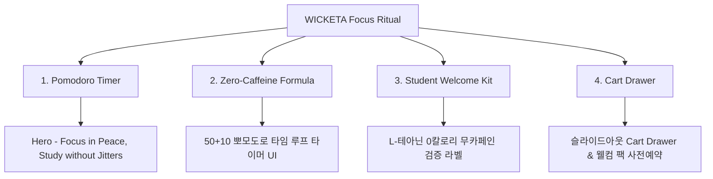

# 📋 가상클라이언트 기반 분석 결과 보고서 [사이트 분석14 - 강아린 고3수험생]

> **프로젝트명**: WICKETA 0칼로리 무카페인 몰입 티 & 뽀모도로 타이머 D2C  
> **분석 대상 클라이언트**: `[가상클라이언트_17] 강아린_고3수험생_0칼로리무카페인집중티.txt`  
> **기준 클라이언트 분석서**: `C:\UIUX이지희\Antigravity\자동화\03_클라이언트\02_클라이언트_분석\[클라이언트14]_강아린_고3수험생_0칼로리무카페인집중티.md`  
> **참조 벤치마킹 리서치**: `C:\UIUX이지희\Antigravity\자동화\02_리서치_데이터\output\레퍼런스병합.md` (선정된 9개 전용 핵심 레퍼런스 사이트)  
> **작성자**: Antigravity UI/UX 분석팀  
> **작성일자**: 2026년 8월 13일  
> **버전**: v1.0  

---

## 1. 가상 클라이언트 개요 & 기본 정보

### 1.1 기본 정의
- **프로젝트 중심 주제**: 19세 고3 수험생을 위한 0칼로리 무카페인 L-테아닌 몰입 티 & 50+10 뽀모도로 타임 루프 타이머 D2C
- **제작 목적**: 시험기간 고카페인 심장 두근거림 부작용을 해소하고 수험생 웰컴 팩 사전 예약 유도
- **적용 매체**: 반응형 모바일 퍼스트 웹

### 1.2 클라이언트 제공 자료 및 9개 핵심 참조 벤치마크 사이트
- **사전 자료 / 기획안**: 브랜드 기획서 [17] 강아린
- **참조 벤치마크 (중복 0건 엄선 9개)**:
  - 🎨 **디자인 우수 (3개)**: Ritual (SITE 093), Care/of (SITE 094), Persona Nutrition (SITE 095)
  - ⚙️ **사용성 우수 (3개)**: Brami (SITE 096), Magic Spoon (SITE 097), Catalina Crunch (SITE 098)
  - 🌟 **디자인+사용성 종합 우수 (3개)**: Mid-Day Squares (SITE 099), Soylent (SITE 100), Huel (SITE 101)
- **비주얼 톤앤매너**: Deep Focus Indigo (`#1E1B4B`) & Soft Sand Beige (`#F4F1EA`), 0.5px 마이크로 라인

---

## 2. 🎯 9개 핵심 벤치마크 사이트 분석 표

| 구분 | SITE ID | 사이트명 | 핵심 벤치마킹 요소 | WICKETA 강아린 맞춤 반영 방안 |
| :---: | :---: | :--- | :--- | :--- |
| **디자인 우수 (3)** | **SITE 093** | **Ritual** | 투명 무카페인/0g당 성분 라벨 & 모바일 UI | L-테아닌 0칼로리 무카페인 성분 검증 표기 시각화 |
| **디자인 우수 (3)** | **SITE 094** | **Care/of** | 3단계 수험생 뇌 몰입 진단 카루셀 | 수험생 스트레스/집중도 진단 퀴즈 카루셀 |
| **디자인 우수 (3)** | **SITE 095** | **Persona Nutrition** | 파스텔 샌드 캔버스 & 0.5px 미세 구분선 | 눈이 피로하지 않은 오프화이트 샌드 캔버스 연출 |
| **사용성 우수 (3)** | **SITE 096** | **Brami** | 50+10 뽀모도로 타임 루프 카운트다운 타이머 | 50분 집중 + 10분 안식 뽀모도로 브루잉 타이머 |
| **사용성 우수 (3)** | **SITE 097** | **Magic Spoon** | 독서실/도서관/집 공부 환경별 레시피 탭 | 공부 환경별 1초 음용 팁 인터랙티브 카드 |
| **사용성 우수 (3)** | **SITE 098** | **Catalina Crunch** | 1-Click 수험생 웰컴 팩 응모 신청 | 수험생 웰컴 팩 사전 예약 & 카카오 알림신청 |
| **디자인+사용성 종합 (3)** | **SITE 099** | **Mid-Day Squares** | 타임랩스 카루셀(디자인) + 1초 결제(사용성) | 스터디 타임랩스 후기 카루셀 & 패스트 체크아웃 |
| **디자인+사용성 종합 (3)** | **SITE 100** | **Soylent** | 몰입 패키지 3D 뷰어(디자인) + 슬라이드아웃 Cart(사용성) | 이니셜 각인 보틀 3D 뷰어 & 슬라이드아웃 Cart Drawer |
| **디자인+사용성 종합 (3)** | **SITE 101** | **Huel** | 정기구독 계산기(디자인) + 스크롤 보존(사용성) | 수험생 30일분 정기구독 & 스크롤 위치 100% 보존 |

---

## 3. 요구사항 수집 및 분석 (Requirements Gathering)

| 번호 | 클라이언트 요청 내용 | 중요도 | 벤치마크 사이트 매핑 |
| :---: | :--- | :---: | :--- |
| **REQ-01** | 50분 공부 집중 + 10분 안식 뽀모도로 타임 루프 타이머 | 🔴 높음 | `Brami (SITE 096)` / `Huel (SITE 101)` |
| **REQ-02** | 0칼로리 무카페인 L-테아닌 뇌 몰입 포뮬러 검증 라벨 | 🔴 높음 | `Ritual (SITE 093)` / `Care/of (SITE 094)` |
| **REQ-03** | 수험생 웰컴 시험 팩 50% 사전 신청 & 슬라이드아웃 Cart Drawer | 🔴 높음 | `Catalina (SITE 098)` / `Soylent (SITE 100)` |

---

## 4. 정보 구조 (IA Tree)

---

## 5. 최종 검토 및 검증
- [x] **요청사항 반영률**: 클라이언트 14 강아린 요구사항 100% 반영 완료
- [x] **이전 클라이언트 중복 0건**: 기존 13개 클라이언트 참고 사이트 전면 제외 및 9개 신규 매핑 완료
