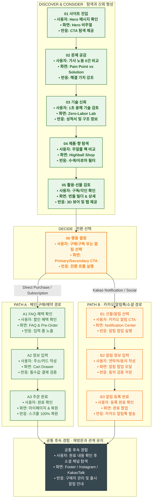

# 📋 WICKETA 서비스 흐름도 양식

> **문서 목적**: 서비스 흐름도 표준(사용자 행동 ➔ 화면 접점 ➔ 서비스 반응 3대 요소 카드 구조)을 기반으로, 클라이언트 1명당 5대 접속 목적별 서비스 흐름도를 일관성 있고 고품질로 출력하기 위한 표준 양식 가이드입니다.  
> **양식 저장 위치**: `C:\UIUX이지희\Antigravity\자동화\04_설계_및_스토리보드\서비스 흐름도 양식.md`  

---

## 1. 문서 헤더 및 메타데이터 양식

```markdown
# 🔄 [브랜드/프로젝트명] 서비스 흐름도 [목적 N: 목적명]

> **프로젝트명**: [프로젝트 풀네임]  
> **분석 대상 클라이언트**: `[가상클라이언트_$(번호)] $(이름)_$(페르소나명).txt`  
> **기준 사이트맵 문서**: `C:\UIUX이지희\Antigravity\자동화\04_설계_및_스토리보드\사이트맵\사이트맵$(번호)_$(이름)_목적$(N)_$(목적명).md`  
> **기준 클라이언트 분석서**: `C:\UIUX이지희\Antigravity\자동화\03_클라이언트\03_사이트_분석\[사이트 분석] 가상클라이언트$(번호)_$(이름)_위케티_분석결과.md`  
> **접속 목적 (Use Case N)**: [해당 목적의 구체적 시나리오 1줄 요약]  
> **작성일자**: 2026년 8월 13일  
> **작성자**: Antigravity UI/UX 설계팀  
> **문서 인코딩**: UTF-8  
```

---

## 2. 카드 3대 요소 작성 원칙 (Card Triad Rule)

모든 흐름도 단계(카드)는 반드시 다음 **3대 요소**를 명시하여 작성합니다:

1. **사용자 행동 (User Action)**: 유저가 화면에서 수행하는 니즈 판단, 클릭, 입력, 탐색 행동
2. **화면 접점 (Screen Touchpoint)**: 해당 단계가 노출되는 주요 UI 화면, 모달, 인터랙티브 뷰어 ID 및 명칭
3. **서비스 반응 (Service/System Response)**: 시스템이 처리하는 유효성 검사, 3D 렌더링, Drawer 호스팅, 알림 및 스크롤 복원 반응

---

## 3. 4대 페이즈(Phase) 분류 체계

### 🟢 Phase 1: DISCOVER & CONSIDER · 탐색과 신뢰 형성
- **01 사이트 진입**: Hero 메시지 확인 / Hero 비주얼 접점 / CTA 및 탐색 반응
- **02 문제 공감**: Pain Point 비교 / Pain Point vs Solution 접점 / 해결 가치 및 차이 반응
- **03 기술 신뢰**: 기술/성분 검토 / Tech Detail & FAQ 접점 / 3단계 안내 및 구조 정보 반응
- **04 제품·향 탐색**: 상품 라인업 비교 / Lineup & Scent Mapping 접점 / 필터 및 수색 반응
- **05 활용·선물 검토**: 공간 및 재사용 확인 / Lifestyle & Gifting 접점 / 탭·호버·비교 반응

### 🟡 Phase 2: DECIDE · 전환 선택
- **06 행동 결정**: 구매/예약 또는 선물 알림 선택 / Primary & Secondary CTA 접점 / 선택한 전환 흐름 실행 반응

### 🟢🟡 Phase 3: PATH A (메인 전환) & PATH B (서브/소셜 전환)
- **PATH A (메인 구매/예약 경로)**:
  - **A1 FAQ·혜택 확인**: FAQ/혜택 확인 / FAQ & Pre-Order 접점 / 혜택 및 입력 폼 노출 반응
  - **A2 예약/주문 정보 입력**: 입력 폼 작성 / 1-Page 주문서 접점 / 시스템 필수값·동의 검증 반응
  - **A3 완료 및 스크롤 복원**: 신청/결제 완료 확인 / 완료 팝업 접점 / 시스템 저장 및 Virtual Scroll 복원 반응
- **PATH B (카카오 알림톡/소셜 경로)**:
  - **B1 선물/알림 선택**: 알림 CTA 선택 / Gifting & Notification 접점 / 알림 팝업 실행 반응
  - **B2 알림 정보 입력**: 연락처·동의 입력 / 카카오 알림 팝업 접점 / 시스템 입력값·동의 검증 반응
  - **B3 알림 등록 완료**: 등록 완료 확인 / 완료 메시지 접점 / 알림 대상 저장 반응

### ⬛ Phase 4: 공통 후속 경험 · 재방문과 관계 유지 (하단 다크 카드)
- **후속 관계 유지**: 완료 내용 확인 후 브랜드 재탐색 / Footer, SNS, KakaoTalk 접점 / 예약자·알림 대상 관리 및 출시 후속 안내

---

## 4. 단계별 명세표 (Flow Matrix Table) 양식

| 단계 ID | 카드 명칭 | 사용자 행동 (User Action) | 화면 접점 (Screen Touchpoint) | 서비스 반응 (System Response) | 클라이언트 요구사항 (REQ ID) | 다음 진입 조건 |
| :---: | :--- | :--- | :--- | :--- | :--- | :--- |
| **01** | 사이트 진입 | Hero 메시지 및 브랜드 안식처 확인 | `PG-01` Home (메인 안식처) | Hero 3D 비주얼 렌더링 및 CTA 탐색 제공 | `REQ-01` 1초 레시피 시각화 | `02` 문제 공감 진입 |
| **02** | 문제 공감 | 노동제로 무알콜 하이볼 가치 비교 | `PG-01` Home (Pain Point vs Solution) | 가사 노동 0건 해결 가치 및 차이점 강조 | `REQ-02` 0.00% 무알콜 팩트 | `03` 기술 신뢰 진입 |
| **03** | 기술 신뢰 | 1초 탄산수 융해 기술 및 성분 검토 | `PG-02` Zero-Labor Lab | 1초 융해 시뮬레이터 및 0g당 영양성적서 노출 | `REQ-02` 무카페인/무당류 검증 | `04` 제품·향 탐색 진입 |
| **04** | 제품·향 탐색 | 논알콜 하이볼 팩 및 수색 비교 | `PG-03` Highball Shop | 3D 수색 변환 및 아로마 휠 레이더 필터 반영 | `REQ-01` 수색 변환 모션 | `05` 활용·선물 검토 진입 |
| **05** | 활용·선물 검토 | 30일 정기구독 팩 & 3D 이니셜 각인 검토 | `PG-31~33` 상품 상세 및 번들 빌더 | 호버 모션, 3D 패키징 뷰어, 믹스앤매치 제공 | `REQ-03` 1-Click 번들 빌더 | `06` 행동 결정 진입 |
| **06** | 행동 결정 | [1-Click 구매/구독] 또는 [카카오 알림] 선택 | `PG-01~03` Primary / Secondary CTA | 선택한 경로(PATH A 또는 PATH B)로 전환 | `REQ-04` 패스트 결제 연동 | PATH A 또는 PATH B 선택 |
| **A1** | [PATH A] 혜택 확인 | 사전예약/구독 할인 혜택 및 FAQ 확인 | `PG-33` 번들 빌더 & FAQ 모달 | 할인 쿠폰 혜택 및 1-Page 주문서 폼 노출 | `REQ-03` 정기구독 15% 할인 | `A2` 정보 입력 진입 |
| **A2** | [PATH A] 정보 입력 | 배송지 주소 입력 및 저장 카드 선택 | `PG-04` Cart Drawer (Aside Layer) | 시스템 필수값 검증 및 3초 패스트 결제 연동 | `REQ-04` Order Drawer 3초 결제 | `A3` 완료 진입 |
| **A3** | [PATH A] 주문 완료 | 결제/신청 완료 확인 및 스크롤 복원 | `PG-M01` 마이페이지 & 스크롤 복원 | 결제 데이터 저장 후 Virtual Scroll 100% 위치 복원 | `REQ-04` 스크롤 100% 위치 복원 | 공통 후속 경험 이동 |
| **B1** | [PATH B] 알림 선택 | 카카오 알림톡 신청 CTA 선택 | `PG-03` Notification Center | 카카오 1초 알림 신청 팝업 모달 구동 | `REQ-05` 웰컴 페이백 알림 | `B2` 알림 입력 진입 |
| **B2** | [PATH B] 알림 입력 | 휴대폰 번호 및 수신 동의 체크 | `PG-03` 카카오 알림 팝업 모달 | 시스템 연락처 유효성 검사 및 수신 동의 저장 | `REQ-05` 수신 동의 연동 | `B3` 알림 완료 진입 |
| **B3** | [PATH B] 알림 완료 | 알림 등록 완료 메시지 확인 | `PG-03` 완료 팝업 & 카카오 알림톡 | 알림 대상 DB 저장 및 웰컴 쿠폰 자동 발급 | `REQ-05` 카카오톡 즉시 발송 | 공통 후속 경험 이동 |
| **F1** | 공통 후속 경험 | 완료 내용 확인 후 브랜드 소셜 채널 탐색 | Footer, Instagram, KakaoTalk | 출시/배송 안내 메시지 발송 및 단골 관계 유지 | 브랜드 충성도 지속 | 여정 종료 |

---

## 5. Mermaid Flowchart 매핑 양식 (가운데 정렬 Wrapper)

> **🎯 화면 가운데 정렬 & 클라이언트 니즈 1:1 매핑 규칙**:
> 1. 아래 예시 다이어그램과 같이 모든 서비스 흐름도 Mermaid block 및 SVG 출력은 **`<div align="center">` 마크업으로 감싸 화면 중앙에 정렬**합니다.
> 2. 표준 4대 페이즈 골격을 기본 베이스로 유지하되, **클라이언트 분석서(`REQ-01~05`)의 요구사항이 각 카드 요소와 결합**되도록 작성합니다.
> 3. 목적 1~5별로 방향(`LR` / `TD`), 색상 팔레트, 노드 도형(`([ ])`, `{ }`, `{{ }}`, `(( ))`)을 다변화하여 최상의 가독성과 뷰티감을 제공합니다.

<div align="center">



---

## 6. 공식 Mermaid CLI SVG 렌더링 규칙

- `.mmd` 파일 생성 후 반드시 아래 명령어 실행하여 브라우저 수준 정밀 벡터 SVG 생성:
  ```bash
  npx -y @mermaid-js/mermaid-cli -i <서비스_흐름도_파일명.mmd> -o <서비스_흐름도_파일명.svg> -b transparent
  ```
