# 🗺️ 가상클라이언트 (서지안 - 육아대디) 사이트맵 설계 보고서 [목적 1: 브랜딩/탐색 모드]

> **프로젝트명**: WICKETA 노동 제로 1초 컷 논알콜 하이볼 & 육퇴 안식처 D2C 자사몰  
> **분석 대상 클라이언트**: `[가상클라이언트_15] 서지안_P8육아대디_노동제로논알콜하이볼.txt`  
> **기준 레퍼런스 분석서**: `[클라이언트12]_서지안_P8육아대디_노동제로논알콜하이볼.md`  
> **접속 목적 (Use Case 1)**: 38세 야근 직장인/육아대디의 노동 제로 1초 탄산수 컷 논알콜 하이볼 믹솔로지 및 0kcal 육퇴 안식처 탐색  
> **작성일자**: 2026년 8월 14일  
> **작성자**: Antigravity UI/UX 설계팀  
> **문서 인코딩**: UTF-8  

---

## 1. 프로젝트 개요

설거지와 준비 과정 등 번거로운 노동을 완전히 배제하고, 밤 10시 육아 퇴근 후 탄산수 캔을 따서 스틱 1포를 넣는 것만으로 1초 만에 완성되는 0kcal 논알콜 하이볼/스파클링 전용 사이트맵입니다. 38세 육아대디 서지안의 현실적 니즈를 반영하여 **노동 제로 1초 탄산수 컷 믹솔로지 쇼케이스**, **0kcal/0sugar/무숙취 검증표**, **하이볼 글래스 룩북**, **3초 슬라이드아웃 Cart Drawer**를 구축했습니다.

---

## 2. 계층형 사이트맵

```text
WICKETA Zero-Labor Non-Alcohol Highball Sanctuary 구축
├── [공통 영역] GNB Sticky Header / LNB Highball Switcher / Footer / Aside Cart Drawer
├── [L1-01] 1. Home (육퇴 안식처 메인 PG-01)
├── [L1-02] 2. 1-Sec Highball Lab (1초 논알콜 하이볼 랩 PG-02)
├── [L1-03] 3. Non-Alcohol Archive (0kcal 논알콜 도감 PG-03)
├── [L1-04] 4. Cart Drawer (3초 패스트 결제 PG-04)
├── [회원 상태별 영역]
│   ├── [회원] 육퇴 리추얼 주기 관리 및 30일 팩 정기구독 (마이페이지)
│   └── [비회원] 육퇴 하이볼 레시피 카드 무료 다운로드 (가정)
├── [주요 사용자 여정]
│   └── Hero 메인 → 1초 하이볼 시뮬레이터 → 논알콜 도감 확인 → 3초 Cart Drawer → 주문 완료
└── [예외 페이지]
    ├── [EXP-01] 404 Page Not Found (메인 안내 - 가정)
    ├── [EXP-02] 하이볼 스타터 패키지 품절 모달 (재입고 알림 - 가정)
    └── [EXP-03] 결제 네트워크 오류 안내 (Cart Drawer 임시 저장 - 가정)
```

---

## 3. Mermaid Flowchart 사이트맵

```mermaid
flowchart TD
    classDef main fill:#1F2937,stroke:#111827,stroke-width:2px,color:#FFFFFF,font-weight:bold;
    classDef sub fill:#374151,stroke:#1F2937,stroke-width:2px,color:#FFFFFF,font-weight:bold;
    classDef drawer fill:#E5E7EB,stroke:#374151,stroke-width:2px,color:#1F2937,font-weight:bold;
    classDef common fill:#F9FAFB,stroke:#1F2937,stroke-width:1px,color:#1F2937;
    classDef member fill:#FFF3E0,stroke:#E65100,stroke-width:1.5px,color:#E65100,stroke-dasharray: 5 5;
    classDef exception fill:#FFEBEE,stroke:#C62828,stroke-width:1.5px,color:#C62828,stroke-dasharray: 3 3;

    Root["WICKETA Non-Alcohol Highball (가상클라이언트12 서지안)"]
    M1["1. Home 육퇴 안식처 메인 (PG-01)"]
    M2["2. 1-Sec Highball Lab 1초 하이볼 (PG-02)"]
    M3["3. Non-Alcohol Archive 논알콜 도감 (PG-03)"]
    M4["4. Cart Drawer 육퇴 결제 (PG-04 Aside Layer)"]

    Root --> M1
    Root --> M2
    Root --> M3
    Root --> M4

    M1_1["Hero Section (설거지 제로, 1초 탄산수 논알콜 하이볼)"]
    M1_2["Night Escape Story (육퇴 후 나만의 안식 에세이)"]
    M1_3["Highball Glass Lookbook (얼음 탄산 거품 화보)"]
    M1_4["0kcal Zero Hangover Checklist (무숙취 성분 검증표)"]

    M1 --> M1_1
    M1 --> M1_2
    M1 --> M1_3
    M1 --> M1_4

    M2_1["1초 탄산수 융해 하이볼 시뮬레이터 (PG-31)"]
    M2_2["스모키 얼그레이 vs 진저 레몬 플레이버 스위처"]

    M2 --> M2_1
    M2 --> M2_2

    M2_1_1["스틱 1포 투입 탄산 버블 3D 렌더러"]
    M2_1_2["알코올 0.00% & 당류 0g 수치 차트"]

    M2_1 --> M2_1_1
    M2_1 --> M2_1_2

    M2_2_1["위스키 오크향 무알콜 블렌딩 스펙"]
    M2_2_2["육퇴 30일 혼술 팩 1-Click 담기"]

    M2_2 --> M2_2_1
    M2_2 --> M2_2_2

    M3_1["4종 논알콜 스파클링 아카이브 (PG-32)"]
    M3_2["이중 유리 하이볼 전용 글래스 쇼케이스"]
    M3_3["육아대디 육퇴 응원 키트 신청 (PG-33)"]

    M3 --> M3_1
    M3 --> M3_2
    M3 --> M3_3

    M3_1_1["탄산 유지력 및 청량감 테이스팅 노트"]
    M3_2_1["결로 방지 더블월 글래스 제원표"]

    M3_1 --> M3_1_1
    M3_2 --> M3_2_1

    M4_1["슬라이드아웃 Cart Drawer (육퇴 처방 주문서)"]
    M4_2["Virtual Scroll 위치 보존 (탐색 스크롤 100% 복원)"]

    M4 --> M4_1
    M4 --> M4_2

    MEM1["[회원 영역] 정기구독 & 배송일 관리 (PG-M01 마이페이지)"]
    GUEST1["[비회원 영역] 논알콜 레시피 카드 다운로드 (가정)"]

    M4 -.-> MEM1
    M4 -.-> GUEST1

    EXP1["[EXP-01] 404 Page Not Found (메인 안내 - 가정)"]
    EXP2["[EXP-02] 하이볼 글래스 품절 안내 모달 (가정)"]
    EXP3["[EXP-03] 결제 오류 장바구니 복원 안내 (가정)"]

    Root -.-> EXP1
    M2_1 -.-> EXP2
    M4_1 -.-> EXP3

    class Root,M1 main;
    class M2,M3 sub;
    class M4,M4_1,M4_2 drawer;
    class M1_1,M1_2,M1_3,M1_4,M2_1,M2_2,M2_1_1,M2_1_2,M2_2_1,M2_2_2,M3_1,M3_2,M3_3,M3_1_1,M3_2_1 common;
    class MEM1,GUEST1 member;
    class EXP1,EXP2,EXP3 exception;
```


