# 🗺️ 가상클라이언트2 (윤기준 - P7 개발팀장) WICKETA 사이트맵 설계 보고서

> **프로젝트명**: WICKETA High-End Zero Defect 0% Error Precision Brewing 웹사이트 구축  
> **분석 대상 클라이언트**: `[가상클라이언트_14] 윤기준_P7개발팀장_정밀브루잉타이머.txt`  
> **기준 레퍼런스 분석서**: `[사이트 분석] 가상클라이언트2_윤기준_위케티_분석결과.md`  
> **작성일자**: 2026년 8월 7일  
> **작성자**: Antigravity UI/UX 설계팀  
> **문서 인코딩**: UTF-8  

---

## 1. 프로젝트 개요

오차 0%의 초 단위 정밀 우림 가이드와 공인 위생 검증(Zero Defect)을 요구하는 하이엔드 완벽주의자 브랜드 WICKETA 자사몰 사이트맵입니다. 타깃 페르소나 윤기준의 요구사항을 반영하여 **3클릭 이내 목표 도달 구조**와 **3초 슬라이드아웃 Cart Drawer**, **탐색 스크롤 위치 100% 보존 모듈**을 핵심으로 설계되었습니다.

---

## 2. 설계 근거와 핵심 사용자 목표

### 2.1 설계 근거 (Design Principles)
1. **[원칙 1 - Priority #1 Killer Feature]**: 클라이언트 고유 킬러 기능인 **`비주얼 아로마 휠 3D 레이더 차트`**을 메인 화면(PG-01) Hero Section 최상단 및 GNB 첫 번째 메뉴로 전면 배치하여 사용자 진입 1.0초 내 시각화 및 인터랙션 실행.
1. 0% 오차 정밀 우림 (Zero Defect Brewing): 물 온도(85℃/100℃), 물 양(250ml), 180초 초 단위 타이머 시각화
2. 수치화 아로마 휠 (Quantitative Aroma Radar): 단맛, 쓴맛, 바디감, 향 노트를 정밀 수치화한 SVG 레이더 차트 표기
3. 공인 위생/품질 디지털 뷰어: 농약 미검출, 위생 검증, 대체당 안전성 시험 성적서 원본 디지털 모달 연동
4. Precision Charcoal & Metallic Platinum UI: 건축 도면 스타일의 0.5px 미세 구분선 테크 에디토리얼 레이아웃

### 2.2 핵심 사용자 목표 (User Goals)
- **목표 1 (최우선 P1)**: 진입 1.0초 이내에 **`비주얼 아로마 휠 3D 레이더 차트`** 모듈을 실행하여 핵심 브랜드 가치를 체감한다.
목표 1: 180초 초 단위 카운트다운 타이머와 85℃/100℃ 정밀 물 온도 배합 가이드 즉시 실행
목표 2: 단맛/쓴맛/바디감 수치 데이터 레이더 차트와 Zero Defect 검증서 원본 확인
목표 3: 찻잎 산화 방지 하이엔드 밀폐 수밀 틴케이스를 1-Click으로 사전 주문하고 스크롤 위치 보존

---

## 3. 전역 내비게이션 구조 (Global Navigation Structure)

- **GNB (Global Navigation Bar - 스티키 플로팅)**:
  - **GNB 1순위 메뉴**: 브랜드 로고 / **`비주얼 아로마 휠 3D 레이더 차트` [1순위 메인 탭]** / 카테고리 룩북 / Cart Drawer
  - GNB: 브랜드 로고 / 정밀 과학 (Precision Science) / 상점 (High-End Tea) / Order Drawer 버튼
- **LNB (Local Navigation Bar - 무드 스위처 탭)**:
  - LNB: [정밀 브루잉 타이머 모드] vs [Zero Defect 검증서 모드]
- **Footer (전역 하단 공통 영역)**:
  - WONDERSCAPE 기업 및 브랜드 정보
  - 팩트 검증표 및 고객센터 / 이용약관 / 개인정보처리방침
- **Aside Layer (우측 플로팅 레이어)**:
  - 3초 슬라이드아웃 Cart Drawer & 스크롤 위치 100% 보존 모듈

---

## 4. 계층형 사이트맵 (1차 / 2차 / 3차 깊이)

```text
WICKETA High-End Zero Defect 0% Error Precision Brewing 웹사이트 구축
├── [공통 영역] GNB Sticky Header / LNB Mood Switcher / Footer / Aside Cart Drawer
├── [L1-01] 1. Home (메인)
├── [L1-02] 2. Sub Category 1 (핵심 모듈)
├── [L1-03] 3. Sub Category 2 (상점 및 룩북)
├── [L1-04] 4. Cart & Checkout (3초 패스트 결제 - Aside Drawer)
├── [회원 상태별 영역]
│   ├── [회원] 저장 결제수단 1-Click 연동 및 마이페이지
│   └── [비회원] 휴대폰 간편 인증 및 할인 쿠폰 발급 (가정)
├── [주요 사용자 여정]
│   └── Hero 메인 → 핵심 모듈/진단 → 상품 큐레이션 → 3초 Cart Drawer → 결제 완료 및 스크롤 복원
└── [예외 페이지]
    ├── [EXP-01] 404 Page Not Found (메인 안내 - 가정)
    ├── [EXP-02] 서비스 안내 모달 (재입고/알림 - 가정)
    └── [EXP-03] 결제 네트워크 오류 안내 (Cart Drawer 임시 저장 - 가정)
```

---

## 5. 페이지별 상세 명세표

| 페이지 ID | 페이지명 | 깊이 | 페이지 목적 | 핵심 콘텐츠 | 주요 기능 | 연결 페이지 | 상태/비고 |
| :---: | :--- | :---: | :--- | :--- | :--- | :--- | :--- |
| **PG-01** | PG-01 Hero (신유진) | 1차 | 브랜드 비전 & 킬러 기능 전면 배치 | Hero 비주얼, `비주얼 아로마 휠 3D 레이더 차트` 모듈 | 1.0초 인터랙티브 실행, 0.5px 그리드 | PG-02, PG-03, PG-04 | ⭐ [킬러 기능 1순위 전면 배치: 비주얼 아로마 휠 3D 레이더 차트] 🔴 최우선(P1) |
| **PG-01A** | Home (정밀 메인) | 1차 | 0% 오차 우림 가이드 & Zero Defect 브랜드 비전 전달 | Hero 비주얼 에세이, 180초 타이머, 수치 아로마 레이더 | 0.5px 미세 구분선 그리드, 데이터 스위처 | PG-02, PG-03, PG-04 | 공통 |
| **PG-02** | Precision Science | 1차 | 과학적 찻잎 우림 데이터 및 공인 검증서 제공 | 85℃/100℃ 물 배합 가이드, 품질 검증서 디지털 원본 | 추출 성분 시뮬레이터, 검증서 모달 뷰어 | PG-01, PG-03 | 공통 |
| **PG-03** | High-End Tea | 1차 | 수밀 틴케이스 싱글팩 및 정밀 브루잉 세트 상점 | 수밀 틴케이스 패키지, 타이머 세트 비주얼 | 3D 산화 방지 뷰어, 사전 주문 빌더 | PG-01, PG-04 | 공통 |
| **PG-04** | Order Drawer | Aside | 화면 전환 없는 수밀 틴케이스 1-Click 패스트 결제 | 1-Page 처방전 스타일 주문서, 배송/결제 정보 | 1-Click Fast Checkout, Virtual Scroll 스크롤 보존 | PG-01, PG-03 | 공통/레이어 |
| **PG-31** | 수밀 틴케이스 상세 | 2차 | 산화 방지 수밀 틴케이스 구조 및 하이엔드 용기 안내 | 수밀 틴케이스 3D 구조도, 보관 일수 카운트다운 | 3D 패키징 뷰어, 수밀 테스트 비디오 | PG-03, PG-04 | 공통 |
| **PG-32** | 정밀 타이머 세트 | 2차 | 초 단위 카운트다운 타이머 및 앰비언트 sound 세트 | 정밀 타이머 디바이스 스펙, 앰비언트 sound | 타이머 동기화 테스트, 1-Click 담기 | PG-03, PG-04 | 공통 |
| **PG-33** | 사전 주문 빌더 | 2차 | 틴케이스 패키지 및 100% 안심 페이백 사전 예약 | 페이백 혜택 안내표, 사전 예약 수량 선택기 | 100% 페이백 쿠폰 자동 적용, 정기구독 연동 | PG-03, PG-04 | 공통 |
| **PG-M01** | 마이페이지 (MY) | 2차 | 회원 정기구독 현황 및 품질 검증서 이력 관리 | 정기구독 주기, 저장된 주소/결제카드 | 1-Click 배송지 수정, 검증서 PDF 다운로드 | PG-01, PG-04 | 회원 전용 |
| **EXP-01** | 404 예외 페이지 | 예외 | 잘못된 경로 접속 시 정밀 메인 안내 | 404 안내 문구, 정밀 메인 이동 버튼 | 메인 1-Click 리다이렉션 | PG-01 | 예외 (가정) |
| **EXP-02** | 틴케이스 품절 모달 | 예외 | 수밀 틴케이스 한정수량 품절 시 재입고 알림 신청 | 품절 안내 메시지, 재입고 알림 신청 폼 | 알림 신청, 대체 타이머 세트 추천 | PG-03, PG-04 | 예외 (가정) |
| **EXP-03** | 데이터 연동 오류 | 예외 | 타이머/결제 연동 에러 발생 시 임시 저장 | 오류 메시지, 데이터 재시도 버튼 | Order Drawer 상태 복원, 임시 저장 | PG-04 | 예외 (가정) |

---

## 6. Mermaid Flowchart 사이트맵

```mermaid
flowchart TD
    classDef main fill:#1C2541,stroke:#0B132B,stroke-width:2px,color:#FFFFFF,font-weight:bold;
    classDef sub fill:#3A506B,stroke:#1C2541,stroke-width:2px,color:#FFFFFF,font-weight:bold;
    classDef drawer fill:#E0F7FA,stroke:#3A506B,stroke-width:2px,color:#1C2541,font-weight:bold;
    classDef common fill:#F8F9FA,stroke:#1C2541,stroke-width:1px,color:#1C2541;
    classDef member fill:#FFF3E0,stroke:#E65100,stroke-width:1.5px,color:#E65100,stroke-dasharray: 5 5;
    classDef exception fill:#FFEBEE,stroke:#C62828,stroke-width:1.5px,color:#C62828,stroke-dasharray: 3 3;

    Root["WICKETA Precision Brewing (가상클라이언트2 윤기준)"]
    M1["1. Home 정밀 메인 (PG-01)"]
    M2["2. Precision Science 가이드 (PG-02)"]
    M3["3. High-End Tea 상점 (PG-03)"]
    M4["4. Order Drawer 결제 Drawer (PG-04 Aside Layer)"]

    Root --> M1
    Root --> M2
    Root --> M3
    Root --> M4

    M1_1["Hero Section (Zero Defect 0% Error Precision)"]
    M1_2["180s Countdown Timer (초 단위 정밀 타이머 모듈)"]
    M1_3["Quantitative Aroma Wheel (수치화 아로마 레이더 차트)"]
    M1_4["Zero Defect Audit Fact (공인 위생/품질 검증 표기)"]

    M1 --> M1_1
    M1 --> M1_2
    M1 --> M1_3
    M1 --> M1_4

    M2_1["85C 및 100C 물 배합 가이드 (Brewing Temperature Guide)"]
    M2_2["Zero Defect Quality Certificate (디지털 검증서 뷰어)"]

    M2 --> M2_1
    M2 --> M2_2

    M2_1_1["물 양 250ml 정밀 우림 계량표"]
    M2_1_2["찻잎 산화율 0% 유지 시뮬레이터"]

    M2_1 --> M2_1_1
    M2_1 --> M2_1_2

    M2_2_1["공인 위생/농약미검출 성적서 모달"]
    M2_2_2["대체당 안전성 영양 분석서"]

    M2_2 --> M2_2_1
    M2_2 --> M2_2_2

    M3_1["밀폐 수밀 틴케이스 팩 (PG-31)"]
    M3_2["정밀 브루잉 타이머 세트 (PG-32)"]
    M3_3["1-Click 틴케이스 예약 빌더 (PG-33)"]

    M3 --> M3_1
    M3 --> M3_2
    M3 --> M3_3

    M3_1_1["수밀 틴케이스 3D 산화 방지 뷰어"]
    M3_3_1["사전 주문 100% 안심 페이백 선택기"]

    M3_1 --> M3_1_1
    M3_3 --> M3_3_1

    M4_1["수밀 틴케이스 1-Click 간편 예약 (1-Page 처방전 주문서)"]
    M4_2["Virtual Scroll 위치 보존 (탐색 스크롤 100% 복원)"]

    M4 --> M4_1
    M4 --> M4_2

    MEM1["[회원 영역] 저장 결제수단 1-Click 연동 (PG-M01 마이페이지)"]
    GUEST1["[비회원 영역] 휴대폰 간편 인증 주문 (품질 검증서 다운로드 - 가정)"]

    M4 -.-> MEM1
    M4 -.-> GUEST1

    EXP1["[EXP-01] 404 Page Not Found (정밀 메인 안내 - 가정)"]
    EXP2["[EXP-02] 틴케이스 한정수량 품절 모달 (재입고 알림 신청 - 가정)"]
    EXP3["[EXP-03] 타이머 데이터 연동 오류 안내 (Cart Drawer 임시 저장 - 가정)"]

    Root -.-> EXP1
    M3_1 -.-> EXP2
    M4_1 -.-> EXP3

    class Root,M1 main;
    class M2,M3 sub;
    class M4,M4_1,M4_2 drawer;
    class M1_1,M1_2,M1_3,M1_4,M2_1,M2_2,M2_1_1,M2_1_2,M2_2_1,M2_2_2,M3_1,M3_2,M3_3,M3_1_1,M3_3_1 common;
    class MEM1,GUEST1 member;
    class EXP1,EXP2,EXP3 exception;

```



---

## 7. 최종 검토 및 품질 확인

- [x] **1차, 2차, 3차 깊이 구분의 명확성**: L1(1차), L2(2차), L3(3차) 깊이 체계적 분류 완료
- [x] **영역별 분류**: 공통 영역, 회원/비회원 상태별 영역, 주요 사용자 여정, 예외 페이지(EXP-01~03) 명확히 구분
- [x] **미확인 사실 가정 표기**: 비회원 혜택, 품절 모달, 네트워크 오류 복구 항목에 `가정` 명시
- [x] **링크 및 중복 검토**: 모든 페이지가 PG-01~04로 정상 연결되며 중복 페이지 0건 확인
