# 🗺️ 가상클라이언트 (윤기준 - IT 개발팀장) 사이트맵 설계 보고서 [목적 3: 커스텀/선물 모드]

> **프로젝트명**: WICKETA 스마트 온도 제어 텀블러 3D 각인 & 개발자 데스크 팩 구축  
> **분석 대상 클라이언트**: `[가상클라이언트_14] 윤기준_P7개발팀장_정밀브루잉타이머.txt`  
> **기준 레퍼런스 분석서**: `[클라이언트11]_윤기준_P7개발팀장_정밀브루잉타이머.md`  
> **접속 목적 (Use Case 3)**: 실시간 수온 유지 스마트 텀블러에 개발자 닉네임/깃허브 ID 3D 레이저 각인 및 선물 키트 신청  
> **작성일자**: 2026년 8월 14일  
> **작성자**: Antigravity UI/UX 설계팀  
> **문서 인코딩**: UTF-8  

---

## 1. 프로젝트 개요

밤샘 코딩과 집중 업무를 수행하는 동료 개발자에게 최적의 음용 수온(65℃~85℃)을 유지해주는 스마트 텀블러와 무카페인 뇌 피로 회복 티를 선물할 수 있도록 설계된 개발자 커스텀 기프팅 사이트맵입니다. 36세 백엔드 개발팀장 윤기준의 테크 감성을 반영하여 **스마트 텀블러 3D 깃허브 ID/코드 레이저 각인 시뮬레이터**, **야간 디버깅 무카페인 티 4종 번들 빌더**, **터미널 콘솔 스타일 모바일 메시지 카드 폼 및 Fast Drawer 결제**를 통합 구축했습니다.

---

## 2. 계층형 사이트맵

```text
WICKETA Developer's Tech Gift Studio 구축
├── [공통 영역] GNB Sticky Header / LNB Parameter Switcher / Footer / Aside Cart Drawer
├── [L1-01] 1. Home (선물 메인 PG-01)
├── [L1-02] 2. Custom Studio (3D 스마트 텀블러 각인 PG-02)
├── [L1-03] 3. Dev Gift Showcase (개발자 팩 선물관 PG-03)
├── [L1-04] 4. Gift Drawer (3초 선물 결제 PG-04)
├── [회원 상태별 영역]
│   ├── [회원] 저장된 텀블러 각인 코드 템플릿 관리 (마이페이지)
│   └── [비회원] 터미널 콘솔 모바일 카드 무료 발급 (가정)
├── [주요 사용자 여정]
│   └── Hero 메인 → 3D 텀블러 각인 → 개발자 번들 구성 → 3초 Gift Drawer → 선물 결제 완료
└── [예외 페이지]
    ├── [EXP-01] 404 Page Not Found (메인 안내 - 가정)
    ├── [EXP-02] 스마트 텀블러 한정 수량 품절 모달 (재입고 알림 - 가정)
    └── [EXP-03] 각인 글자수 초과 에러 모달 (가정)
```

---

## 3. Mermaid Flowchart 사이트맵

```mermaid
flowchart TD
    classDef main fill:#1B2A32,stroke:#0F181D,stroke-width:2px,color:#FFFFFF,font-weight:bold;
    classDef sub fill:#37474F,stroke:#1B2A32,stroke-width:2px,color:#FFFFFF,font-weight:bold;
    classDef drawer fill:#ECEFF1,stroke:#37474F,stroke-width:2px,color:#1B2A32,font-weight:bold;
    classDef common fill:#F5F7F8,stroke:#1B2A32,stroke-width:1px,color:#1B2A32;
    classDef member fill:#FFF3E0,stroke:#E65100,stroke-width:1.5px,color:#E65100,stroke-dasharray: 5 5;
    classDef exception fill:#FFEBEE,stroke:#C62828,stroke-width:1.5px,color:#C62828,stroke-dasharray: 3 3;

    Root["WICKETA Dev Tech Gift (가상클라이언트11 윤기준)"]
    M1["1. Home 개발자 선물 메인 (PG-01)"]
    M2["2. Custom Studio 3D 텀블러 각인 (PG-02)"]
    M3["3. Dev Gift Showcase 개발자 팩 (PG-03)"]
    M4["4. Gift Drawer 테크 결제 (PG-04 Aside Layer)"]

    Root --> M1
    Root --> M2
    Root --> M3
    Root --> M4

    M1_1["Hero Section (개발자의 집중을 지켜주는 스마트 텀블러)"]
    M1_2["3D Smart Tumbler Preview (3D 렌더러)"]
    M1_3["Night Debugging Tea Bundle (무카페인 4종 세트)"]
    M1_4["Hardware Reliability Checklist (온도 센서 검증서)"]

    M1 --> M1_1
    M1 --> M1_2
    M1 --> M1_3
    M1 --> M1_4

    M2_1["실시간 3D 텀블러 레이저 각인기 (PG-31)"]
    M2_2["매트 블랙 / 스페이스 그레이 메탈 스위처"]

    M2 --> M2_1
    M2 --> M2_2

    M2_1_1["모노스페이스 코딩 폰트 3종 시뮬레이션"]
    M2_1_2["정밀 티타늄 레이저 미세 각인 스펙"]

    M2_1 --> M2_1_1
    M2_1 --> M2_1_2

    M2_2_1["스마트 LED 수온 디스플레이 3D 뷰어"]
    M2_2_2["자석 부착형 티 인퓨저 세트 뷰어"]

    M2_2 --> M2_2_1
    M2_2 --> M2_2_2

    M3_1["야간 디버깅/집중 무카페인 번들 빌더 (PG-32)"]
    M3_2["터미널 CLI 콘솔 스타일 모바일 카드 폼 (PG-33)"]
    M3_3["1-Click 카카오 선물하기 연동"]

    M3 --> M3_1
    M3 --> M3_2
    M3 --> M3_3

    M3_1_1["테아닌 고함량 뇌 피로 회복 스틱 팩"]
    M3_2_1["다크모드 코드 블록 메시지 템플릿"]

    M3_1 --> M3_1_1
    M3_2 --> M3_2_1

    M4_1["3초 슬라이드아웃 Gift Cart Drawer (선물 주문서)"]
    M4_2["Virtual Scroll 위치 보존 (탐색 스크롤 100% 복원)"]

    M4 --> M4_1
    M4 --> M4_2

    MEM1["[회원 영역] 저장된 각인 코드 (PG-M01 마이페이지)"]
    GUEST1["[비회원 영역] CLI 콘솔 모바일 카드 발급 (가정)"]

    M4 -.-> MEM1
    M4 -.-> GUEST1

    EXP1["[EXP-01] 404 Page Not Found (메인 안내 - 가정)"]
    EXP2["[EXP-02] 스마트 텀블러 품절 안내 모달 (가정)"]
    EXP3["[EXP-03] 각인 글자수 초과 에러 모달 (가정)"]

    Root -.-> EXP1
    M2_1 -.-> EXP2
    M2_1 -.-> EXP3

    class Root,M1 main;
    class M2,M3 sub;
    class M4,M4_1,M4_2 drawer;
    class M1_1,M1_2,M1_3,M1_4,M2_1,M2_2,M2_1_1,M2_1_2,M2_2_1,M2_2_2,M3_1,M3_2,M3_3,M3_1_1,M3_2_1 common;
    class MEM1,GUEST1 member;
    class EXP1,EXP2,EXP3 exception;
```


