# 🗺️ 가상클라이언트 (윤기준 - P7 개발팀장) WICKETA 사이트맵 설계 보고서 [목적 4: 리추얼/타이머 모드]

> **프로젝트명**: WICKETA 180초 정밀 브루잉 타이머 & 앰비언트 힐링 D2C 자사몰 구축  
> **분석 대상 클라이언트**: `[가상클라이언트_14] 윤기준_P7개발팀장_정밀브루잉타이머.txt`  
> **기준 레퍼런스 분석서**: `[사이트 분석] 가상클라이언트11_윤기준_위케티_분석결과.md`  
> **접속 목적 (Use Case 4)**: 물 온도 85℃/100℃, 250ml, 180초 초 단위 정밀 브루잉 카운트다운 타이머 실행 및 앰비언트 sound 구동  
> **작성일자**: 2026년 8월 14일  
> **작성자**: Antigravity UI/UX 설계팀  
> **문서 인코딩**: UTF-8  

---

## 1. 프로젝트 개요

오피스 데스크나 개발 환경에서 오차 없이 최적의 차 맛을 추출하고 깊은 몰입(Deep Work)을 경험할 수 있도록 설계된 정밀 타이머 전용 자사몰 사이트맵입니다. 백엔드 개발팀장 윤기준의 정밀 과학적 접근을 바탕으로 **180초 초 단위 카운트다운 애니메이션 캔버스**, **물 온도 85℃/100℃ & 250ml 파라미터 스위처**, **집중력 앰비언트 ASMR 사운드 플레이어**, **재주문 전용 3초 슬라이드아웃 Cart Drawer**를 통합 구축했습니다.

---

## 2. 설계 근거와 핵심 사용자 목표

### 2.1 설계 근거 (Design Principles)
1. **[원칙 1 - Priority #1 Killer Feature]**: 클라이언트 고유 킬러 기능인 **`비주얼 아로마 휠 3D 레이더 차트`**을 메인 화면(PG-01) Hero Section 최상단 및 GNB 첫 번째 메뉴로 전면 배치하여 사용자 진입 1.0초 내 시각화 및 인터랙션 실행.
1. **180초 정밀 카운트다운 캔버스**: 0.1초 단위 정밀 타이밍과 물 온도(85℃/100℃), 물 양(250ml) 설정에 따른 성분 추출 진행률 시각화
2. **개발자 집중 앰비언트 ASMR 사운드**: 화이트 노이즈와 잔잔한 물소리를 결합하여 뇌 피로를 해소하고 몰입을 돕는 오디오 제어기
3. **과학적 뇌 피로 회복 페어링 가이드**: 카페인 부작용 없는 0kcal 무가당 싱글 오리진 페어링 팁 및 180초 브루잉 사이언스 가이드 제공
4. **재주문 전용 슬라이드아웃 Cart Drawer**: 타이머 완료 후 스크롤 위치 이탈 없이 1-Click으로 소진된 싱글 오리진 팩을 3초 만에 재구매

### 2.2 핵심 사용자 목표 (User Goals)
- **목표 1 (최우선 P1)**: 진입 1.0초 이내에 **`비주얼 아로마 휠 3D 레이더 차트`** 모듈을 실행하여 핵심 브랜드 가치를 체감한다.
- **목표 1**: 180초 정밀 브루잉 타이머와 앰비언트 사운드를 구동하여 오차 0%의 최적화된 찻물 추출 경험
- **목표 2**: 물 온도 및 시간대별 성분 추출 데이터 리포트를 확인하고 감성 찜하기
- **목표 3**: 타이머 종료 후 우측 슬라이드아웃 Cart Drawer를 호출하여 스크롤 위치를 유지하며 1-Click 패스트 재주문

---

## 3. 전역 내비게이션 구조 (Global Navigation Structure)

- **GNB (Global Navigation Bar - 스티키 플로팅)**:
  - **GNB 1순위 메뉴**: 브랜드 로고 / **`비주얼 아로마 휠 3D 레이더 차트` [1순위 메인 탭]** / 카테고리 룩북 / Cart Drawer
  - GNB: 브랜드 로고 / 정밀 타이머 (Precision Timer) / 과학적 페어링 (Science Pairing) / Quick Order Drawer 버튼
- **LNB (Local Navigation Bar - 무드 스위처 탭)**:
  - LNB: [180초 초 단위 타이머 모드] vs [앰비언트 Sound 모드]
- **Footer (전역 하단 공통 영역)**:
  - WONDERSCAPE 기업 정보, 정밀 브루잉 알고리즘 가이드, 하단 사전 신청 CTA
- **Aside Layer (우측 플로팅 레이어)**:
  - 3초 슬라이드아웃 Quick Order Drawer & 스크롤 위치 100% 보존 모듈

---

## 4. 계층형 사이트맵 (1차 / 2차 / 3차 깊이)

```text
WICKETA High-End Ritual & Precision Timer Sanctuary 구축
├── [공통 영역] GNB Sticky Header / LNB Mood Switcher / Footer / Aside Cart Drawer
├── [L1-01] 1. Home (리추얼 메인)
├── [L1-02] 2. Precision Timer Lab (정밀 타이머 랩)
├── [L1-03] 3. Science Pairing (과학적 페어링관)
├── [L1-04] 4. Quick Order Drawer (3초 재주문 결제 - Aside Drawer)
├── [회원 상태별 영역]
│   ├── [회원] 브루잉 로그 기록 및 타이머 프리셋 저장 (마이페이지)
│   └── [비회원] 앰비언트 sound 무료 플레이어 제공 (가정)
├── [주요 사용자 여정]
│   └── Hero 메인 → 180초 정밀 타이머 실행 → 앰비언트 사운드 감상 → 페어링 팁 확인 → 3초 Cart Drawer → 재주문 완료
└── [예외 페이지]
    ├── [EXP-01] 404 Page Not Found (정밀 메인 안내 - 가정)
    ├── [EXP-02] 오디오 자동재생 제한 안내 모달 (무음 타이머 전환 - 가정)
    └── [EXP-03] 결제 네트워크 오류 안내 (Cart Drawer 임시 저장 - 가정)
```

---

## 5. 페이지별 상세 명세표

| 페이지 ID | 페이지명 | 깊이 | 페이지 목적 | 핵심 콘텐츠 | 주요 기능 | 연결 페이지 | 상태/비고 |
| :---: | :--- | :---: | :--- | :--- | :--- | :--- | :--- |
| **PG-01** | PG-01 Hero (신유진) | 1차 | 브랜드 비전 & 킬러 기능 전면 배치 | Hero 비주얼, `비주얼 아로마 휠 3D 레이더 차트` 모듈 | 1.0초 인터랙티브 실행, 0.5px 그리드 | PG-02, PG-03, PG-04 | ⭐ [킬러 기능 1순위 전면 배치: 비주얼 아로마 휠 3D 레이더 차트] 🔴 최우선(P1) |
| **PG-01A** | Home (리추얼 메인) | 1차 | 180초 정밀 브루잉 비전 전달 & 타이머 시작 | Hero 테크 배너, 180초 타이머 시작 버튼, 팩트 체크표 | 슬라이드아웃 Drawer 호출, 모드 스위처 | PG-02, PG-03, PG-04 | 공통 |
| **PG-02** | Precision Timer Lab | 1차 | 180초 초 단위 카운트다운 및 앰비언트 사운드 플레이어 | 180초 Canvas 애니메이션, ASMR sound 제어기 | 초 단위 카운트다운, Sound 온오프 스위치 | PG-01, PG-03, PG-04 | 공통 |
| **PG-03** | Science Pairing | 1차 | 개발자 뇌 피로 회복을 위한 과학적 티 페어링 가이드 | 페어링 레시피 카드, 성분 추출 데이터 룩북 | 1-Click 페어링 팩 담기, 감성 찜하기 | PG-02, PG-04 | 공통 |
| **PG-04** | Quick Order Drawer | Aside | 화면 전환 없는 1-Click 재주문 결제 | 1-Page 처방전 스타일 주문서, 배송 정보 | 1-Click Fast Checkout, 스크롤 위치 100% 보존 | PG-01, PG-02 | 공통/레이어 |
| **PG-31** | 타이머 설정 상세 | 2차 | 물 온도(85℃/100℃) 및 알림 사운드 세부 설정 | 알림 사운드 3종, 추출 파라미터 스펙표 | 알림음 테스트, 온도 스위처 | PG-02, PG-04 | 공통 |
| **PG-32** | 페어링 팁 상세 | 2차 | 딥 워크를 위한 0kcal 무가당 티타임 튜토리얼 | 브루잉 사이언스 비디오, 성분 분석표 | 비디오 플레이어, 번들 담기 | PG-03, PG-04 | 공통 |
| **PG-33** | 브루잉 데이터 룩북 | 2차 | 추출 시간별 탄닌/아미노산 농도 데이터 리포트 | 성분 농도 그래프 그리드, 후기 카루셀 | 고해상도 데이터 뷰어 | PG-03, PG-M01 | 공통 |
| **PG-M01** | 마이페이지 (MY) | 2차 | 회원 브루잉 로그 및 틴케이스 정기구독 현황 | 주간 브루잉 횟수, 보유 품질보증 쿠폰함 | 1-Click 재구매, 브루잉 통계 조회 | PG-01, PG-04 | 회원 전용 |
| **EXP-01** | 404 예외 페이지 | 예외 | 잘못된 경로 접속 시 정밀 메인 안내 | 404 안내 문구, 메인 이동 버튼 | 메인 1-Click 리다이렉션 | PG-01 | 예외 (가정) |
| **EXP-02** | 오디오 오류 모달 | 예외 | 브라우저 자동재생 제한 시 무음 모드 안내 | 무음 타이머 안내 문구, 오디오 허용 가이드 | 무음 타이머 자동 전환 | PG-02 | 예외 (가정) |
| **EXP-03** | 결제 연동 오류 | 예외 | 결제 에러 발생 시 데이터 임시 저장 | 오류 메시지, 재시도 버튼 | Cart Drawer 상태 복원, 임시 저장 | PG-04 | 예외 (가정) |

---

## 6. Mermaid Flowchart 사이트맵

```mermaid
flowchart TD
    classDef main fill:#1C2541,stroke:#0B132B,stroke-width:2px,color:#FFFFFF,font-weight:bold;
    classDef sub fill:#3A506B,stroke:#1C2541,stroke-width:2px,color:#FFFFFF,font-weight:bold;
    classDef drawer fill:#E0F7FA,stroke:#3A506B,stroke-width:2px,color:#1C2541,font-weight:bold;
    classDef common fill:#F8F9FA,stroke:#1C2541,stroke-width:1px,color:#1C2541;
    classDef member fill:#FFF3E0,stroke:#E65100,stroke-width:1.5px,color:#E65100,stroke-dasharray: 5 5;
    classDef exception fill:#FFEBEE,stroke:#C62828,stroke-width:1.5px,color:#C62828,stroke-dasharray: 3 3;

    Root["WICKETA Precision Ritual Timer (가상클라이언트2 윤기준)"]
    M1["1. Home 리추얼 메인 (PG-01)"]
    M2["2. Precision Timer Lab (PG-02)"]
    M3["3. Science Pairing (PG-03)"]
    M4["4. Quick Order Drawer 결제 (PG-04 Aside Layer)"]

    Root --> M1
    Root --> M2
    Root --> M3
    Root --> M4

    M1_1["Hero Section (오차 0% 180초 정밀 브루잉 타이머)"]
    M1_2["Accurate Countdown Canvas (초 단위 타이머 모션)"]
    M1_3["Precision Ambient Sound (오피스 집중 ASMR 사운드)"]
    M1_4["Lab Data Checklist (180초 성분 추출 데이터 표기)"]

    M1 --> M1_1
    M1 --> M1_2
    M1 --> M1_3
    M1 --> M1_4

    M2_1["180초 정밀 카운트다운 캔버스 (PG-31)"]
    M2_2["앰비언트 사운드 온오프 플레이어 (온/오프)"]

    M2 --> M2_1
    M2 --> M2_2

    M2_1_1["물 온도 85℃/100℃ 파라미터 스위처"]
    M2_1_2["0.1초 단위 밀리세컨드 카운트다운"]

    M2_1 --> M2_1_1
    M2_1 --> M2_1_2

    M2_2_1["화이트 노이즈 & 물방울 ASMR 사운드"]
    M2_2_2["무음 집중 타이머 전환 모드"]

    M2_2 --> M2_2_1
    M2_2 --> M2_2_2

    M3_1["개발자 집중력 부스팅 페어링 팁 (PG-32)"]
    M3_2["카페인 Zero 딥 워크 룩북 (PG-33)"]
    M3_3["정밀 싱글 오리진 팩 1-Click 담기"]

    M3 --> M3_1
    M3 --> M3_2
    M3 --> M3_3

    M3_1_1["0kcal 뇌 피로 회복 레시피"]
    M3_2_1["180초 브루잉 사이언스 가이드 비디오"]

    M3_1 --> M3_1_1
    M3_2 --> M3_2_1

    M4_1["3초 슬라이드아웃 Quick Cart Drawer (재주문)"]
    M4_2["Virtual Scroll 위치 보존 (탐색 스크롤 100% 복원)"]

    M4 --> M4_1
    M4 --> M4_2

    MEM1["[회원 영역] 브루잉 로그 및 타이머 통계 (PG-M01 마이페이지)"]
    GUEST1["[비회원 영역] 앰비언트 sound 무료 플레이어 (가정)"]

    M4 -.-> MEM1
    M4 -.-> GUEST1

    EXP1["[EXP-01] 404 Page Not Found (정밀 메인 안내 - 가정)"]
    EXP2["[EXP-02] 타이머 오디오 연동 오류 안내 (무음 타이머 전환 - 가정)"]
    EXP3["[EXP-03] 결제 네트워크 오류 안내 (Cart Drawer 임시 저장 - 가정)"]

    Root -.-> EXP1
    M2_2 -.-> EXP2
    M4_1 -.-> EXP3

    class Root,M1 main;
    class M2,M3 sub;
    class M4,M4_1,M4_2 drawer;
    class M1_1,M1_2,M1_3,M1_4,M2_1,M2_2,M2_1_1,M2_1_2,M2_2_1,M2_2_2,M3_1,M3_2,M3_3,M3_1_1,M3_2_1 common;
    class MEM1,GUEST1 member;
    class EXP1,EXP2,EXP3 exception;
```



---

## 7. 최종 검토 및 품질 확인

- [x] **1차, 2차, 3차 깊이 구분의 명확성**: L1(1차), L2(2차), L3(3차) 깊이 체계적 분류 완료
- [x] **영역별 분류**: 공통 영역, 회원/비회원 상태별 영역, 주요 사용자 여정, 예외 페이지(EXP-01~03) 명확히 구분
- [x] **미확인 사실 가정 표기**: 비회원 혜택, 오디오 오류 모달, 네트워크 오류 복구 항목에 `가정` 명시
- [x] **링크 및 중복 검토**: 모든 페이지가 PG-01~04로 정상 연결되며 중복 페이지 0건 확인
