# 🗺️ 가상클라이언트3 (차은채 - WICKETA 총괄디렉터) WICKETA 사이트맵 설계 보고서

> **프로젝트명**: WICKETA 몽환적 맞춤형 믹솔로지 티 & 캄테크 D2C 자사몰 구축  
> **분석 대상 클라이언트**: `[가상클라이언트_01] 차은채_WICKETA총괄디렉터_D2C안식처.txt`  
> **기준 레퍼런스 분석서**: `[사이트 분석] 가상클라이언트3_차은채_위케티_분석결과.md`  
> **작성일자**: 2026년 8월 7일  
> **작성자**: Antigravity UI/UX 설계팀  
> **문서 인코딩**: UTF-8  

---

## 1. 프로젝트 개요

2030 세대를 위한 몽환적 맞춤형 믹솔로지(Mixology) 티 & 캄테크(Calm-Tech) D2C 사전 신청 자사몰 사이트맵입니다. 타깃 페르소나 차은채의 요구사항을 반영하여 **3클릭 이내 목표 도달 구조**와 **3초 슬라이드아웃 Cart Drawer**, **탐색 스크롤 위치 100% 보존 모듈**을 핵심으로 설계되었습니다.

---

## 2. 설계 근거와 핵심 사용자 목표

### 2.1 설계 근거 (Design Principles)
1. **[원칙 1 - Priority #1 Killer Feature]**: 클라이언트 고유 킬러 기능인 **`D2C 자사몰 브랜드 론칭 비주얼 룩북`**을 메인 화면(PG-01) Hero Section 최상단 및 GNB 첫 번째 메뉴로 전면 배치하여 사용자 진입 1.0초 내 시각화 및 인터랙션 실행.
1. 몽환적 안식처 UI (Dreamy Sanctuary): 비밀 안식처 감성의 오프화이트 샌드 베이지 & 글래스모피즘
2. 감정 진단 큐레이션 (Emotional Diagnosis): 3단계 내면 상태 감정 다이얼 선택 기반 맞춤 블렌딩 레시피 매칭
3. 초현실 브루잉 타이머: 3분 파스텔 수색 변환 캔버스 및 앰비언트 sound 온오프 조작 플레이어
4. 3D 이니셜 각인 빌더: 나만의 틴케이스 실시간 영문 이니셜 3D 각인 미리보기 및 DIY 번들 빌더

### 2.2 핵심 사용자 목표 (User Goals)
- **목표 1 (최우선 P1)**: 진입 1.0초 이내에 **`D2C 자사몰 브랜드 론칭 비주얼 룩북`** 모듈을 실행하여 핵심 브랜드 가치를 체감한다.
목표 1: 오늘 하루 감성 무드 진단 퀴즈로 나만의 믹솔로지 티 레시피 자동 큐레이션
목표 2: 3분 파스텔 수색 변환 캔버스와 앰비언트 sound로 힐링 리추얼 경험
목표 3: 3D 영문 이니셜 각인을 확인하고 웰컴 키트 응모 및 슬라이드아웃 Cart Drawer 결제 완료

---

## 3. 전역 내비게이션 구조 (Global Navigation Structure)

- **GNB (Global Navigation Bar - 스티키 플로팅)**:
  - **GNB 1순위 메뉴**: 브랜드 로고 / **`D2C 자사몰 브랜드 론칭 비주얼 룩북` [1순위 메인 탭]** / 카테고리 룩북 / Cart Drawer
  - GNB: 브랜드 로고 / 감정 큐레이션 (Mixology Lab) / DIY 상점 (Custom Sanctuary) / Cart Drawer 버튼
- **LNB (Local Navigation Bar - 무드 스위처 탭)**:
  - LNB: [Focus 릴랙스 모드] vs [Rest 안식 모드]
- **Footer (전역 하단 공통 영역)**:
  - WONDERSCAPE 기업 및 브랜드 정보
  - 팩트 검증표 및 고객센터 / 이용약관 / 개인정보처리방침
- **Aside Layer (우측 플로팅 레이어)**:
  - 3초 슬라이드아웃 Cart Drawer & 스크롤 위치 100% 보존 모듈

---

## 4. 계층형 사이트맵 (1차 / 2차 / 3차 깊이)

```text
WICKETA 몽환적 맞춤형 믹솔로지 티 & 캄테크 D2C 자사몰 구축
├── [공통 영역] GNB Sticky Header / LNB Mood Switcher / Footer / Aside Cart Drawer
├── [L1-01] 1. Home (메인)
├── [L1-02] 2. Sub Category 1 (핵심 모듈)
├── [L1-03] 3. Sub Category 2 (상점 및 룩북)
├── [L1-04] 4. Cart & Checkout (3초 패스트 결제 - Aside Drawer)
├── [회원 상태별 영역]
│   ├── [회원] 저장 결제수단 1-Click 연동 및 마이페이지
│   └── [비회원] 휴대폰 간편 인증 및 할인 쿠폰 발급 (가정)
├── [주요 사용자 여정]
│   └── Hero 메인 → 핵심 모듈/진단 → 상품 큐레이션 → 3초 Cart Drawer → 결제 완료 및 스크롤 복원
└── [예외 페이지]
    ├── [EXP-01] 404 Page Not Found (메인 안내 - 가정)
    ├── [EXP-02] 서비스 안내 모달 (재입고/알림 - 가정)
    └── [EXP-03] 결제 네트워크 오류 안내 (Cart Drawer 임시 저장 - 가정)
```

---

## 5. 페이지별 상세 명세표

| 페이지 ID | 페이지명 | 깊이 | 페이지 목적 | 핵심 콘텐츠 | 주요 기능 | 연결 페이지 | 상태/비고 |
| :---: | :--- | :---: | :--- | :--- | :--- | :--- | :--- |
| **PG-01** | PG-01 Hero (차은채) | 1차 | 브랜드 비전 & 킬러 기능 전면 배치 | Hero 비주얼, `D2C 자사몰 브랜드 론칭 비주얼 룩북` 모듈 | 1.0초 인터랙티브 실행, 0.5px 그리드 | PG-02, PG-03, PG-04 | ⭐ [킬러 기능 1순위 전면 배치: D2C 자사몰 브랜드 론칭 비주얼 룩북] 🔴 최우선(P1) |
| **PG-01A** | Home (메인 안식처) | 1차 | 몽환적 브랜드 비전 전달 & 감정 진단 퀴즈 연동 | Hero 비주얼 에세이, 3단계 감정 퀴즈, 3D 각인 미리보기 | 0.5px 미세 구분선 그리드, 모드 스위처 | PG-02, PG-03, PG-04 | 공통 |
| **PG-02** | Mixology Lab | 1차 | 감정별 믹솔로지 레시피 및 3분 수색 변환 제공 | 3분 파스텔 수색 캔버스, 앰비언트 sound 플레이어 | 수색 변환 애니메이션, 사운드 온오프 | PG-01, PG-03 | 공통 |
| **PG-03** | Custom Sanctuary | 1차 | 나만의 틴케이스 라이브 3D 이니셜 각인 상점 | 3D 패키징 모델링, 8대 페르소나 룩북 | 실시간 영문 이니셜 3D 렌더링, 1-Click 담기 | PG-01, PG-04 | 공통 |
| **PG-04** | Cart Drawer | Aside | 화면 전환 없는 3초 심리스 패스트 체크아웃 | 1-Page 처방전 스타일 주문서, 웰컴키트 응모서 | 3초 Fast Checkout, Virtual Scroll 스크롤 보존 | PG-01, PG-03 | 공통/레이어 |
| **PG-31** | 3D 각인 상세 | 2차 | 이니셜 각인 틴케이스 재질 및 폰트 옵션 안내 | 3D 폰트 각인 미리보기, 패키징 그래픽 | 3D 폰트 스타일 변경, 1-Click 각인 적용 | PG-03, PG-04 | 공통 |
| **PG-32** | 페르소나 룩북 상세 | 2차 | 8대 페르소나별 맞춤 블렌딩 팩 룩북 표기 | 8대 페르소나 화보 카드, 올팩토리 아로마 휠 | 페르소나 팩 믹스앤매치, 추천 팩 담기 | PG-03, PG-04 | 공통 |
| **PG-M01** | 마이페이지 (MY) | 2차 | 회원 정기구독 및 각인 주문 이력 관리 | 웰컴키트 당첨 현황, 저장된 각인 이니셜 | 정기구독 주기 변경, 주소지 수정 | PG-01, PG-04 | 회원 전용 |
| **EXP-01** | 404 예외 페이지 | 예외 | 잘못된 경로 접속 시 메인 안식처 안내 | 404 안내 문구, 메인 이동 버튼 | 메인 안식처 1-Click 리다이렉션 | PG-01 | 예외 (가정) |
| **EXP-02** | 각인 오류 모달 | 예외 | 특수문자 입력 등 3D 각인 불가 시 안내 | 각인 폰트 오류 안내, 영문 입력 유도 | 영문 텍스트 재입력 폼 | PG-03 | 예외 (가정) |
| **EXP-03** | 결제 오류 레이어 | 예외 | 결제 실패 시 장바구니 상태 임시 보존 | 오류 메시지, 재결제 버튼 | Cart Drawer 상태 복원 | PG-04 | 예외 (가정) |

---

## 6. Mermaid Flowchart 사이트맵

```mermaid
flowchart TD
    classDef main fill:#5C5470,stroke:#352F44,stroke-width:2px,color:#FFFFFF,font-weight:bold;
    classDef sub fill:#B9B4C7,stroke:#5C5470,stroke-width:2px,color:#1C2541,font-weight:bold;
    classDef drawer fill:#E0F7FA,stroke:#5C5470,stroke-width:2px,color:#1C2541,font-weight:bold;
    classDef common fill:#F8F9FA,stroke:#1C2541,stroke-width:1px,color:#1C2541;
    classDef member fill:#FFF3E0,stroke:#E65100,stroke-width:1.5px,color:#E65100,stroke-dasharray: 5 5;
    classDef exception fill:#FFEBEE,stroke:#C62828,stroke-width:1.5px,color:#C62828,stroke-dasharray: 3 3;

    Root["WICKETA D2C Sanctuary (가상클라이언트3 차은채)"]
    M1["1. Home 메인 안식처 (PG-01)"]
    M2["2. Mixology Lab 큐레이션 (PG-02)"]
    M3["3. Custom Sanctuary DIY (PG-03)"]
    M4["4. Cart Drawer 결제 Drawer (PG-04 Aside Layer)"]

    Root --> M1
    Root --> M2
    Root --> M3
    Root --> M4

    M1_1["Hero Section (Drink Me, Escape Reality)"]
    M1_2["Emotional Quiz Section (3단계 감정 진단 퀴즈)"]
    M1_3["3D Initial Engraving Preview (3D 각인 미리보기)"]
    M1_4["Welcome Kit Pre-Order (웰컴 키트 응모 폼)"]

    M1 --> M1_1
    M1 --> M1_2
    M1 --> M1_3
    M1 --> M1_4

    M2_1["감정 다이얼 레시피 상세 (Emotional Mixology Recipe)"]
    M2_2["비주얼 아로마 휠 아카이브 (Visual Aroma Wheel Archive)"]

    M2 --> M2_1
    M2 --> M2_2

    M2_1_1["3분 파스텔 수색 변환 캔버스"]
    M2_1_2["앰비언트 Sound 플레이어"]

    M2_1 --> M2_1_1
    M2_1 --> M2_1_2

    M3_1["라이브 3D 이니셜 각인 시뮬레이터 (3D Engrave Builder)"]
    M3_2["8대 페르소나 맞춤 추천 팩 룩북 (Persona Lookbook)"]

    M3 --> M3_1
    M3 --> M3_2

    M4_1["슬라이드아웃 Cart Drawer (1-Page 처방전 주문서)"]
    M4_2["Virtual Scroll 위치 보존 (탐색 스크롤 100% 복원)"]

    M4 --> M4_1
    M4 --> M4_2

    MEM1["[회원 영역] 저장 결제수단 1-Click 연동 (PG-M01 마이페이지)"]
    GUEST1["[비회원 영역] 웰컴 체험키트 응모 (할인 쿠폰 - 가정)"]

    M4 -.-> MEM1
    M4 -.-> GUEST1

    EXP1["[EXP-01] 404 Page Not Found (메인 안식처 안내 - 가정)"]
    EXP2["[EXP-02] 각인 옵션 적용 오류 모달 (재시도 안내 - 가정)"]
    EXP3["[EXP-03] 결제 네트워크 오류 안내 (Cart Drawer 임시 저장 - 가정)"]

    Root -.-> EXP1
    M3_1 -.-> EXP2
    M4_1 -.-> EXP3

    class Root,M1 main;
    class M2,M3 sub;
    class M4,M4_1,M4_2 drawer;
    class M1_1,M1_2,M1_3,M1_4,M2_1,M2_2,M2_1_1,M2_1_2,M3_1,M3_2 common;
    class MEM1,GUEST1 member;
    class EXP1,EXP2,EXP3 exception;

```



---

## 7. 최종 검토 및 품질 확인

- [x] **1차, 2차, 3차 깊이 구분의 명확성**: L1(1차), L2(2차), L3(3차) 깊이 체계적 분류 완료
- [x] **영역별 분류**: 공통 영역, 회원/비회원 상태별 영역, 주요 사용자 여정, 예외 페이지(EXP-01~03) 명확히 구분
- [x] **미확인 사실 가정 표기**: 비회원 혜택, 품절 모달, 네트워크 오류 복구 항목에 `가정` 명시
- [x] **링크 및 중복 검토**: 모든 페이지가 PG-01~04로 정상 연결되며 중복 페이지 0건 확인
