# 🗺️ 가상클라이언트 (차은채 - 총괄 디렉터) 사이트맵 설계 보고서 [목적 1: 브랜딩/탐색 모드]

> **프로젝트명**: WICKETA 0.5px 모던 미니멀 D2C 브랜드 안식처 구축  
> **분석 대상 클라이언트**: `[가상클라이언트_01] 차은채_총괄디렉터_D2C안식처.txt`  
> **기준 레퍼런스 분석서**: `[클라이언트01]_차은채_WICKETA총괄디렉터_D2C안식처.md`  
> **접속 목적 (Use Case 1)**: 29세 WICKETA 총괄 디렉터의 브랜드 철학 에세이 및 0kcal 무가당 클린 티 안식처 룩북 감상  
> **작성일자**: 2026년 8월 14일  
> **작성자**: Antigravity UI/UX 설계팀  
> **문서 인코딩**: UTF-8  

---

## 1. 프로젝트 개요

불필요한 장식과 복잡한 절차를 걷어내고, 여백과 타이포그래피, 0.5px 미세 구분선만으로 차분하고 우아한 브랜드 철학을 전달하는 모던 미니멀 플래그십 D2C 사이트맵입니다. 29세 총괄 디렉터 차은채의 비전을 담아 **미니멀 에디토리얼 브랜드 에세이**, **찬물 1초 융해 클린 티 성분 투명성 검증표**, **시그니처 글래스 다기 룩북**, **3초 슬라이드아웃 Cart Drawer**를 통합 구축했습니다.

---

## 2. 계층형 사이트맵

```text
WICKETA Flagship Minimal Sanctuary 구축
├── [공통 영역] GNB Sticky Header / LNB Philosophy Switcher / Footer / Aside Cart Drawer
├── [L1-01] 1. Home (플래그십 메인 PG-01)
├── [L1-02] 2. Brand Philosophy (브랜드 철학관 PG-02)
├── [L1-03] 3. Clean Tea Archive (클린 티 도감 PG-03)
├── [L1-04] 4. Cart Drawer (3초 패스트 결제 PG-04)
├── [회원 상태별 영역]
│   ├── [회원] 나의 브랜드 아카이브 및 30일 루틴 구독 (마이페이지)
│   └── [비회원] 브랜드 에세이 룩북 PDF 다운로드 (가정)
├── [주요 사용자 여정]
│   └── Hero 메인 → 브랜드 철학 에세이 → 클린 티 도감 확인 → 3초 Cart Drawer → 주문 완료
└── [예외 페이지]
    ├── [EXP-01] 404 Page Not Found (메인 안내 - 가정)
    ├── [EXP-02] 플래그십 리미티드 에디션 품절 안내 모달 (가정)
    └── [EXP-03] 결제 네트워크 오류 안내 (Cart Drawer 임시 저장 - 가정)
```

---

## 3. Mermaid Flowchart 사이트맵

```mermaid
flowchart TD
    classDef main fill:#212529,stroke:#000000,stroke-width:2px,color:#FFFFFF,font-weight:bold;
    classDef sub fill:#495057,stroke:#212529,stroke-width:2px,color:#FFFFFF,font-weight:bold;
    classDef drawer fill:#F8F9FA,stroke:#495057,stroke-width:2px,color:#212529,font-weight:bold;
    classDef common fill:#FFFFFF,stroke:#212529,stroke-width:1px,color:#212529;
    classDef member fill:#FFF3E0,stroke:#E65100,stroke-width:1.5px,color:#E65100,stroke-dasharray: 5 5;
    classDef exception fill:#FFEBEE,stroke:#C62828,stroke-width:1.5px,color:#C62828,stroke-dasharray: 3 3;

    Root["WICKETA Flagship (가상클라이언트01 차은채)"]
    M1["1. Home 플래그십 메인 (PG-01)"]
    M2["2. Brand Philosophy 철학관 (PG-02)"]
    M3["3. Clean Tea Archive 클린티 도감 (PG-03)"]
    M4["4. Cart Drawer 플래그십 결제 (PG-04 Aside Layer)"]

    Root --> M1
    Root --> M2
    Root --> M3
    Root --> M4

    M1_1["Hero Section (Drink Mindful, Live Minimal)"]
    M1_2["Director's Manifesto (0.5px 미세선 에세이)"]
    M1_3["Minimal Glass Lookbook (투명 유리 다기 화보)"]
    M1_4["0kcal 0g Sugar Transparency (100% 투명 검증표)"]

    M1 --> M1_1
    M1 --> M1_2
    M1 --> M1_3
    M1 --> M1_4

    M2_1["디렉터 차은채의 마인드풀 믹솔로지 철학 (PG-31)"]
    M2_2["0.5px 미세선 에디토리얼 비대칭 그리드"]

    M2 --> M2_1
    M2 --> M2_2

    M2_1_1["차를 통한 마인드 웰니스 인터뷰"]
    M2_1_2["지속 가능한 클린 원료 소싱 맵"]

    M2_1 --> M2_1_1
    M2_1 --> M2_1_2

    M2_2_1["디렉터 추천 시그니처 4종 큐레이션"]
    M2_2_2["플래그십 스타터 키트 1-Click 담기"]

    M2_2 --> M2_2_1
    M2_2 --> M2_2_2

    M3_1["0kcal 무카페인 4종 성분 도감 (PG-32)"]
    M3_2["내열 유리 티팟 & 잔 세트 쇼케이스"]
    M3_3["오프라인 플래그십 쇼룸 예약 (PG-33)"]

    M3 --> M3_1
    M3 --> M3_2
    M3 --> M3_3

    M3_1_1["원산지 증명서 및 비건 인증 리포트"]
    M3_2_1["0.8mm 극초박형 내열 유리 스펙"]

    M3_1 --> M3_1_1
    M3_2 --> M3_2_1

    M4_1["슬라이드아웃 Cart Drawer (플래그십 주문서)"]
    M4_2["Virtual Scroll 위치 보존 (탐색 스크롤 100% 복원)"]

    M4 --> M4_1
    M4 --> M4_2

    MEM1["[회원 영역] 나의 아카이브 관리 (PG-M01 마이페이지)"]
    GUEST1["[비회원 영역] 브랜드 에세이 PDF 다운로드 (가정)"]

    M4 -.-> MEM1
    M4 -.-> GUEST1

    EXP1["[EXP-01] 404 Page Not Found (메인 안내 - 가정)"]
    EXP2["[EXP-02] 리미티드 에디션 품절 안내 모달 (가정)"]
    EXP3["[EXP-03] 결제 오류 장바구니 복원 안내 (가정)"]

    Root -.-> EXP1
    M2_1 -.-> EXP2
    M4_1 -.-> EXP3

    class Root,M1 main;
    class M2,M3 sub;
    class M4,M4_1,M4_2 drawer;
    class M1_1,M1_2,M1_3,M1_4,M2_1,M2_2,M2_1_1,M2_1_2,M2_2_1,M2_2_2,M3_1,M3_2,M3_3,M3_1_1,M3_2_1 common;
    class MEM1,GUEST1 member;
    class EXP1,EXP2,EXP3 exception;
```


