# 🗺️ 가상클라이언트 (차은채 - 총괄 디렉터) 사이트맵 설계 보고서 [목적 3: 커스텀/선물 모드]

> **프로젝트명**: WICKETA 시그니처 미니멀 글래스웨어 3D 각인 & 마인드풀 선물 세트 구축  
> **분석 대상 클라이언트**: `[가상클라이언트_01] 차은채_총괄디렉터_D2C안식처.txt`  
> **기준 레퍼런스 분석서**: `[클라이언트01]_차은채_WICKETA총괄디렉터_D2C안식처.md`  
> **접속 목적 (Use Case 3)**: 내열 유리 티팟/글래스에 감성 문구 3D 에칭 각인 및 마인드풀 선물 세트 신청  
> **작성일자**: 2026년 8월 14일  
> **작성자**: Antigravity UI/UX 설계팀  
> **문서 인코딩**: UTF-8  

---

## 1. 프로젝트 개요

소중한 사람에게 맑고 순수한 차 한 잔의 안식을 선물할 수 있도록 설계된 플래그십 기프팅 사이트맵입니다. 29세 총괄 디렉터 차은채의 미니멀 미학을 담아 **투명 내열 유리 티팟 실시간 3D 에칭 각인 시뮬레이터**, **클린 티 4종 번들 빌더**, **미니멀 화이트 모바일 레터 폼 및 Fast Drawer 결제**를 통합 구축했습니다.

---

## 2. 계층형 사이트맵

```text
WICKETA Minimalist Glassware & Mindful Gift Studio 구축
├── [공통 영역] GNB Sticky Header / LNB Philosophy Switcher / Footer / Aside Cart Drawer
├── [L1-01] 1. Home (플래그십 선물 메인 PG-01)
├── [L1-02] 2. Custom Studio (3D 글래스웨어 각인 PG-02)
├── [L1-03] 3. Mindful Gift Showcase (마인드풀 선물관 PG-03)
├── [L1-04] 4. Gift Drawer (3초 선물 결제 PG-04)
├── [회원 상태별 영역]
│   ├── [회원] 저장된 글래스 각인 템플릿 관리 (마이페이지)
│   └── [비회원] 미니멀 감성 모바일 카드 무료 발급 (가정)
├── [주요 사용자 여정]
│   └── Hero 메인 → 3D 글래스 각인 → 클린 티 4종 번들 구성 → 3초 Gift Drawer → 선물 결제 완료
└── [예외 페이지]
    ├── [EXP-01] 404 Page Not Found (메인 안내 - 가정)
    ├── [EXP-02] 글래스웨어 품절 안내 모달 (가정)
    └── [EXP-03] 각인 글자수 초과 에러 모달 (가정)
```

---

## 3. Mermaid Flowchart 사이트맵

```mermaid
flowchart TD
    classDef main fill:#212529,stroke:#000000,stroke-width:2px,color:#FFFFFF,font-weight:bold;
    classDef sub fill:#495057,stroke:#212529,stroke-width:2px,color:#FFFFFF,font-weight:bold;
    classDef drawer fill:#F8F9FA,stroke:#495057,stroke-width:2px,color:#212529,font-weight:bold;
    classDef common fill:#FFFFFF,stroke:#212529,stroke-width:1px,color:#212529;
    classDef member fill:#FFF3E0,stroke:#E65100,stroke-width:1.5px,color:#E65100,stroke-dasharray: 5 5;
    classDef exception fill:#FFEBEE,stroke:#C62828,stroke-width:1.5px,color:#C62828,stroke-dasharray: 3 3;

    Root["WICKETA Minimal Gift Studio (가상클라이언트01 차은채)"]
    M1["1. Home 플래그십 선물 메인 (PG-01)"]
    M2["2. Custom Studio 3D 글래스각인 (PG-02)"]
    M3["3. Mindful Gift Showcase 선물관 (PG-03)"]
    M4["4. Gift Drawer 마인드풀 결제 (PG-04 Aside Layer)"]

    Root --> M1
    Root --> M2
    Root --> M3
    Root --> M4

    M1_1["Hero Section (순수한 안식을 선물하는 미니멀 글래스웨어)"]
    M1_2["3D Minimal Teapot Preview (3D 렌더러)"]
    M1_3["Clean Tea Ritual Bundle (4종 선물 세트)"]
    M1_4["Director's Guarantee Checklist (품질 보증서)"]

    M1 --> M1_1
    M1 --> M1_2
    M1 --> M1_3
    M1 --> M1_4

    M2_1["실시간 3D 글래스 에칭 레이저 각인기 (PG-31)"]
    M2_2["투명 클리어 / 매트 프로스트 글래스 스위처"]

    M2 --> M2_1
    M2 --> M2_2

    M2_1_1["모던 산세리프 미세 에칭 시뮬레이션"]
    M2_1_2["영구 보존 고열 내구성 에칭 스펙"]

    M2_1 --> M2_1_1
    M2_1 --> M2_1_2

    M2_2_1["360도 회전 내열 티팟 뷰어"]
    M2_2_2["초슬림 더블월 글래스 컵 세트 뷰어"]

    M2_2 --> M2_2_1
    M2_2 --> M2_2_2

    M3_1["클린 티 4종 맞춤 수량 번들 빌더 (PG-32)"]
    M3_2["미니멀 화이트 감성 모바일 카드 작성 폼 (PG-33)"]
    M3_3["1-Click 카카오 선물하기 연동"]

    M3 --> M3_1
    M3 --> M3_2
    M3 --> M3_3

    M3_1_1["0kcal 무카페인 4종 조합표"]
    M3_2_1["여백 중심 모바일 카드 템플릿"]

    M3_1 --> M3_1_1
    M3_2 --> M3_2_1

    M4_1["3초 슬라이드아웃 Gift Cart Drawer (선물 주문서)"]
    M4_2["Virtual Scroll 위치 보존 (탐색 스크롤 100% 복원)"]

    M4 --> M4_1
    M4 --> M4_2

    MEM1["[회원 영역] 저장된 각인 디자인 (PG-M01 마이페이지)"]
    GUEST1["[비회원 영역] 미니멀 모바일 카드 발급 (가정)"]

    M4 -.-> MEM1
    M4 -.-> GUEST1

    EXP1["[EXP-01] 404 Page Not Found (메인 안내 - 가정)"]
    EXP2["[EXP-02] 글래스웨어 품절 안내 모달 (가정)"]
    EXP3["[EXP-03] 각인 글자수 초과 에러 모달 (가정)"]

    Root -.-> EXP1
    M2_1 -.-> EXP2
    M2_1 -.-> EXP3

    class Root,M1 main;
    class M2,M3 sub;
    class M4,M4_1,M4_2 drawer;
    class M1_1,M1_2,M1_3,M1_4,M2_1,M2_2,M2_1_1,M2_1_2,M2_2_1,M2_2_2,M3_1,M3_2,M3_3,M3_1_1,M3_2_1 common;
    class MEM1,GUEST1 member;
    class EXP1,EXP2,EXP3 exception;
```


