# 🗺️ 가상클라이언트4 (신유진 - 조향사) WICKETA 사이트맵 설계 보고서

> **프로젝트명**: WICKETA 1초 DIY 논알콜 믹솔로지 레시피 아카이브 & 홈카페 스타터 키트 구축  
> **분석 대상 클라이언트**: `[가상클라이언트_03] 신유진_WICKETA_조향사_DIY믹솔로지.txt`  
> **기준 레퍼런스 분석서**: `[사이트 분석] 가상클라이언트4_신유진_위케티_분석결과.md`  
> **작성일자**: 2026년 8월 7일  
> **작성자**: Antigravity UI/UX 설계팀  
> **문서 인코딩**: UTF-8  

---

## 1. 프로젝트 개요

1초 DIY 논알콜 믹솔로지 레시피 아카이브 & 홈카페 논알콜 칵테일 스타터 키트 사전 신청 자사몰 사이트맵입니다. 타깃 페르소나 신유진의 요구사항을 반영하여 **3클릭 이내 목표 도달 구조**와 **3초 슬라이드아웃 Cart Drawer**, **탐색 스크롤 위치 100% 보존 모듈**을 핵심으로 설계되었습니다.

---

## 2. 설계 근거와 핵심 사용자 목표

### 2.1 설계 근거 (Design Principles)
1. **[원칙 1 - Priority #1 Killer Feature]**: 클라이언트 고유 킬러 기능인 **`비주얼 아로마 휠 3D 레이더 차트`**을 메인 화면(PG-01) Hero Section 최상단 및 GNB 첫 번째 메뉴로 전면 배치하여 사용자 진입 1.0초 내 시각화 및 인터랙션 실행.
1. 3D 수색 변화 & Taste Radar Chart: 베이스 티 x 서브 토핑 선택 시 실시간 수색 변화 및 맛 수치 시각화
2. 올팩토리 향 아카이브: 탑/미들/베이스 향 레이어링 아로마 휠 아카이브 필터 구축
3. 크리에이터 숏폼 챌린지: 홈카페 크리에이터 숏폼 비디오 플레이어 및 레시피 챌린지 등록 탭
4. 4+2 스타터 DIY 팩 & 100% 페이백: 체험 팩 결제 시 본품 100% 페이백 쿠폰 자동 연동

### 2.2 핵심 사용자 목표 (User Goals)
- **목표 1 (최우선 P1)**: 진입 1.0초 이내에 **`비주얼 아로마 휠 3D 레이더 차트`** 모듈을 실행하여 핵심 브랜드 가치를 체감한다.
목표 1: 베이스 티와 서브 토핑을 조합하여 3D 수색 변화 및 Taste Radar Chart 실시간 확인
목표 2: 올팩토리 향 레이어링 아카이브 탭에서 나만의 조향 노트를 검색하고 숏폼 레시피 영상 감상
목표 3: 4+2 스타터 DIY 체험 팩을 1-Click 번들 빌더로 주문하고 100% 페이백 쿠폰 적용

---

## 3. 전역 내비게이션 구조 (Global Navigation Structure)

- **GNB (Global Navigation Bar - 스티키 플로팅)**:
  - **GNB 1순위 메뉴**: 브랜드 로고 / **`비주얼 아로마 휠 3D 레이더 차트` [1순위 메인 탭]** / 카테고리 룩북 / Cart Drawer
  - GNB: 브랜드 로고 / 3D 시뮬레이터 (Mixology Lab) / 향 아카이브 (Olfactory Archive) / Cart Drawer 버튼
- **LNB (Local Navigation Bar - 무드 스위처 탭)**:
  - LNB: [DIY 레시피 모드] vs [향 아카이브 모드]
- **Footer (전역 하단 공통 영역)**:
  - WONDERSCAPE 기업 및 브랜드 정보
  - 팩트 검증표 및 고객센터 / 이용약관 / 개인정보처리방침
- **Aside Layer (우측 플로팅 레이어)**:
  - 3초 슬라이드아웃 Cart Drawer & 스크롤 위치 100% 보존 모듈

---

## 4. 계층형 사이트맵 (1차 / 2차 / 3차 깊이)

```text
WICKETA 1초 DIY 논알콜 믹솔로지 레시피 아카이브 & 홈카페 스타터 키트 구축
├── [공통 영역] GNB Sticky Header / LNB Mood Switcher / Footer / Aside Cart Drawer
├── [L1-01] 1. Home (메인)
├── [L1-02] 2. Sub Category 1 (핵심 모듈)
├── [L1-03] 3. Sub Category 2 (상점 및 룩북)
├── [L1-04] 4. Cart & Checkout (3초 패스트 결제 - Aside Drawer)
├── [회원 상태별 영역]
│   ├── [회원] 저장 결제수단 1-Click 연동 및 마이페이지
│   └── [비회원] 휴대폰 간편 인증 및 할인 쿠폰 발급 (가정)
├── [주요 사용자 여정]
│   └── Hero 메인 → 핵심 모듈/진단 → 상품 큐레이션 → 3초 Cart Drawer → 결제 완료 및 스크롤 복원
└── [예외 페이지]
    ├── [EXP-01] 404 Page Not Found (메인 안내 - 가정)
    ├── [EXP-02] 서비스 안내 모달 (재입고/알림 - 가정)
    └── [EXP-03] 결제 네트워크 오류 안내 (Cart Drawer 임시 저장 - 가정)
```

---

## 5. 페이지별 상세 명세표

| 페이지 ID | 페이지명 | 깊이 | 페이지 목적 | 핵심 콘텐츠 | 주요 기능 | 연결 페이지 | 상태/비고 |
| :---: | :--- | :---: | :--- | :--- | :--- | :--- | :--- |
| **PG-01** | PG-01 Hero (신유진) | 1차 | 브랜드 비전 & 킬러 기능 전면 배치 | Hero 비주얼, `비주얼 아로마 휠 3D 레이더 차트` 모듈 | 1.0초 인터랙티브 실행, 0.5px 그리드 | PG-02, PG-03, PG-04 | ⭐ [킬러 기능 1순위 전면 배치: 비주얼 아로마 휠 3D 레이더 차트] 🔴 최우선(P1) |
| **PG-01A** | Home (DIY 메인) | 1차 | 믹솔로지 정체성 전달 & 3D 수색 시뮬레이터 연동 | Hero 비주얼, 3D 수색 변화 시뮬레이터, Taste Radar Chart | 0.5px 미세 구분선 그리드, 모드 스위처 | PG-02, PG-03, PG-04 | 공통 |
| **PG-02** | Mixology Lab | 1차 | 베이스 티 x 서브 토핑 조합 및 숏폼 챌린지 제공 | 레시피 믹스앤매치 셀렉터, 숏폼 비디오 그리드 | 3D 수색 렌더링, 숏폼 업로드 폼 | PG-01, PG-03 | 공통 |
| **PG-03** | Olfactory Archive | 1차 | 탑/미들/베이스 향 아카이브 및 대체당 FAQ 제공 | 올팩토리 향 노트 다이어그램, 0kcal 성분표 | 향 노트 검색 필터, 대체당 FAQ 모달 | PG-01, PG-04 | 공통 |
| **PG-04** | Cart Drawer | Aside | 화면 전환 없는 4+2 스타터 팩 1-Click 패스트 결제 | 1-Page 처방전 주문서, 100% 페이백 쿠폰 바우처 | 1-Click Fast Checkout, 스크롤 위치 보존 | PG-01, PG-03 | 공통/레이어 |
| **PG-31** | 숏폼 레시피 상세 | 2차 | 크리에이터 비디오 및 믹솔로지 재료 비율 안내 | 크리에이터 숏폼 영상, 스틱/토핑 배합 비율표 | 레시피 1-Click 담기, 챌린지 좋아요 | PG-02, PG-04 | 공통 |
| **PG-32** | 4+2 스타터 팩 상세 | 2차 | 스타터 DIY 체험 팩 패키지 및 페이백 쿠폰 표기 | 스타터 키트 3D 그래픽, 100% 페이백 쿠폰 안내 | 스타터 키트 담기, 페이백 적용 | PG-03, PG-04 | 공통 |
| **PG-M01** | 마이페이지 (MY) | 2차 | 저장된 나만의 레시피 및 페이백 쿠폰함 관리 | 내가 만든 믹솔로지 조합, 페이백 쿠폰 잔액 | 레시피 재주문, 쿠폰 사용 | PG-01, PG-04 | 회원 전용 |
| **EXP-01** | 404 예외 페이지 | 예외 | 잘못된 경로 접속 시 DIY 메인 안내 | 404 안내 문구, 메인 이동 버튼 | 메인 1-Click 리다이렉션 | PG-01 | 예외 (가정) |
| **EXP-02** | 비디오 오류 모달 | 예외 | 숏폼 영상 재생 실패 시 안내 | 재생 오류 메시지, 새로고침 버튼 | 비디오 재로드 | PG-02 | 예외 (가정) |
| **EXP-03** | 결제 오류 레이어 | 예외 | 결제 실패 시 장바구니 상태 임시 보존 | 오류 메시지, 재결제 버튼 | Cart Drawer 상태 복원 | PG-04 | 예외 (가정) |

---

## 6. Mermaid Flowchart 사이트맵

```mermaid
flowchart TD
    classDef main fill:#2B3A42,stroke:#1A252C,stroke-width:2px,color:#FFFFFF,font-weight:bold;
    classDef sub fill:#3F5D6B,stroke:#2B3A42,stroke-width:2px,color:#FFFFFF,font-weight:bold;
    classDef drawer fill:#E0F7FA,stroke:#3F5D6B,stroke-width:2px,color:#1C2541,font-weight:bold;
    classDef common fill:#F8F9FA,stroke:#1C2541,stroke-width:1px,color:#1C2541;
    classDef member fill:#FFF3E0,stroke:#E65100,stroke-width:1.5px,color:#E65100,stroke-dasharray: 5 5;
    classDef exception fill:#FFEBEE,stroke:#C62828,stroke-width:1.5px,color:#C62828,stroke-dasharray: 3 3;

    Root["WICKETA DIY Mixology Lab (가상클라이언트4 신유진)"]
    M1["1. Home DIY 메인 (PG-01)"]
    M2["2. Mixology Lab 3D 시뮬레이터 (PG-02)"]
    M3["3. Olfactory Archive 향 아카이브 (PG-03)"]
    M4["4. Cart Drawer 결제 Drawer (PG-04 Aside Layer)"]

    Root --> M1
    Root --> M2
    Root --> M3
    Root --> M4

    M1_1["Hero Section (Create Your Own Surreal Mixology)"]
    M1_2["3D Color Change Simulator (베이스x토핑 3D 수색 시뮬레이터)"]
    M1_3["Taste Radar Chart (단맛/쓴맛/바디감 맛 수치표)"]
    M1_4["4+2 Starter Kit Offer (4+2 스타터 팩 페이백 안내)"]

    M1 --> M1_1
    M1 --> M1_2
    M1 --> M1_3
    M1 --> M1_4

    M2_1["베이스 티 x 서브 토핑 믹스앤매치 (Recipe Builder)"]
    M2_2["홈카페 크리에이터 숏폼 챌린지 (Short-form Challenge)"]

    M2 --> M2_1
    M2 --> M2_2

    M2_2_1["크리에이터 숏폼 영상 플레이어"]
    M2_2_2["유저 레시피 챌린지 등록 폼"]

    M2_2 --> M2_2_1
    M2_2 --> M2_2_2

    M3_1["탑/미들/베이스 올팩토리 아카이브 (Olfactory Notes)"]
    M3_2["대체당 0kcal 영양성분 투명 표기 (Stevia FAQ)"]

    M3 --> M3_1
    M3 --> M3_2

    M4_1["100% 페이백 쿠폰 자동 적용 (1-Page 처방전 주문서)"]
    M4_2["Virtual Scroll 위치 보존 (탐색 스크롤 100% 복원)"]

    M4 --> M4_1
    M4 --> M4_2

    MEM1["[회원 영역] 페이백 쿠폰 이력 및 마이 레시피 (PG-M01)"]
    GUEST1["[비회원 영역] 체험 팩 주문 (첫구매 페이백 쿠폰 발급 - 가정)"]

    M4 -.-> MEM1
    M4 -.-> GUEST1

    EXP1["[EXP-01] 404 Page Not Found (DIY 메인 안내 - 가정)"]
    EXP2["[EXP-02] 숏폼 동영상 재생 오류 안내 (재시도 모달 - 가정)"]
    EXP3["[EXP-03] 결제 네트워크 오류 안내 (Cart Drawer 임시 저장 - 가정)"]

    Root -.-> EXP1
    M2_2 -.-> EXP2
    M4_1 -.-> EXP3

    class Root,M1 main;
    class M2,M3 sub;
    class M4,M4_1,M4_2 drawer;
    class M1_1,M1_2,M1_3,M1_4,M2_1,M2_2,M2_2_1,M2_2_2,M3_1,M3_2 common;
    class MEM1,GUEST1 member;
    class EXP1,EXP2,EXP3 exception;

```



---

## 7. 최종 검토 및 품질 확인

- [x] **1차, 2차, 3차 깊이 구분의 명확성**: L1(1차), L2(2차), L3(3차) 깊이 체계적 분류 완료
- [x] **영역별 분류**: 공통 영역, 회원/비회원 상태별 영역, 주요 사용자 여정, 예외 페이지(EXP-01~03) 명확히 구분
- [x] **미확인 사실 가정 표기**: 비회원 혜택, 품절 모달, 네트워크 오류 복구 항목에 `가정` 명시
- [x] **링크 및 중복 검토**: 모든 페이지가 PG-01~04로 정상 연결되며 중복 페이지 0건 확인
