# 🗺️ 가상클라이언트 (신유진 - WICKETA 수석 조향사) 사이트맵 설계 보고서 [목적 1: 브랜딩/탐색 모드]

> **프로젝트명**: WICKETA Top/Mid/Base 조향 아카이브 & 인터랙티브 DIY 아로마 휠 믹솔로지 랩  
> **분석 대상 클라이언트**: `[가상클라이언트_02] 신유진_WICKETA_조향사_DIY믹솔로지.txt`  
> **기준 레퍼런스 분석서**: `[클라이언트02]_신유진_WICKETA_조향사_DIY믹솔로지.md`  
> **접속 목적 (Use Case 1)**: 31세 수석 조향사의 3단계 향기 노트(Top/Mid/Base) 인터랙티브 아로마 휠 믹솔로지 랩 탐색 및 향기 분석  
> **작성일자**: 2026년 8월 14일  
> **작성자**: Antigravity UI/UX 설계팀  
> **문서 인코딩**: UTF-8  

---

## 1. 프로젝트 개요

일반적인 설문 퀴즈가 아닌, 조향사의 전문적인 향기 설계 이론에 기반하여 사용자가 **Top Note(시트러스/베르가못), Mid Note(플로럴/허브), Base Note(우디/머스크)**를 직접 인터랙티브하게 회전시키며 조합하는 'DIY 아로마 휠 믹솔로지 랩' 전용 자사몰 사이트맵입니다. 31세 조향사 신유진의 감각을 담아 **인터랙티브 3D 아로마 휠**, **조향 배합 비율 분석기**, **아포테케리 글래스 앰플 쇼케이스**, **3초 슬라이드아웃 Cart Drawer**를 통합 구축했습니다.

---

## 2. 설계 근거와 핵심 사용자 목표

### 2.1 설계 근거 (Design Principles)
1. **[원칙 1 - Priority #1 Killer Feature]**: 클라이언트 고유 킬러 기능인 **`비주얼 아로마 휠 3D 레이더 차트`**을 메인 화면(PG-01) Hero Section 최상단 및 GNB 첫 번째 메뉴로 전면 배치하여 사용자 진입 1.0초 내 시각화 및 인터랙션 실행.
1. **인터랙티브 DIY 아로마 휠 믹솔로지**: 사용자가 3단계 향기 레이어를 직접 선택하고 돌려가며 실시간 향기 레이더 차트를 생성
2. **조향사의 시크릿 레시피 아카이브**: 0kcal 무카페인 식물성 에센셜 티의 향기 분자 구조 및 테이스팅 노트 시각화
3. **아포테케리 조향 키트 쇼케이스**: 갈색 유리 앰플과 스포이드로 구성된 전문 조향 블렌딩 세트 화보
4. **1-Click Cart Drawer & 스크롤 위치 100% 보존**: 탐색 중 언제든 화면 전환 없이 나만의 조향 포뮬러를 1-Click 주문

### 2.2 핵심 사용자 목표 (User Goals)
- **목표 1 (최우선 P1)**: 진입 1.0초 이내에 **`비주얼 아로마 휠 3D 레이더 차트`** 모듈을 실행하여 핵심 브랜드 가치를 체감한다.
- **목표 1**: 인터랙티브 아로마 휠을 조작하여 나만의 3단계 향기 블렌딩 포뮬러 완성 및 향기 분석표 확인
- **목표 2**: 조향사의 시크릿 레시피 아카이브를 탐색하고 원하는 향기 조합을 1-Click으로 찜하기
- **목표 3**: 슬라이드아웃 Cart Drawer를 통해 스크롤 위치 이탈 없이 조향 블렌딩 스타터 키트 주문 완료

---

## 3. 전역 내비게이션 구조 (Global Navigation Structure)

- **GNB (Global Navigation Bar - 스티키 플로팅)**:
  - **GNB 1순위 메뉴**: 브랜드 로고 / **`비주얼 아로마 휠 3D 레이더 차트` [1순위 메인 탭]** / 카테고리 룩북 / Cart Drawer
  - GNB: 브랜드 로고 / 아로마 휠 랩 (Aroma Wheel Lab) / 조향 아카이브 (Fragrance Archive) / 조향 도구 상점 (Perfumer Shop) / Cart Drawer 버튼
- **LNB (Local Navigation Bar - 향기 계열 스위처 탭)**:
  - LNB: [시트러스 & 플로럴 계열] vs [우디 & 허벌 머스크 계열]
- **Footer (전역 하단 공통 영역)**:
  - WONDERSCAPE 조향 연구소 정보, 100% 천연 에센스 인증표, 하단 사전 신청 CTA
- **Aside Layer (우측 플로팅 레이어)**:
  - 3초 슬라이드아웃 Cart Drawer & 스크롤 위치 100% 보존 모듈

---

## 4. 계층형 사이트맵 (1차 / 2차 / 3차 깊이)

```text
WICKETA Perfumer's Aroma Wheel Sanctuary 구축
├── [공통 영역] GNB Sticky Header / LNB Note Switcher / Footer / Aside Cart Drawer
├── [L1-01] 1. Home (조향 랩 메인 PG-01)
├── [L1-02] 2. Aroma Wheel Lab (인터랙티브 조향 랩 PG-02)
├── [L1-03] 3. Fragrance Archive (향기 아카이브 PG-03)
├── [L1-04] 4. Cart Drawer (3초 패스트 결제 PG-04)
├── [회원 상태별 영역]
│   ├── [회원] 나의 커스텀 조향 포뮬러 기록 및 재주문 (마이페이지)
│   └── [비회원] 1-Click 조향 레시피 PDF 무료 다운로드 (가정)
├── [주요 사용자 여정]
│   └── Hero 메인 → 3D 아로마 휠 조향 → 향기 레이더 분석 → 3초 Cart Drawer → 조향 키트 결제
└── [예외 페이지]
    ├── [EXP-01] 404 Page Not Found (메인 안내 - 가정)
    ├── [EXP-02] 한정판 조향 앰플 품절 모달 (재입고 알림 - 가정)
    └── [EXP-03] 결제 네트워크 오류 안내 (Cart Drawer 임시 저장 - 가정)
```

---

## 5. 페이지별 상세 명세표

| 페이지 ID | 페이지명 | 깊이 | 페이지 목적 | 핵심 콘텐츠 | 주요 기능 | 연결 페이지 | 상태/비고 |
| :---: | :--- | :---: | :--- | :--- | :--- | :--- | :--- |
| **PG-01** | PG-01 Hero (신유진) | 1차 | 브랜드 비전 & 킬러 기능 전면 배치 | Hero 비주얼, `비주얼 아로마 휠 3D 레이더 차트` 모듈 | 1.0초 인터랙티브 실행, 0.5px 그리드 | PG-02, PG-03, PG-04 | ⭐ [킬러 기능 1순위 전면 배치: 비주얼 아로마 휠 3D 레이더 차트] 🔴 최우선(P1) |
| **PG-01A** | Home (조향 랩 메인) | 1차 | 조향사 신유진의 믹솔로지 철학 전달 & 아로마 휠 소개 | Hero 조향 비주얼, 3단계 향기 레이어 스토리 | 3D 아로마 휠 숏컷, 조향 키트 룩북 | PG-02, PG-03, PG-04 | 공통 |
| **PG-02** | Aroma Wheel Lab | 1차 | 인터랙티브 3D 아로마 휠 조향 및 실시간 배합 | Top/Mid/Base 3단 회전 다이얼, 실시간 레이더 차트 | 360도 휠 인터랙션, 향기 배합비 산출 | PG-01, PG-03, PG-04 | 공통 |
| **PG-03** | Fragrance Archive | 1차 | 12종 천연 원료 향기 도감 및 에센스 스펙 | 원료별 테이스팅 노트, 분자 휘발도 차트 | 향기 필터링, 레시피 1-Click 찜 | PG-02, PG-04 | 공통 |
| **PG-04** | Cart Drawer | Aside | 화면 전환 없는 1-Click 조향 키트 결제 | 1-Page 조향 처방전 주문서, 앰플 구성표 | 1-Click Fast Checkout, 스크롤 보존 | PG-01, PG-02 | 공통/레이어 |
| **PG-31** | 조향 포뮬러 상세 | 2차 | 사용자가 배합한 향기 비율 및 맞춤 음용 가이드 | 커스텀 포뮬러 카드, 찻물 온도별 향 확산 곡선 | 포뮬러 저장, 커스텀 라벨링 | PG-02, PG-04 | 공통 |
| **PG-32** | 앰플 키트 상세 | 2차 | 갈색 유리 앰플 4종 및 스포이드 세트 안내 | 아포테케리 패키지 화보, 스포이드 눈금 스펙 | 1-Click 번들 담기 | PG-03, PG-04 | 공통 |
| **PG-33** | 조향 마스터클래스 | 2차 | 수석 조향사의 프라이빗 원데이 클래스 신청 | 클래스 커리큘럼, 오프라인 랩 일정표 | 1-Click 클래스 예약 | PG-01, PG-04 | 공통 |
| **PG-M01** | 마이페이지 (MY) | 2차 | 회원 저장 조향 포뮬러 관리 및 앰플 리필 구독 | 저장된 아로마 휠 포뮬러 목록, 보유 쿠폰 | 1-Click 재주문, 정기 리필 설정 | PG-01, PG-04 | 회원 전용 |
| **EXP-01** | 404 예외 페이지 | 예외 | 잘못된 경로 접속 시 메인 안내 | 404 안내 문구, 메인 이동 버튼 | 메인 1-Click 리다이렉션 | PG-01 | 예외 (가정) |
| **EXP-02** | 앰플 품절 모달 | 예외 | 특정 에센스 앰플 품절 시 대체 원료 추천 | 품절 안내 메시지, 대체 향기 원료 제안 | 알림 신청, 대체 향기 적용 | PG-02, PG-04 | 예외 (가정) |
| **EXP-03** | 결제 연동 오류 | 예외 | 결제 실패 시 조향 포뮬러 상태 임시 저장 | 오류 메시지, 재시도 버튼 | 포뮬러 복원, 임시 저장 | PG-04 | 예외 (가정) |

---

## 6. Mermaid Flowchart 사이트맵

```mermaid
flowchart TD
    classDef main fill:#2E2A36,stroke:#1B0000,stroke-width:2px,color:#FFFFFF,font-weight:bold;
    classDef sub fill:#685B79,stroke:#2E2A36,stroke-width:2px,color:#FFFFFF,font-weight:bold;
    classDef drawer fill:#F4EFF9,stroke:#685B79,stroke-width:2px,color:#2E2A36,font-weight:bold;
    classDef common fill:#FAF8FC,stroke:#2E2A36,stroke-width:1px,color:#2E2A36;
    classDef member fill:#FFF3E0,stroke:#E65100,stroke-width:1.5px,color:#E65100,stroke-dasharray: 5 5;
    classDef exception fill:#FFEBEE,stroke:#C62828,stroke-width:1.5px,color:#C62828,stroke-dasharray: 3 3;

    Root["WICKETA Perfumer Lab (가상클라이언트02 신유진)"]
    M1["1. Home 조향 랩 메인 (PG-01)"]
    M2["2. Aroma Wheel Lab 인터랙티브 랩 (PG-02)"]
    M3["3. Fragrance Archive 향기 도감 (PG-03)"]
    M4["4. Cart Drawer 조향 결제 (PG-04 Aside Layer)"]

    Root --> M1
    Root --> M2
    Root --> M3
    Root --> M4

    M1_1["Hero Section (Top/Mid/Base 조향의 예술)"]
    M1_2["Perfumer's Secret Note (조향사 에세이)"]
    M1_3["Glass Dropper Lookbook (아포테케리 화보)"]
    M1_4["100% Natural Essence Checklist (성분 검증표)"]

    M1 --> M1_1
    M1 --> M1_2
    M1 --> M1_3
    M1 --> M1_4

    M2_1["3D 아로마 휠 3단 회전 다이얼 (PG-31)"]
    M2_2["실시간 향기 밸런스 레이더 차트"]

    M2 --> M2_1
    M2 --> M2_2

    M2_1_1["Top-Mid-Base 실시간 배합 비율 산출기"]
    M2_1_2["수온별 향기 확산 곡선 시뮬레이터"]

    M2_1 --> M2_1_1
    M2_1 --> M2_1_2

    M2_2_1["나만의 조향 포뮬러 라벨 생성기"]
    M2_2_2["맞춤 조향 앰플 팩 1-Click 담기"]

    M2_2 --> M2_2_1
    M2_2 --> M2_2_2

    M3_1["12종 천연 향기 원료 아카이브 (PG-32)"]
    M3_2["갈색 유리 앰플 조향 키트 쇼케이스"]
    M3_3["오프라인 조향 클래스 사전 신청 (PG-33)"]

    M3 --> M3_1
    M3 --> M3_2
    M3 --> M3_3

    M3_1_1["분자 휘발도 및 향기 강도 분석표"]
    M3_2_1["스포이드 + 앰플 4종 세트 뷰어"]

    M3_1 --> M3_1_1
    M3_2 --> M3_2_1

    M4_1["슬라이드아웃 Cart Drawer (조향 처방전 주문서)"]
    M4_2["Virtual Scroll 위치 보존 (탐색 스크롤 100% 복원)"]

    M4 --> M4_1
    M4 --> M4_2

    MEM1["[회원 영역] 저장된 조향 포뮬러 관리 (PG-M01 마이페이지)"]
    GUEST1["[비회원 영역] 조향 레시피 PDF 다운로드 (가정)"]

    M4 -.-> MEM1
    M4 -.-> GUEST1

    EXP1["[EXP-01] 404 Page Not Found (메인 랩 안내 - 가정)"]
    EXP2["[EXP-02] 한정판 에센스 품절 모달 (대체 향기 추천 - 가정)"]
    EXP3["[EXP-03] 결제 오류 포뮬러 복원 안내 (가정)"]

    Root -.-> EXP1
    M2_1 -.-> EXP2
    M4_1 -.-> EXP3

    class Root,M1 main;
    class M2,M3 sub;
    class M4,M4_1,M4_2 drawer;
    class M1_1,M1_2,M1_3,M1_4,M2_1,M2_2,M2_1_1,M2_1_2,M2_2_1,M2_2_2,M3_1,M3_2,M3_3,M3_1_1,M3_2_1 common;
    class MEM1,GUEST1 member;
    class EXP1,EXP2,EXP3 exception;
```



---

## 7. 최종 검토 및 품질 확인

- [x] **클라이언트 고유 요구사항 반영**: 획일적인 진단 퀴즈/틴케이스 각인 전면 배제, **Top/Mid/Base 3단 아로마 휠 믹솔로지 랩 및 앰플 키트** 100% 특화 구현
- [x] **깊이 체계성**: 1차, 2차, 3차 깊이 및 Aside Cart Drawer 구조 명확화
- [x] **예외 처리 및 가정 표기**: 비회원 혜택, 에센스 품절 대체 추천, 결제 복구에 `가정` 명시
