# 🗺️ 가상클라이언트 (신유진 - WICKETA 조향사) WICKETA 사이트맵 설계 보고서 [목적 2: 커머스/구독 모드]

> **프로젝트명**: WICKETA 4+2 스타터 팩 번들 & 정기구독 D2C 자사몰 구축  
> **분석 대상 클라이언트**: `[가상클라이언트_03] 신유진_WICKETA_조향사_DIY믹솔로지.txt`  
> **기준 레퍼런스 분석서**: `[사이트 분석] 가상클라이언트4_신유진_위케티_분석결과.md`  
> **접속 목적 (Use Case 2)**: 4+2 스타터 DIY 체험 팩 및 정기구독 시뮬레이션 & 100% 페이백 쿠폰 슬라이드아웃 Cart Drawer 결제  
> **작성일자**: 2026년 8월 14일  
> **작성자**: Antigravity UI/UX 설계팀  
> **문서 인코딩**: UTF-8  

---

## 1. 프로젝트 개요

홈카페에서 부담 없이 논알콜 믹솔로지를 경험하고 지속적인 티 리추얼을 이어갈 수 있도록 설계된 커머스/정기구독 전용 자사몰 사이트맵입니다. 조향사 신유진의 기획 의도를 반영하여 **4+2 스타터 DIY 체험 팩(베이스 4종 + 서브 2종)**, **첫 구매 100% 페이백 쿠폰 자동 적용**, **2주/4주 스마트 배송 주기 스위처**, **3초 슬라이드아웃 Cart Drawer 1-Click 체크아웃**을 통합 구축했습니다.

---

## 2. 설계 근거와 핵심 사용자 목표

### 2.1 설계 근거 (Design Principles)
1. **[원칙 1 - Priority #1 Killer Feature]**: 클라이언트 고유 킬러 기능인 **`비주얼 아로마 휠 3D 레이더 차트`**을 메인 화면(PG-01) Hero Section 최상단 및 GNB 첫 번째 메뉴로 전면 배치하여 사용자 진입 1.0초 내 시각화 및 인터랙션 실행.
1. **4+2 스타터 DIY 체험 팩 번들**: 4가지 베이스 티와 2가지 서브 에센스를 자유롭게 조합하는 스타터 전용 번들 큐레이션
2. **첫 구매 100% 안심 페이백**: 스타터 팩 구매 시 본품 구매에 사용 가능한 100% 페이백 쿠폰을 즉시 자동 증정
3. **스마트 배송 주기 선택기**: 2주/4주 맞춤 정기구독 주기 설정 및 15% 상시 정기구독 할인율 계산 시뮬레이터
4. **슬라이드아웃 Cart Drawer & 스크롤 보존**: 페이지 이탈 없이 1-Page 처방전 스타일 주문서에서 3초 만에 결제를 완료하고 기존 스크롤 위치 유지

### 2.2 핵심 사용자 목표 (User Goals)
- **목표 1 (최우선 P1)**: 진입 1.0초 이내에 **`비주얼 아로마 휠 3D 레이더 차트`** 모듈을 실행하여 핵심 브랜드 가치를 체감한다.
- **목표 1**: 4+2 스타터 DIY 체험 팩의 조합 구성과 100% 페이백 혜택을 1-Click으로 확인
- **목표 2**: 배송 주기 선택기(2주/4주)와 정기구독 시뮬레이터를 통해 나만의 홈카페 구독 플랜 설정
- **목표 3**: 슬라이드아웃 Cart Drawer를 호출하여 스크롤 위치 이탈 없이 1-Click으로 간편 결제 완료

---

## 3. 전역 내비게이션 구조 (Global Navigation Structure)

- **GNB (Global Navigation Bar - 스티키 플로팅)**:
  - **GNB 1순위 메뉴**: 브랜드 로고 / **`비주얼 아로마 휠 3D 레이더 차트` [1순위 메인 탭]** / 카테고리 룩북 / Cart Drawer
  - GNB: 브랜드 로고 / 정기구독 랩 (Subscription Lab) / 스타터 팩 상점 (Starter Shop) / Cart Drawer 버튼
- **LNB (Local Navigation Bar - 무드 스위처 탭)**:
  - LNB: [4+2 스타터 번들 모드] vs [30일 정기구독 모드]
- **Footer (전역 하단 공통 영역)**:
  - WONDERSCAPE 기업 정보, 정기구독 및 페이백 정책 FAQ, 하단 사전 신청 CTA
- **Aside Layer (우측 플로팅 레이어)**:
  - 3초 슬라이드아웃 Cart Drawer & 스크롤 위치 100% 보존 모듈

---

## 4. 계층형 사이트맵 (1차 / 2차 / 3차 깊이)

```text
WICKETA DIY Mixology Commerce & Subscription 구축
├── [공통 영역] GNB Sticky Header / LNB Mood Switcher / Footer / Aside Cart Drawer
├── [L1-01] 1. Home (정기구독 메인)
├── [L1-02] 2. Starter & Sub Lab (스타터 및 구독 상점)
├── [L1-03] 3. Benefit & Payback (혜택 계산기)
├── [L1-04] 4. Cart Drawer (3초 패스트 결제 - Aside Drawer)
├── [회원 상태별 영역]
│   ├── [회원] 1-Click 구독 주기 변경 및 페이백 쿠폰함 (마이페이지)
│   └── [비회원] 카카오 간편 로그인 & 첫 구독 100% 페이백 쿠폰 (가정)
├── [주요 사용자 여정]
│   └── Hero 메인 → 스타터 번들 선택 → 배송 주기 및 할인 계산 → 3초 Cart Drawer → 1-Click 결제
└── [예외 페이지]
    ├── [EXP-01] 404 Page Not Found (메인 안내 - 가정)
    ├── [EXP-02] 스타터 팩 한정수량 품절 모달 (재입고 알림 - 가정)
    └── [EXP-03] 결제 네트워크 오류 안내 (Cart Drawer 상태 저장 - 가정)
```

---

## 5. 페이지별 상세 명세표

| 페이지 ID | 페이지명 | 깊이 | 페이지 목적 | 핵심 콘텐츠 | 주요 기능 | 연결 페이지 | 상태/비고 |
| :---: | :--- | :---: | :--- | :--- | :--- | :--- | :--- |
| **PG-01** | PG-01 Hero (신유진) | 1차 | 브랜드 비전 & 킬러 기능 전면 배치 | Hero 비주얼, `비주얼 아로마 휠 3D 레이더 차트` 모듈 | 1.0초 인터랙티브 실행, 0.5px 그리드 | PG-02, PG-03, PG-04 | ⭐ [킬러 기능 1순위 전면 배치: 비주얼 아로마 휠 3D 레이더 차트] 🔴 최우선(P1) |
| **PG-01A** | Home (정기구독 메인) | 1차 | 4+2 스타터 팩 및 30일 정기구독 비전 전달 | Hero 비주얼 배너, 100% 페이백 안내표, 팩트 체크표 | 슬라이드아웃 Drawer 호출, 모드 스위처 | PG-02, PG-03, PG-04 | 공통 |
| **PG-02** | Starter & Sub Lab | 1차 | 4+2 스타터 팩 및 30일 정기구독 패키지 판매 | 4+2 번들 선택기, 30일 정기구독 팩 비주얼 | 2주/4주 주기 선택, 1-Click 번들 담기 | PG-01, PG-03, PG-04 | 공통 |
| **PG-03** | Benefit & Payback | 1차 | 구독 할인율 및 100% 페이백 수치 시각화 | 실시간 구독 할인율 계산기, 페이백 바우처 안내 | 연간 절약 금액 계산 시뮬레이터 | PG-02, PG-04 | 공통 |
| **PG-04** | Cart Drawer | Aside | 화면 전환 없는 1-Click 패스트 결제 | 1-Page 처방전 스타일 주문서, 구독 주기 선택 | 1-Click Fast Checkout, 스크롤 위치 100% 보존 | PG-01, PG-02 | 공통/레이어 |
| **PG-31** | 4+2 번들 상세 | 2차 | 베이스 4종 + 서브 2종 구성 안내 및 영양성분표 | 스타터 팩 3D 패키징 구조도, 0kcal 성분 성적서 | 베이스x서브 믹스 선택기 | PG-02, PG-04 | 공통 |
| **PG-32** | 정기구독 설정 상세 | 2차 | 홈카페 라이프스타일 맞춤 배송 주기 변경 | 배송일 캘린더, 수량 조절기 | 배송일 일시정지/건너뛰기 버튼 | PG-02, PG-M01 | 회원 전용 |
| **PG-33** | 탄산수 묶음 빌더 | 2차 | 믹솔로지 팩 + 전용 탄산수 6팩 정기 묶음 구성 | 탄산수 번들 할인표, 용량 선택기 | 1-Click 탄산수 묶음 담기 | PG-03, PG-04 | 공통 |
| **PG-M01** | 마이페이지 (MY) | 2차 | 회원 정기구독 현황 및 페이백 쿠폰 관리 | 정기구독 주기, 보유 페이백 쿠폰함 | 1-Click 배송지 수정, 구독 일시중지 | PG-01, PG-04 | 회원 전용 |
| **EXP-01** | 404 예외 페이지 | 예외 | 잘못된 경로 접속 시 메인 안내 | 404 안내 문구, 메인 이동 버튼 | 메인 1-Click 리다이렉션 | PG-01 | 예외 (가정) |
| **EXP-02** | 스타터 팩 품절 모달 | 예외 | 스타터 팩 한정 수량 품절 시 알림 신청 | 품절 안내 메시지, 카카오 알림톡 신청 | 알림 신청, 대체 번들 추천 | PG-02, PG-04 | 예외 (가정) |
| **EXP-03** | 결제 연동 오류 | 예외 | 결제 에러 발생 시 데이터 임시 저장 | 오류 메시지, 재시도 버튼 | Cart Drawer 상태 복원, 임시 저장 | PG-04 | 예외 (가정) |

---

## 6. Mermaid Flowchart 사이트맵

```mermaid
flowchart TD
    classDef main fill:#2D3142,stroke:#1F2430,stroke-width:2px,color:#FFFFFF,font-weight:bold;
    classDef sub fill:#4F5D75,stroke:#2D3142,stroke-width:2px,color:#FFFFFF,font-weight:bold;
    classDef drawer fill:#EBF2FA,stroke:#4F5D75,stroke-width:2px,color:#2D3142,font-weight:bold;
    classDef common fill:#F8F9FA,stroke:#2D3142,stroke-width:1px,color:#2D3142;
    classDef member fill:#FFF3E0,stroke:#E65100,stroke-width:1.5px,color:#E65100,stroke-dasharray: 5 5;
    classDef exception fill:#FFEBEE,stroke:#C62828,stroke-width:1.5px,color:#C62828,stroke-dasharray: 3 3;

    Root["WICKETA Mixology Commerce (가상클라이언트4 신유진)"]
    M1["1. Home 정기구독 메인 (PG-01)"]
    M2["2. Starter & Sub Lab (PG-02)"]
    M3["3. Benefit & Payback 혜택계산 (PG-03)"]
    M4["4. Cart Drawer 결제 Drawer (PG-04 Aside Layer)"]

    Root --> M1
    Root --> M2
    Root --> M3
    Root --> M4

    M1_1["Hero Section (4+2 스타터 팩 50% & 100% 페이백)"]
    M1_2["1-Sec Instant Dissolution (1초 탄산수 융해 퀵뷰)"]
    M1_3["Flexible Delivery Schedule (2주/4주 배송 주기)"]
    M1_4["0kcal Nutrition Fact (대체당 안전성 검증표)"]

    M1 --> M1_1
    M1 --> M1_2
    M1 --> M1_3
    M1 --> M1_4

    M2_1["4+2 스타터 DIY 체험 팩 (PG-31)"]
    M2_2["30일분 정기구독 패키지 (PG-32)"]

    M2 --> M2_1
    M2 --> M2_2

    M2_1_1["베이스 4종 + 서브 2종 맞춤 큐레이션"]
    M2_1_2["100% 페이백 바우처 자동 증정"]

    M2_1 --> M2_1_1
    M2_1 --> M2_1_2

    M2_2_1["배송 주기 선택기 2주/4주"]
    M2_2_2["구독 일시정지 및 건너뛰기 설정"]

    M2_2 --> M2_2_1
    M2_2 --> M2_2_2

    M3_1["정기구독 할인율 계산기 (PG-33)"]
    M3_2["100% 안심 페이백 바우처 안내표"]
    M3_3["전용 탄산수 6팩 묶음 선택기"]

    M3 --> M3_1
    M3 --> M3_2
    M3 --> M3_3

    M3_1_1["연간 믹솔로지 절약 금액 시각화"]
    M3_3_1["믹솔로지 팩 + 탄산수 번들 빌더"]

    M3_1 --> M3_1_1
    M3_3 --> M3_3_1

    M4_1["슬라이드아웃 Cart Drawer 1-Click 결제"]
    M4_2["Virtual Scroll 위치 보존 (탐색 스크롤 100% 복원)"]

    M4 --> M4_1
    M4 --> M4_2

    MEM1["[회원 영역] 1-Click 구독 주기 변경 (PG-M01 마이페이지)"]
    GUEST1["[비회원 영역] 카카오 1초 간편 로그인 (가정)"]

    M4 -.-> MEM1
    M4 -.-> GUEST1

    EXP1["[EXP-01] 404 Page Not Found (메인 안내 - 가정)"]
    EXP2["[EXP-02] 스타터 팩 품절 모달 (재입고 알림 - 가정)"]
    EXP3["[EXP-03] 결제 네트워크 오류 안내 (Cart Drawer 임시 저장 - 가정)"]

    Root -.-> EXP1
    M2_1 -.-> EXP2
    M4_1 -.-> EXP3

    class Root,M1 main;
    class M2,M3 sub;
    class M4,M4_1,M4_2 drawer;
    class M1_1,M1_2,M1_3,M1_4,M2_1,M2_2,M2_1_1,M2_1_2,M2_2_1,M2_2_2,M3_1,M3_2,M3_3,M3_1_1,M3_3_1 common;
    class MEM1,GUEST1 member;
    class EXP1,EXP2,EXP3 exception;
```



---

## 7. 최종 검토 및 품질 확인

- [x] **1차, 2차, 3차 깊이 구분의 명확성**: L1(1차), L2(2차), L3(3차) 깊이 체계적 분류 완료
- [x] **영역별 분류**: 공통 영역, 회원/비회원 상태별 영역, 주요 사용자 여정, 예외 페이지(EXP-01~03) 명확히 구분
- [x] **미확인 사실 가정 표기**: 비회원 혜택, 품절 모달, 네트워크 오류 복구 항목에 `가정` 명시
- [x] **링크 및 중복 검토**: 모든 페이지가 PG-01~04로 정상 연결되며 중복 페이지 0건 확인
