# 🗺️ 가상클라이언트 (신유진 - WICKETA 수석 조향사) 사이트맵 설계 보고서 [목적 3: 커스텀/선물 모드]

> **프로젝트명**: WICKETA 나만의 아로마 포뮬러 라벨 3D 인쇄 & 조향 앰플 4종 선물 키트 구축  
> **분석 대상 클라이언트**: `[가상클라이언트_02] 신유진_WICKETA_조향사_DIY믹솔로지.txt`  
> **기준 레퍼런스 분석서**: `[클라이언트02]_신유진_WICKETA_조향사_DIY믹솔로지.md`  
> **접속 목적 (Use Case 3)**: 나만의 조향 포뮬러가 인쇄된 아포테케리 앰플 4종 & 유리 스포이드 조향 선물 키트 신청  
> **작성일자**: 2026년 8월 14일  
> **작성자**: Antigravity UI/UX 설계팀  
> **문서 인코딩**: UTF-8  

---

## 1. 프로젝트 개요

소중한 지인에게 세상에 단 하나뿐인 시그니처 향기를 선물할 수 있도록 설계된 조향 선물 전용 자사몰 사이트맵입니다. 조향사 신유진의 감각적인 아포테케리 스타일을 반영하여 **라이브 3D 조향 보틀 라벨 인쇄 시뮬레이터**, **Top-Mid-Base 4종 앰플 선택기**, **조향사의 향기 보증서 및 Gift Drawer 결제**를 통합 구축했습니다.

---

## 2. 설계 근거와 핵심 사용자 목표

### 2.1 설계 근거 (Design Principles)
1. **[원칙 1 - Priority #1 Killer Feature]**: 클라이언트 고유 킬러 기능인 **`비주얼 아로마 휠 3D 레이더 차트`**을 메인 화면(PG-01) Hero Section 최상단 및 GNB 첫 번째 메뉴로 전면 배치하여 사용자 진입 1.0초 내 시각화 및 인터랙션 실행.
1. **실시간 3D 조향 라벨 시뮬레이터**: 나만의 조향 이름과 배합 비율(예: Bergamot 40% + Cedarwood 60%)이 새겨진 라벨을 3D 렌더링으로 확인
2. **조향 앰플 4종 커스텀 번들**: 선물 받는 사람의 취향에 맞춰 12종 천연 에센스 중 4종을 골라 담는 아포테케리 선물 세트
3. **조향사의 공식 향기 보증서**: 조향사 신유진의 서명과 향기 분자 피라미드가 담긴 감성 보증서 및 모바일 카드 동봉
4. **선물 전용 1-Click Fast Checkout**: 스크롤 이탈 없이 슬라이드아웃 Gift Drawer에서 배송지와 메시지를 입력하고 3초 만에 결제 완료

---

## 3. 계층형 사이트맵

```text
WICKETA Perfumer's Custom Gift Studio 구축
├── [공통 영역] GNB Sticky Header / LNB Note Switcher / Footer / Aside Cart Drawer
├── [L1-01] 1. Home (조향 선물 메인 PG-01)
├── [L1-02] 2. Custom Studio (3D 조향 라벨 스튜디오 PG-02)
├── [L1-03] 3. Gift Showcase (조향 앰플 선물관 PG-03)
├── [L1-04] 4. Gift Drawer (3초 선물 결제 PG-04)
├── [회원 상태별 영역]
│   ├── [회원] 저장된 나만의 조향 포뮬러 불러오기 (마이페이지)
│   └── [비회원] 감성 향기 보증서 모바일 카드 무료 발급 (가정)
├── [주요 사용자 여정]
│   └── Hero 메인 → 3D 라벨 커스텀 → 4종 앰플 선택 → 3초 Gift Drawer → 선물 결제 완료
└── [예외 페이지]
    ├── [EXP-01] 404 Page Not Found (메인 안내 - 가정)
    ├── [EXP-02] 특정 앰플 품절 모달 (대체 에센스 추천 - 가정)
    └── [EXP-03] 라벨 글자수 초과 에러 모달 (가정)
```

---

## 4. Mermaid Flowchart 사이트맵

```mermaid
flowchart TD
    classDef main fill:#2E2A36,stroke:#1B0000,stroke-width:2px,color:#FFFFFF,font-weight:bold;
    classDef sub fill:#685B79,stroke:#2E2A36,stroke-width:2px,color:#FFFFFF,font-weight:bold;
    classDef drawer fill:#F4EFF9,stroke:#685B79,stroke-width:2px,color:#2E2A36,font-weight:bold;
    classDef common fill:#FAF8FC,stroke:#2E2A36,stroke-width:1px,color:#2E2A36;
    classDef member fill:#FFF3E0,stroke:#E65100,stroke-width:1.5px,color:#E65100,stroke-dasharray: 5 5;
    classDef exception fill:#FFEBEE,stroke:#C62828,stroke-width:1.5px,color:#C62828,stroke-dasharray: 3 3;

    Root["WICKETA Perfumer Gift Studio (가상클라이언트02 신유진)"]
    M1["1. Home 조향 선물 메인 (PG-01)"]
    M2["2. Custom Studio 3D 조향 라벨 (PG-02)"]
    M3["3. Gift Showcase 앰플 선물관 (PG-03)"]
    M4["4. Gift Drawer 조향 결제 (PG-04 Aside Layer)"]

    Root --> M1
    Root --> M2
    Root --> M3
    Root --> M4

    M1_1["Hero Section (세상에 하나뿐인 나만의 향기 선물)"]
    M1_2["3D Bottle Label Preview (실시간 라벨 렌더러)"]
    M1_3["Apothecary Dropper Bundle (앰플 4종 선물 세트)"]
    M1_4["Perfumer Certification Checklist (공식 향기 보증서)"]

    M1 --> M1_1
    M1 --> M1_2
    M1 --> M1_3
    M1 --> M1_4

    M2_1["실시간 3D 조향 라벨 시뮬레이터 (PG-31)"]
    M2_2["갈색 유리 앰플 캡 & 폰트 스위처"]

    M2 --> M2_1
    M2 --> M2_2

    M2_1_1["Top-Mid-Base 성분 비율 자동 라벨링"]
    M2_1_2["친환경 크라프트 라벨 방수 코팅 스펙"]

    M2_1 --> M2_1_1
    M2_1 --> M2_1_2

    M2_2_1["아포테케리 앰플 360도 3D 뷰어"]
    M2_2_2["정밀 유리 스포이드 눈금 뷰어"]

    M2_2 --> M2_2_1
    M2_2 --> M2_2_2

    M3_1["12종 에센스 중 4종 선택 번들 빌더 (PG-32)"]
    M3_2["조향사 신유진 감성 향기 카드 작성 폼 (PG-33)"]
    M3_3["1-Click 카카오 선물하기 연동"]

    M3 --> M3_1
    M3 --> M3_2
    M3 --> M3_3

    M3_1_1["시트러스/플로럴/우디 밸런스 검증기"]
    M3_2_1["모바일 향기 피라미드 카드 템플릿"]

    M3_1 --> M3_1_1
    M3_2 --> M3_2_1

    M4_1["3초 슬라이드아웃 Gift Cart Drawer (선물 주문서)"]
    M4_2["Virtual Scroll 위치 보존 (탐색 스크롤 100% 복원)"]

    M4 --> M4_1
    M4 --> M4_2

    MEM1["[회원 영역] 저장된 조향 포뮬러 (PG-M01 마이페이지)"]
    GUEST1["[비회원 영역] 감성 향기 보증서 발급 (가정)"]

    M4 -.-> MEM1
    M4 -.-> GUEST1

    EXP1["[EXP-01] 404 Page Not Found (메인 랩 안내 - 가정)"]
    EXP2["[EXP-02] 앰플 패키지 품절 모달 (재입고 알림 - 가정)"]
    EXP3["[EXP-03] 라벨 글자수 초과 에러 모달 (가정)"]

    Root -.-> EXP1
    M2_1 -.-> EXP2
    M2_1 -.-> EXP3

    class Root,M1 main;
    class M2,M3 sub;
    class M4,M4_1,M4_2 drawer;
    class M1_1,M1_2,M1_3,M1_4,M2_1,M2_2,M2_1_1,M2_1_2,M2_2_1,M2_2_2,M3_1,M3_2,M3_3,M3_1_1,M3_2_1 common;
    class MEM1,GUEST1 member;
    class EXP1,EXP2,EXP3 exception;
```


