# 🗺️ 가상클라이언트 (신유진 - WICKETA 수석 조향사) 사이트맵 설계 보고서 [목적 4: 리추얼/타이머 모드]

> **프로젝트명**: WICKETA 3분 수온별 향기 확산(Diffusion) 아로마 타이머 & 힐링 D2C 구축  
> **분석 대상 클라이언트**: `[가상클라이언트_02] 신유진_WICKETA_조향사_DIY믹솔로지.txt`  
> **기준 레퍼런스 분석서**: `[클라이언트02]_신유진_WICKETA_조향사_DIY믹솔로지.md`  
> **접속 목적 (Use Case 4)**: 3분 동안 물의 온도에 따라 Top→Mid→Base 향기 분자가 단계별로 피어나는 아로마 디퓨징 타이머 구동  
> **작성일자**: 2026년 8월 14일  
> **작성자**: Antigravity UI/UX 설계팀  
> **문서 인코딩**: UTF-8  

---

## 1. 프로젝트 개요

단순히 시간만 재는 타이머가 아닌, 조향 이론에 따라 **0~60초(Top 시트러스 발향) → 60~120초(Mid 플로럴 융해) → 120~180초(Base 우디 잔향 안착)**의 향기 확산 과정을 시각 및 사운드로 전달하는 아로마 디퓨징 타이머 사이트맵입니다. 31세 조향사 신유진의 향기 믹솔로지 철학을 담아 **3분 향기 분자 확산 캔버스**, **수온별(60℃/80℃/100℃) 발향 가이드**, **재주문 전용 3초 슬라이드아웃 Cart Drawer**를 통합 설계했습니다.

---

## 2. 계층형 사이트맵

```text
WICKETA Aroma Diffusion & Mind Sanctuary 구축
├── [공통 영역] GNB Sticky Header / LNB Note Switcher / Footer / Aside Cart Drawer
├── [L1-01] 1. Home (리추얼 메인 PG-01)
├── [L1-02] 2. Aroma Timer Lab (향기 확산 타이머랩 PG-02)
├── [L1-03] 3. Note Pairing (향기 페어링관 PG-03)
├── [L1-04] 4. Quick Order Drawer (3초 재주문 결제 PG-04)
├── [회원 상태별 영역]
│   ├── [회원] 나의 리추얼 향기 기록 및 앰플 재구매 (마이페이지)
│   └── [비회원] 아로마 앰비언트 sound 무료 플레이어 (가정)
├── [주요 사용자 여정]
│   └── Hero 메인 → 3분 아로마 타이머 실행 → 향기 확산 감상 → 앰플 재주문 Drawer → 결제 완료
└── [예외 페이지]
    ├── [EXP-01] 404 Page Not Found (메인 안내 - 가정)
    ├── [EXP-02] 오디오 재생 오류 안내 (무음 타이머 전환 - 가정)
    └── [EXP-03] 결제 네트워크 오류 안내 (Cart Drawer 임시 저장 - 가정)
```

---

## 3. Mermaid Flowchart 사이트맵

```mermaid
flowchart TD
    classDef main fill:#2E2A36,stroke:#1B0000,stroke-width:2px,color:#FFFFFF,font-weight:bold;
    classDef sub fill:#685B79,stroke:#2E2A36,stroke-width:2px,color:#FFFFFF,font-weight:bold;
    classDef drawer fill:#F4EFF9,stroke:#685B79,stroke-width:2px,color:#2E2A36,font-weight:bold;
    classDef common fill:#FAF8FC,stroke:#2E2A36,stroke-width:1px,color:#2E2A36;
    classDef member fill:#FFF3E0,stroke:#E65100,stroke-width:1.5px,color:#E65100,stroke-dasharray: 5 5;
    classDef exception fill:#FFEBEE,stroke:#C62828,stroke-width:1.5px,color:#C62828,stroke-dasharray: 3 3;

    Root["WICKETA Aroma Diffusion Timer (가상클라이언트02 신유진)"]
    M1["1. Home 리추얼 메인 (PG-01)"]
    M2["2. Aroma Timer Lab 타이머랩 (PG-02)"]
    M3["3. Note Pairing 향기 페어링 (PG-03)"]
    M4["4. Quick Order Drawer 결제 (PG-04 Aside Layer)"]

    Root --> M1
    Root --> M2
    Root --> M3
    Root --> M4

    M1_1["Hero Section (3분 Top-Mid-Base 향기 확산 타이머)"]
    M1_2["Aroma Molecule Motion (향기 분자 퍼짐 애니메이션)"]
    M1_3["Botanical Sound Player (천연 식물원 ASMR 사운드)"]
    M1_4["Ritual Fact Checklist (천연 에센스 0kcal 검증)"]

    M1 --> M1_1
    M1 --> M1_2
    M1 --> M1_3
    M1 --> M1_4

    M2_1["3분 아로마 디퓨징 캔버스 (PG-31)"]
    M2_2["수온별 발향 가이드 (60℃ 냉침 vs 90℃ 온침)"]

    M2 --> M2_1
    M2 --> M2_2

    M2_1_1["0~60초 Top 시트러스 피어오름"]
    M2_1_2["60~180초 Mid-Base 잔향 안착 곡선"]

    M2_1 --> M2_1_1
    M2_1 --> M2_1_2

    M2_2_1["온도별 분자 휘발도 그래프"]
    M2_2_2["무음 힐링 타이머 전환 스위치"]

    M2_2 --> M2_2_1
    M2_2 --> M2_2_2

    M3_1["조향사의 데일리 아로마 페어링 팁 (PG-32)"]
    M3_2["계절별 향기 무드 룩북 (PG-33)"]
    M3_3["소진된 앰플 1-Click 재구매 담기"]

    M3 --> M3_1
    M3 --> M3_2
    M3 --> M3_3

    M3_1_1["오전 집중 vs 야간 이완 향기 처방"]
    M3_2_1["3분 아로마 명상 오디오 가이드"]

    M3_1 --> M3_1_1
    M3_2 --> M3_2_1

    M4_1["3초 슬라이드아웃 Quick Cart Drawer (앰플 재주문)"]
    M4_2["Virtual Scroll 위치 보존 (탐색 스크롤 100% 복원)"]

    M4 --> M4_1
    M4 --> M4_2

    MEM1["[회원 영역] 나의 아로마 리추얼 통계 (PG-M01 마이페이지)"]
    GUEST1["[비회원 영역] 앰비언트 sound 무료 플레이어 (가정)"]

    M4 -.-> MEM1
    M4 -.-> GUEST1

    EXP1["[EXP-01] 404 Page Not Found (메인 안내 - 가정)"]
    EXP2["[EXP-02] 오디오 오류 안내 모달 (무음 전환 - 가정)"]
    EXP3["[EXP-03] 결제 네트워크 오류 안내 (임시 저장 - 가정)"]

    Root -.-> EXP1
    M2_2 -.-> EXP2
    M4_1 -.-> EXP3

    class Root,M1 main;
    class M2,M3 sub;
    class M4,M4_1,M4_2 drawer;
    class M1_1,M1_2,M1_3,M1_4,M2_1,M2_2,M2_1_1,M2_1_2,M2_2_1,M2_2_2,M3_1,M3_2,M3_3,M3_1_1,M3_2_1 common;
    class MEM1,GUEST1 member;
    class EXP1,EXP2,EXP3 exception;
```


