# 🗺️ 가상클라이언트5 (윤서연 - 29SELECT 수석MD) WICKETA 사이트맵 설계 보고서

> **프로젝트명**: WICKETA x 29SELECT 단독 브랜드위크 쇼케이스 & 감성 큐레이션 웹사이트 구축  
> **분석 대상 클라이언트**: `[가상클라이언트_06] 윤서연_29SELECT_수석MD_감성큐레이션.txt`  
> **기준 레퍼런스 분석서**: `[사이트 분석] 가상클라이언트5_윤서연_위케티_분석결과.md`  
> **작성일자**: 2026년 8월 7일  
> **작성자**: Antigravity UI/UX 설계팀  
> **문서 인코딩**: UTF-8  

---

## 1. 프로젝트 개요

29SELECT 단독 WICKETA 브랜드위크 쇼케이스 및 29SELECT 단독 에디션 사전 예약 유치 자사몰 사이트맵입니다. 타깃 페르소나 윤서연의 요구사항을 반영하여 **3클릭 이내 목표 도달 구조**와 **3초 슬라이드아웃 Cart Drawer**, **탐색 스크롤 위치 100% 보존 모듈**을 핵심으로 설계되었습니다.

---

## 2. 설계 근거와 핵심 사용자 목표

### 2.1 설계 근거 (Design Principles)
1. **[원칙 1 - Priority #1 Killer Feature]**: 클라이언트 고유 킬러 기능인 **`29SELECT 감성 큐레이션 & 0.5px 미세 구분선`**을 메인 화면(PG-01) Hero Section 최상단 및 GNB 첫 번째 메뉴로 전면 배치하여 사용자 진입 1.0초 내 시각화 및 인터랙션 실행.
1. 29SELECT 에디토리얼 브랜드 스토리: 오프화이트 샌드 베이지 & 0.5px 미세 구분선 매거진 쇼케이스 UI
2. 단독 한정판 기프트 팩 쇼케이스: 샌드 베이지 파우치 + 스틱 4종 360도 회전 3D 패키징 뷰어
3. 29SELECT 유저 전용 감정 퀴즈: 29SELECT 타깃 맞춤 감정 진단 및 1:1 맞춤 티 큐레이션
4. 15% 쿠폰 직연동 Cart Drawer: 29SELECT 회원 계정 직연동 15% 할인 쿠폰 & 100% 안심 페이백 예약

### 2.2 핵심 사용자 목표 (User Goals)
- **목표 1 (최우선 P1)**: 진입 1.0초 이내에 **`29SELECT 감성 큐레이션 & 0.5px 미세 구분선`** 모듈을 실행하여 핵심 브랜드 가치를 체감한다.
목표 1: 29SELECT 단독 브랜드위크 에디토리얼 스토리 및 대표 에디터 5인 힐링 화보 리뷰 감상
목표 2: 29SELECT 회원 감정 진단 퀴즈 참여 및 단독 한정판 기프트 팩 360도 회전 뷰어 확인
목표 3: 29SELECT 계정 직연동으로 15% 할인 쿠폰을 자동 적용받아 3초 만에 사전 예약 완료

---

## 3. 전역 내비게이션 구조 (Global Navigation Structure)

- **GNB (Global Navigation Bar - 스티키 플로팅)**:
  - **GNB 1순위 메뉴**: 브랜드 로고 / **`29SELECT 감성 큐레이션 & 0.5px 미세 구분선` [1순위 메인 탭]** / 카테고리 룩북 / Cart Drawer
  - GNB: 브랜드 로고 / 에디토리얼 (Editorial Showcase) / 단독관 (29SELECT Exclusive) / Cart Drawer 버튼
- **LNB (Local Navigation Bar - 무드 스위처 탭)**:
  - LNB: [쇼케이스 에세이] vs [에디터 리뷰 룩북]
- **Footer (전역 하단 공통 영역)**:
  - WONDERSCAPE 기업 및 브랜드 정보
  - 팩트 검증표 및 고객센터 / 이용약관 / 개인정보처리방침
- **Aside Layer (우측 플로팅 레이어)**:
  - 3초 슬라이드아웃 Cart Drawer & 스크롤 위치 100% 보존 모듈

---

## 4. 계층형 사이트맵 (1차 / 2차 / 3차 깊이)

```text
WICKETA x 29SELECT 단독 브랜드위크 쇼케이스 & 감성 큐레이션 웹사이트 구축
├── [공통 영역] GNB Sticky Header / LNB Mood Switcher / Footer / Aside Cart Drawer
├── [L1-01] 1. Home (메인)
├── [L1-02] 2. Sub Category 1 (핵심 모듈)
├── [L1-03] 3. Sub Category 2 (상점 및 룩북)
├── [L1-04] 4. Cart & Checkout (3초 패스트 결제 - Aside Drawer)
├── [회원 상태별 영역]
│   ├── [회원] 저장 결제수단 1-Click 연동 및 마이페이지
│   └── [비회원] 휴대폰 간편 인증 및 할인 쿠폰 발급 (가정)
├── [주요 사용자 여정]
│   └── Hero 메인 → 핵심 모듈/진단 → 상품 큐레이션 → 3초 Cart Drawer → 결제 완료 및 스크롤 복원
└── [예외 페이지]
    ├── [EXP-01] 404 Page Not Found (메인 안내 - 가정)
    ├── [EXP-02] 서비스 안내 모달 (재입고/알림 - 가정)
    └── [EXP-03] 결제 네트워크 오류 안내 (Cart Drawer 임시 저장 - 가정)
```

---

## 5. 페이지별 상세 명세표

| 페이지 ID | 페이지명 | 깊이 | 페이지 목적 | 핵심 콘텐츠 | 주요 기능 | 연결 페이지 | 상태/비고 |
| :---: | :--- | :---: | :--- | :--- | :--- | :--- | :--- |
| **PG-01** | PG-01 Hero (윤서연) | 1차 | 브랜드 비전 & 킬러 기능 전면 배치 | Hero 비주얼, `29SELECT 감성 큐레이션 & 0.5px 미세 구분선` 모듈 | 1.0초 인터랙티브 실행, 0.5px 그리드 | PG-02, PG-03, PG-04 | ⭐ [킬러 기능 1순위 전면 배치: 29SELECT 감성 큐레이션 & 0.5px 미세 구분선] 🔴 최우선(P1) |
| **PG-01A** | Home (쇼케이스 메인) | 1차 | 29SELECT 단독 콜라보 비전 전달 & 기프트 팩 소개 | Hero 비주얼, 0.5px 에디토리얼 스토리, 단독 기프트 팩 | 360도 3D 회전 뷰어, 쿠폰 바우처 모달 | PG-02, PG-03, PG-04 | 공통 |
| **PG-02** | Editorial Showcase | 1차 | 감성 브랜드 스토리 및 에디터 5인 화보 리뷰 제공 | 에디터 5인 힐링 화보 그리드, 회원 감정 진단 퀴즈 | 퀴즈 1:1 추천, 화보 모달 뷰어 | PG-01, PG-03 | 공통 |
| **PG-03** | 29SELECT Exclusive | 1차 | 29SELECT 단독 혜택 및 수색 그래디언트 아트 제공 | 15% 단독 할인 쿠폰, 3D 수색 그래디언트 캔버스 | 15% 쿠폰 직연동, 100% 페이백 예약 | PG-01, PG-04 | 공통 |
| **PG-04** | Cart Drawer | Aside | 화면 전환 없는 29SELECT 계정 직연동 패스트 예약 | 1-Page 처방전 스타일 주문서, 쿠폰 적용표 | 1-Click Fast Checkout, 스크롤 위치 보존 | PG-01, PG-03 | 공통/레이어 |
| **PG-31** | 단독 기프트 팩 상세 | 2차 | 샌드 베이지 파우치 + 스틱 4종 한정판 패키지 안내 | 샌드 베이지 파우치 비주얼, 스틱 4종 구제 구성표 | 360도 회전 뷰어, 1-Click 담기 | PG-01, PG-04 | 공통 |
| **PG-32** | 에디터 리뷰 상세 | 2차 | 에디터 5인의 실제 오피스/홈 사용기 상세 | 에디터 시량 리포트, 힐링 화보 슬라이드 | 화보 확대보기, 에디터 추천 팩 담기 | PG-02, PG-04 | 공통 |
| **PG-M01** | 마이페이지 (MY) | 2차 | 29SELECT 연동 예약 내역 및 쿠폰함 관리 | 사전 예약 현황, 발급된 15% 쿠폰 바우처 | 예약 취소/변경, 쿠폰 조회 | PG-01, PG-04 | 회원 전용 |
| **EXP-01** | 404 예외 페이지 | 예외 | 잘못된 경로 접속 시 쇼케이스 메인 안내 | 404 안내 문구, 쇼케이스 메인 이동 버튼 | 메인 1-Click 리다이렉션 | PG-01 | 예외 (가정) |
| **EXP-02** | 쿠폰 오류 모달 | 예외 | 29SELECT 회원 계정 쿠폰 연동 실패 시 안내 | 쿠폰 연동 오류 메시지, 재연동 버튼 | 계정 재인증 폼 | PG-03 | 예외 (가정) |
| **EXP-03** | 결제 오류 레이어 | 예외 | 결제 실패 시 장바구니 상태 임시 보존 | 오류 메시지, 재결제 버튼 | Cart Drawer 상태 복원 | PG-04 | 예외 (가정) |

---

## 6. Mermaid Flowchart 사이트맵

```mermaid
flowchart TD
    classDef main fill:#332C39,stroke:#1C1825,stroke-width:2px,color:#FFFFFF,font-weight:bold;
    classDef sub fill:#6B5B95,stroke:#332C39,stroke-width:2px,color:#FFFFFF,font-weight:bold;
    classDef drawer fill:#E0F7FA,stroke:#6B5B95,stroke-width:2px,color:#1C2541,font-weight:bold;
    classDef common fill:#F8F9FA,stroke:#1C2541,stroke-width:1px,color:#1C2541;
    classDef member fill:#FFF3E0,stroke:#E65100,stroke-width:1.5px,color:#E65100,stroke-dasharray: 5 5;
    classDef exception fill:#FFEBEE,stroke:#C62828,stroke-width:1.5px,color:#C62828,stroke-dasharray: 3 3;

    Root["WICKETA x 29SELECT Showcase (가상클라이언트5 윤서연)"]
    M1["1. Home 쇼케이스 메인 (PG-01)"]
    M2["2. Editorial Showcase 매거진 (PG-02)"]
    M3["3. 29SELECT Exclusive 단독관 (PG-03)"]
    M4["4. Cart Drawer 결제 Drawer (PG-04 Aside Layer)"]

    Root --> M1
    Root --> M2
    Root --> M3
    Root --> M4

    M1_1["Hero Section (29SELECT Exclusive : WICKETA Escape Reality)"]
    M1_2["Editorial Brand Story (0.5px 미세선 브랜드 에세이)"]
    M1_3["29SELECT Exclusive Gift Pack (한정판 파우치 3D 뷰어)"]
    M1_4["29SELECT Member 15% Coupon (15% 쿠폰 바우처)"]

    M1 --> M1_1
    M1 --> M1_2
    M1 --> M1_3
    M1 --> M1_4

    M2_1["29SELECT 회원 맞춤 감정 진단 퀴즈 (Member Quiz)"]
    M2_2["29SELECT 대표 에디터 5인 힐링 화보 리뷰 (Editor Review)"]

    M2 --> M2_1
    M2 --> M2_2

    M2_2_1["에디터 5인 오피스/홈 화보 모달"]
    M2_2_2["에디터 시량 리포트"]

    M2_2 --> M2_2_1
    M2_2 --> M2_2_2

    M3_1["15% 쿠폰 자동 직연동 바우처 (Coupon Voucher)"]
    M3_2["수색 그래디언트 아트 3D 시뮬레이션 (3D Canvas)"]

    M3 --> M3_1
    M3 --> M3_2

    M4_1["29SELECT 계정 직연동 1-Click 사전 예약 (1-Page 주문서)"]
    M4_2["Virtual Scroll 위치 보존 (탐색 스크롤 100% 복원)"]

    M4 --> M4_1
    M4 --> M4_2

    MEM1["[회원 영역] 29SELECT 계정 연동 및 예약 내역 (PG-M01)"]
    GUEST1["[비회원 영역] 간편 예약 (가입 시 15% 쿠폰 지급 - 가정)"]

    M4 -.-> MEM1
    M4 -.-> GUEST1

    EXP1["[EXP-01] 404 Page Not Found (쇼케이스 메인 안내 - 가정)"]
    EXP2["[EXP-02] 쿠폰 연동 오류 안내 모달 (재연동 안내 - 가정)"]
    EXP3["[EXP-03] 결제 네트워크 오류 안내 (Cart Drawer 임시 저장 - 가정)"]

    Root -.-> EXP1
    M3_1 -.-> EXP2
    M4_1 -.-> EXP3

    class Root,M1 main;
    class M2,M3 sub;
    class M4,M4_1,M4_2 drawer;
    class M1_1,M1_2,M1_3,M1_4,M2_1,M2_2,M2_2_1,M2_2_2,M3_1,M3_2 common;
    class MEM1,GUEST1 member;
    class EXP1,EXP2,EXP3 exception;

```



---

## 7. 최종 검토 및 품질 확인

- [x] **1차, 2차, 3차 깊이 구분의 명확성**: L1(1차), L2(2차), L3(3차) 깊이 체계적 분류 완료
- [x] **영역별 분류**: 공통 영역, 회원/비회원 상태별 영역, 주요 사용자 여정, 예외 페이지(EXP-01~03) 명확히 구분
- [x] **미확인 사실 가정 표기**: 비회원 혜택, 품절 모달, 네트워크 오류 복구 항목에 `가정` 명시
- [x] **링크 및 중복 검토**: 모든 페이지가 PG-01~04로 정상 연결되며 중복 페이지 0건 확인
