# 🗺️ 가상클라이언트 (윤서연 - 29SELECT 수석MD) 사이트맵 설계 보고서 [목적 1: 브랜딩/탐색 모드]

> **프로젝트명**: WICKETA x 29SELECT 감성 에디토리얼 기획전 & 콜라보 큐레이션 D2C  
> **분석 대상 클라이언트**: `[가상클라이언트_03] 윤서연_29SELECT_수석MD_감성큐레이션.txt`  
> **기준 레퍼런스 분석서**: `[클라이언트03]_윤서연_29SELECT_수석MD_감성큐레이션.md`  
> **접속 목적 (Use Case 1)**: 34세 수석 MD의 29SELECT 감성 매거진 에디토리얼 화보 및 WICKETA 단독 입점 기획전 탐색  
> **작성일자**: 2026년 8월 14일  
> **작성자**: Antigravity UI/UX 설계팀  
> **문서 인코딩**: UTF-8  

---

## 1. 프로젝트 개요

29CM 및 감성 셀렉트숍 플랫폼 소비자를 타깃으로, 잡지를 넘겨보듯 감각적인 매거진 에디토리얼 레이아웃과 수석 MD의 추천 코멘터리를 전달하는 단독 콜라보 기획전 사이트맵입니다. 34세 수석 MD 윤서연의 기획력을 담아 **29SELECT 에디토리얼 매거진 그리드**, **MD 픽 시그니처 4종 큐레이션 화보**, **29SELECT 단독 웰컴 바우처 모달**, **3초 슬라이드아웃 Cart Drawer**를 통합 구축했습니다.

---

## 2. 계층형 사이트맵

```text
WICKETA x 29SELECT Editorial Collaboration Sanctuary 구축
├── [공통 영역] GNB Sticky Header / LNB Curation Switcher / Footer / Aside Cart Drawer
├── [L1-01] 1. Home (기획전 메인 PG-01)
├── [L1-02] 2. Editorial Magazine (매거진 기획관 PG-02)
├── [L1-03] 3. 29SELECT Special (단독 콜라보 상점 PG-03)
├── [L1-04] 4. Cart Drawer (3초 패스트 결제 PG-04)
├── [회원 상태별 영역]
│   ├── [29SELECT 회원] 단독 바우처 쿠폰함 및 찜 목록 관리 (마이페이지)
│   └── [비회원] 29SELECT 단독 15% 웰컴 쿠폰 1초 발급 (가정)
├── [주요 사용자 여정]
│   └── Hero 메인 → 에디토리얼 화보 탐색 → MD 픽 큐레이션 확인 → 3초 Cart Drawer → 콜라보 팩 결제
└── [예외 페이지]
    ├── [EXP-01] 404 Page Not Found (메인 안내 - 가정)
    ├── [EXP-02] 단독 콜라보 세트 한정수량 품절 모달 (가정)
    └── [EXP-03] 결제 네트워크 오류 안내 (Cart Drawer 임시 저장 - 가정)
```

---

## 3. Mermaid Flowchart 사이트맵

```mermaid
flowchart TD
    classDef main fill:#2B2625,stroke:#1A1615,stroke-width:2px,color:#FFFFFF,font-weight:bold;
    classDef sub fill:#5D4E4A,stroke:#2B2625,stroke-width:2px,color:#FFFFFF,font-weight:bold;
    classDef drawer fill:#F5EFEB,stroke:#5D4E4A,stroke-width:2px,color:#2B2625,font-weight:bold;
    classDef common fill:#FAF7F5,stroke:#2B2625,stroke-width:1px,color:#2B2625;
    classDef member fill:#FFF3E0,stroke:#E65100,stroke-width:1.5px,color:#E65100,stroke-dasharray: 5 5;
    classDef exception fill:#FFEBEE,stroke:#C62828,stroke-width:1.5px,color:#C62828,stroke-dasharray: 3 3;

    Root["WICKETA x 29SELECT (가상클라이언트03 윤서연)"]
    M1["1. Home 기획전 메인 (PG-01)"]
    M2["2. Editorial Magazine 매거진 (PG-02)"]
    M3["3. 29SELECT Special 단독상점 (PG-03)"]
    M4["4. Cart Drawer 콜라보 결제 (PG-04 Aside Layer)"]

    Root --> M1
    Root --> M2
    Root --> M3
    Root --> M4

    M1_1["Hero Section (29SELECT 단독 에디토리얼 쇼케이스)"]
    M1_2["MD's Curator Note (수석 MD 감성 에세이)"]
    M1_3["Editorial Fashion Lookbook (감성 룩북 화보)"]
    M1_4["Clean Sugar-Free Fact (성분 투명성 검증표)"]

    M1 --> M1_1
    M1 --> M1_2
    M1 --> M1_3
    M1 --> M1_4

    M2_1["29SELECT 에디토리얼 매거진 그리드 (PG-31)"]
    M2_2["MD 픽 4종 시그니처 테이스팅 스토리"]

    M2 --> M2_1
    M2 --> M2_2

    M2_1_1["라이프스타일 컷 & 감성 보더 레이아웃"]
    M2_1_2["디자이너 인터뷰 & 영감의 원천"]

    M2_1 --> M2_1_1
    M2_1 --> M2_1_2

    M2_2_1["29SELECT 단독 콜라보 굿즈 매칭"]
    M2_2_2["단독 기획전 팩 1-Click 담기"]

    M2_2 --> M2_2_1
    M2_2 --> M2_2_2

    M3_1["29SELECT 한정판 기프트 세트 (PG-32)"]
    M3_2["콜라보 틴케이스 & 글래스 머들러 화보"]
    M3_3["단독 15% 할인 웰컴 바우처 발급 (PG-33)"]

    M3 --> M3_1
    M3 --> M3_2
    M3 --> M3_3

    M3_1_1["선물용 친환경 패키지 스펙 안내"]
    M3_2_1["단독 콜라보 각인 디자인 뷰어"]

    M3_1 --> M3_1_1
    M3_2 --> M3_2_1

    M4_1["슬라이드아웃 Cart Drawer (콜라보 주문서)"]
    M4_2["Virtual Scroll 위치 보존 (탐색 스크롤 100% 복원)"]

    M4 --> M4_1
    M4 --> M4_2

    MEM1["[회원 영역] 단독 쿠폰함 & 주문 관리 (PG-M01 마이페이지)"]
    GUEST1["[비회원 영역] 29SELECT 15% 바우처 발급 (가정)"]

    M4 -.-> MEM1
    M4 -.-> GUEST1

    EXP1["[EXP-01] 404 Page Not Found (메인 안내 - 가정)"]
    EXP2["[EXP-02] 콜라보 한정 팩 품절 안내 모달 (가정)"]
    EXP3["[EXP-03] 결제 오류 장바구니 복원 안내 (가정)"]

    Root -.-> EXP1
    M3_1 -.-> EXP2
    M4_1 -.-> EXP3

    class Root,M1 main;
    class M2,M3 sub;
    class M4,M4_1,M4_2 drawer;
    class M1_1,M1_2,M1_3,M1_4,M2_1,M2_2,M2_1_1,M2_1_2,M2_2_1,M2_2_2,M3_1,M3_2,M3_3,M3_1_1,M3_2_1 common;
    class MEM1,GUEST1 member;
    class EXP1,EXP2,EXP3 exception;
```


