# 🗺️ 가상클라이언트 (윤서연 - 29SELECT 수석MD) 사이트맵 설계 보고서 [목적 3: 커스텀/선물 모드]

> **프로젝트명**: WICKETA x 29SELECT 단독 기프트 박스 & 감성 커스텀 선물 세트 구축  
> **분석 대상 클라이언트**: `[가상클라이언트_03] 윤서연_29SELECT_수석MD_감성큐레이션.txt`  
> **기준 레퍼런스 분석서**: `[클라이언트03]_윤서연_29SELECT_수석MD_감성큐레이션.md`  
> **접속 목적 (Use Case 3)**: 29SELECT 단독 한정판 패키지 3D 이니셜 각인 및 선물 세트 신청  
> **작성일자**: 2026년 8월 14일  
> **작성자**: Antigravity UI/UX 설계팀  
> **문서 인코딩**: UTF-8  

---

## 1. 프로젝트 개요

29SELECT 단독 콜라보 굿즈와 프리미엄 티 세트를 감성적으로 포장하여 선물할 수 있도록 설계된 기프팅 사이트맵입니다. 34세 수석 MD 윤서연의 셀렉션을 담아 **29SELECT 단독 틴케이스 실시간 3D 각인 시뮬레이터**, **MD 추천 시그니처 4종 큐레이션 번들 빌더**, **29CM 감성 모바일 메시지 카드 및 Fast Drawer 결제**를 통합 구축했습니다.

---

## 2. 계층형 사이트맵

```text
WICKETA x 29SELECT Collaboration Gift Studio 구축
├── [공통 영역] GNB Sticky Header / LNB Curation Switcher / Footer / Aside Cart Drawer
├── [L1-01] 1. Home (콜라보 선물 메인 PG-01)
├── [L1-02] 2. Custom Studio (3D 콜라보 패키지 각인 PG-02)
├── [L1-03] 3. 29SELECT Gift Showcase (단독 선물관 PG-03)
├── [L1-04] 4. Gift Drawer (3초 선물 결제 PG-04)
├── [회원 상태별 영역]
│   ├── [회원] 저장된 각인 디자인 및 단독 선물 배송 조회 (마이페이지)
│   └── [비회원] 29SELECT 감성 모바일 카드 무료 발급 (가정)
├── [주요 사용자 여정]
│   └── Hero 메인 → 3D 패키지 각인 → 4종 MD 번들 구성 → 3초 Gift Drawer → 선물 결제 완료
└── [예외 페이지]
    ├── [EXP-01] 404 Page Not Found (메인 안내 - 가정)
    ├── [EXP-02] 단독 패키지 품절 안내 모달 (가정)
    └── [EXP-03] 각인 글자수 초과 에러 모달 (가정)
```

---

## 3. Mermaid Flowchart 사이트맵

```mermaid
flowchart TD
    classDef main fill:#2B2625,stroke:#1A1615,stroke-width:2px,color:#FFFFFF,font-weight:bold;
    classDef sub fill:#5D4E4A,stroke:#2B2625,stroke-width:2px,color:#FFFFFF,font-weight:bold;
    classDef drawer fill:#F5EFEB,stroke:#5D4E4A,stroke-width:2px,color:#2B2625,font-weight:bold;
    classDef common fill:#FAF7F5,stroke:#2B2625,stroke-width:1px,color:#2B2625;
    classDef member fill:#FFF3E0,stroke:#E65100,stroke-width:1.5px,color:#E65100,stroke-dasharray: 5 5;
    classDef exception fill:#FFEBEE,stroke:#C62828,stroke-width:1.5px,color:#C62828,stroke-dasharray: 3 3;

    Root["WICKETA x 29SELECT Gift (가상클라이언트03 윤서연)"]
    M1["1. Home 콜라보 선물 메인 (PG-01)"]
    M2["2. Custom Studio 3D 패키지각인 (PG-02)"]
    M3["3. 29SELECT Gift Showcase 단독선물관 (PG-03)"]
    M4["4. Gift Drawer 콜라보 결제 (PG-04 Aside Layer)"]

    Root --> M1
    Root --> M2
    Root --> M3
    Root --> M4

    M1_1["Hero Section (29SELECT 단독 한정판 선물 세트)"]
    M1_2["3D Tin Package Preview (3D 렌더러)"]
    M1_3["MD Pick Curation Bundle (4종 선물 세트)"]
    M1_4["29SELECT Certification Checklist (품질 보증서)"]

    M1 --> M1_1
    M1 --> M1_2
    M1 --> M1_3
    M1 --> M1_4

    M2_1["실시간 3D 틴 패키지 레이저 각인기 (PG-31)"]
    M2_2["오트밀 베이지 / 딥 에스프레소 스위처"]

    M2 --> M2_1
    M2 --> M2_2

    M2_1_1["모던 세리프 폰트 3종 시뮬레이션"]
    M2_1_2["친환경 무광 실크스크린 인쇄 스펙"]

    M2_1 --> M2_1_1
    M2_1 --> M2_1_2

    M2_2_1["360도 회전 콜라보 틴케이스 뷰어"]
    M2_2_2["글래스 머들러 & 코스터 세트 뷰어"]

    M2_2 --> M2_2_1
    M2_2 --> M2_2_2

    M3_1["MD 추천 4종 맞춤 수량 번들 빌더 (PG-32)"]
    M3_2["29SELECT 감성 에디토리얼 모바일 카드 폼 (PG-33)"]
    M3_3["1-Click 카카오 선물하기 연동"]

    M3 --> M3_1
    M3 --> M3_2
    M3 --> M3_3

    M3_1_1["카모마일/히비스커스/민트/루이보스 조합"]
    M3_2_1["29CM 감성 에디토리얼 카드 템플릿"]

    M3_1 --> M3_1_1
    M3_2 --> M3_2_1

    M4_1["3초 슬라이드아웃 Gift Cart Drawer (선물 주문서)"]
    M4_2["Virtual Scroll 위치 보존 (탐색 스크롤 100% 복원)"]

    M4 --> M4_1
    M4 --> M4_2

    MEM1["[회원 영역] 저장된 각인 디자인 (PG-M01 마이페이지)"]
    GUEST1["[비회원 영역] 감성 모바일 카드 발급 (가정)"]

    M4 -.-> MEM1
    M4 -.-> GUEST1

    EXP1["[EXP-01] 404 Page Not Found (메인 안내 - 가정)"]
    EXP2["[EXP-02] 단독 패키지 품절 안내 모달 (가정)"]
    EXP3["[EXP-03] 각인 글자수 초과 에러 모달 (가정)"]

    Root -.-> EXP1
    M2_1 -.-> EXP2
    M2_1 -.-> EXP3

    class Root,M1 main;
    class M2,M3 sub;
    class M4,M4_1,M4_2 drawer;
    class M1_1,M1_2,M1_3,M1_4,M2_1,M2_2,M2_1_1,M2_1_2,M2_2_1,M2_2_2,M3_1,M3_2,M3_3,M3_1_1,M3_2_1 common;
    class MEM1,GUEST1 member;
    class EXP1,EXP2,EXP3 exception;
```


