# 🗺️ 가상클라이언트 (임태경 - 부티크호텔 이사) 사이트맵 설계 보고서 [목적 2: B2B/대량납품 모드]

> **프로젝트명**: WICKETA x Le Serein 부티크 호텔 B2B 대량 납품 & 객실 어메니티 정기 공급 자사몰  
> **분석 대상 클라이언트**: `[가상클라이언트_08] 임태경_부티크호텔이사_인룸티타임.txt`  
> **기준 레퍼런스 분석서**: `[클라이언트05]_임태경_부티크호텔이사_인룸티타임.md`  
> **접속 목적 (Use Case 2)**: 5성급 호텔 F&B 총괄이사의 인룸 어메니티 대량 발주 견적 산출 및 월간 정기 납품 계약 체결  
> **작성일자**: 2026년 8월 14일  
> **작성자**: Antigravity UI/UX 설계팀  
> **문서 인코딩**: UTF-8  

---

## 1. 프로젝트 개요

호텔 및 고급 리조트 B2B 구매 담당자를 위해 객실 수(50객실/100객실/300객실)에 따른 실시간 대량 납품 단가 계산 및 샘플 키트 신청을 제공하는 B2B 전문 사이트맵입니다. 45세 부티크 호텔 F&B 총괄이사 임태경의 비즈니스 요구를 반영하여 **실시간 B2B 대량 발주 견적 계산기**, **호텔 전용 친환경 개별 밀봉 패키지 스펙표**, **B2B 샘플 신청 폼**, **1-Click 계약 문의 Drawer**를 구축했습니다.

---

## 2. 계층형 사이트맵

```text
WICKETA Hospitality B2B & Wholesale Supply 구축
├── [공통 영역] GNB Sticky Header / LNB B2B Switcher / Footer / Aside Cart Drawer
├── [L1-01] 1. Home (호스피탈리티 메인 PG-01)
├── [L1-02] 2. B2B Wholesale Lab (대량 납품 랩 PG-02)
├── [L1-03] 3. Amenity Spec Sheet (어메니티 스펙관 PG-03)
├── [L1-04] 4. B2B Quote Drawer (실시간 견적 & 샘플 신청 PG-04)
├── [회원/파트너 상태별 영역]
│   ├── [파트너사] 호텔 전용 도매 발주 센터 및 전자세금계산서 관리 (마이페이지)
│   └── [비회원] 호텔 어메니티 무료 샘플 키트 1초 신청 (가정)
├── [주요 사용자 여정]
│   └── Hero 메인 → B2B 견적 계산기 → 어메니티 스펙 확인 → 3초 Quote Drawer → 샘플 키트 신청 완료
└── [예외 페이지]
    ├── [EXP-01] 404 Page Not Found (메인 안내 - 가정)
    ├── [EXP-02] 샘플 키트 소진 안내 모달 (사전 예약 - 가정)
    └── [EXP-03] 견적서 발송 네트워크 오류 안내 (임시 저장 - 가정)
```

---

## 3. Mermaid Flowchart 사이트맵

```mermaid
flowchart TD
    classDef main fill:#2A1810,stroke:#1A0F0A,stroke-width:2px,color:#FFFFFF,font-weight:bold;
    classDef sub fill:#4A3228,stroke:#2A1810,stroke-width:2px,color:#FFFFFF,font-weight:bold;
    classDef drawer fill:#FDFBF7,stroke:#4A3228,stroke-width:2px,color:#2A1810,font-weight:bold;
    classDef common fill:#F8F9FA,stroke:#2A1810,stroke-width:1px,color:#2A1810;
    classDef member fill:#FFF3E0,stroke:#E65100,stroke-width:1.5px,color:#E65100,stroke-dasharray: 5 5;
    classDef exception fill:#FFEBEE,stroke:#C62828,stroke-width:1.5px,color:#C62828,stroke-dasharray: 3 3;

    Root["WICKETA Hospitality B2B (가상클라이언트05 임태경)"]
    M1["1. Home 호스피탈리티 메인 (PG-01)"]
    M2["2. B2B Wholesale Lab 대량납품 (PG-02)"]
    M3["3. Amenity Spec Sheet 어메니티 스펙 (PG-03)"]
    M4["4. B2B Quote Drawer 견적/샘플 (PG-04 Aside Layer)"]

    Root --> M1
    Root --> M2
    Root --> M3
    Root --> M4

    M1_1["Hero Section (5성급 호텔을 위한 웰니스 어메니티 솔루션)"]
    M1_2["Hospitality Partnership Story (호텔 파트너십 에세이)"]
    M1_3["In-Room Amenity Showcase (인룸 세팅 화보)"]
    M1_4["Zero Sugar & Eco Packaging Checklist (친환경 검증표)"]

    M1 --> M1_1
    M1 --> M1_2
    M1 --> M1_3
    M1 --> M1_4

    M2_1["실시간 B2B 대량 발주 견적 계산기 (PG-31)"]
    M2_2["객실 규모별(50/100/300객실) 티 공급 플랜"]

    M2 --> M2_1
    M2 --> M2_2

    M2_1_1["월간 납품 수량별 단계적 할인율 시각화"]
    M2_1_2["호텔 전용 브랜드 로고 인쇄 옵션 계산"]

    M2_1 --> M2_1_1
    M2_1 --> M2_1_2

    M2_2_1["정기 자동 재고 보충 스케줄러"]
    M2_2_2["B2B 도매 샘플 팩 1-Click 담기"]

    M2_2 --> M2_2_1
    M2_2 --> M2_2_2

    M3_1["어메니티 안전성 검증서 및 스펙표 (PG-32)"]
    M3_2["호텔 전용 우드 트레이 & 보관함 세트 안내"]
    M3_3["B2B 전담 매니저 1:1 방문 상담 신청 (PG-33)"]

    M3 --> M3_1
    M3 --> M3_2
    M3 --> M3_3

    M3_1_1["식품위생검사 및 알러지 프리 성적서"]
    M3_2_1["방수 우드 트레이 규격 도면"]

    M3_1 --> M3_1_1
    M3_2 --> M3_2_1

    M4_1["슬라이드아웃 B2B Quote Drawer (견적서 즉시 다운로드)"]
    M4_2["Virtual Scroll 위치 보존 (탐색 스크롤 100% 복원)"]

    M4 --> M4_1
    M4 --> M4_2

    MEM1["[파트너 영역] 호텔 발주 관리 & 정산 (PG-M01 마이페이지)"]
    GUEST1["[비회원 영역] 무료 어메니티 샘플 키트 신청 (가정)"]

    M4 -.-> MEM1
    M4 -.-> GUEST1

    EXP1["[EXP-01] 404 Page Not Found (메인 안내 - 가정)"]
    EXP2["[EXP-02] 샘플 키트 일시 품절 모달 (가정)"]
    EXP3["[EXP-03] 견적서 발송 오류 복원 안내 (가정)"]

    Root -.-> EXP1
    M2_1 -.-> EXP2
    M4_1 -.-> EXP3

    class Root,M1 main;
    class M2,M3 sub;
    class M4,M4_1,M4_2 drawer;
    class M1_1,M1_2,M1_3,M1_4,M2_1,M2_2,M2_1_1,M2_1_2,M2_2_1,M2_2_2,M3_1,M3_2,M3_3,M3_1_1,M3_2_1 common;
    class MEM1,GUEST1 member;
    class EXP1,EXP2,EXP3 exception;
```


