# 🗺️ 가상클라이언트 (임태경 - 부티크호텔 이사) 사이트맵 설계 보고서 [목적 3: 커스텀/선물 모드]

> **프로젝트명**: WICKETA x Le Serein 호텔 VIP 웰컴 기프트 & 비스포크 우드 트레이 세트 구축  
> **분석 대상 클라이언트**: `[가상클라이언트_08] 임태경_부티크호텔이사_인룸티타임.txt`  
> **기준 레퍼런스 분석서**: `[클라이언트05]_임태경_부티크호텔이사_인룸티타임.md`  
> **접속 목적 (Use Case 3)**: 호텔 VIP 투숙객 전용 웰컴 티 기프트 박스 3D 로고 각인 및 호스피탈리티 선물 세트 신청  
> **작성일자**: 2026년 8월 14일  
> **작성자**: Antigravity UI/UX 설계팀  
> **문서 인코딩**: UTF-8  

---

## 1. 프로젝트 개요

스위트룸 투숙객 및 VIP 고객을 위한 럭셔리 웰컴 기프트 세트를 기획/주문할 수 있도록 설계된 호텔 커스텀 기프팅 전용 사이트맵입니다. 45세 호텔 F&B 총괄이사 임태경의 품격을 반영하여 **3D 월넛 우드 박스 호텔 로고 각인 시뮬레이터**, **수면 안식 티 4종 + 도자기 티스푼 번들 빌더**, **호텔 총지배인 서명 모바일 웰컴 레터 폼 및 Fast Drawer 결제**를 통합 구축했습니다.

---

## 2. 계층형 사이트맵

```text
WICKETA Hotel VIP Bespoke Gift Studio 구축
├── [공통 영역] GNB Sticky Header / LNB B2B Switcher / Footer / Aside Cart Drawer
├── [L1-01] 1. Home (VIP 선물 메인 PG-01)
├── [L1-02] 2. Custom Studio (3D 우드박스 각인 PG-02)
├── [L1-03] 3. VIP Gift Showcase (스위트룸 선물관 PG-03)
├── [L1-04] 4. Gift Drawer (3초 선물 결제 PG-04)
├── [회원 상태별 영역]
│   ├── [호텔 VIP 회원] 저장된 각인 템플릿 및 객실 배송 연동 (마이페이지)
│   └── [비회원] VIP 모바일 웰컴 레터 무료 체험 (가정)
├── [주요 사용자 여정]
│   └── Hero 메인 → 3D 로고 각인 → 스위트룸 번들 구성 → 3초 Gift Drawer → VIP 선물 결제
└── [예외 페이지]
    ├── [EXP-01] 404 Page Not Found (메인 안내 - 가정)
    ├── [EXP-02] 우드 박스 수량 한정 품절 모달 (재입고 알림 - 가정)
    └── [EXP-03] 각인 글자수 초과 에러 모달 (가정)
```

---

## 3. Mermaid Flowchart 사이트맵

```mermaid
flowchart TD
    classDef main fill:#2A1810,stroke:#1A0F0A,stroke-width:2px,color:#FFFFFF,font-weight:bold;
    classDef sub fill:#4A3228,stroke:#2A1810,stroke-width:2px,color:#FFFFFF,font-weight:bold;
    classDef drawer fill:#FDFBF7,stroke:#4A3228,stroke-width:2px,color:#2A1810,font-weight:bold;
    classDef common fill:#F8F9FA,stroke:#2A1810,stroke-width:1px,color:#2A1810;
    classDef member fill:#FFF3E0,stroke:#E65100,stroke-width:1.5px,color:#E65100,stroke-dasharray: 5 5;
    classDef exception fill:#FFEBEE,stroke:#C62828,stroke-width:1.5px,color:#C62828,stroke-dasharray: 3 3;

    Root["WICKETA Hotel VIP Gift (가상클라이언트05 임태경)"]
    M1["1. Home VIP 선물 메인 (PG-01)"]
    M2["2. Custom Studio 3D 우드각인 (PG-02)"]
    M3["3. VIP Gift Showcase 스위트룸 선물관 (PG-03)"]
    M4["4. Gift Drawer VIP 결제 (PG-04 Aside Layer)"]

    Root --> M1
    Root --> M2
    Root --> M3
    Root --> M4

    M1_1["Hero Section (스위트룸 고객을 위한 웰컴 기프트 세트)"]
    M1_2["3D Wood Gift Box Preview (3D 렌더러)"]
    M1_3["In-Room Sleep Tea Bundle (수면 티 4종 세트)"]
    M1_4["Hospitality Certification Checklist (호텔 전용 보증서)"]

    M1 --> M1_1
    M1 --> M1_2
    M1 --> M1_3
    M1 --> M1_4

    M2_1["실시간 3D 우드박스 로고 각인기 (PG-31)"]
    M2_2["딥 월넛 / 내추럴 오크 원목 재질 스위처"]

    M2 --> M2_1
    M2 --> M2_2

    M2_1_1["호텔 영문 로고 음각 시뮬레이션"]
    M2_1_2["친환경 식물성 오일 마감 스펙 안내"]

    M2_1 --> M2_1_1
    M2_1 --> M2_1_2

    M2_2_1["360도 회전 우드 패키지 뷰어"]
    M2_2_2["도자기 티스푼 & 거치대 세트 뷰어"]

    M2_2 --> M2_2_1
    M2_2 --> M2_2_2

    M3_1["스위트룸 전용 수면 티 4종 번들 빌더 (PG-32)"]
    M3_2["호텔 총지배인 모바일 웰컴 레터 작성 폼 (PG-33)"]
    M3_3["1-Click 호텔 객실 배송 연동"]

    M3 --> M3_1
    M3 --> M3_2
    M3 --> M3_3

    M3_1_1["무카페인 카모마일 & 라벤더 블렌딩 팩"]
    M3_2_1["고급 린넨 페이퍼 텍스처 웰컴 레터"]

    M3_1 --> M3_1_1
    M3_2 --> M3_2_1

    M4_1["3초 슬라이드아웃 Gift Cart Drawer (선물 주문서)"]
    M4_2["Virtual Scroll 위치 보존 (탐색 스크롤 100% 복원)"]

    M4 --> M4_1
    M4 --> M4_2

    MEM1["[회원 영역] 저장된 호텔 각인 디자인 (PG-M01 마이페이지)"]
    GUEST1["[비회원 영역] 감성 모바일 웰컴 레터 발급 (가정)"]

    M4 -.-> MEM1
    M4 -.-> GUEST1

    EXP1["[EXP-01] 404 Page Not Found (메인 안내 - 가정)"]
    EXP2["[EXP-02] 우드 박스 품절 안내 모달 (가정)"]
    EXP3["[EXP-03] 각인 글자수 초과 에러 모달 (가정)"]

    Root -.-> EXP1
    M2_1 -.-> EXP2
    M2_1 -.-> EXP3

    class Root,M1 main;
    class M2,M3 sub;
    class M4,M4_1,M4_2 drawer;
    class M1_1,M1_2,M1_3,M1_4,M2_1,M2_2,M2_1_1,M2_1_2,M2_2_1,M2_2_2,M3_1,M3_2,M3_3,M3_1_1,M3_2_1 common;
    class MEM1,GUEST1 member;
    class EXP1,EXP2,EXP3 exception;
```


